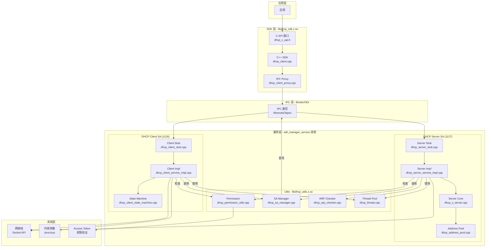
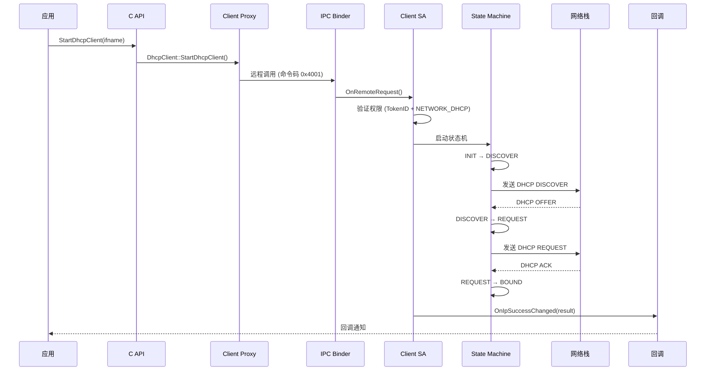
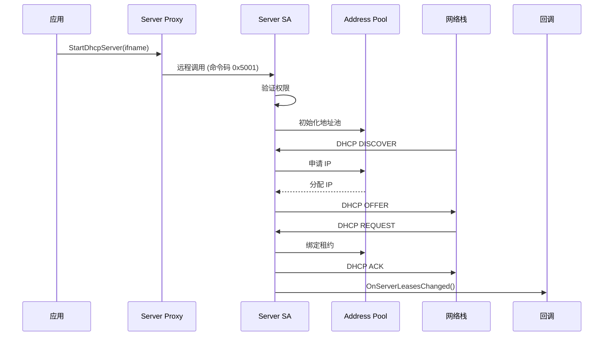
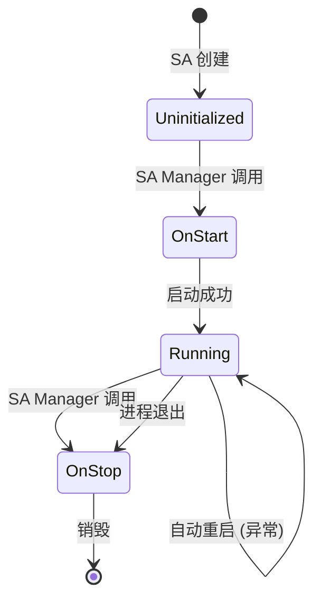
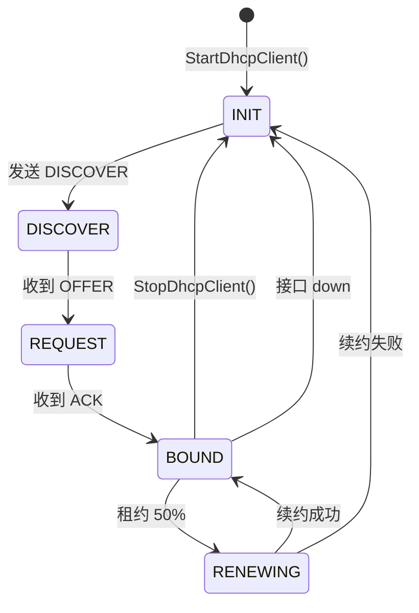

# 系统架构说明

## 文档目的

本文档详细说明 DHCP 组件的系统架构，包括组件图、数据流、线程模型和关键时序。

---

## 适用范围

- 组件: @ohos/dhcp
- 版本: 3.1.0

---

## 组件架构图

### 1. 整体架构



### 2. 层次关系

| 层级 | 组件 | 职责 |
|------|------|------|
| 应用层 | 第三方应用 | 调用 DHCP 功能 |
| SDK 层 | libdhcp_sdk.z.so | 接口封装、IPC 转发 |
| IPC 层 | Binder/HDI | 跨进程通信 |
| 服务层 | Client/Server SA | DHCP 协议实现、业务逻辑 |
| 工具层 | libdhcp_utils.z.so | 权限、SA、ARP 等基础功能 |
| 系统层 | 内核/网络栈 | 底层资源访问 |

---

## 数据流

### DHCP Client 数据流



### DHCP Server 数据流



---

## 线程模型

### Client SA 线程

| 线程 | 类型 | 职责 | 证据 |
|------|------|------|------|
| 主线程 | SA 线程 | SA 生命周期、IPC 请求处理 | `dhcp_client_service_impl.cpp:OnStart()` |
| DHCP 处理线程 | 工作线程 | DHCP 包收发、状态机执行 | `dhcp_thread.cpp:CreateThread()` |
| IPv6 处理线程 | 工作线程 | IPv6 地址获取 | `dhcp_ipv6_client.cpp:150` |
| 定时器线程 | 定时器线程 | 租约超时、重试任务 | `dhcp_system_timer.cpp:50` |
| 回调线程 | 工作线程 | 异步回调通知 | `dhcp_event.cpp:100` |

### Server SA 线程

| 线程 | 类型 | 职责 | 证据 |
|------|------|------|------|
| 主线程 | SA 线程 | SA 生命周期、IPC 请求处理 | `dhcp_server_service_impl.cpp:OnStart()` |
| DHCPd 线程 | 工作线程 | DHCP 包收发、租约管理 | `dhcp_s_server.cpp:300` |
| ARP 检查线程 | 工作线程 | IP 冲突检测 | `dhcp_arp_checker.cpp:50` |
| 定时器线程 | 定时器线程 | 租约超时 | `dhcp_system_timer.cpp:50` |
| 回调线程 | 工作线程 | 租约变更通知 | `dhcp_event.cpp:100` |

### 线程同步机制

- **互斥锁**: `std::mutex` - 保护共享数据（地址池、租约表）
- **条件变量**: `std::condition_variable` - 线程间通知
- **原子变量**: `std::atomic` - 状态标志

证据: `dhcp_thread.cpp:80`, `dhcp_address_pool.cpp:120`

---

## IPC 通信机制

### IPC 接口定义

| 接口 | ID | 命令码范围 | 实现类 |
|------|-----|-----------|--------|
| IDhcpClient | 1126 | 0x4000-0x6000 | DhcpClientStub |
| IDhcpServer | 1127 | 0x5000-0x7000 | DhcpServerStub |

### 关键 IPC 命令

**DhcpClientInterfaceCode** (0x4000-0x6000):
```cpp
// 证据: dhcp_manager_service_ipc_interface_code.h:10-30
DHCP_CLIENT_SVR_CMD_REG_CALL_BACK = 0x4000      // 注册回调
DHCP_CLIENT_SVR_CMD_START_DHCP_CLIENT = 0x4001  // 启动 Client
DHCP_CLIENT_SVR_CMD_STOP_DHCP_CLIENT = 0x4002   // 停止 Client
DHCP_CLIENT_SVR_CMD_UPDATE_DHCP_CLIENT = 0x4003 // 更新配置
DHCP_CLIENT_SVR_CMD_RENEW_DHCP_CLIENT = 0x4004  // 续约
```

**DhcpServerInterfaceCode** (0x5000-0x7000):
```cpp
// 证据: dhcp_manager_service_ipc_interface_code.h:40-70
DHCP_SERVER_SVR_CMD_START_DHCP_SERVER = 0x5001  // 启动 Server
DHCP_SERVER_SVR_CMD_STOP_DHCP_SERVER = 0x5002   // 停止 Server
DHCP_SERVER_SVR_CMD_SET_DHCP_RANGE = 0x5003    // 设置地址池
DHCP_SERVER_SVR_CMD_SET_DHCP_NAME = 0x5004      // 设置标签
DHCP_SERVER_SVR_CMD_PUT_DHCP_RANGE = 0x5005    // 添加地址池
DHCP_SERVER_SVR_CMD_REMOVE_DHCP_RANGE = 0x5006  // 删除地址池
DHCP_SERVER_SVR_CMD_GET_DHCP_CLIENT_INFOS = 0x5007 // 查询租约
```

### IPC 调用流程

```
1. 应用调用 C API
   ↓
2. C API 调用 Proxy → Remote()->SendRequest()
   ↓
3. Binder 驱动将请求传输到 Server 进程
   ↓
4. Server 进程 Stub 接收 → OnRemoteRequest()
   ↓
5. Stub 根据命令码分发到具体方法
   ↓
6. 方法执行 → 返回结果
   ↓
7. Binder 驱动将结果传回 Client
   ↓
8. Proxy 接收结果 → 返回给 C API
```

---

## 生命周期管理

### SA 生命周期



### Client 状态机



证据: `dhcp_client_state_machine.cpp:200-400`

---

## 错误传播机制

### 错误码流转

```
1. 内部错误 (ErrCode)
   ↓
2. 转换为 C API 错误码 (DhcpErrorCode)
   ↓
3. 通过 IPC 传输
   ↓
4. C API 返回给应用
```

错误码映射表 (`dhcp_c_utils.cpp:20-40`):
```cpp
{DHCP_E_SUCCESS, DHCP_SUCCESS}
{DHCP_E_FAILED, DHCP_FAILED}
{DHCP_E_INVALID_PARAM, DHCP_INVALID_PARAM}
{DHCP_E_NON_SYSTEMAPP, DHCP_NON_SYSTEMAPP}
{DHCP_E_PERMISSION_DENIED, DHCP_PERMISSION_DENIED}
{DHCP_E_INVALID_CONFIG, DHCP_INVALID_CONFIG}
{DHCP_E_UNKNOWN, DHCP_UNKNOWN_ERROR}
```

---

## 资源生命周期

### Socket 管理
- 创建: `dhcp_socket.cpp:CreateSocket()`
- 监听: `dhcp_socket.cpp:StartListen()`
- 销毁: `dhcp_socket.cpp:DestroySocket()`
- 异常处理: 接口 down 时自动关闭

### 租约管理 (Server)
- 创建: 分配 IP 时创建租约
- 更新: 续约时更新租约
- 过期: 定时器检查并清理过期租约
- 证据: `dhcp_binding.cpp:100-200`

### SA 管理
- 获取: `DhcpSaManager::GetDhcpService()`
- 缓存: 使用 static 缓存 SA 指针
- 死亡通知: DeathRecipient 监听 SA 死亡
- 证据: `dhcp_sa_manager.cpp:100-150`

---

## 相关链接

- [00_Overview](00_Overview.md) - 项目概览
- [01_Project_Positioning](01_Project_Positioning.md) - 项目边界
- [04_C_API_Reference](04_C_API_Reference.md) - API 详情
- [05_Inner_API](05_Inner_API.md) - 内部接口
- [08_Security_Review](08_Security_Review.md) - 信任边界
