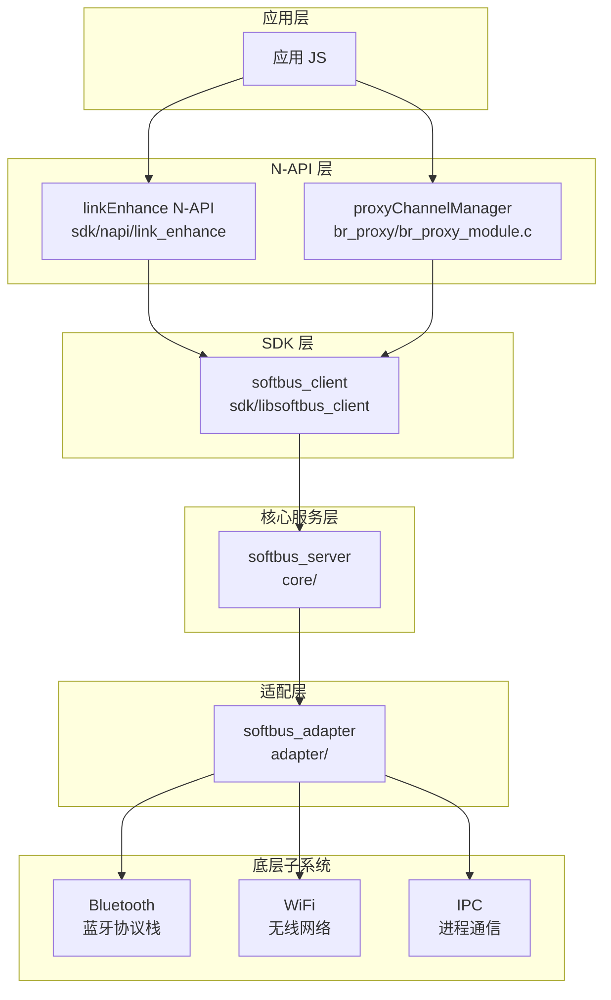

# DSoftBus 架构说明

## 整体架构



## 模块职责

### 核心模块 (core/)

| 模块 | 路径 | 职责 |
|------|------|------|
| **authentication** | `core/authentication/` | 设备认证、会话密钥管理、HiChain集成 |
| **bus_center** | `core/bus_center/` | 网络拓扑管理、本地网络协商(LNN)、设备状态管理 |
| **connection** | `core/connection/` | 物理连接管理(BR/BLE/TCP/SLE/WiFi-Direct) |
| **discovery** | `core/discovery/` | 设备发现服务(BLE/CoAP/USB/NFC) |
| **frame** | `core/frame/` | 服务框架初始化、IPC骨架 |
| **transmission** | `core/transmission/` | 会话管理、数据传输通道(TCP/UDP/Proxy) |
| **common** | `core/common/` | 公共工具(消息队列、JSON、安全、FFRT) |

> 代码证据: `core/` 目录结构

### SDK 模块 (sdk/)

| 模块 | 路径 | 职责 |
|------|------|------|
| **bus_center** | `sdk/bus_center/` | 客户端网络管理接口 |
| **connection** | `sdk/connection/` | 客户端连接管理 |
| **frame** | `sdk/frame/` | 客户端框架、服务代理 |
| **transmission** | `sdk/transmission/` | 客户端会话与传输 |
| **napi/link_enhance** | `sdk/napi/link_enhance/` | Link Enhance N-API 实现 |

> 代码证据: `sdk/` 目录结构

### 接口层 (interfaces/)

| 类型 | 路径 | 用途 |
|------|------|------|
| **kits** | `interfaces/kits/` | 对外 SDK API（应用使用） |
| **inner_kits** | `interfaces/inner_kits/` | 系统能力间调用接口 |

> 代码证据: `interfaces/` 目录结构

## 数据流

### 设备发现流程

```
1. PublishLNN() → Disc Manager → BLE/CoAP/NFC/USB 发现
2. RefreshLNN() → Disc Manager → 发现回调 → DeviceInfo
```

### 网络连接流程

```
1. JoinLNN() → Bus Center → Connection Manager → 认证 → LNN
2. LeaveLNN() → 断开连接 → 清理资源
```

### 数据传输流程

```
1. Socket() → 创建会话
2. Listen/Bind() → 建立监听
3. SendBytes/SendStream/SendFile() → 传输数据
4. Shutdown() → 关闭连接
```

> 代码证据: `README.md` 设备发现、网络、传输章节

## 线程模型

### 服务端线程

| 组件 | 线程模型 |
|------|---------|
| **softbus_server** | 主线程 + FFRT线程池 |
| **消息处理** | `core/common/message_handler/` |
| **IPC** | `core/frame/standard/` |

### 客户端线程

| 组件 | 线程模型 |
|------|---------|
| **softbus_client** | 调用线程 + IPC回调 |

### 线程安全

- **无锁队列**: `core/common/queue/` 
- **互斥锁**: 保护关键数据结构
- **消息驱动**: 异步事件处理

## 模块依赖关系

```
                    ┌─────────────┐
                    │ softbus_server │
                    └──────┬──────┘
                           │
         ┌─────────────────┼─────────────────┐
         │                 │                 │
         ▼                 ▼                 ▼
┌───────────────┐ ┌───────────────┐ ┌───────────────┐
│ authentication │ │   discovery   │ │   connection  │
└───────────────┘ └───────────────┘ └───────────────┘
         │                 │                 │
         └─────────────────┼─────────────────┘
                           ▼
                    ┌───────────────┐
                    │ bus_center    │
                    │ (LNN)         │
                    └───────┬───────┘
                            │
                            ▼
                    ┌───────────────┐
                    │ transmission  │
                    │ (Session)     │
                    └───────────────┘
```

## 稳定性标注

| 接口类型 | 位置 | 稳定性 | 说明 |
|---------|------|--------|------|
| **对外 JS API** | `sdk/napi/` | 稳定 | N-API 接口 |
| **SDK C API** | `interfaces/kits/` | 稳定 | 官方接口 |
| **内部 API** | `interfaces/inner_kits/` | 较稳定 | 系统能力间调用 |
| **内部实现** | `core/*/src/` | 不稳定 | 可能变更 |

---

**相关文档**

- [项目概览](./01_Overview.md)
- [N-API 接口](./03_NAPI.md)
- [内部 API](./04_InnerAPI.md)
