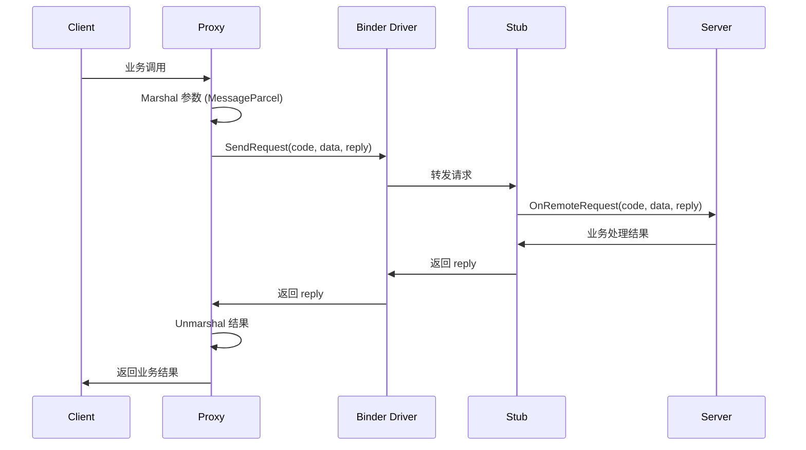

# 架构设计

## 3.1 系统架构图

```
┌─────────────────────────────────────────────────────────────────┐
│                      应用层 (Application)                         │
│  ┌─────────────────┐    ┌─────────────────┐                   │
│  │  FA/Ability     │    │  Native Service │                   │
│  │  (JS/ArkTS)     │    │  (C++)         │                   │
│  └────────┬────────┘    └────────┬────────┘                   │
├───────────┼──────────────────────┼─────────────────────────────┤
│           │                      │                             │
│  ┌────────▼────────┐    ┌────────▼────────┐                   │
│  │ @ohos/rpc N-API │    │ IRemoteBroker  │                   │
│  │ (JS/ArkTS)     │    │ (Native)       │                   │
│  └────────┬────────┘    └────────┬────────┘                   │
├───────────┼──────────────────────┼─────────────────────────────┤
│           │                      │                             │
│  ┌────────▼────────┐    ┌────────▼────────┐                   │
│  │  IPC Native     │    │  IPC Framework  │                   │
│  │  (IPCSkeleton)  │    │  (Proxy/Stub)  │                   │
│  └────────┬────────┘    └────────┬────────┘                   │
├───────────┼──────────────────────┼─────────────────────────────┤
│           │                      │                             │
│  ┌────────▼────────┐    ┌────────▼────────┐                   │
│  │  Binder Driver  │    │  DBinder       │                   │
│  │  (设备内 IPC)   │    │  (跨设备 RPC) │                   │
│  └────────┬────────┘    └────────┬────────┘                   │
├───────────┼──────────────────────┼─────────────────────────────┤
│           │                      │                             │
│           └──────────┬───────────┘                             │
│                      ▼                                         │
│            ┌─────────────────┐                                  │
│            │   SAMgr        │                                  │
│            │ (系统能力管理)  │                                  │
│            └─────────────────┘                                  │
└─────────────────────────────────────────────────────────────────┘
```

## 3.2 组件交互图

### IPC 调用流程



### 关键调用链

| 阶段 | 入口 | 终点 | 关键文件 |
|------|------|------|----------|
| 1. 代理创建 | `SAMgr.GetSystemAbility()` | `IRemoteProxy` | `ipc_object_proxy.cpp` |
| 2. 请求发送 | `Proxy.SendRequest()` | `Binder Driver` | `ipc_object_proxy.cpp:184` |
| 3. 请求接收 | `Binder Driver` | `Stub.OnRemoteRequest()` | `ipc_object_stub.cpp:132` |
| 4. 业务处理 | `OnRemoteRequest()` | 业务代码 | 业务实现 |
| 5. 结果返回 | 业务代码 | `Client` | 同调用链逆向 |

## 3.3 线程模型

### IPC 线程池

```
┌─────────────────────────────────────┐
│        IPC Work Thread Pool         │
│  ┌─────┐ ┌─────┐ ┌─────┐ ┌─────┐  │
│  │Thread│ │Thread│ │Thread│ │Thread│  │
│  │  1   │ │  2   │ │  3   │ │  N   │  │
│  └─────┘ └─────┘ └─────┘ └─────┘  │
└─────────────────────────────────────┘
         ↑              ↑
    JoinWorkThread()  StopWorkThread()
    (IPCSkeleton)      (IPCSkeleton)
```

### 线程职责

| 线程类型 | 职责 | 配置方式 |
|----------|------|----------|
| **IPC Work Thread** | 处理 IPC 请求 | `IPCSkeleton.SetMaxWorkThreadNum()` |
| **Binder Thread** | 内核 Binder 线程 | 系统自动创建 |
| **UI Thread** | 主线程 | 应用主线程 |

### 线程配置

```cpp
// IPCSkeleton 静态方法
IPCSkeleton::SetMaxWorkThreadNum(int maxNum);  // 配置最大线程数
IPCSkeleton::JoinWorkThread();                  // 当前线程加入线程池
IPCSkeleton::StopWorkThread();                  // 线程退出线程池
```

**证据**: `interfaces/innerkits/ipc_core/include/ipc_skeleton.h:33-47`

## 3.4 调用身份机制

### 身份信息

| 信息 | 获取方式 | 用途 |
|------|----------|------|
| **PID** | `IPCSkeleton.GetCallingPid()` | 进程标识 |
| **UID** | `IPCSkeleton.GetCallingUid()` | 用户标识 |
| **TokenID** | `IPCSkeleton.GetCallingTokenID()` | 权限令牌 |
| **DeviceID** | `IPCSkeleton.GetCallingDeviceID()` | 设备标识 |
| **LocalDeviceID** | `IPCSkeleton.GetLocalDeviceID()` | 本地设备 |

### 身份管理

```cpp
// 重置调用身份（用于切换身份进行操作）
IPCSkeleton::ResetCallingIdentity();

// 设置调用身份
IPCSkeleton::SetCallingIdentity(uint64_t token, uint64_t index);

// 检查是否本地调用
bool isLocal = IPCSkeleton::IsLocalCalling();
```

**证据**: `interfaces/innerkits/ipc_core/include/ipc_skeleton.h:61-178`

## 3.5 消息序列化

### MessageParcel 数据流

```
┌─────────────────────────────────────────┐
│            MessageParcel                │
├─────────────────────────────────────────┤
│  WriteRemoteObject() → IRemoteObject    │
│  WriteInterfaceToken() → 接口令牌       │
│  WriteXXX() → 基本类型数据              │
│  WriteAshmem() → 共享内存              │
│  WriteFileDescriptor() → FD             │
└─────────────────────────────────────────┘
```

### MessageOption 配置

```cpp
MessageOption option;

// 同步调用（默认）
option.setFlags(MessageOption::TF_SYNC);  // 0x00

// 异步调用
option.setFlags(MessageOption::TF_ASYNC); // 0x01

// 接受文件描述符
option.setFlags(MessageOption::TF_ACCEPT_FDS); // 0x10

// 设置超时（毫秒）
option.setWaitTime(5000);
```

**证据**:
- `message_option.h:21-32` - MessageOption 定义
- `message_parcel.h:26-164` - MessageParcel 方法

## 3.6 DBinder 架构（跨设备）

```
┌─────────────────┐         DSoftBus          ┌─────────────────┐
│   Device A      │        Socket            │   Device B      │
│  ┌───────────┐  │  ◄──────────────────►   │  ┌───────────┐  │
│  │DBinderSvc │  │   Session Established   │  │DBinderSvc │  │
│  └─────┬─────┘  │                         │  └─────┬─────┘  │
│        │         │                         │        │       │
│  ┌─────▼─────┐   │                         │  ┌─────▼─────┐  │
│  │Stub本地存根│   │   RegisterRemoteProxy    │  │Proxy远端代理│  │
│  └───────────┘   │  ────────────────────►   │  └───────────┘  │
│                 │                         │                 │
└─────────────────┘                         └─────────────────┘
```

### DBinder 核心组件

| 组件 | 职责 |
|------|------|
| `DBinderService` | 动态代理注册、服务发现 |
| `DBinderRemoteListener` | DSoftBus Socket 监听 |
| `DBinderDatabusInvoker` | 基于 Databus 的调用 |
| `DBinderDeathRecipient` | 死亡通知处理 |

**证据**: `interfaces/innerkits/libdbinder/include/dbinder_service.h:126`

---

*证据来源*:
- `README_zh.md:18-21` - 系统架构图
- `ipc_skeleton.h:22-178` - IPCSkeleton 类定义
- `message_option.h:21-65` - MessageOption 定义
- `dbinder_service.h:126` - DBinderService 类
- Phase 1 全局扫描结果
