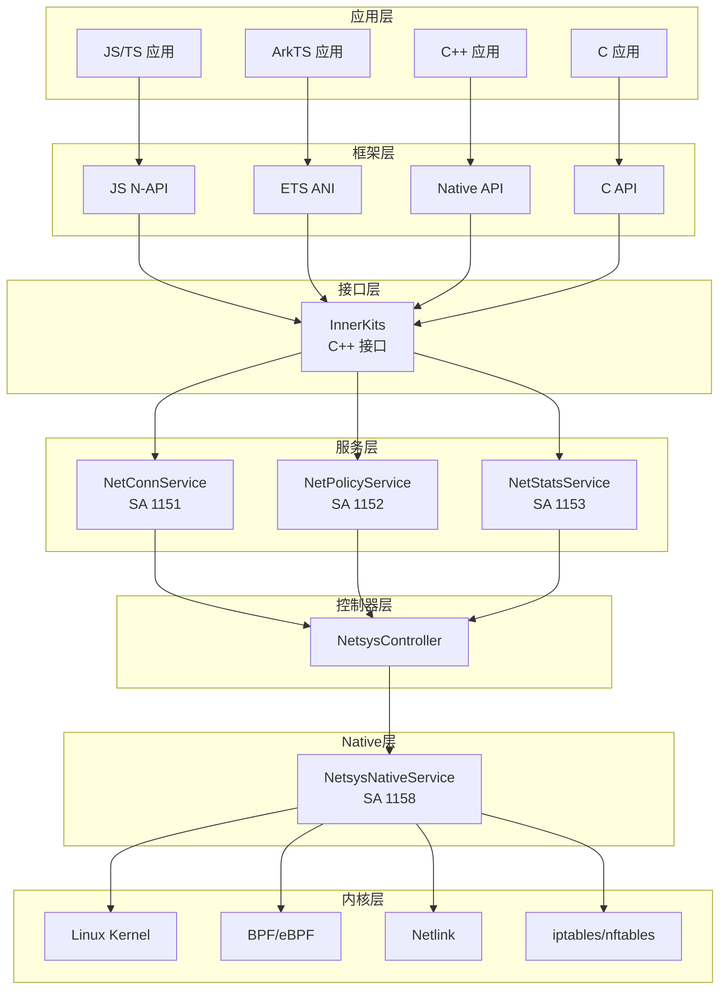
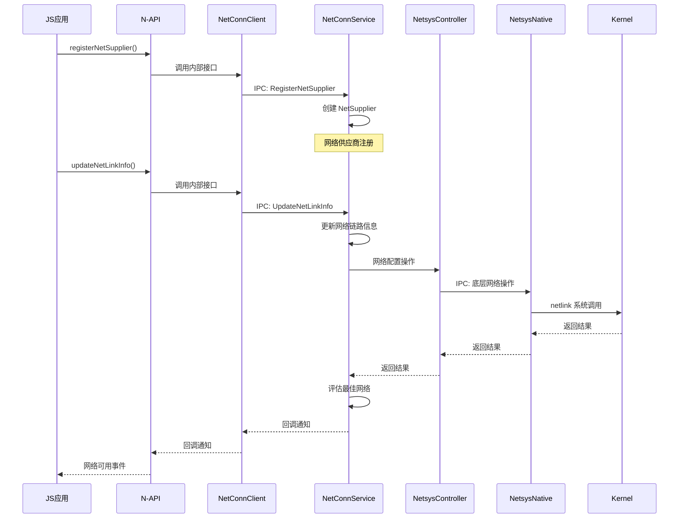
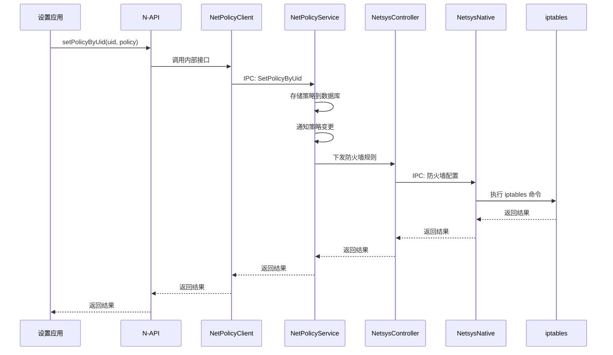
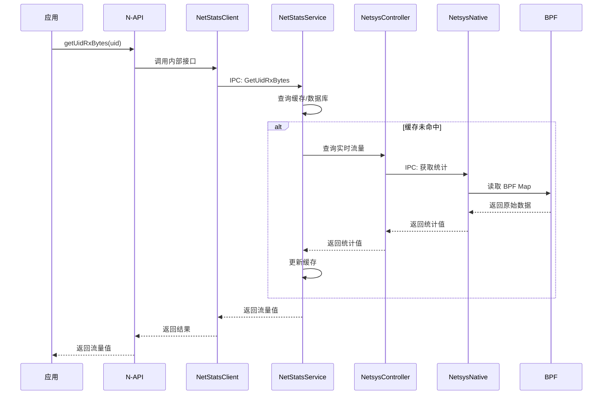
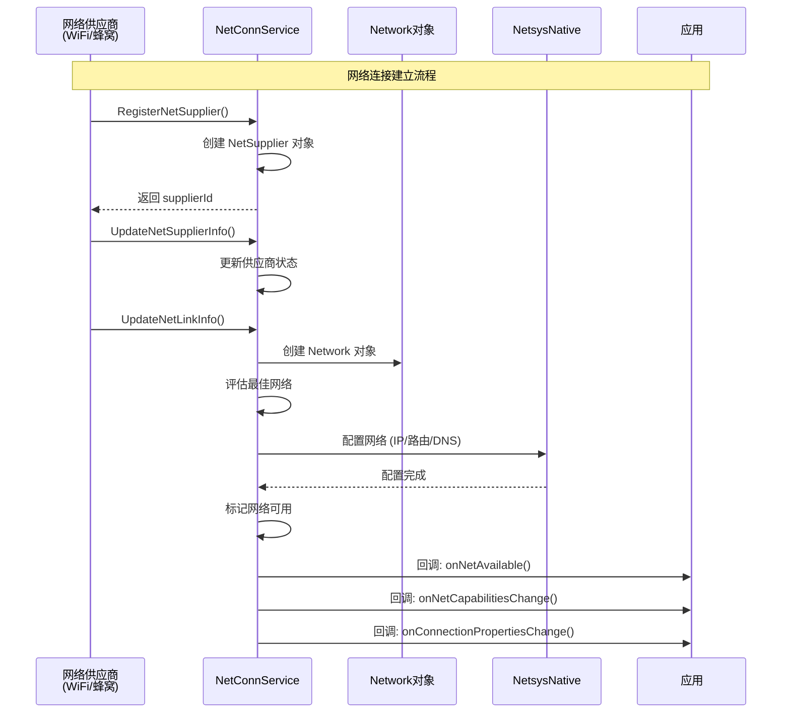
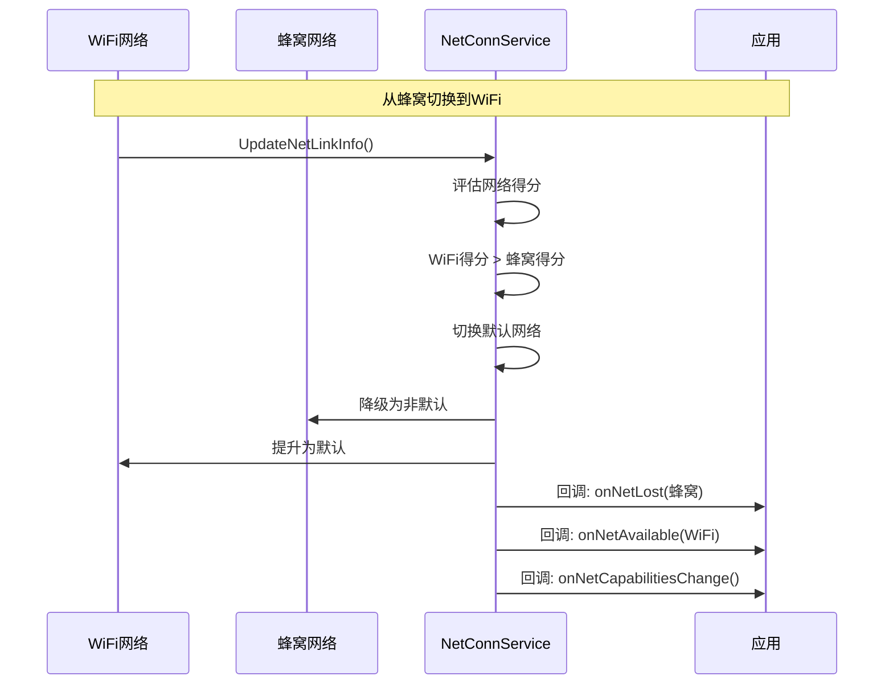
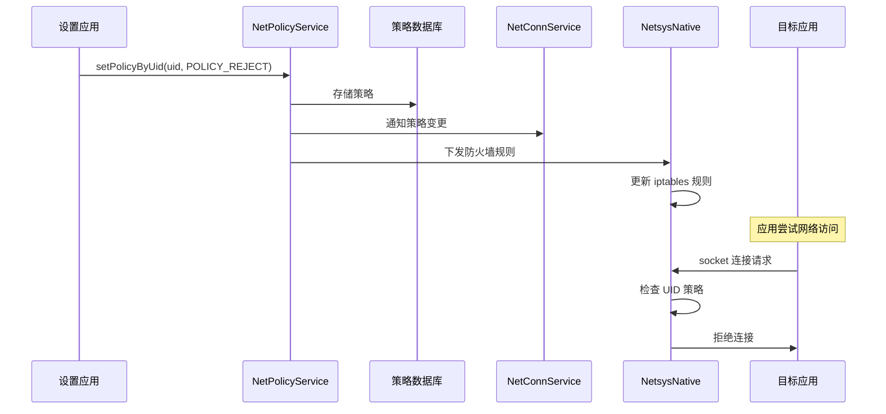

# 架构设计与组件关系

## 1. 整体架构图



---

## 2. 组件详细说明

### 2.1 服务层组件

| 组件 | SA ID | 进程 | 核心职责 |
|------|-------|------|----------|
| NetConnService | 1151 | netmanager | 网络连接管理、网络选择、代理配置 |
| NetPolicyService | 1152 | netmanager | 网络策略、防火墙、配额管理 |
| NetStatsService | 1153 | netmanager | 流量统计、历史数据、告警 |
| NetsysNativeService | 1158 | netsysnative | 底层网络操作、DNS、路由、防火墙 |

### 2.2 进程模型

```
┌─────────────────────────────────────────────────────────────┐
│                     netmanager 进程                          │
│                                                              │
│  ┌───────────────┐  ┌───────────────┐  ┌───────────────┐   │
│  │ NetConnService│  │NetPolicyService│  │ NetStatsService│   │
│  │    (SA 1151)  │  │    (SA 1152)   │  │    (SA 1153)   │   │
│  └───────┬───────┘  └───────┬───────┘  └───────┬───────┘   │
│          │                  │                  │            │
│          └──────────────────┴──────────────────┘            │
│                             │                               │
│                    ┌────────┴────────┐                      │
│                    │  NetsysController │                      │
│                    └────────┬────────┘                      │
└─────────────────────────────┼───────────────────────────────┘
                              │
                              │ IPC (Binder)
                              ▼
┌─────────────────────────────────────────────────────────────┐
│                   netsysnative 进程                          │
│                                                              │
│              ┌──────────────────────────┐                   │
│              │   NetsysNativeService    │                   │
│              │        (SA 1158)         │                   │
│              └──────────────────────────┘                   │
└─────────────────────────────────────────────────────────────┘
```

---

## 3. 数据流

### 3.1 网络连接建立流



### 3.2 网络策略控制流



### 3.3 流量统计查询流



---

## 4. 线程模型

### 4.1 NetConnService 线程模型

```
┌─────────────────────────────────────────────────────────────────┐
│                      NetConnService                             │
│                                                                 │
│  ┌──────────────────┐    ┌─────────────────────────────────┐  │
│  │  EventHandler    │    │         工作线程池              │  │
│  │  (主线程)        │    │  ┌─────┐ ┌─────┐ ┌─────┐       │  │
│  │                  │    │  │Worker│ │Worker│ │Worker│       │  │
│  │  - 处理IPC请求   │    │  └─────┘ └─────┘ └─────┘       │  │
│  │  - 网络事件分发  │    │                                 │  │
│  │  - 定时任务      │    │  处理阻塞操作：                 │  │
│  │  - 回调通知      │    │  - HTTP探测                     │  │
│  │                  │    │  - 数据库查询                   │  │
│  └──────────────────┘    │  - 网络配置                     │  │
│                          └─────────────────────────────────┘  │
└─────────────────────────────────────────────────────────────────┘
```

**关键线程**:
- **主线程 (EventHandler)**: 处理 IPC 请求、网络状态变更事件
- **HTTP 探测线程**: 执行网络连通性探测
- **代理检测线程**: 检测 PAC 代理配置

### 4.2 NetsysNativeService 线程模型

```
┌─────────────────────────────────────────────────────────────────┐
│                   NetsysNativeService                           │
│                                                                 │
│  ┌──────────────────┐    ┌─────────────────────────────────┐  │
│  │  IPC 线程        │    │        DNS 线程池               │  │
│  │                  │    │  ┌─────┐ ┌─────┐ ┌─────┐       │  │
│  │  - Binder 通信   │    │  │DNS  │ │DNS  │ │DNS  │       │  │
│  │  - 接口分发      │    │  │Worker│ │Worker│ │Worker│       │  │
│  │                  │    │  └─────┘ └─────┘ └─────┘       │  │
│  └──────────────────┘    │                                 │  │
│                          │  并发 DNS 解析                  │  │
│  ┌──────────────────┐    └─────────────────────────────────┘  │
│  │  Netlink 线程    │                                          │
│  │                  │    ┌─────────────────────────────────┐  │
│  │  - 监听内核事件  │    │        BPF 轮询线程             │  │
│  │  - 接口变更      │    │                                 │  │
│  │  - 路由变更      │    │  - 读取 BPF Ring Buffer         │  │
│  │                  │    │  - 流量统计更新                 │  │
│  └──────────────────┘    │  - 防火墙事件                   │  │
│                          └─────────────────────────────────┘  │
└─────────────────────────────────────────────────────────────────┘
```

---

## 5. 关键时序图

### 5.1 网络连接注册与激活时序



### 5.2 网络切换时序



### 5.3 应用网络策略生效时序



---

## 6. 模块交互关系

### 6.1 核心交互矩阵

| 调用方 | 被调用方 | 通信方式 | 典型场景 |
|--------|----------|----------|----------|
| NetConnService | NetsysController | IPC | 网络配置、路由设置 |
| NetPolicyService | NetsysController | IPC | 防火墙规则下发 |
| NetStatsService | NetsysController | IPC | 流量统计查询 |
| NetConnService | NetPolicyService | IPC | 策略同步通知 |
| NetsysController | NetsysNativeService | IPC | 底层网络操作 |
| NetConnService | NetConnClient | Callback | 网络状态通知 |
| NetsysNativeService | Kernel | Netlink | 网络配置 |
| NetsysNativeService | Kernel | BPF | 流量统计 |

### 6.2 回调机制

```
┌─────────────────────────────────────────────────────────────────┐
│                        回调架构                                  │
│                                                                 │
│  应用层 (JS/C++/C)                                              │
│       │                                                         │
│       │ 注册回调                                                 │
│       ▼                                                         │
│  ┌──────────────────────────────────────────────────────────┐  │
│  │  INetConnCallback / INetPolicyCallback / ...            │  │
│  │  (IPC Callback Interface)                                │  │
│  └──────────────────────────────────────────────────────────┘  │
│       │                                                         │
│       │ IPC (DeathRecipient 处理断线)                          │
│       ▼                                                         │
│  ┌──────────────────────────────────────────────────────────┐  │
│  │  NetConnService / NetPolicyService / ...                 │  │
│  │  (Service 发起回调)                                       │  │
│  └──────────────────────────────────────────────────────────┘  │
│                                                                 │
│  回调类型:                                                      │
│  - onNetAvailable / onNetLost                                  │
│  - onNetCapabilitiesChange                                     │
│  - onConnectionPropertiesChange                                │
│  - onUidPolicyChange                                           │
│  - onQuotaPolicyChange                                         │
└─────────────────────────────────────────────────────────────────┘
```

---

## 7. 设计模式应用

### 7.1 使用的关键设计模式

| 模式 | 应用场景 | 文件 |
|------|----------|------|
| **单例模式** | NetsysController | `services/netsyscontroller/include/netsys_controller.h` |
| **观察者模式** | 网络状态监听 | `services/netconnmanager/include/net_activate.h` |
| **策略模式** | 网络选择策略 | `services/netconnmanager/src/net_conn_service.cpp` |
| **工厂模式** | Network 对象创建 | `services/netconnmanager/include/network.h` |
| **代理模式** | IPC Proxy/Stub | `interfaces/innerkits/*/include/proxy/` |
| **桥接模式** | N-API 封装 | `frameworks/js/napi/connection/` |

### 7.2 类层次结构

```
SystemAbility (OpenHarmony基类)
    │
    ├── NetConnService
    │       ├── INetActivateCallback
    │       └── NetConnServiceStub
    │
    ├── NetPolicyService
    │       └── NetPolicyCallbackStub
    │
    ├── NetStatsService
    │       └── NetStatsServiceStub
    │
    └── NetsysNativeService
            └── NetsysNativeServiceStub

IRemoteBroker (IPC接口基类)
    │
    ├── INetConnService
    │       ├── NetConnServiceStub (服务端)
    │       └── NetConnServiceProxy (客户端)
    │
    ├── INetPolicyService
    │       ├── NetPolicyServiceStub
    │       └── NetPolicyServiceProxy
    │
    └── INetsysService
            ├── NetsysNativeServiceStub
            └── NetsysNativeServiceProxy
```

---

*生成时间: 2025-02-06*
