# 关键调用链

本文档描述 `netmanager_cangjie_wrapper` 项目中的关键调用链，包括从仓颉 API 到 FFI 再到底层 C 接口的完整调用路径。

## 调用链概览

```
kit/NetworkKit (Kit 层)
    │
    ├──► ohos.net.connection (连接模块)
    │       ├──► CJ_CreateNetConnection() ──────────────► netmanager_base
    │       ├──► CJ_GetDefaultNet() ────────────────────► netmanager_base
    │       ├──► CJ_GetNetCapabilities() ─────────────────► netmanager_base
    │       ├──► CJ_GetConnectionProperties() ───────────► netmanager_base
    │       └──► CJ_OnNetAvailable/Lost() ──────────────► netmanager_base
    │
    └──► ohos.net.http (HTTP 模块)
            ├──► CJ_CreateHttp() ────────────────────────► netstack
            ├──► CJ_SendRequest() ──────────────────────► netstack
            ├──► CJ_OnHeadersReceive() ─────────────────► netstack
            ├──► CJ_OnDataReceive() ────────────────────► netstack
            └──► CJ_DestroyRequest() ───────────────────► netstack
```

---

## HTTP 请求调用链

### 1. 创建 HTTP 请求任务

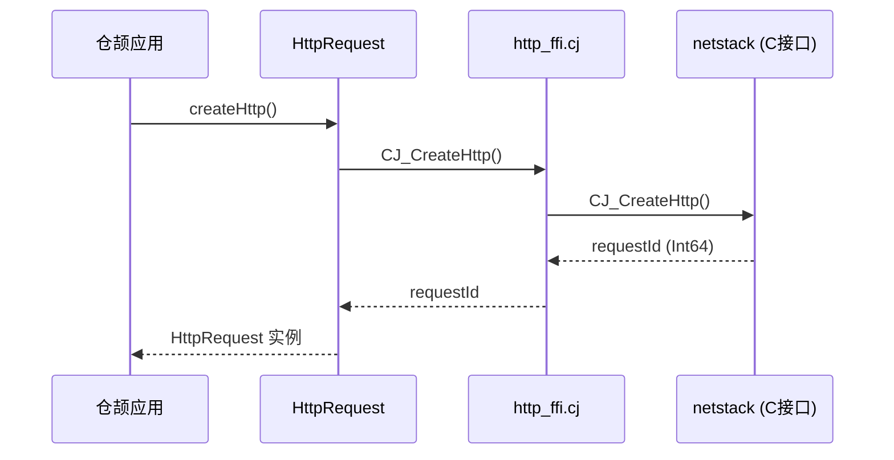

**证据来源**：`ohos/net/http/http.cj:34-41`

```cangjie
public func createHttp(): HttpRequest {
    let id = unsafe { CJ_CreateHttp() }
    HttpRequest(id)
}
```

---

### 2. 发起 HTTP 请求

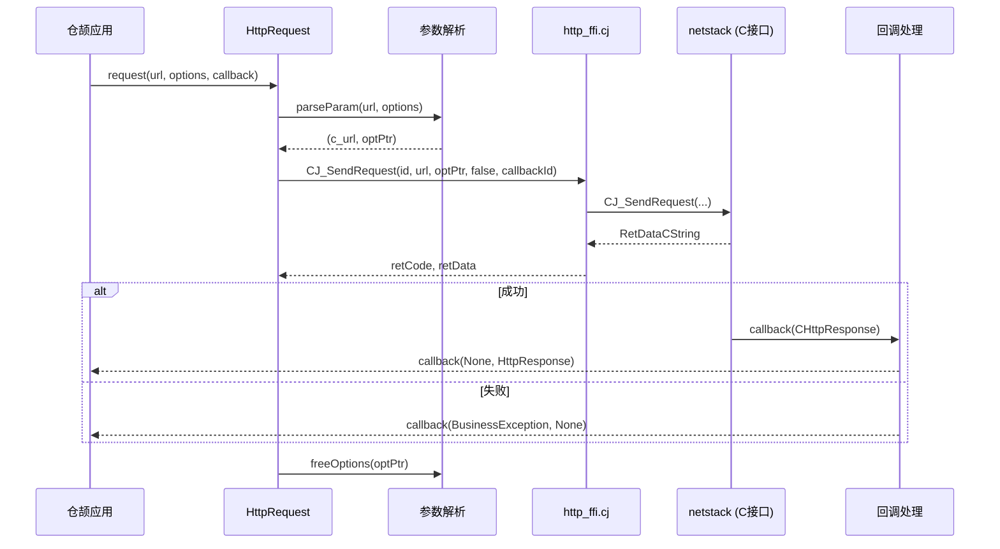

**证据来源**：`ohos/net/http/http.cj:233-268`

```cangjie
public func request(url: String, options: HttpRequestOptions, 
                    callback: AsyncCallback<HttpResponse>): Unit {
    let (c_url, optPtr) = unsafe { parseParam(url, options) }
    
    let wrapper = { resp: CHttpResponse =>
        if (resp.errCode != SUCCESS_CODE) {
            callback(error, None)
        } else {
            callback(None, HttpResponse(resp))
        }
        resp.free()
    }
    
    let ret = unsafe { CJ_SendRequest(id, c_url, optPtr, false, registerCall.getID()) }
    // ...
}
```

---

### 3. 流式 HTTP 请求

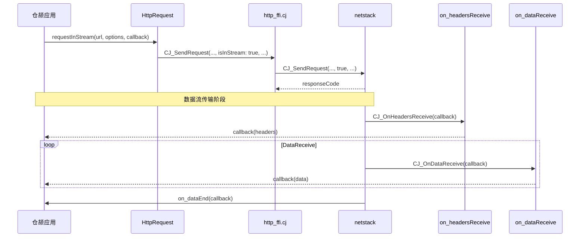

**证据来源**：`ohos/net/http/http.cj:394-432`

---

### 4. HTTP 事件监听注册

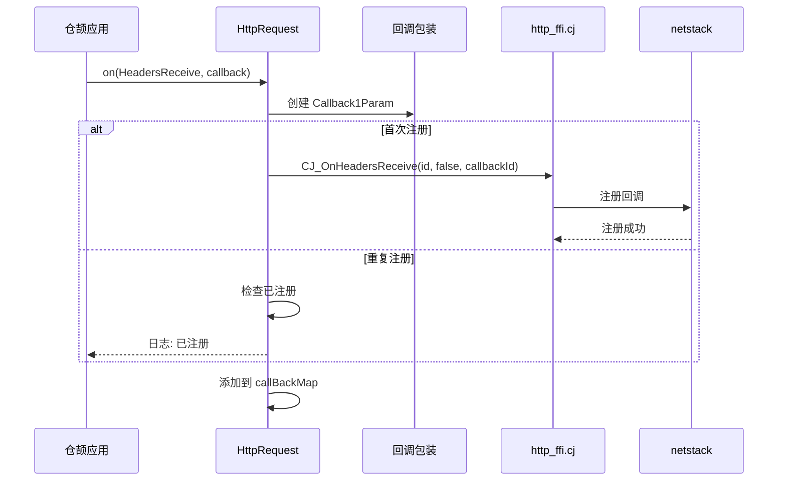

**证据来源**：`ohos/net/http/http.cj:545-558`

```cangjie
public func on(event: HttpRequestEvent, 
               callback: Callback1Argument<HashMap<String, String>>): Unit {
    if (event != HttpRequestEvent.HeadersReceive) {
        throw BusinessException(2100001, "Invalid parameter value.")
    }
    commonSubscribe1Arg(event, callback) {
        cArrString: CArrString => cArrString2Map(cArrString)
    }
}
```

---

## 网络连接调用链

### 1. 创建网络连接

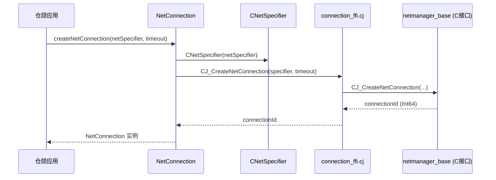

**证据来源**：`ohos/net/connection/net_connection.cj:40-52`

```cangjie
public func createNetConnection(netSpecifier!: ?NetSpecifier = None, 
                                 timeout!: UInt32 = 0): NetConnection {
    let specifier = match (netSpecifier) {
        case Some(v) => CNetSpecifier(v)
        case None => CNetSpecifier()
    }
    let id = unsafe { CJ_CreateNetConnection(specifier, timeout) }
    if (id < 0) {
        throw BusinessException(2100003, "System internal error.")
    }
    NetConnection(id)
}
```

---

### 2. 获取默认网络

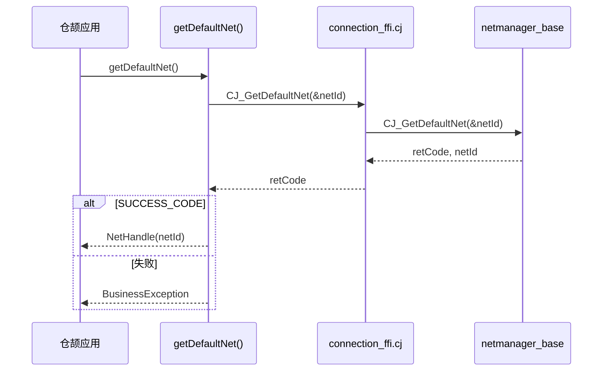

**证据来源**：`ohos/net/connection/net_connection.cj:68-78`

---

### 3. 解析

``` DNSmermaid
sequenceDiagram
    participant App as 仓颉应用
    participant NH as NetHandle
    participant Conv as Host转换
    participant FFI as connection_ffi.cj
    participant C as netmanager_base

    App->>NH: getAddressesByName(host)
    NH->>Conv: LibC.mallocCString(host)
    Conv-->>NH: cHost
    
    NH->>FFI: CJ_GetAddressesByName(netId, cHost)
    FFI->>C: CJ_GetAddressesByName(...)
    C-->>FFI: RetNetAddressArr
    FFI-->>NH: (code, size, data)
    
    NH->>Conv: 转换 C数组->Array<NetAddress>
    NH->>Conv: LibC.free(cHost)
    NH->>Conv: ret.free()
    
    NH-->>App: Array<NetAddress>
```

**证据来源**：`ohos/net/connection/net_connection.cj:632-658`

```cangjie
public func getAddressesByName(host: String): Array<NetAddress> {
    if (host.isEmpty() || host.startsWith("\0")) {
        throw BusinessException(2100001, "...")
    }
    let cHost = unsafe { LibC.mallocCString(host) }
    let ret: RetNetAddressArr = unsafe { CJ_GetAddressesByName(netId, cHost) }
    unsafe { LibC.free(cHost) }
    
    let arr = Array<NetAddress>(
        size,
        { i => NetAddress(unsafe { ptr.read(i) }) }
    )
    ret.free()
    arr
}
```

---

### 4. 网络事件监听

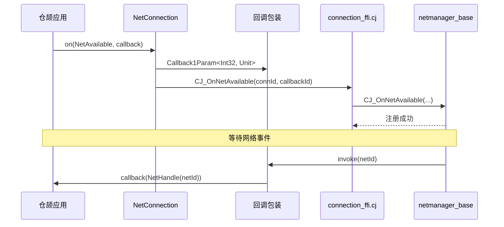

**证据来源**：`ohos/net/connection/net_connection.cj:416-430`

```cangjie
public func on(event: NetConnectionEvent, 
               callback: Callback1Argument<NetHandle>): Unit {
    let wrapper = { netId: Int32 =>
        let handle = NetHandle(netId)
        callback.invoke(None, handle)
    }
    let registerCall = Callback1Param<Int32, Unit>(wrapper)
    unsafe {
        match (event) {
            case NetConnectionEvent.NetAvailable => 
                CJ_OnNetAvailable(getID(), registerCall.getID())
            case NetConnectionEvent.NetLost => 
                CJ_OnNetLost(getID(), registerCall.getID())
            case _ => throw BusinessException(2100001, "...")
        }
    }
}
```

---

## 数据类型转换调用链

### 1. 字符串转换

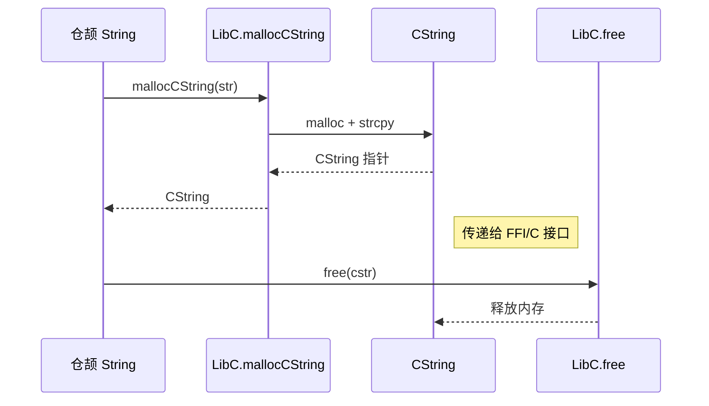

---

### 2. 数组转换

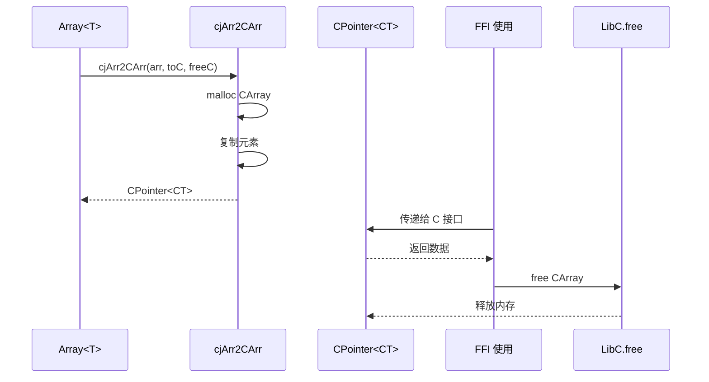

---

## 内存管理调用链

### 资源释放模式

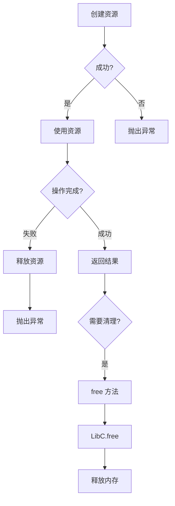

**证据来源**：`ohos/net/http/http_ffi.cj:167-186`

```cangjie
func free(): Unit {
    unsafe {
        LibC.free(this.method)
        LibC.free(this.caPath)
        LibC.free(this.dnsOverHttps)
        LibC.free<UInt8>(this.extraData.head)
        this.header.free()
        this.dnsServers.free()
        // ... 完整释放链
    }
}
```

---

## 异常传播调用链

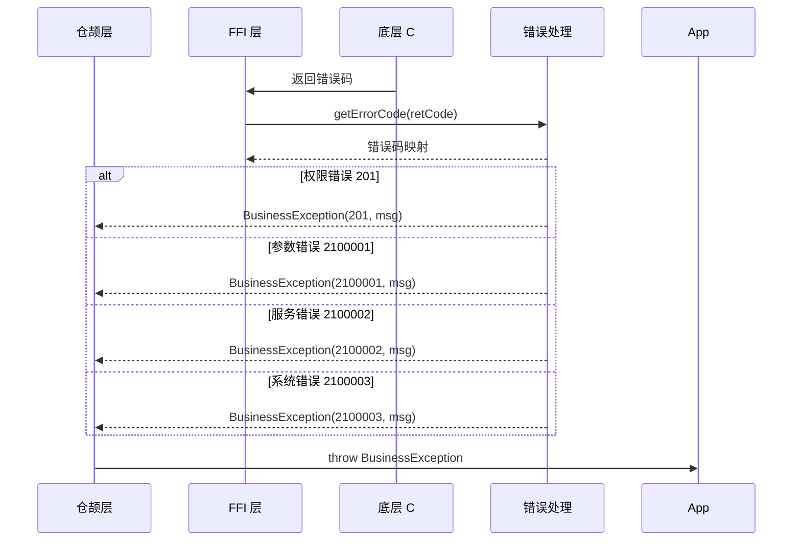

**证据来源**：`ohos/net/connection/net_connection.cj:73-75`

```cangjie
if (retCode != SUCCESS_CODE) {
    let errCode = getErrorCode(retCode)
    throw BusinessException(errCode, "getDefaultNet failed: ${getErrorMsg(errCode)}")
}
```

---

## 相关文档

- [API 参考](03_API_Reference.md) - API 详细说明
- [FFI 接口](04_FFI_Interface.md) - FFI 函数定义
- [系统架构](02_Architecture.md) - 整体架构设计
- [安全评审](06_Security_Review.md) - 安全风险分析
