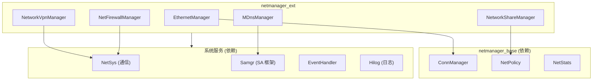

# 项目概览 (Project Overview)

**netmanager_ext** 是 OpenHarmony 网络管理扩展模块，提供以太网、网络共享、VPN、防火墙等增强网络能力。

---

## 一句话定义

> netmanager_ext 是 OpenHarmony 网络管理子系统的可裁剪扩展组件，在基础网络服务之上提供以太网配置、网络共享、VPN 连接、防火墙规则、多播 DNS 等高级网络功能，通过 N-API 向应用层暴露 JavaScript 接口，通过 IPC 与系统服务通信。

**证据**: `bundle.json:4` "description": "net manager extensive service"

---

## 能力边界

### ✅ 能做什么

| 能力 | 说明 | 模块 |
|------|------|------|
| **以太网管理** | 配置有线网络 IP/网关/DNS、获取 MAC 地址、EAP 认证 | Ethernet |
| **网络共享** | 开启 WiFi 热点、USB 共享、蓝牙共享、流量统计 | Sharing |
| **VPN 连接** | 支持 OpenVPN、IPSec、L2TP、第三方 VPN 扩展 | VPN / VPNExt |
| **网络防火墙** | 配置 iptables/nftables 规则、拦截记录 | NetFirewall |
| **mDNS 服务** | 服务发现、服务注册、本地服务解析 | MDNS |
| **可穿戴分布式网络** | 可穿戴设备间的网络互联 | WearableDistributedNet |
| **5G 网络切片** | URSP 配置、网络切片管理 | NetworkSlice |

### ❌ 不能做什么

| 功能 | 说明 | 归属模块 |
|------|------|----------|
| 基础网络连接管理 | WiFi/蜂窝网络连接、网络切换 | netmanager_base |
| 网络策略管理 | 网络偏好、代理设置 | netmanager_base |
| 流量统计管理 | 应用级流量统计 | netmanager_base |
| 原始 Socket 操作 | 低层网络编程 | 不提供 |

**说明**: netmanager_ext 依赖 netmanager_base 提供的基础能力，两者共同构成完整的网络管理子系统。

**证据**: `README_zh.md:16-17`

---

## 运行环境

### 系统要求

| 要求 | 说明 |
|------|------|
| **OpenHarmony 版本** | 3.2+ (standard 系统) |
| **系统类型** | standard (轻量/小型系统不支持) |
| **最小 ROM** | 2MB |
| **最小 RAM** | 500KB |

**证据**: `bundle.json:46-50`

### 依赖的系统服务



**证据**: `bundle.json:52-96`

---

## 快速开始

### 1. 以太网配置示例

```javascript
import ethernet from '@ohos.net.ethernet';

// 获取 MAC 地址
ethernet.getMacAddress().then((macList) => {
    console.log("MAC addresses:", macList);
});

// 配置静态 IP
ethernet.setIfaceConfig("eth0", {
    mode: ethernet.STATIC,
    ipAddr: "192.168.1.100",
    routeAddr: "192.168.1.1",
    gateAddr: "192.168.1.1",
    maskAddr: "255.255.255.0",
    dnsAddr0: "8.8.8.8",
    dnsAddr1: "8.8.4.4"
}).then(() => {
    console.log("配置成功");
});
```

**证据**: `README_zh.md:93-107`

### 2. 网络共享示例

```javascript
import sharing from '@ohos.net.sharing';

// 检查是否支持共享
sharing.isSharingSupported().then((supported) => {
    if (supported) {
        // 启动 WiFi 热点
        sharing.startSharing(sharing.WIFI).then(() => {
            console.log("热点已启动");
        });
    }
});
```

**证据**: `README_zh.md:131-142`

### 3. VPN 配置示例

```javascript
import vpn from '@ohos.net.vpn';

// 创建 VPN 连接
vpn.createVpnConnection({
    vpnType: vpn.VpnType.L2TP,
    vpnAddresses: [{ address: "10.0.0.2", prefix: 24 }],
    vpnRoutes: [{ address: "0.0.0.0", prefix: 0 }],
    // 更多配置...
}).then(() => {
    console.log("VPN 连接创建成功");
});
```

**权限**: `ohos.permission.MANAGE_VPN`

---

## 系统能力声明

使用本组件需要在 `bundle.json` 中声明系统能力：

```json
{
  "module": {
    "abilities": [
      {
        "skills": [
          {
            "systemCapabilities": [
              "SystemCapability.Communication.NetManager.Ethernet",
              "SystemCapability.Communication.NetManager.NetSharing",
              "SystemCapability.Communication.NetManager.MDNS",
              "SystemCapability.Communication.NetManager.Vpn",
              "SystemCapability.Communication.NetManager.NetFirewall"
            ]
          }
        ]
      }
    ]
  }
}
```

**证据**: `bundle.json:22-29`

---

## Feature 开关

netmanager_ext 支持编译期裁剪，通过 `netmanager_ext_config.gni` 控制：

| Feature | 默认值 | 说明 |
|---------|--------|------|
| `netmanager_ext_feature_ethernet` | true | 以太网功能 |
| `netmanager_ext_feature_share` | true | 网络共享 |
| `netmanager_ext_feature_mdns` | true | MDNS |
| `netmanager_ext_feature_vpn` | true | VPN |
| `netmanager_ext_feature_vpnext` | true | VPN 扩展 |
| `netmanager_ext_feature_net_firewall` | false | 防火墙 |
| `netmanager_ext_feature_networkslice` | false | 网络切片 |

**证据**: `netmanager_ext_config.gni:62-76`

---

## 架构概览

```
┌─────────────────────────────────────────────────────────────┐
│  应用层 (JS/TS)                                              │
│  @ohos.net.ethernet / @ohos.net.sharing / ...               │
├─────────────────────────────────────────────────────────────┤
│  N-API 层                                                   │
│  frameworks/js/napi/{ethernet,sharing,vpn,...}              │
├─────────────────────────────────────────────────────────────┤
│  Innerkits (C++ 客户端)                                      │
│  interfaces/innerkits/{ethernetclient,netshareclient,...}   │
├─────────────────────────────────────────────────────────────┤
│  IPC 通信层                                                  │
│  IDL 接口定义 → Proxy/Stub                                  │
├─────────────────────────────────────────────────────────────┤
│  System Ability 服务层                                       │
│  services/{ethernetmanager,networksharemanager,...}         │
├─────────────────────────────────────────────────────────────┤
│  系统调用层                                                  │
│  Netd / NetsysController / 内核网络子系统                    │
└─────────────────────────────────────────────────────────────┘
```

详细架构见 [02_Architecture.md](02_Architecture.md)

---

## 核心数据

| 指标 | 数值 |
|------|------|
| **服务数量** | 7 个 SA 服务 |
| **N-API 模块** | 8 个 JS 模块 |
| **代码行数** | ~10 万行 (不含测试) |
| **BUILD.gn 文件** | 59 个 |
| **SA ID** | 1154, 1155, 1161, 8300, 8301, 8400 |

---

## 相关仓库

- [communication_netmanager_base](https://gitee.com/openharmony/communication_netmanager_base) - 网络管理基础服务
- [communication_netstack](https://gitee.com/openharmony/communication_netstack) - 网络协议栈

**证据**: `README_zh.md:157-163`

---

## 快速导航

- 🏗️ [架构与数据流](02_Architecture.md) - 理解系统架构
- 📁 [目录结构](03_CodeMap.md) - 快速定位代码
- 🔌 [对外接口](04_Interface.md) - API 详细说明
- 🔐 [攻击面分析](05_AttackSurface.md) - 安全研究入口
- 🛡️ [安全风险评估](06_SecurityReview.md) - 漏洞分析

---

*文档版本: v1.0 | 更新时间: 2025-02-07*
