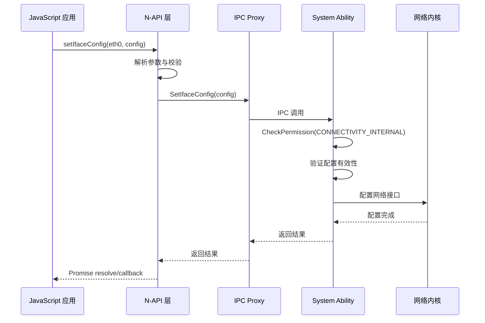
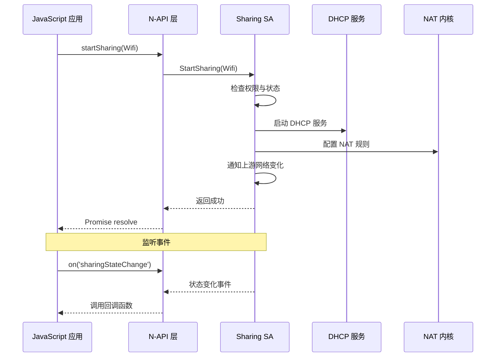

# 架构说明

## 目的

本文档说明 Net Manager Ext 的整体架构、组件交互、数据流、线程模型和关键时序，帮助开发者理解系统设计。

---

## 整体架构图

```
┌─────────────────────────────────────────────────────────────────────────┐
│                        JavaScript 应用层                             │
│  (ohos.net.ethernet, ohos.net.sharing, ohos.net.vpn, ...)   │
└─────────────────────────────┬───────────────────────────────────────┘
                          │ N-API 调用
                          ↓
┌─────────────────────────────────────────────────────────────────────────┐
│                      N-API 桥接层 (frameworks/js/napi/)           │
│  ┌──────────┬──────────┬──────────┬──────────┬──────────┐│
│  │ ethernet │ sharing  │   mdns   │   vpn    │firewall  ││
│  └──────────┴──────────┴──────────┴──────────┴──────────┘│
└─────────────────────────────┬───────────────────────────────────────┘
                          │ IPC 调用 (HDI/HBinder)
                          ↓
┌─────────────────────────────────────────────────────────────────────────┐
│                  IPC Proxy 层 (frameworks/native/)                 │
│  ┌──────────┬──────────┬──────────┬──────────┬──────────┐│
│  │ ethernet │ sharing  │   mdns   │   vpn    │firewall  ││
│  │  client  │  client  │  client  │  client  │  client  ││
│  └──────────┴──────────┴──────────┴──────────┴──────────┘│
└─────────────────────────────┬───────────────────────────────────────┘
                          │ IPC 调用
                          ↓
┌─────────────────────────────────────────────────────────────────────────┐
│                  System Ability 服务层 (services/)                   │
│  ┌──────────┬──────────┬──────────┬──────────┬──────────┐│
│  │ ethernet │ sharing  │   mdns   │   vpn    │firewall  ││
│  │ manager  │ manager  │  manager  │ manager  │ manager  ││
│  └──────────┴──────────┴──────────┴──────────┴──────────┘│
└─────────────────────────────┬───────────────────────────────────────┘
                          │
                          ↓ 网络接口调用
┌─────────────────────────────────────────────────────────────────────────┐
│                   系统层 / 内核层                                 │
│  ┌──────────┬──────────┬──────────┬──────────┬──────────┐│
│  │ netstack │ drivers  │ DHCP     │ mDNS     │iptables   ││
│  └──────────┴──────────┴──────────┴──────────┴──────────┘│
└─────────────────────────────────────────────────────────────────────────┘
```

---

## 组件交互与数据流

### 典型调用链：设置以太网接口配置

```
1. JavaScript 应用
   ↓
2. N-API: setIfaceConfig(iface, config)
   frameworks/js/napi/ethernet/ethernet_module.cpp:61-65
   ↓
3. 异步工作队列：SetIfaceConfigContext
   ↓
4. IPC Proxy 调用
   frameworks/native/ethernetclient/src/proxy/ethernet_proxy.cpp
   ↓
5. IPC 传输（HDI/HBinder）
   ↓
6. SA Stub 接收
   services/ethernetmanager/src/ethernet_stub.cpp
   ↓
7. 权限验证
   services/ethernetmanager/src/ethernet_service.cpp:226
   NetManagerPermission::CheckPermission(Permission::CONNECTIVITY_INTERNAL)
   ↓
8. 业务逻辑执行
   - 配置网络接口
   - 更新 IP 地址、网关、DNS
   - 持久化配置
   ↓
9. 调用底层网络接口
   → netmanager_base（连接管理）
   → netstack（协议栈）
   → DHCP 客户端
   ↓
10. 返回结果
    SA Stub → IPC → N-API → JavaScript Promise/Callback
```

**代码证据**：
- N-API 注册：ethernet_module.cpp:149-157
- IPC Proxy：frameworks/native/ethernetclient/src/
- SA 服务：services/ethernetmanager/src/ethernet_service.cpp
- 权限检查：ethernet_service.cpp:226

---

## 线程模型

### N-API 线程模型

**JS 线程**：主线程执行 JavaScript 代码

**工作线程**：异步操作在独立线程执行

```
┌─────────────┐
│  JS 线程   │  ← 用户 JS 代码执行
└──────┬──────┘
       │ napi_create_threadsafe_function
       ↓
┌─────────────────────┐
│  工作线程池          │  ← 耗时操作执行
│  (napi_queue)       │
└──────────┬──────────┘
           │ 回调结果
           ↓
┌─────────────┐
│  JS 线程   │  ← 回调到 JavaScript
└─────────────┘
```

**代码证据**：
- `ModuleTemplate::Interface<>` 模板使用工作队列
- frameworks/js/napi/sharing/src/netshare_async_work.cpp

### SA 服务线程模型

每个 System Ability 在独立进程中运行：

| 进程 | SA 列表 | 进程类型 |
|-------|----------|---------|
| netmanager | Net Firewall (8300), Network Slice (8301), Wearable Distributed Net (8400) | 系统服务 |
| mdnsmanager | mDNS (1161) | 专有服务 |
| netmanager_base | 基础网络服务 | 系统服务 |

**证据**：sa_profile/*.json:2

---

## 关键时序

### 以太网配置时序



### 网络共享时序



**代码证据**：
- sharing N-API：frameworks/js/napi/sharing/src/netshare_module.cpp:81-93
- sharing SA：services/networksharemanager/src/networkshare_service.cpp

---

## IPC 机制

### Proxy/Stub 模式

```
客户端进程                        服务端进程
┌─────────────┐               ┌─────────────┐
│   N-API     │               │   SA Stub   │
│   ↓          │               │   ↑          │
│   Proxy      │◄────IPC──────►│   Service    │
└─────────────┘  HDI/HBinder  └─────────────┘
```

**Proxy**：客户端使用，封装 IPC 调用
**Stub**：服务端实现，接收 IPC 请求并转发到 Service

**代码证据**：
- Proxy：frameworks/native/*/src/proxy/*.cpp
- Stub：services/*/src/*_stub.cpp

### System Ability 注册

每个 SA 在启动时通过 `SA_INIT` 宏注册：

```cpp
// 示例：MDNS Service
REGISTER_SYSTEM_ABILITY_BY_ID(1161, MdnsService);
```

**代码证据**：services/mdnsmanager/src/mdns_service.cpp (SA 注册位置待确认)

---

## 回调机制

### 从 SA 到 N-API 的回调

```
┌─────────────┐               ┌─────────────┐
│   N-API     │               │   SA        │
│   Observer   │◄────事件────►│   Emitter    │
└─────────────┘   Callback    └─────────────┘
```

**实现方式**：
1. N-API 注册 Observer（如 `On('sharingStateChange')`）
2. SA 发送事件到客户端（通过 IPC Callback）
3. N-API 调用 JavaScript 回调函数

**代码证据**：
- Sharing Observer：frameworks/js/napi/sharing/src/netshare_observer_wrapper.cpp
- Ethernet Observer：frameworks/js/napi/ethernet/src/interface_state_observer_wrapper.cpp
- IPC Callback Stub：frameworks/native/netshareclient/src/proxy/ipccallback/sharing_event_callback_stub.cpp

---

## 资源生命周期

### N-API 资源管理

1. **初始化**：`napi_module_register` 时创建
2. **Cleanup Hook**：`napi_add_env_cleanup_hook` 注册清理函数
3. **析构**：环境销毁时调用 cleanup hook

**代码证据**：
- ethernet_module.cpp:120-130 - AddCleanupHook
- netshare_module.cpp:202 - napi_add_env_cleanup_hook

### SA 资源管理

1. **OnStart**：SA 启动时初始化资源
2. **OnStop**：SA 停止时释放资源
3. **OnDump**：调试信息导出

---

## 模块依赖关系

### 依赖方向（避免环）

```
┌─────────────────────────────────────────────┐
│          netmanager_base (外部依赖)         │
│  连接管理、策略管理、流量管理              │
└──────────┬──────────────────────────────┘
           │ 依赖
           ↓
┌─────────────────────────────────────────────┐
│       netmanager_ext (本仓库)           │
│  ┌──────────┬──────────┬──────────┐ │
│  │ ethernet │ sharing  │   vpn    │ │
│  └──────────┴──────────┴──────────┘ │
└──────────┬──────────────────────────────┘
           │ 依赖
           ↓
┌─────────────────────────────────────────────┐
│    netstack (外部依赖)               │
│  协议栈实现                          │
└─────────────────────────────────────────────┘
```

**内部依赖**（模块间）：
- VPN Manager 可能依赖 Network Manager（获取上游网络）
- Sharing Manager 可能依赖 Ethernet Manager（获取接口状态）

**代码证据**：bundle.json:51-97 - deps.components

---

## 稳定性说明

### 稳定接口（可长期使用）

- **N-API 模块名**：`net.ethernet`, `net.sharing`, `net.vpn`（向后兼容）
- **SA ID**：8300, 8301, 1161, 8400（系统分配）
- **Inner Kit 头文件**：`interfaces/innerkits/*/include/*.h`（带版本控制）

### 不稳定接口（可能变更）

- **内部实现类**：`services/*/src/*.cpp` 中的具体类
- **私有头文件**：未在 `interfaces/innerkits` 中暴露的头文件

**代码证据**：
- bundle.json:129-212 - inner_kits 定义（稳定接口）
- 服务实现类名可能变更

---

## 相关跳转

- [项目定位](01_Project_Positioning.md) - 项目边界与核心能力
- [目录结构](02_Directory_Structure.md) - 代码组织详解
- [内部 API](05_Inner_API.md) - 模块间接口定义
- [安全风险评审](08_Security_Review.md) - IPC 安全分析
