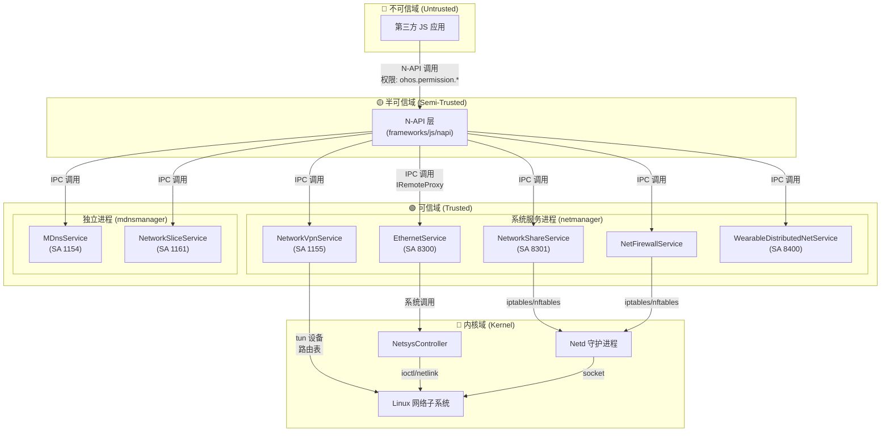

# 攻击面分析 (Attack Surface Analysis)

**目的**: 帮助安全研究员快速识别所有外部输入入口、敏感操作点和信任边界跨越位置。

**适用范围**: netmanager_ext 全部 7 个模块 (Ethernet/Sharing/MDNS/VPN/NetFirewall/WearableDistributedNet/NetworkSlice)

---

## 1. 信任边界与数据流

### 1.1 分层信任模型



### 1.2 关键信任边界

| 边界 | 位置 | 风险等级 | 防护措施 |
|------|------|----------|----------|
| **JS → N-API** | `frameworks/js/napi/*/*_module.cpp` | 🔴 高 | 参数解析与基础校验 |
| **N-API → SA** | `interfaces/innerkits/*client/*_proxy.cpp` | 🟡 中 | IPC 通信 + 权限检查 |
| **SA → 内核** | `services/*manager/src/*_service.cpp` | 🔴 高 | 输入验证 + 权限校验 |

---

## 2. 外部输入入口清单

### 2.1 N-API 层输入 (JavaScript → C++)

#### 2.1.1 Ethernet 模块

| 入口函数 | 文件路径 | 输入类型 | 敏感参数 |
|----------|----------|----------|----------|
| `SetIfaceConfig` | `ethernet/context/set_iface_config_context.cpp:57-79` | string, object | `iface` (网卡名), `ipAddr`, `gateway`, `dnsServers` |
| `GetIfaceConfig` | `ethernet/context/get_iface_config_context.cpp:47` | string | `iface` (网卡名) |
| `GetMacAddress` | `ethernet/context/get_mac_address_context.cpp` | - | - |
| `IsIfaceActive` | `ethernet/context/is_iface_active_context.cpp:47` | string | `iface` (网卡名) |
| `on/off` | `ethernet/interface_state_observer_wrapper.cpp:55` | string | `event` (事件名) |

**风险点**:
- `iface` 参数直接传递到内核，无路径遍历检查
- `ipAddr`/`gateway` 格式验证在服务端进行，N-API 层透传

#### 2.1.2 Sharing 模块

| 入口函数 | 文件路径 | 输入类型 | 敏感参数 |
|----------|----------|----------|----------|
| `StartSharing` | `sharing/netshare_startsharing_context.cpp:38` | int32 | `type` (共享类型: 0=Wifi, 1=USB, 2=蓝牙) |
| `StopSharing` | sharing 上下文 | int32 | `type` |
| `GetSharableRegexs` | sharing 上下文 | int32 | `type` |
| `GetSharingState` | sharing 上下文 | int32 | `type` |
| `on/off` | `sharing/netshare_observer_wrapper.cpp:48` | string | `event` |

**风险点**:
- `type` 为枚举值，范围 0-2，需校验防止越界

#### 2.1.3 MDNS 模块

| 入口函数 | 文件路径 | 输入类型 | 敏感参数 |
|----------|----------|----------|----------|
| `AddLocalService` | `mdns/contexts/mdns_addlocalservice_context.cpp` | object | `serviceInfo` (服务信息对象) |
| `RemoveLocalService` | mdns 上下文 | object | `serviceInfo` |
| `StartSearching` | `mdns/contexts/mdns_startsearching_context.cpp` | string | `serviceType` (服务类型) |
| `ResolveLocalService` | mdns 上下文 | object | `serviceInfo` |
| `on/off` | `mdns/mdns_callback_observer.cpp` | string | `event` |

**风险点**:
- `serviceType` 为字符串 (如 `"_http._tcp"`)，无长度限制
- `serviceInfo` 包含多个字符串字段，需检查总大小

#### 2.1.4 VPN 模块

| 入口函数 | 文件路径 | 输入类型 | 敏感参数 |
|----------|----------|----------|----------|
| `SetUp` | `vpn/context/setup_context.cpp:76-384` | object | `vpnConfig` (复杂配置对象) |
| `Protect` | `vpn/context/protect_context.cpp:53` | int32 | `socketFd` (套接字描述符) |
| `Destroy` | `vpn/context/destroy_context.cpp:51` | string | `vpnId` (VPN ID) |
| `GetVpnList` | - | - | - |

**风险点**:
- `vpnConfig` 包含大量敏感字段：服务器地址、证书路径、密码、预共享密钥
- `socketFd` 为用户传入的文件描述符，需验证是否合法
- 配置文件路径字段可能存在路径遍历风险

#### 2.1.5 VPN Ext 模块

| 入口函数 | 文件路径 | 输入类型 | 敏感参数 |
|----------|----------|----------|----------|
| `CreateVpnConnection` | `vpnext/setup_context_ext.cpp` | object | 同 VPN 模块 |
| `DestroyVpnConnection` | `vpnext/destroy_context_ext.cpp:39` | string | `vpnId` |
| `Protect` | `vpnext/protect_context_ext.cpp:53` | int32 | `socketFd` |
| `on/off` | `vpnext/vpn_monitor_ext.cpp:136` | string | `event` |

#### 2.1.6 NetFirewall 模块

| 入口函数 | 文件路径 | 输入类型 | 敏感参数 |
|----------|----------|----------|----------|
| `AddFirewallRule` | `netfirewall/context/add_netfirewall_rule_context.cpp` | object | `rule` (防火墙规则) |
| `DeleteFirewallRule` | netfirewall 上下文 | string/int | `ruleId` |
| `GetFirewallRules` | netfirewall 上下文 | - | - |
| `SetFirewallPolicy` | netfirewall 上下文 | object | `policy` |
| `GetInterceptRecords` | netfirewall 上下文 | - | - |

**风险点**:
- `rule` 对象包含 IP 地址、端口、协议等网络层参数
- 规则可被用来开放/限制网络访问，需严格权限控制

### 2.2 IPC 层输入 (跨进程调用)

| 服务 | IPC 接口 | 输入类型 | 位置 |
|------|----------|----------|------|
| EthernetService | `SetIfaceConfig` | `ConfigurationParcelIpc` | `ethernet_service.cpp:226` |
| EthernetService | `SetInterfaceUp/Down` | string (iface) | `ethernet_service.cpp:284,302` |
| NetworkShareService | `StartNetworkSharing` | int32 (type) | `networkshare_service.cpp:172` |
| NetworkShareService | `SetConfigureForShare` | bool | `networkshare_service.cpp` |
| VPNService | `SetUp` | `VpnConfig` | `networkvpn_service.cpp:299` |
| VPNService | `Protect` | int32 (socket) | `networkvpn_service.cpp:674` |
| MDnsService | `RegisterService` | `MDnsServiceInfo` | `mdns_service.cpp:47` |
| NetFirewallService | `AddFirewallRule` | `NetFirewallRule` | `netfirewall_stub.cpp:62` |

### 2.3 配置文件输入

| 文件 | 格式 | 解析位置 | 风险 |
|------|------|----------|------|
| `/data/service/el1/public/netmanager/vpn_config.json` | JSON | `vpn_database_helper.cpp` | 权限敏感 |
| `/system/etc/netmanager_ext/UrspConfig*.xml` | XML | `urspconfig.cpp` | 路径固定 |
| `/data/service/el1/public/netmanager/netfirewall/*.json` | JSON | `netfirewall_db_helper.cpp` | 权限敏感 |

---

## 3. 敏感操作清单

### 3.1 网络配置操作

| 操作 | 模块 | 代码位置 | 风险等级 | 所需权限 |
|------|------|----------|----------|----------|
| 设置网卡 IP | Ethernet | `ethernet_service.cpp:226` | 🔴 高 | `CONNECTIVITY_INTERNAL` |
| 启用/禁用网卡 | Ethernet | `ethernet_service.cpp:284,302` | 🔴 高 | `CONNECTIVITY_INTERNAL` |
| 获取 MAC 地址 | Ethernet | `ethernet_service.cpp:211` | 🟡 中 | `GET_ETHERNET_LOCAL_MAC` |

### 3.2 网络共享操作

| 操作 | 模块 | 代码位置 | 风险等级 | 所需权限 |
|------|------|----------|----------|----------|
| 启动 WiFi 共享 | Sharing | `networkshare_service.cpp:172` | 🔴 高 | `CONNECTIVITY_INTERNAL` |
| 启动 USB 共享 | Sharing | `networkshare_service.cpp:172` | 🔴 高 | `CONNECTIVITY_INTERNAL` |
| 启动蓝牙共享 | Sharing | `networkshare_service.cpp:172` | 🔴 高 | `CONNECTIVITY_INTERNAL` |
| 配置 iptables | Sharing | `networkshare_tracker.cpp` | 🔴 高 | Native 权限 |

### 3.3 VPN 操作

| 操作 | 模块 | 代码位置 | 风险等级 | 所需权限 |
|------|------|----------|----------|----------|
| 创建 VPN 连接 | VPN | `networkvpn_service.cpp:299` | 🔴 高 | `MANAGE_VPN` |
| 删除 VPN 连接 | VPN | `networkvpn_service.cpp` | 🔴 高 | `MANAGE_VPN` |
| 保护套接字 | VPN | `networkvpn_service.cpp:674` | 🟡 中 | `MANAGE_VPN` |
| 配置系统 VPN | VPN | `networkvpn_service.cpp:868` | 🔴 高 | `MANAGE_EDM_POLICY` |
| 读取 VPN 配置 | VPN | `vpn_database_helper.cpp` | 🟡 中 | Native 权限 |

### 3.4 防火墙操作

| 操作 | 模块 | 代码位置 | 风险等级 | 所需权限 |
|------|------|----------|----------|----------|
| 添加防火墙规则 | NetFirewall | `netfirewall_stub.cpp:62` | 🔴 高 | `MANAGE_NET_FIREWALL` |
| 删除防火墙规则 | NetFirewall | `netfirewall_stub.cpp` | 🔴 高 | `MANAGE_NET_FIREWALL` |
| 设置防火墙策略 | NetFirewall | `netfirewall_policy_manager.cpp` | 🔴 高 | `MANAGE_NET_FIREWALL` |
| 应用 iptables 规则 | NetFirewall | `netfirewall_rule_native_helper.cpp` | 🔴 高 | Native 权限 |

### 3.5 MDNS 操作

| 操作 | 模块 | 代码位置 | 风险等级 | 所需权限 |
|------|------|----------|----------|----------|
| 注册服务 | MDNS | `mdns_service.cpp:47` | 🟢 低 | 无（需验证） |
| 发现服务 | MDNS | `mdns_service.cpp:50` | 🟢 低 | 无（需验证） |
| 解析服务 | MDNS | `mdns_service.cpp:53` | 🟢 低 | 无（需验证） |
| 网络 socket 操作 | MDNS | `mdns_socket_listener.cpp` | 🟡 中 | Native 权限 |

---

## 4. 权限检查点汇总

### 4.1 权限定义位置

```cpp
// interfaces/innerkits/include/netmanager_ext_constants.h
const std::string GET_ETHERNET_LOCAL_MAC = "ohos.permission.GET_ETHERNET_LOCAL_MAC";
const std::string MANAGE_VPN = "ohos.permission.MANAGE_VPN";
const std::string MANAGE_NET_FIREWALL = "ohos.permission.MANAGE_NET_FIREWALL";
```

### 4.2 权限检查代码分布

| 权限 | 检查位置 | 次数 | 模块 |
|------|----------|------|------|
| `CONNECTIVITY_INTERNAL` | `ethernet_service.cpp`, `networkshare_service.cpp`, `wearable_distributed_net_service.cpp` | 40+ | 多个 |
| `GET_NETWORK_INFO` | `ethernet_service.cpp` | 10+ | Ethernet |
| `GET_ETHERNET_LOCAL_MAC` | `ethernet_service.cpp:211` | 1 | Ethernet |
| `MANAGE_ENTERPRISE_WIFI_CONNECTION` | `ethernet_service.cpp:451,461,514,526` | 4 | Ethernet (EAP) |
| `MANAGE_VPN` | `networkvpn_service.cpp:299,674` | 2 | VPN |
| `MANAGE_EDM_POLICY` | `networkvpn_service.cpp:868` | 1 | VPN (系统) |

---

## 5. 攻击面优先级

### 5.1 高危攻击面 (🔴 Critical)

| 排名 | 攻击面 | 原因 | 利用难度 | 影响 |
|------|--------|------|----------|------|
| 1 | VPN 配置接口 | 影响全局路由、可劫持流量 | 中 | 全局网络控制 |
| 2 | 防火墙规则管理 | 可开放/限制网络访问 | 中 | 网络访问控制绕过 |
| 3 | 网络共享配置 | 暴露网络拓扑、创建热点 | 低 | 网络暴露 |
| 4 | 网卡 IP 配置 | 可造成 DoS、中间人攻击 | 低 | 网络中断/劫持 |

### 5.2 中危攻击面 (🟡 Medium)

| 排名 | 攻击面 | 原因 | 利用难度 | 影响 |
|------|--------|------|----------|------|
| 5 | MDNS 服务注册 | 可能伪造服务信息 | 中 | 服务发现欺骗 |
| 6 | VPN 证书路径 | 可能存在路径遍历 | 中 | 文件读取 |
| 7 | 套接字保护接口 | 传入 fd 需验证合法性 | 中 | fd 伪造 |

### 5.3 低危攻击面 (🟢 Low)

| 排名 | 攻击面 | 原因 | 利用难度 | 影响 |
|------|--------|------|----------|------|
| 8 | 事件订阅接口 | 字符串参数，可能资源耗尽 | 低 | DoS |
| 9 | 配置查询接口 | 只读操作 | - | 信息泄露 |

---

## 6. 快速审计检查清单

### 6.1 N-API 层检查

- [ ] 所有字符串输入是否有长度限制
- [ ] 所有整数输入是否有范围校验
- [ ] 复杂对象（如 VPN 配置）是否有总大小限制
- [ ] 文件路径参数是否有路径遍历防护
- [ ] 回调注册是否有数量限制（防止资源耗尽）

### 6.2 IPC 层检查

- [ ] 所有 IPC 接口入口是否有权限检查
- [ ] 权限检查是否在数据处理之前
- [ ] 嵌套 IPC 调用是否保留原始调用者身份

### 6.3 服务层检查

- [ ] 敏感操作前是否有二次权限验证
- [ ] 内核调用参数是否已净化
- [ ] 是否有 TOCTOU (检查时间/使用时间) 问题

### 6.4 配置/存储检查

- [ ] 配置文件存储路径是否安全（/data/service 而非 /data/app）
- [ ] 配置文件权限是否正确（禁止其他应用读取）
- [ ] 配置解析是否有防御性编程（防畸形数据）

---

## 7. 关键代码位置速查

```
权限检查工具类:
  - netmanager_base_permission.h

权限检查示例:
  services/ethernetmanager/src/ethernet_service.cpp:211-226
  services/networksharemanager/src/networkshare_service.cpp:172
  services/vpnmanager/src/networkvpn_service.cpp:299
  services/netfirewallmanager/src/netfirewall_stub.cpp:62

N-API 入口:
  frameworks/js/napi/ethernet/ethernet_module.cpp:49-77
  frameworks/js/napi/vpn/src/vpn_config_utils.cpp:34-258
  frameworks/js/napi/mdns/src/mdns_module.cpp
  frameworks/js/napi/netfirewall/src/netfirewall_module.cpp

IPC 接口定义:
  interfaces/innerkits/*/I*Service.idl

SA 配置:
  sa_profile/*.json
  sa_profile/*.xml
```

---

*文档版本: v1.0 | 更新时间: 2025-02-07*
