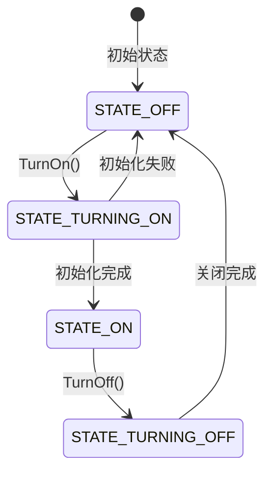

# NFC 组件概述

## 文档信息

| 项目 | 内容 |
|------|------|
| **目的** | 介绍 NFC 组件的项目定位、边界和核心能力 |
| **适用范围** | OpenHarmony NFC 组件所有开发者 |
| **相关文档** | [架构设计](01_Architecture.md)、[N-API 接口](03_NAPI_Interfaces.md) |

---

## 1. 项目定位

### 1.1 什么是 NFC

NFC（Near Field Communication，近场通信）是一种短距离高频无线通信技术，允许电子设备在 10 厘米内进行非接触式点对点数据传输。

### 1.2 组件定位

NFC 组件是 OpenHarmony **通信子系统（communication）** 的核心组件，位于 `foundation/communication/nfc`，提供：

- **NFC 开关控制** - 系统级 NFC 功能启停
- **标签发现与分发** - 自动识别和处理 NFC 标签
- **标签读写** - 支持多种标签类型的数据读写
- **卡模拟** - 支持 HCE（Host Card Emulation）卡模拟功能

### 1.3 架构位置

```
┌─────────────────────────────────────────────────────────────┐
│                     应用层 (Applications)                    │
│         @ohos.nfc.controller / @ohos.nfc.tag                │
└─────────────────────────────────────────────────────────────┘
                              │
                              ▼
┌─────────────────────────────────────────────────────────────┐
│                    框架层 (Framework)                        │
│              N-API / Taihe / CJ FFI 绑定层                   │
└─────────────────────────────────────────────────────────────┘
                              │
                              ▼
┌─────────────────────────────────────────────────────────────┐
│                    服务层 (Services)                         │
│  ┌─────────────┐  ┌─────────────┐  ┌─────────────────────┐  │
│  │ Controller  │  │    Tag      │  │   CardEmulation     │  │
│  │   Service   │  │   Service   │  │      Service        │  │
│  └─────────────┘  └─────────────┘  └─────────────────────┘  │
└─────────────────────────────────────────────────────────────┘
                              │
                              ▼
┌─────────────────────────────────────────────────────────────┐
│                   硬件抽象层 (HAL)                           │
│                    NCI Adapter                               │
│           (libnfc-nci / Vendor NCI Native)                  │
└─────────────────────────────────────────────────────────────┘
                              │
                              ▼
┌─────────────────────────────────────────────────────────────┐
│                   NFC 控制器芯片                             │
└─────────────────────────────────────────────────────────────┘
```

---

## 2. 核心能力

### 2.1 NFC 开关控制

**能力描述**：控制 NFC 功能的开启和关闭

**代码证据**：
- 服务实现：`services/src/ipc/controller/nfc_controller_impl.cpp:TurnOn/TurnOff`
- IDL 接口：`interfaces/inner_api/controller/idl/INfcController.idl:26-28`
- N-API：`frameworks/js/napi/controller/nfc_napi_controller.cpp:66-69`

**状态流转**：



### 2.2 标签发现与分发

**能力描述**：自动发现 NFC 标签并分发到合适的应用处理

**代码证据**：
- 标签发现：`services/src/tag/tag_dispatcher.cpp`
- 前台分发：`frameworks/js/napi/tag/nfc_napi_foreground_dispatch.cpp`
- 读卡模式：`interfaces/inner_api/tags/idl/ITagSession.idl:43-48`

**支持的标签类型**：

| 标签类型 | 技术规范 | 代码位置 |
|----------|----------|----------|
| NFC-A | ISO 14443 Type A | `interfaces/inner_api/tags/nfca_tag.h` |
| NFC-B | ISO 14443 Type B | `interfaces/inner_api/tags/nfcb_tag.h` |
| NFC-F | JIS 6319-4 (FeliCa) | `interfaces/inner_api/tags/nfcf_tag.h` |
| NFC-V | ISO 15693 | `interfaces/inner_api/tags/iso15693_tag.h` |
| MIFARE Classic | NXP 专有 | `interfaces/inner_api/tags/mifare_classic_tag.h` |
| MIFARE Ultralight | NXP 专有 | `interfaces/inner_api/tags/mifare_ultralight_tag.h` |
| ISO-DEP | ISO 14443-4 | `interfaces/inner_api/tags/isodep_tag.h` |
| NDEF | NFC 数据交换格式 | `interfaces/inner_api/tags/ndef_tag.h` |

### 2.3 标签读写

**能力描述**：支持多种技术的标签数据读写操作

**代码证据**：
- 基础会话：`interfaces/inner_api/tags/basic_tag_session.cpp`
- NDEF 操作：`interfaces/inner_api/tags/ndef_tag.cpp`
- MIFARE 操作：`interfaces/inner_api/tags/mifare_classic_tag.cpp`

**支持的操作**：
- 连接/断开标签
- 发送原始 APDU 命令
- 读写 NDEF 消息
- MIFARE 区块读写
- 设置超时和传输参数

### 2.4 卡模拟（HCE）

**能力描述**：支持基于主机的卡模拟，实现手机作为 NFC 卡

**代码证据**：
- HCE 服务：`services/src/card_emulation/ce_service.cpp`
- HCE 会话：`services/src/ipc/card_emulation/hce_session.cpp`
- IDL 接口：`interfaces/inner_api/cardEmulation/idl/IHceSession.idl:23-31`

**支持功能**：
- AID 路由注册
- APDU 命令处理
- 支付应用管理
- 默认服务设置

---

## 3. 运行环境

### 3.1 系统能力要求

组件声明了以下系统能力（syscap）(bundle.json:40-44)：

```json
{
  "syscap": [
    "SystemCapability.Communication.NFC.Core",
    "SystemCapability.Communication.NFC.Tag",
    "SystemCapability.Communication.NFC.CardEmulation"
  ]
}
```

### 3.2 硬件要求

- **NFC 控制器芯片**：设备必须配备 NFC 控制器才能使用 NFC 服务
- **NCI 支持**：NFC Controller Interface 标准支持

### 3.3 依赖组件

主要依赖组件（bundle.json:58-88）：

| 依赖 | 用途 |
|------|------|
| ipc | IPC 通信基础 |
| access_token | 权限校验 |
| bundle_framework | 应用信息获取 |
| ability_runtime | 应用生命周期管理 |
| common_event_service | 公共事件发布/订阅 |
| safwk | System Ability Framework |

### 3.4 Feature 开关

编译期功能开关（nfc.gni:19-48）：

| 功能 | 变量名 | 默认值 | 说明 |
|------|--------|--------|------|
| 厂商 NCI | `nfc_use_vendor_nci_native` | false | 使用厂商提供的 NCI 实现 |
| 厂商应用 | `nfc_service_feature_vendor_applications_enabled` | false | 支持厂商应用扩展 |
| SIM 卡 | `nfc_sim_feature` | false | SIM 卡 NFC 功能 |
| WiFi NDEF | `nfc_service_feature_ndef_wifi_enabled` | false | NDEF WiFi 配对 |
| 蓝牙 NDEF | `nfc_service_feature_ndef_bt_enabled` | false | NDEF 蓝牙配对 |
| 禁用振动 | `nfc_vibrator_disabled` | false | 禁用发现标签时的振动 |
| 屏幕锁 | `nfc_handle_screen_lock` | false | 处理屏幕锁定事件 |

---

## 4. 关键概念

### 4.1 System Ability (SA)

NFC 服务以 System Ability 形式运行：
- **SA ID**: 1140 (`interfaces/inner_api/common/nfc_sdk_common.h:31`)
- **SA 名称**: "nfc_service" (`interfaces/inner_api/common/nfc_sdk_common.h:32`)
- **配置文件**: `sa_profile/1140.json`

### 4.2 NCI (NFC Controller Interface)

NFC 控制器接口，定义了与 NFC 芯片通信的标准接口：
- 默认实现：`services/src/nci_adapter/nci_native_default/`
- 厂商实现：可通过 `nfc_use_vendor_nci_native` 切换

### 4.3 NDEF (NFC Data Exchange Format)

NFC 数据交换格式，标准的数据封装格式：
- 定义位置：`interfaces/inner_api/common/ndef_message.h`
- TNF 类型：Empty, Well-Known, MIME Media, Absolute URI, External, Unknown, Unchanged

### 4.4 HCE (Host Card Emulation)

主机卡模拟，让设备模拟成 NFC 卡：
- AID (Application ID): 应用标识符
- APDU (Application Protocol Data Unit): 应用协议数据单元

---

## 5. 与相关模块关系

### 5.1 与 Settings 关系

- NFC 状态持久化到 SettingsData
- URI: `datashare://com.ohos.settingsdata/.../data_key_nfc_state`
- 代码：`services/src/external_deps/nfc_data_share_impl.cpp`

### 5.2 与 AbilityManager 关系

- 标签分发通过 Want 机制启动应用
- 前台应用分发：`services/src/external_deps/tag_ability_dispatcher.cpp`
- 代码：`services/src/external_deps/app_data_parser.cpp`

### 5.3 与 BundleManager 关系

- 获取应用信息用于权限校验
- 查询支付应用信息
- 代码：`services/src/external_deps/app_data_parser.cpp`

### 5.4 与 WiFi/蓝牙关系

- NDEF WiFi 记录自动连接 WiFi
- NDEF 蓝牙记录自动配对蓝牙设备
- 代码：`services/src/tag/wifi_connection_manager.cpp`, `bt_connection_manager.cpp`

---

## 6. 约束与限制

### 6.1 功能约束

1. **硬件依赖**：设备必须配备 NFC 控制器芯片
2. **单实例**：NFC 服务为系统单例，不支持多实例
3. **权限要求**：关键操作需要特定系统权限

### 6.2 性能约束

1. **标签响应时间**：标签发现后需在限定时间内完成处理
2. **APDU 超时**：ISO-DEP 操作有默认超时限制
3. **HCE 并发**：同一时间只有一个 HCE 应用可以激活

### 6.3 安全约束

1. **前台限制**：标签分发优先前台应用
2. **权限校验**：敏感操作需要 `ohos.permission.NFC` 等权限
3. **签名验证**：支付应用需要特定签名

