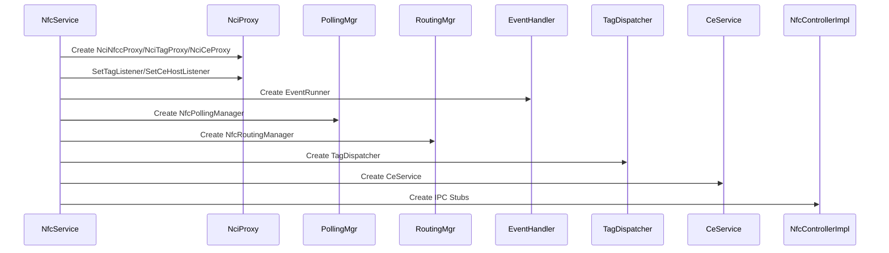
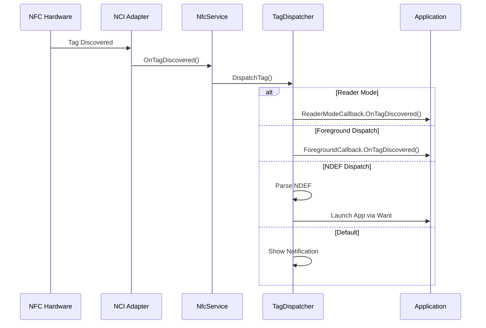
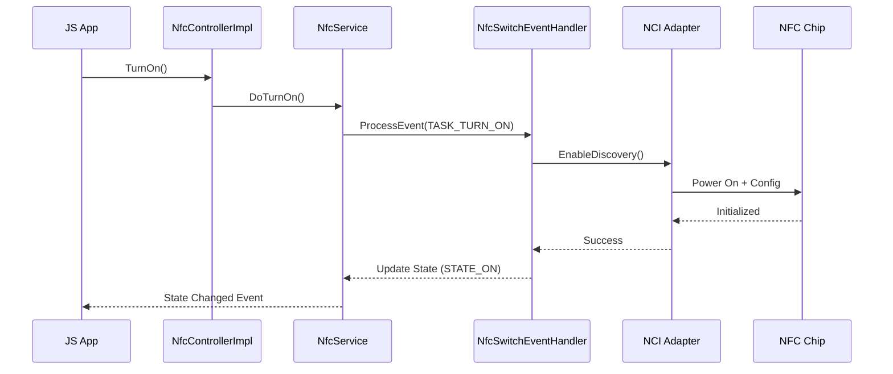
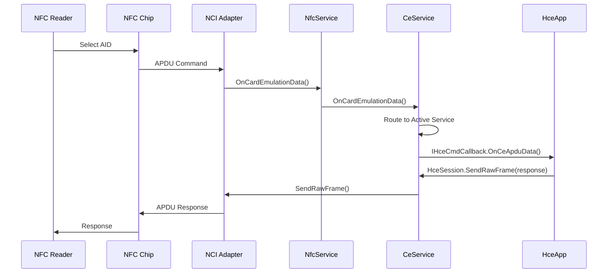
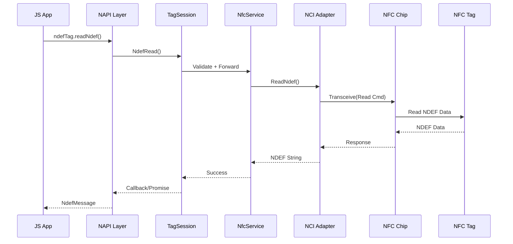

# NFC 架构设计

## 文档信息

| 项目 | 内容 |
|------|------|
| **目的** | 描述 NFC 组件的系统架构、组件关系和数据流 |
| **适用范围** | OpenHarmony NFC 组件系统开发 |
| **相关文档** | [概述](00_Overview.md)、[内部接口](04_Inner_API.md) |

---

## 1. 系统架构总览

```
┌─────────────────────────────────────────────────────────────────┐
│                     应用层 (Applications)                        │
│         @ohos.nfc.controller / @ohos.nfc.tag                   │
└─────────────────────────────────────────────────────────────────┘
                              │
                              ▼
┌─────────────────────────────────────────────────────────────────┐
│                    框架层 (Framework)                           │
│  ┌─────────────────┬─────────────────┬─────────────────────┐   │
│  │   JS N-API      │    ETS Taihe    │    CJ FFI           │   │
│  │ (frameworks/js) │ (frameworks/ets)│  (frameworks/cj)    │   │
│  └────────┬────────┴────────┬────────┴──────────┬──────────┘   │
└───────────┼─────────────────┼───────────────────┼──────────────┘
            │                 │                   │
            ▼                 ▼                   ▼
┌─────────────────────────────────────────────────────────────────┐
│                    IPC 接口层 (IDL)                              │
│  ┌─────────────────┐ ┌─────────────────┐ ┌──────────────────┐  │
│  │ INfcController  │ │   ITagSession   │ │   IHceSession    │  │
│  │  (Controller)   │ │     (Tags)      │ │ (CardEmulation)  │  │
│  └────────┬────────┘ └────────┬────────┘ └────────┬─────────┘  │
└───────────┼───────────────────┼───────────────────┼────────────┘
            │                   │                   │
            ▼                   ▼                   ▼
┌─────────────────────────────────────────────────────────────────┐
│                    服务实现层 (Services)                         │
│  ┌─────────────────────────────────────────────────────────┐   │
│  │                  NfcService (主服务)                     │   │
│  │  ┌─────────────┐ ┌─────────────┐ ┌─────────────────┐   │   │
│  │  │NfcPollingMgr│ │NfcRoutingMgr│ │   CeService     │   │   │
│  │  └─────────────┘ └─────────────┘ └─────────────────┘   │   │
│  │  ┌─────────────┐ ┌─────────────┐ ┌─────────────────┐   │   │
│  │  │TagDispatcher│ │HostCardEmu  │ │ NfcEventHandler │   │   │
│  │  └─────────────┘ └─────────────┘ └─────────────────┘   │   │
│  └─────────────────────────────────────────────────────────┘   │
└──────────────────────────────┬──────────────────────────────────┘
                               │
                               ▼
┌─────────────────────────────────────────────────────────────────┐
│                    NCI 适配层 (NCI Adapter)                      │
│  ┌─────────────┐ ┌─────────────┐ ┌─────────────────────────┐   │
│  │NciNfccProxy │ │NciTagProxy  │ │      NciCeProxy         │   │
│  └──────┬──────┘ └──────┬──────┘ └───────────┬─────────────┘   │
│         │               │                     │                 │
│         ▼               ▼                     ▼                 │
│  ┌─────────────────────────────────────────────────────────┐   │
│  │           NciNativeSelector (dlopen)                    │   │
│  │     libnci_native_default.z.so / libnci_native_vendor   │   │
│  └─────────────────────────────────────────────────────────┘   │
└──────────────────────────────┬──────────────────────────────────┘
                               │
                               ▼
┌─────────────────────────────────────────────────────────────────┐
│                   NFC 控制器芯片 (Hardware)                      │
└─────────────────────────────────────────────────────────────────┘
```

---

## 2. 核心组件

### 2.1 NfcService（主服务）

**位置**: `services/src/nfc_service.cpp`

NfcService 是 NFC 服务的核心，负责：
- 初始化 NCI 代理层
- 管理 NFC 状态（开启/关闭）
- 协调各子模块
- 处理系统事件

**关键接口** (nfc_service.h:46-79)：
```cpp
class NfcService : public NCI::INciTagInterface::ITagListener,
    public NCI::INciCeInterface::ICeHostListener,
    public INfcService {
public:
    bool Initialize();                              // 初始化
    void OnTagDiscovered(uint32_t tagDiscId);       // 标签发现回调
    void OnTagLost(uint32_t tagDiscId);             // 标签丢失回调
    void OnCardEmulationData(const std::vector<uint8_t>& data);
    OHOS::sptr<IRemoteObject> GetTagServiceIface();
    OHOS::sptr<IRemoteObject> GetHceServiceIface();
    // ...
};
```

**初始化流程** (nfc_service.cpp:Initialize)：


### 2.2 NfcPollingManager（轮询管理器）

**位置**: `services/src/nfc_polling_manager.cpp`

管理标签发现和轮询参数：
- 前台分发注册（前台应用接收标签）
- 读卡模式注册（独占标签访问）
- 屏幕状态变化处理
- 轮询参数管理

**数据结构** (nfc_polling_manager.h)：
```cpp
struct ForegroundRegistryData {
    bool isEnabled_;
    bool isVendorApp_;
    uint16_t techMask_;
    AppExecFwk::ElementName element_;
    sptr<KITS::IForegroundCallback> callback_;
};

struct ReaderModeRegistryData {
    bool isEnabled_;
    bool isVendorApp_;
    uint16_t techMask_;
    AppExecFwk::ElementName element_;
    sptr<KITS::IReaderModeCallback> callback_;
};
```

### 2.3 NfcRoutingManager（路由管理器）

**位置**: `services/src/nfc_routing_manager.cpp`

管理卡模拟的路由表：
- 基于默认支付应用计算路由参数
- 提交路由配置到 NFC 控制器
- 与 CeService 协同进行 AID 路由

### 2.4 CeService（卡模拟服务）

**位置**: `services/src/card_emulation/ce_service.cpp`

管理主机卡模拟（HCE）生命周期：
- 构建和配置 AID 路由表
- 处理卡模拟事件（场激活/失活、APDU 数据）
- 支持 HCE 和 UICC/SIM 卡模拟

### 2.5 TagDispatcher（标签分发器）

**位置**: `services/src/tag/tag_dispatcher.cpp`

标签分发逻辑：
1. 检查读卡模式（如启用，发送到读卡应用）
2. 检查前台分发（如启用，发送到前台应用）
3. NDEF 分发（解析 NDEF，分发到对应应用）
4. 回退到通知

---

## 3. 线程模型

### 3.1 事件处理器

**NfcEventHandler** - 主事件处理器：
- 处理：TAG_FOUND, TAG_LOST, SCREEN_CHANGED, COMMIT_ROUTING 等
- 线程：主线程（EventRunner: "nfcservice::EventRunner"）

**NfcSwitchEventHandler** - NFC 开关专用处理器：
- 处理：TASK_INITIALIZE, TASK_TURN_ON, TASK_TURN_OFF, TASK_RESTART
- 线程：FFRT 线程（EventRunner: "NfcSwitchHandler"）
- 目的：避免初始化阻塞主线程

### 3.2 线程架构图

```
┌─────────────────────────────────────────────────────────────┐
│  Main Thread                                                │
│  - NfcEventHandler 处理所有 NFC 事件                        │
│  - 标签发现、状态变化、路由提交                              │
└─────────────────────────────────────────────────────────────┘
                              │
┌─────────────────────────────────────────────────────────────┐
│  FFRT Thread                                                │
│  - NfcSwitchEventHandler 处理 NFC 开/关                      │
│  - 初始化可能需要 90 秒（固件下载），独立线程避免阻塞          │
└─────────────────────────────────────────────────────────────┘
                              │
┌─────────────────────────────────────────────────────────────┐
│  NCI Callback Thread                                        │
│  - 来自 NCI native 层的回调                                 │
│  - 通过 PostEvent 分发到主线程处理                          │
└─────────────────────────────────────────────────────────────┘
```

### 3.3 看门狗机制

**NfcWatchDog** 监控 NCI 操作超时：
```cpp
// nfc_watch_dog.cpp
class NfcWatchDog {
    static constexpr const int WATCH_DOG_TIME_OUT = 10 * 1000;  // 10秒超时
    // 监控长时间未完成的 NCI 操作
};
```

---

## 4. IPC 通信模式

### 4.1 IDL 接口定义

**INfcController** (idl/INfcController.idl)：
```idl
interface OHOS.NFC.INfcController {
    [ipccode 101] int GetState();
    [ipccode 102] void TurnOn();
    [ipccode 103] void TurnOff();
    [ipccode 105] void RegisterNfcStatusCallBack([in] INfcControllerCallback cb, [in] String type);
    [ipccode 108] IRemoteObject GetTagServiceIface();
    [ipccode 115] IRemoteObject GetHceServiceIface();
};
```

**ITagSession** (idl/ITagSession.idl)：
```idl
interface OHOS.NFC.ITagSession {
    [ipccode 201] void Connect([in] int tagRfDiscId, [in] int technology);
    [ipccode 203] void Disconnect([in] int tagRfDiscId);
    [ipccode 207] void SendRawFrame([in] int tagRfDiscId, [in] String hexCmdData, ...);
    [ipccode 208] void NdefRead([in] int tagRfDiscId, [out] String ndefMessage);
    [ipccode 209] void NdefWrite([in] int tagRfDiscId, [in] String msg);
    [ipccode 109] void RegForegroundDispatch(...);
};
```

**IHceSession** (idl/IHceSession.idl)：
```idl
interface OHOS.NFC.IHceSession {
    [ipccode 301] void StartHce([in] ElementName element, [in] List<String> aids);
    [ipccode 302] void StopHce([in] ElementName element);
    [ipccode 303] void RegHceCmdCallback([in] IHceCmdCallback cb, [in] String type);
    [ipccode 305] void SendRawFrame([in] String hexCmdData, ...);
};
```

### 4.2 Stub/Proxy 模式

每个 IDL 接口生成：
- **Stub**（服务端）：`NfcControllerStub`, `TagSessionStub`, `HceSessionStub`
- **Proxy**（客户端）：由客户端使用

**Stub 实现** (services/src/ipc/)：
- `NfcControllerImpl` - 控制器 IPC 处理
- `TagSession` - 标签操作 IPC 处理
- `HceSession` - 卡模拟 IPC 处理

### 4.3 死亡接收者

处理客户端进程死亡：
- `NfcControllerDeathRecipient` - 控制器回调死亡清理
- `ForegroundDeathRecipient` - 前台分发应用死亡清理
- `ReaderModeDeathRecipient` - 读卡模式应用死亡清理
- `HceCmdDeathRecipient` - HCE 回调死亡清理

---

## 5. NCI 适配层

### 5.1 动态库加载

**NciNativeSelector** (services/src/nci_adapter/nci_native_selector.cpp)：
```cpp
#ifdef USE_VENDOR_NCI_NATIVE
    libPath_ = "libnci_native_vendor.z.so";
#else
    libPath_ = "libnci_native_default.z.so";
#endif
```

### 5.2 NCI 接口层次

```
INciNativeInterface (工厂)
    │
    ├──► INciNfccInterface ──► NciNfccProxy ──► nfcc_nci_adapter (硬件)
    │
    ├──► INciTagInterface ───► NciTagProxy ───► tag_nci_adapter (硬件)
    │
    └──► INciCeInterface ────► NciCeProxy ────► nci_ce_impl (硬件)
```

### 5.3 主要 NCI 接口

**INciNfccInterface** (硬件控制)：
- `Initialize()` / `Deinitialize()` - 初始化/反初始化
- `EnableDiscovery()` / `DisableDiscovery()` - 启用/禁用发现
- `SetScreenStatus()` - 屏幕状态管理
- `GetNciVersion()` - NCI 版本

**INciTagInterface** (标签操作)：
- `SetTagListener()` - 注册标签事件监听
- `Connect()` / `Disconnect()` / `Reconnect()` - 连接管理
- `Transceive()` - 发送命令接收响应
- `ReadNdef()` / `WriteNdef()` - NDEF 读写

**INciCeInterface** (卡模拟)：
- `SetCeHostListener()` - 注册 CE 事件监听
- `ComputeRoutingParams()` / `CommitRouting()` - 路由管理
- `SendRawFrame()` - 发送 APDU
- `AddAidRouting()` / `ClearAidTable()` - AID 路由表

---

## 6. 数据流时序图

### 6.1 标签发现与分发



### 6.2 NFC 开关流程



### 6.3 HCE 卡模拟流程



### 6.4 标签读写流程



---

## 7. SA 生命周期

### 7.1 SA 启动流程

```
System Startup / First NFC Access
        │
        ▼
┌───────────────┐
│  OnStart()    │◄─── System Ability Framework 调用
│  SetPriority()│    (设置进程优先级为 -20)
└───────┬───────┘
        ▼
┌───────────────┐
│     Init()    │
│  Create       │
│  NfcService   │
│  Initialize() │
└───────┬───────┘
        ▼
┌───────────────┐
│ Publish(nfc   │
│ControllerImpl)│◄─── 注册到 SystemAbilityManager
└───────┬───────┘
        ▼
┌───────────────┐
│ExecuteTask()  │◄─── 初始化 NFC 状态（如需要则开启）
│(TASK_INIT)    │
└───────────────┘
```

### 7.2 SA ID

- **SA ID**: 1140 (`nfc_sdk_common.h:31`)
- **SA 名称**: "nfc_service" (`nfc_sdk_common.h:32`)
- **配置文件**: `sa_profile/1140.json`

### 7.3 动态卸载

当 NFC 关闭 5 分钟后，SA 自动卸载以节省内存：
```cpp
// nfc_service.cpp
void NfcService::UnloadNfcSa() {
    samgr->UnloadSystemAbility(KITS::NFC_MANAGER_SYS_ABILITY_ID);
}
```

---

## 8. 关键时序参数

| 参数 | 值 | 位置 | 说明 |
|------|-----|------|------|
| `WAIT_MS_INIT` | 90 * 1000 | nfc_service.h:125 | 初始化等待时间（含固件下载） |
| `WAIT_ROUTING_INIT` | 10 * 1000 | nfc_service.h:126 | 路由初始化等待时间 |
| `MAX_RETRY_TIME` | 3 | nfc_service.h:129 | 最大重试次数 |
| `SWITCH_OPER_WAIT_MS` | 200 | nfc_service.h:131 | 开关操作等待时间 |
| `WATCH_DOG_TIME_OUT` | 10 * 1000 | nfc_watch_dog.cpp | 看门狗超时时间 |

