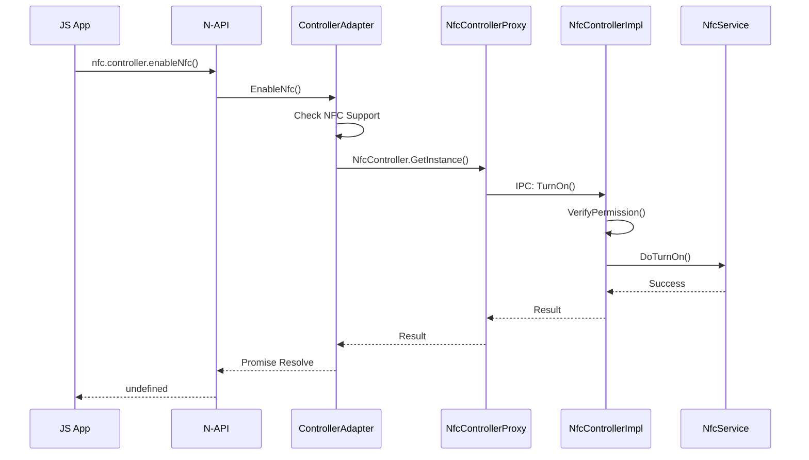
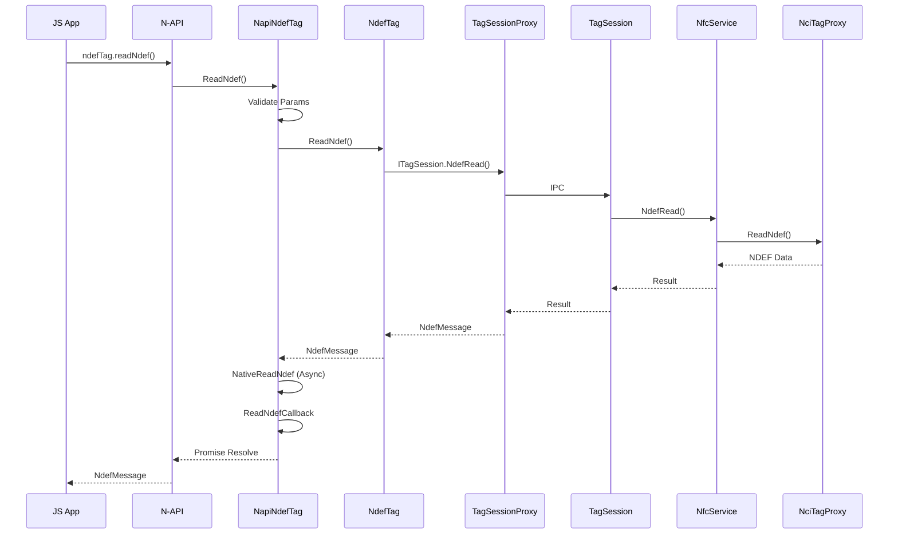
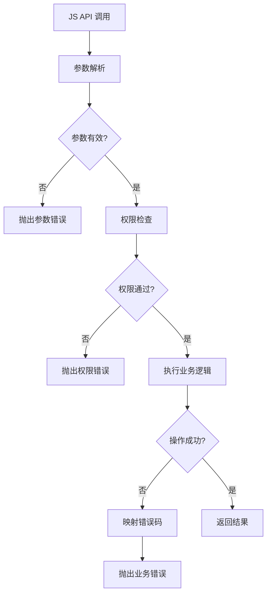

# NFC N-API 接口文档

## 文档信息

| 项目 | 内容 |
|------|------|
| **目的** | 详细描述 NFC 组件提供的 N-API 接口 |
| **适用范围** | 应用开发者 |
| **相关文档** | [概述](00_Overview.md)、[目录结构](02_Directory_Structure.md) |

---

## 1. N-API 模块总览

NFC 组件提供三个 N-API 模块：

| 模块名 | 模块标识 | 功能 |
|--------|----------|------|
| nfc.controller | `nfc.controller` | NFC 开关控制、状态监听 |
| nfc.tag | `nfc.tag` | 标签读写、前台分发 |
| nfc.cardEmulation | `nfc.cardEmulation` | 主机卡模拟（HCE）|

---

## 2. nfc.controller 模块

### 2.1 模块注册

**位置**: `frameworks/js/napi/controller/nfc_napi_controller.cpp:82-95`

```cpp
static napi_module nfcControllerModule = {
    .nm_version = 1,
    .nm_flags = 0,
    .nm_filename = NULL,
    .nm_register_func = InitJs,
    .nm_modname = "nfc.controller",
    .nm_priv = ((void *)0),
    .reserved = { 0 }
};

extern "C" __attribute__((constructor)) void RegisterModule(void)
{
    napi_module_register(&nfcControllerModule);
}
```

### 2.2 API 清单

| JS API | C++ 实现 | 文件 | 行号 | 同步/异步 |
|--------|----------|------|------|-----------|
| `openNfc()` | `OpenNfc()` | nfc_napi_controller_adapter.cpp | 28 | 同步 |
| `enableNfc()` | `EnableNfc()` | nfc_napi_controller_adapter.cpp | 47 | 同步 |
| `closeNfc()` | `CloseNfc()` | nfc_napi_controller_adapter.cpp | 65 | 同步 |
| `disableNfc()` | `DisableNfc()` | nfc_napi_controller_adapter.cpp | 84 | 同步 |
| `getNfcState()` | `GetNfcState()` | nfc_napi_controller_adapter.cpp | 102 | 同步 |
| `isNfcAvailable()` | `IsNfcAvailable()` | nfc_napi_controller_adapter.cpp | 114 | 同步 |
| `isNfcOpen()` | `IsNfcOpen()` | nfc_napi_controller_adapter.cpp | 126 | 同步 |
| `on(type, handler)` | `On()` | nfc_napi_controller_event.cpp | 189 | 事件 |
| `off(type, handler?)` | `Off()` | nfc_napi_controller_event.cpp | 216 | 事件 |

### 2.3 枚举定义

**NfcState** (nfc_napi_controller.cpp:39-60)：

| 枚举值 | 数值 | 说明 |
|--------|------|------|
| `STATE_OFF` | 1 | NFC 关闭 |
| `STATE_TURNING_ON` | 2 | NFC 正在开启 |
| `STATE_ON` | 3 | NFC 已开启 |
| `STATE_TURNING_OFF` | 4 | NFC 正在关闭 |

### 2.4 调用链



### 2.5 错误码

| 错误码 | 说明 |
|--------|------|
| 201 | 权限不足 |
| 202 | 非系统应用 |
| 3100100+ | NFC 状态错误 |

---

## 3. nfc.tag 模块

### 3.1 模块注册

**位置**: `frameworks/js/napi/tag/nfc_napi_tag.cpp:1011-1024`

### 3.2 Tag 类型类

| JS 类 | C++ 类 | 注册函数 | 文件 |
|-------|--------|----------|------|
| `NfcATag` | `NfcATag` | `RegisterNfcAJSClass()` | nfc_napi_tag.cpp:470 |
| `NfcBTag` | `NfcBTag` | `RegisterNfcBJSClass()` | nfc_napi_tag.cpp:489 |
| `NfcFTag` | `NfcFTag` | `RegisterNfcFJSClass()` | nfc_napi_tag.cpp:507 |
| `NfcVTag` | `Iso15693Tag` | `RegisterNfcVJSClass()` | nfc_napi_tag.cpp:525 |
| `IsoDepTag` | `IsoDepTag` | `RegisterIsoDepJSClass()` | nfc_napi_tag.cpp:543 |
| `NdefTag` | `NdefTag` | `RegisterNdefJSClass()` | nfc_napi_tag.cpp:562 |
| `MifareClassicTag` | `MifareClassicTag` | `RegisterMifareClassicJSClass()` | nfc_napi_tag.cpp:610 |
| `MifareUltralightTag` | `MifareUltralightTag` | `RegisterMifareUltralightJSClass()` | nfc_napi_tag.cpp:641 |
| `NdefFormatableTag` | `NdefFormatableTag` | `RegisterNdefFormatableJSClass()` | nfc_napi_tag.cpp:661 |
| `BarcodeTag` | `BarcodeTag` | `RegisterBarcodeTagJSClass()` | nfc_napi_tag.cpp:680 |

### 3.3 基础标签方法 (所有 Tag 类)

**NapiNfcTagSession 基类方法** (nfc_napi_tag_session.cpp)：

| JS 方法 | C++ 函数 | 行号 | 同步/异步 |
|---------|----------|------|-----------|
| `getTagInfo()` | `GetTagInfo()` | 44 | 同步 |
| `connect()` / `connectTag()` | `Connect()` / `ConnectTag()` | 336 / 81 | 同步 |
| `reset()` / `resetConnection()` | `Reset()` / `ResetConnection()` | 354 / 101 | 同步 |
| `isConnected()` / `isTagConnected()` | `IsConnected()` / `IsTagConnected()` | 372 / 117 | 同步 |
| `getTimeout()` / `getSendDataTimeout()` | `GetTimeout()` / `GetSendDataTimeout()` | 411 / 175 | 同步 |
| `setTimeout()` / `setSendDataTimeout()` | `SetTimeout()` / `SetSendDataTimeout()` | 384 / 138 | 同步 |
| `getMaxTransmitSize()` / `getMaxSendLength()` | `GetMaxTransmitSize()` / `GetMaxSendLength()` | 428 / 197 | 同步 |
| `transmit()` / `sendData()` | `Transmit()` / `SendData()` | 490 / 278 | 异步 |

### 3.4 NdefTag 方法

**NapiNdefTag 方法** (nfc_napi_tag_ndef.cpp)：

| JS 方法 | C++ 函数 | 行号 | 同步/异步 |
|---------|----------|------|-----------|
| `createNdefMessage()` | `CreateNdefMessage()` | 125 | 同步 |
| `getNdefTagType()` | `GetNdefTagType()` | 183 | 同步 |
| `getNdefMessage()` | `GetNdefMessage()` | 211 | 同步 |
| `isNdefWritable()` | `IsNdefWritable()` | 267 | 同步 |
| `readNdef()` | `ReadNdef()` | 379 | 异步 |
| `writeNdef()` | `WriteNdef()` | 462 | 异步 |
| `canSetReadOnly()` | `CanSetReadOnly()` | 501 | 同步 |
| `setReadOnly()` | `SetReadOnly()` | 580 | 异步 |
| `getNdefTagTypeString()` | `GetNdefTagTypeString()` | 610 | 同步 |

### 3.5 MifareClassicTag 方法

**NapiMifareClassicTag 方法** (nfc_napi_tag_mifare_classic.cpp)：

| JS 方法 | C++ 函数 | 同步/异步 |
|---------|----------|-----------|
| `authenticateSector()` | `AuthenticateSector()` | 异步 |
| `readSingleBlock()` | `ReadSingleBlock()` | 异步 |
| `writeSingleBlock()` | `WriteSingleBlock()` | 异步 |
| `incrementBlock()` | `IncrementBlock()` | 异步 |
| `decrementBlock()` | `DecrementBlock()` | 异步 |
| `transferToBlock()` | `TransferToBlock()` | 异步 |
| `restoreFromBlock()` | `RestoreFromBlock()` | 异步 |
| `getSectorCount()` | `GetSectorCount()` | 同步 |
| `getBlockCountInSector()` | `GetBlockCountInSector()` | 同步 |
| `getType()` | `GetType()` | 同步 |
| `getTagSize()` | `GetTagSize()` | 同步 |
| `isEmulatedTag()` | `IsEmulatedTag()` | 同步 |
| `getBlockIndex()` | `GetBlockIndex()` | 同步 |
| `getSectorIndex()` | `GetSectorIndex()` | 同步 |

### 3.6 模块静态函数

| JS 函数 | C++ 函数 | 说明 |
|---------|----------|------|
| `getNfcA()` / `getNfcATag()` | `GetNfcATag()` | 获取 NFC-A Tag 实例 |
| `getNfcB()` / `getNfcBTag()` | `GetNfcBTag()` | 获取 NFC-B Tag 实例 |
| `getNfcF()` / `getNfcFTag()` | `GetNfcFTag()` | 获取 NFC-F Tag 实例 |
| `getNfcV()` / `getNfcVTag()` | `GetNfcVTag()` | 获取 NFC-V Tag 实例 |
| `getIsoDep()` | `GetIsoDepTag()` | 获取 IsoDep Tag 实例 |
| `getNdef()` | `GetNdefTag()` | 获取 Ndef Tag 实例 |
| `getMifareClassic()` | `GetMifareClassicTag()` | 获取 MifareClassic Tag 实例 |
| `getMifareUltralight()` | `GetMifareUltralightTag()` | 获取 MifareUltralight Tag 实例 |
| `getNdefFormatable()` | `GetNdefFormatableTag()` | 获取 NdefFormatable Tag 实例 |
| `getBarcodeTag()` | `GetBarcodeTag()` | 获取 Barcode Tag 实例 |
| `getTagInfo()` | `GetTagInfo()` | 从 Want 获取 TagInfo |
| `registerForegroundDispatch()` | `RegisterForegroundDispatch()` | 注册前台分发 |
| `unregisterForegroundDispatch()` | `UnregisterForegroundDispatch()` | 注销前台分发 |
| `on()` | `On()` | 注册标签事件 |
| `off()` | `Off()` | 注销标签事件 |

### 3.7 枚举定义

**TnfType** (nfc_napi_tag.cpp:53-85)：

| 枚举值 | 说明 |
|--------|------|
| `TNF_EMPTY` | 空记录 |
| `TNF_WELL_KNOWN` | Well-Known 类型 |
| `TNF_MEDIA` | MIME Media 类型 |
| `TNF_ABSOLUTE_URI` | 绝对 URI |
| `TNF_EXT_APP` | 外部应用类型 |
| `TNF_UNKNOWN` | 未知类型 |
| `TNF_UNCHANGED` | 未改变 |

**NfcForumType** (nfc_napi_tag.cpp:87-113)：

| 枚举值 | 说明 |
|--------|------|
| `NFC_FORUM_TYPE_1` | Type 1 Tag |
| `NFC_FORUM_TYPE_2` | Type 2 Tag |
| `NFC_FORUM_TYPE_3` | Type 3 Tag |
| `NFC_FORUM_TYPE_4` | Type 4 Tag |
| `MIFARE_CLASSIC` | MIFARE Classic |

**TagTechnology 常量** (nfc_napi_tag.cpp:984-997)：

| 常量 | 数值 | 说明 |
|------|------|------|
| `NFC_A` | 1 | NFC-A 技术 |
| `NFC_B` | 2 | NFC-B 技术 |
| `ISO_DEP` | 3 | ISO-DEP 技术 |
| `NFC_F` | 4 | NFC-F 技术 |
| `NFC_V` | 5 | NFC-V 技术 |
| `NDEF` | 6 | NDEF 技术 |
| `MIFARE_CLASSIC` | 8 | MIFARE Classic 技术 |
| `MIFARE_ULTRALIGHT` | 9 | MIFARE Ultralight 技术 |
| `NFC_BARCODE` | 10 | Barcode 技术 |
| `NDEF_FORMATABLE` | 7 | NDEF Formattable 技术 |

### 3.8 ndef 命名空间静态方法

| JS 方法 | C++ 函数 | 说明 |
|---------|----------|------|
| `ndef.createNdefMessage()` | `NapiNdefTag::CreateNdefMessage()` | 创建 NDEF 消息 |
| `ndef.makeUriRecord()` | `NapiNdefMessage::MakeUriRecord()` | 创建 URI 记录 |
| `ndef.makeTextRecord()` | `NapiNdefMessage::MakeTextRecord()` | 创建文本记录 |
| `ndef.makeMimeRecord()` | `NapiNdefMessage::MakeMimeRecord()` | 创建 MIME 记录 |
| `ndef.makeExternalRecord()` | `NapiNdefMessage::MakeExternalRecord()` | 创建外部记录 |
| `ndef.makeApplicationRecord()` | `NapiNdefMessage::MakeApplicationRecord()` | 创建应用记录 |
| `ndef.messageToBytes()` | `NapiNdefMessage::MessageToBytes()` | 消息转字节 |

### 3.9 调用链示例

**readNdef 调用链**：



---

## 4. nfc.cardEmulation 模块

### 4.1 模块注册

**位置**: `frameworks/js/napi/cardEmulation/nfc_napi_cardEmulation.cpp:98-111`

### 4.2 静态方法

| JS 方法 | C++ 函数 | 同步/异步 |
|---------|----------|-----------|
| `isSupported()` | `IsSupported()` | 同步 |
| `hasHceCapability()` | `HasHceCapability()` | 同步 |
| `isDefaultService()` | `IsDefaultService()` | 同步 |
| `getPaymentServices()` | `GetPaymentServices()` | 同步 |

### 4.3 HceService 类方法

**NfcNapiHceAdapter 实现** (nfc_napi_hce_adapter.cpp)：

| JS 方法 | C++ 函数 | 行号 | 同步/异步 |
|---------|----------|------|-----------|
| `on(type, handler)` | `OnHceCmd()` | 142 | 事件 |
| `off(type, handler)` | `OffHceCmd()` | 172 | 事件 |
| `transmit(data)` | `Transmit()` | 521 | 异步 |
| `start(element, aids)` | `StartHCE()` | 590 | 同步 |
| `stop(element)` | `StopHce()` | 565 | 同步 |

---

## 5. 参数解析与校验

### 5.1 通用解析函数

**位置**: `frameworks/js/napi/common/nfc_napi_common_utils.cpp`

| 函数 | 行号 | 用途 |
|------|------|------|
| `ParseString()` | 25-50 | 解析字符串参数 |
| `ParseInt32()` | 51-63 | 解析整数参数 |
| `ParseBool()` | 65-77 | 解析布尔参数 |
| `ParseBytesVector()` | 79-105 | 解析字节数组 |
| `ParseElementName()` | 167-196 | 解析 ElementName |

### 5.2 类型检查函数

| 函数 | 行号 | 用途 |
|------|------|------|
| `IsNumberArray()` | 592-610 | 检查 number[] 类型 |
| `IsArray()` | 632-646 | 检查数组类型 |
| `IsNumber()` | 648-653 | 检查数字类型 |
| `IsString()` | 655-660 | 检查字符串类型 |
| `IsObject()` | 662-667 | 检查对象类型 |
| `IsFunction()` | 669-674 | 检查函数类型 |

### 5.3 校验与抛出宏

| 函数 | 行号 | 用途 |
|------|------|------|
| `CheckParametersAndThrow()` | 766-775 | 校验参数类型 |
| `CheckArrayNumberAndThrow()` | 776-785 | 校验 number 数组 |
| `CheckNumberAndThrow()` | 786-795 | 校验数字 |
| `CheckStringAndThrow()` | 796-805 | 校验字符串 |
| `CheckObjectAndThrow()` | 806-815 | 校验对象 |
| `CheckFunctionAndThrow()` | 817-826 | 校验函数 |
| `CheckArgCountAndThrow()` | 828-836 | 校验参数数量 |

---

## 6. 错误处理

### 6.1 业务错误码

**位置**: `frameworks/js/napi/common/nfc_napi_common_utils.h`

| 错误码 | 值 | 说明 |
|--------|-----|------|
| `BUSI_ERR_PERM` | 201 | 权限不足 |
| `BUSI_ERR_NOT_SYSTEM_APP` | 202 | 非系统应用 |
| `BUSI_ERR_PARAM` | 401 | 参数错误 |
| `BUSI_ERR_CAPABILITY` | 801 | 能力不支持 |
| `BUSI_ERR_TAG_STATE_INVALID` | 3100201 | 标签状态无效 |
| `BUSI_ERR_ELEMENT_STATE_INVALID` | 3100202 | Element 状态无效 |
| `BUSI_ERR_REGISTER_STATE_INVALID` | 3100203 | 注册状态无效 |
| `BUSI_ERR_IO_OPERATION_INVALID` | 3100204 | I/O 操作失败 |
| `BUSI_ERR_HCE_STATE_INVALID` | 3100301 | HCE 状态无效 |

### 6.2 权限常量

| 常量 | 值 |
|------|-----|
| `TAG_PERM_DESC` | `"ohos.permission.NFC_TAG"` |
| `CARD_EMULATION_PERM_DESC` | `"ohos.permission.NFC_CARD_EMULATION"` |

### 6.3 错误处理流程



---

## 7. 异步实现

### 7.1 异步工作框架

**BaseContext** (nfc_napi_common_utils.h:82-89)：
```cpp
struct BaseContext {
    napi_env env;
    napi_async_work work;
    napi_deferred deferred;
    napi_ref callbackRef;
    bool resolved;
    int errorCode;
    std::string abilityName;
};
```

### 7.2 异步方法实现模式

```cpp
// 1. 定义执行回调（Native 线程）
static void NativeReadNdef(napi_env env, void *data)
{
    auto context = static_cast<NdefContext*>(data);
    // 执行实际的读取操作
    context->errorCode = nfcNdefTagPtr->ReadNdef(ndefMessage);
    context->value = ndefMessage;
    context->resolved = true;
}

// 2. 定义完成回调（JS 线程）
static void ReadNdefCallback(napi_env env, napi_status status, void *data)
{
    auto context = static_cast<NdefContext*>(data);
    if (context->resolved && context->errorCode == ERR_NONE) {
        // 成功 - 解析 Promise 或调用回调
        DoAsyncCallbackOrPromise(env, context, result);
    } else {
        // 失败 - 拒绝 Promise 或调用错误回调
        ThrowAsyncError(env, context, errCode, errMessage);
    }
}

// 3. 注册异步工作
napi_value result = HandleAsyncWork(env, context, "ReadNdef", 
                                     NativeReadNdef, ReadNdefCallback);
```

---

## 8. 权限说明

### 8.1 权限要求

| 模块 | 权限 | 说明 |
|------|------|------|
| nfc.controller | 无 | 状态查询不需要权限，开关需要系统权限 |
| nfc.tag | `ohos.permission.NFC_TAG` | 标签操作需要此权限 |
| nfc.cardEmulation | `ohos.permission.NFC_CARD_EMULATION` | HCE 操作需要此权限 |

### 8.2 权限检查位置

权限检查在服务层实现，N-API 层接收错误码并转换为业务错误：

- **Tag 操作**: `services/src/ipc/tags/tag_session.cpp`
- **HCE 操作**: `services/src/ipc/card_emulation/hce_session.cpp`
- **权限检查器**: `services/src/external_deps/nfc_permission_checker.cpp`

