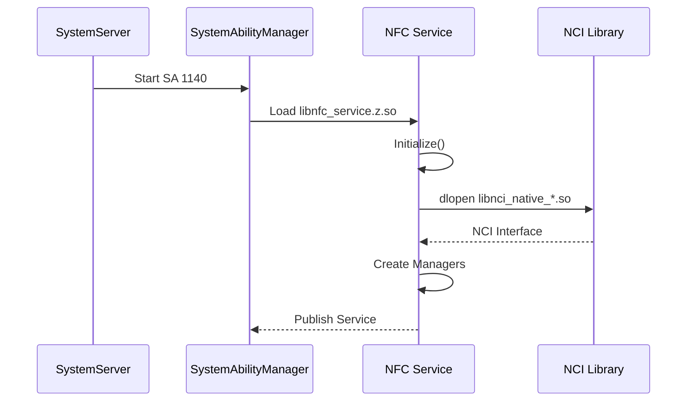

# 构建产物与运行时加载

## 文档信息

| 项目 | 内容 |
|------|------|
| **目的** | 描述 NFC 组件的构建产物、安装路径和运行时加载关系 |
| **适用范围** | 系统集成、发布工程师 |
| **相关文档** | [GN 构建目标](05_GN_Targets.md)、[架构设计](01_Architecture.md) |

---

## 1. 产物总览

### 1.1 产物分类

| 类别 | 产物类型 | 示例 |
|------|----------|------|
| **可执行文件** | .so (共享库) | libnfc_service.z.so |
| **静态库** | .a | libnfc_service_static.a |
| **配置文件** | .json, .cfg | 1140.json, nfc_service.cfg |
| **N-API 模块** | .so | libcontroller.z.so |
| **资源文件** | 目录 | /system/etc/nfc/ |

### 1.2 产物清单

#### 核心服务库

| 产物名 | 类型 | 大小估算 | 说明 |
|--------|------|----------|------|
| libnfc_service.z.so | 共享库 | ~1-2MB | NFC 主服务 |
| libnci_native_default.z.so | 共享库 | ~500KB-1MB | NCI 默认实现 |
| libnfc_notification.z.so | 共享库 | ~100KB | 通知模块 |

#### Inner API 库

| 产物名 | 类型 | 大小估算 | 说明 |
|--------|------|----------|------|
| libnfc_inner_kits_common.z.so | 共享库 | ~200KB | 通用接口和数据结构 |
| libnfc_inner_kits_controller.z.so | 共享库 | ~150KB | 控制器接口 |
| libnfc_inner_kits_tags.z.so | 共享库 | ~300KB | 标签接口 |
| libnfc_inner_kits_card_emulation.z.so | 共享库 | ~200KB | 卡模拟接口 |

#### JS N-API 模块

| 产物名 | 类型 | 安装路径 | 说明 |
|--------|------|----------|------|
| libcontroller.z.so | N-API 模块 | /system/lib/module/nfc/ | 控制器 N-API |
| libtag.z.so | N-API 模块 | /system/lib/module/nfc/ | 标签 N-API |
| libcardemulation.z.so | N-API 模块 | /system/lib/module/nfc/ | 卡模拟 N-API |

#### CJ FFI 库

| 产物名 | 类型 | 说明 |
|--------|------|------|
| libcj_nfc_controller_ffi.z.so | 共享库 | Cangjie 控制器 FFI |
| libcj_nfc_cardemulation_ffi.z.so | 共享库 | Cangjie 卡模拟 FFI |

#### 配置文件

| 产物名 | 类型 | 安装路径 | 说明 |
|--------|------|----------|------|
| 1140.json | JSON | /system/profile/ | SA 配置文件 |
| nfc_service.cfg | CFG | /system/etc/init/ | 启动配置 |

---

## 2. 安装路径

### 2.1 系统库路径

```
/system/lib/
├── libnfc_service.z.so
├── libnci_native_default.z.so
├── libnfc_notification.z.so
├── libnfc_inner_kits_common.z.so
├── libnfc_inner_kits_controller.z.so
├── libnfc_inner_kits_tags.z.so
├── libnfc_inner_kits_card_emulation.z.so
├── libcj_nfc_controller_ffi.z.so
└── libcj_nfc_cardemulation_ffi.z.so
```

### 2.2 N-API 模块路径

```
/system/lib/module/nfc/
├── libcontroller.z.so
├── libtag.z.so
└── libcardemulation.z.so
```

### 2.3 配置文件路径

```
/system/etc/init/
└── nfc_service.cfg          # SA 启动配置

/system/profile/
└── 1140.json                # SA ID 配置

/system/etc/nfc/
└── (resources/)             # NFC 资源文件
```

### 2.4 路径映射表

| 产物 | 构建输出路径 | 安装路径 |
|------|--------------|----------|
| libnfc_service.z.so | `out/{product}/system/lib/` | `/system/lib/` |
| libcontroller.z.so | `out/{product}/system/lib/module/nfc/` | `/system/lib/module/nfc/` |
| 1140.json | `out/{product}/system/profile/` | `/system/profile/` |
| nfc_service.cfg | `out/{product}/system/etc/init/` | `/system/etc/init/` |

---

## 3. 运行时加载关系

### 3.1 启动时加载



### 3.2 库依赖关系

```
libnfc_service.z.so
├── libnfc_hce_interface_stub.so
├── libnfc_controller_interface_stub.so
├── libnfc_tag_interface_stub.so
├── libnfc_inner_kits_common.so
├── libnfc_notification.so
└── libnci_native_default.so (或 libnci_native_vendor.so)
    └── libnfc-nci.so (第三方)

libcontroller.z.so (N-API)
├── libnfc_inner_kits_controller.so
└── libnfc_inner_kits_common.so

libtag.z.so (N-API)
├── libnfc_inner_kits_tags.so
└── libnfc_inner_kits_common.so

libcardemulation.z.so (N-API)
├── libnfc_inner_kits_card_emulation.so
└── libnfc_inner_kits_common.so
```

### 3.3 运行时加载顺序

**系统启动时**:
1. SystemAbilityManager 加载 `libnfc_service.z.so`
2. NFC Service 通过 `NciNativeSelector` 动态加载 NCI 库
3. 初始化 NCI 接口、创建管理器
4. 发布 IPC 接口到 SystemAbilityManager

**应用调用时**:
1. JS 运行时加载对应的 N-API 模块 (如 `libtag.z.so`)
2. N-API 模块链接 Inner API 库
3. Inner API 通过 IPC 连接到 NFC Service
4. NFC Service 通过 NCI 接口操作硬件

---

## 4. SA 配置 (1140.json)

**位置**: `sa_profile/1140.json`

```json
{
  "process": "nfc_service",
  "systemability": [
    {
      "name": 1140,
      "libpath": "libnfc_service.z.so",
      "run-on-create": false,
      "distributed": false,
      "dump-level": 1,
      "start-on-demand": {
        "boot": "bootevent.boot.completed",
        "parameter": [
          {
            "name": "const.nfc.hal_service.ready",
            "value": "true"
          }
        ]
      },
      "stop-on-demand": {
        "parameter": [
          {
            "name": "const.nfc.state",
            "value": "off"
          }
        ]
      }
    }
  ]
}
```

**关键配置**:
- **SA ID**: 1140
- **进程名**: nfc_service
- **库路径**: libnfc_service.z.so
- **启动时机**: 
  - 开机完成后 (`bootevent.boot.completed`)
  - NFC HAL 服务就绪后 (`const.nfc.hal_service.ready=true`)
- **停止时机**: NFC 关闭 (`const.nfc.state=off`)

---

## 5. 启动配置 (nfc_service.cfg)

**位置**: `services/etc/init/nfc_service.cfg`

```cfg
service nfc_service /system/bin/sa_main /system/profile/nfc_service.json
    class core
    user nfc
    group nfc system
    seclabel u:r:nfc_service:s0
    oneshot
    disabled
```

**关键配置**:
- **用户**: nfc
- **组**: nfc, system
- **SELinux**: u:r:nfc_service:s0
- **启动方式**: oneshot (启动一次后等待显式重启)
- **默认状态**: disabled (按需启动)

---

## 6. 运行时文件

### 6.1 运行时数据

| 路径 | 用途 | 权限 |
|------|------|------|
| `/data/nfc/nfc_preferences.xml` | NFC 偏好设置 | 0600 (nfc:nfc) |

### 6.2 日志

| 日志域 | 标签 | 级别 |
|--------|------|------|
| 0xD000301 | Nfc_Core | DEBUG/INFO/WARN/ERROR |
| 0xD000301 | Nfc_EtsFwk | DEBUG/INFO/WARN/ERROR |

---

## 7. 版本信息

### 7.1 库版本

版本信息通过以下方式获取：
- `nfc_sdk_common.h` 中的版本宏
- 编译时间戳
- Git 提交哈希（如配置了构建规则）

### 7.2 兼容性

| 版本 | 说明 |
|------|------|
| NCI 1.0 | 基本 NFC 支持 |
| NCI 2.0 | 增强功能（通过 `GetNciVersion()` 获取）|

---

## 8. 常见问题

### 8.1 库加载失败

**现象**: NFC 服务启动失败，日志显示 dlopen 错误

**检查项**:
1. 确认 `libnci_native_default.z.so` 或 `libnci_native_vendor.z.so` 存在
2. 检查库依赖关系: `ldd /system/lib/libnfc_service.z.so`
3. 检查 SELinux 权限: `ls -Z /system/lib/libnfc*.so`

### 8.2 SA 启动失败

**现象**: SystemAbilityManager 无法启动 SA 1140

**检查项**:
1. 检查配置文件: `/system/profile/1140.json`
2. 检查启动配置: `/system/etc/init/nfc_service.cfg`
3. 检查日志: `hilog | grep nfc`

### 8.3 N-API 加载失败

**现象**: JS 应用无法调用 NFC API

**检查项**:
1. 确认 N-API 模块存在: `ls /system/lib/module/nfc/`
2. 检查模块权限: `ls -l /system/lib/module/nfc/*.so`
3. 检查 syscap: 确认设备支持 `SystemCapability.Communication.NFC.*`

