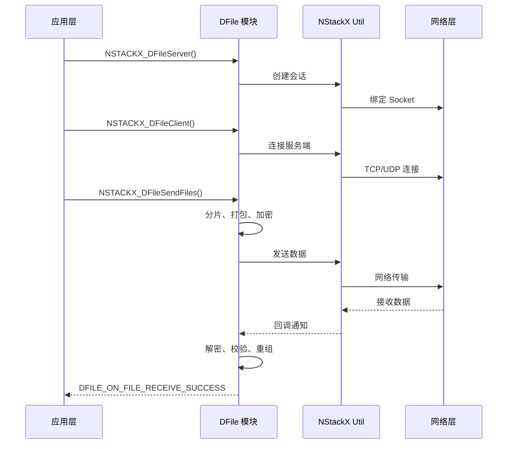
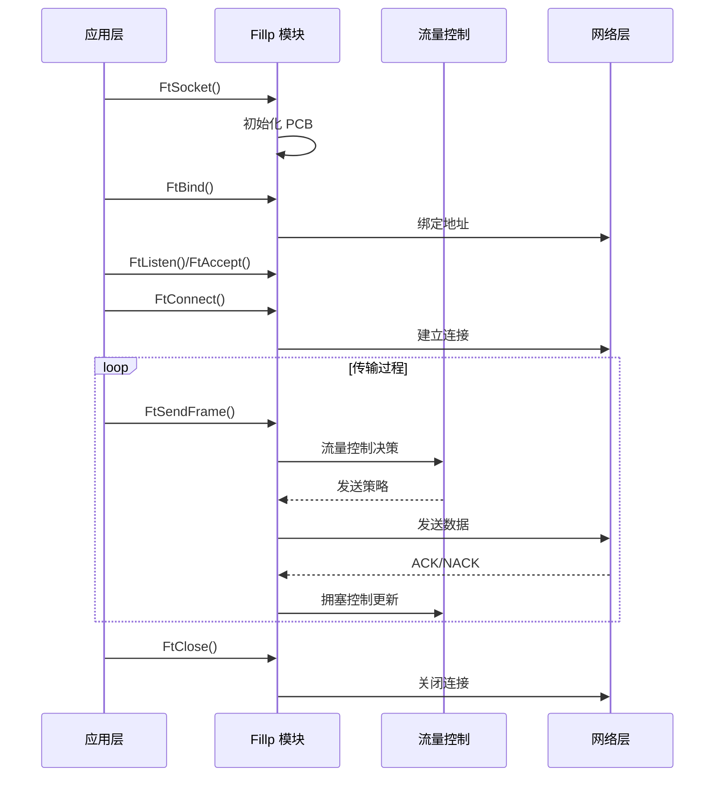
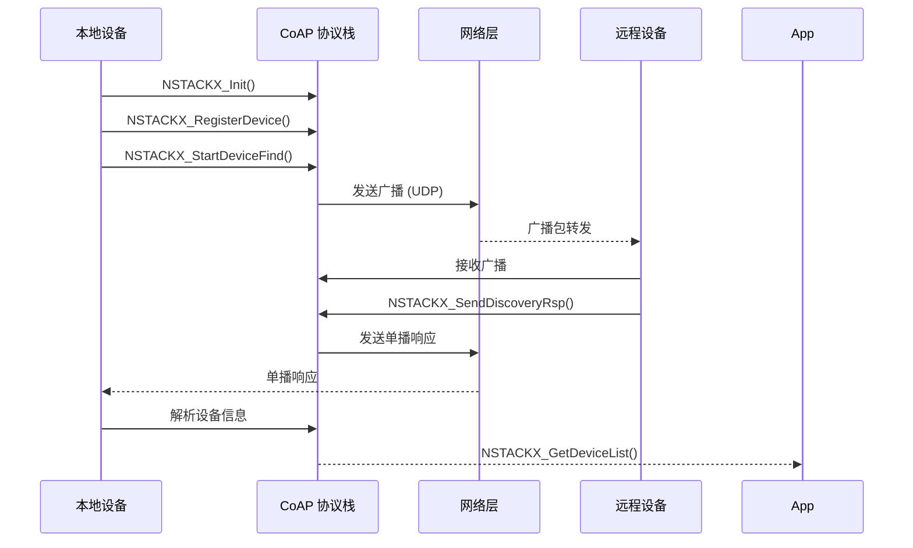

# T2Stack 架构说明

## 整体架构

T2Stack 采用分层架构设计，从下到上依次为：

```
┌─────────────────────────────────────────────────────────────────────┐
│                         应用层 (Application)                         │
│                  上层业务调用 T2Stack 接口                             │
├─────────────────────────────────────────────────────────────────────┤
│                       接口层 (API Layer)                             │
│  ┌─────────────┐ ┌─────────────┐ ┌─────────────────────┐            │
│  │ Fillp API   │ │ DFile API   │ │   NStackX API      │            │
│  │(fillpinc.h) │ │(nstackx_    │ │   (nstackx.h)      │            │
│  │             │ │ dfile.h)    │ │                     │            │
│  └─────────────┘ └─────────────┘ └─────────────────────┘            │
├─────────────────────────────────────────────────────────────────────┤
│                      核心层 (Core Layer)                            │
│  ┌─────────────┐ ┌─────────────┐ ┌─────────────────────┐            │
│  │ Fillp Core  │ │ DFile Core  │ │   NStackX Core     │            │
│  │   (协议实现)  │ │  (协议实现)  │ │    (协议实现)       │            │
│  └─────────────┘ └─────────────┘ └─────────────────────┘            │
├─────────────────────────────────────────────────────────────────────┤
│                      公共模块层 (Util Layer)                          │
│  ┌─────────────────────────────────────────────────────────────┐    │
│  │  NStackX Util (事件、Socket、定时器、加密、日志)              │    │
│  │  ┌─────────┐ ┌─────────┐ ┌─────────┐ ┌─────────┐         │    │
│  │  │  Event  │ │ Socket  │ │  Timer  │ │ Crypto  │         │    │
│  │  └─────────┘ └─────────┘ └─────────┘ └─────────┘         │    │
│  └─────────────────────────────────────────────────────────────┘    │
├─────────────────────────────────────────────────────────────────────┤
│                       系统适配层 (Platform Layer)                     │
│  ┌─────────────┐ ┌─────────────┐ ┌─────────────────────┐            │
│  │  LiteOS-A   │ │  LiteOS-M   │ │      Linux         │            │
│  │  适配层      │ │  适配层      │ │      适配层         │            │
│  └─────────────┘ └─────────────┘ └─────────────────────┘            │
└─────────────────────────────────────────────────────────────────────┘
```

## 组件交互图

### 文件传输流程



### 流传输流程



### 设备发现流程



## 线程模型

### Fillp 线程模型

Fillp 采用**单线程事件循环**模式：

```
┌─────────────────────────────────────────────────────────────┐
│                      Fillp 主线程                            │
│  ┌─────────────────────────────────────────────────────────┐  │
│  │                    事件循环                            │  │
│  │  ┌─────────┐  ┌─────────┐  ┌─────────┐  ┌─────────┐  │  │
│  │  │ Epoll   │→ │ 数据收发 │→ │ 拥塞控制 │→ │ 重传处理 │  │  │
│  │  │  等待   │  │         │  │         │  │         │  │  │
│  │  └─────────┘  └─────────┘  └─────────┘  └─────────┘  │  │
│  └─────────────────────────────────────────────────────────┘  │
│                                                             │
│  调用者线程 (Epoll 模式下)                                   │
│  ┌─────────┐  ┌─────────┐  ┌─────────┐                     │
│  │ FtSend  │  │ FtRecv  │  │ FtClose │                     │
│  │(用户调用) │  │(用户调用) │  │(用户调用) │                     │
│  └─────────┘  └─────────┘  └─────────┘                     │
└─────────────────────────────────────────────────────────────┘
```

**关键机制**：
- **非阻塞模式**：支持 NON-BLOCK socket
- **Epoll 集成**：`FtEpollWait()` 接口
- **线程安全**：由调用者保证同步

### DFile 线程模型

DFile 采用**回调驱动**模式，不创建独立线程：

```
┌─────────────────────────────────────────────────────────────┐
│                      调用者线程                               │
│  ┌─────────────────────────────────────────────────────────┐  │
│  │  NSTACKX_DFileServer()  ←  创建服务端                   │  │
│  │  NSTACKX_DFileClient()  ←  创建客户端                   │  │
│  │  NSTACKX_DFileSendFiles() ←  发送文件                   │  │
│  └─────────────────────────────────────────────────────────┘  │
│                              ↓                               │
│                    DFile 内部处理 (非阻塞)                     │
│                              ↓                               │
│              DFileMsgReceiver 回调 (软总线调用)                │
└─────────────────────────────────────────────────────────────┘
```

**关键机制**：
- **异步回调**：所有操作通过回调通知
- **软总线集成**：依赖软总线进行数据传输
- **无独立线程**：降低资源占用

### NStackX 线程模型

NStackX 需要独立的**发现线程**：

```
┌─────────────────────────────────────────────────────────────┐
│                      NStackX 线程                            │
│  ┌─────────────────────────────────────────────────────────┐  │
│  │                    发现循环                             │  │
│  │  ┌─────────┐  ┌─────────┐  ┌─────────┐               │  │
│  │  │ 广播发送 │→ │ 响应接收 │→ │ 设备缓存 │               │  │
│  │  └─────────┘  └─────────┘  └─────────┘               │  │
│  └─────────────────────────────────────────────────────────┘  │
│                                                             │
│  ┌─────────────────────────────────────────────────────────┐  │
│  │                    调用者线程                           │  │
│  │  NSTACKX_Init() → NSTACKX_RegisterDevice()             │  │
│  │  NSTACKX_StartDeviceFind() → NSTACKX_GetDeviceList()   │  │
│  └─────────────────────────────────────────────────────────┘  │
└─────────────────────────────────────────────────────────────┘
```

## 数据流

### Fillp 数据流

```
┌──────────────────────────────────────────────────────────────────┐
│                           发送端                                  │
│  ┌─────────┐    ┌─────────┐    ┌─────────┐    ┌─────────┐     │
│  │ 应用层   │ →  │ 分片引擎 │ →  │ 加密模块 │ →  │ 发送队列 │     │
│  │ FtSend  │    │ 帧分割   │    │ AES/    │    │ 重传管理 │     │
│  └─────────┘    └─────────┘    │ RC4     │    └────┬────┘     │
│                                └─────────┘         │          │
└──────────────────────────────────────────────────────────────┘ │
                                                           │      │
                          ┌────────────────────────────────┘      │
                          ↓                                       │
┌──────────────────────────────────────────────────────────────┐  │
│                         网络传输 (UDP)                          │←─┘
└──────────────────────────────────────────────────────────────┘ │
                          │                                       │
                          ↓                                       │
┌──────────────────────────────────────────────────────────────┐  │
│                           接收端                               │  │
│  ┌─────────┐    ┌─────────┐    ┌─────────┐    ┌─────────┐     │
│  │ 接收队列 │ ←  │ 重组引擎 │ ←  │ 解密模块 │ ←  │ 网络层  │     │
│  │ 乱序缓存 │    │ 帧重组   │    │ AES/    │    │ UDP     │     │
│  └────┬────┘    └─────────┘    │ RC4     │    └─────────┘     │
│       │                          └─────────┘                   │
│       ↓                                                       │
│  ┌─────────┐                                                  │
│  │ FtRecv  │ →  应用层                                         │
│  └─────────┘                                                  │
└──────────────────────────────────────────────────────────────┘
```

### DFile 数据流

```
┌──────────────────────────────────────────────────────────────────┐
│                           发送端                                  │
│  ┌─────────┐    ┌─────────┐    ┌─────────┐    ┌─────────┐     │
│  │ 文件列表 │ →  │ 分片计算 │ →  │ 加密打包 │ →  │ 软总线  │     │
│  │ NSTACKX_│    │ MD5/    │    │ AES-    │    │ Session │     │
│  │ SendFiles│    │ SHA1    │    │ CTR     │    │         │     │
│  └─────────┘    └─────────┘    └─────────┘    └─────────┘     │
└──────────────────────────────────────────────────────────────────┘
                              ↓
                    ┌─────────────────┐
                    │   软总线传输     │
                    │   (TCP/UDP)      │
                    └─────────────────┘
                              ↓
┌──────────────────────────────────────────────────────────────────┐
│                           接收端                                  │
│  ┌─────────┐    ┌─────────┐    ┌─────────┐    ┌─────────┐     │
│  │ 软总线  │ →  │ 校验解密 │ →  │ 文件重组 │ →  │ 写入磁盘 │     │
│  │ Session │    │ AES-    │    │ MD5/    │    │ rename  │     │
│  │         │    │ CTR     │    │ SHA1    │    │ hook    │     │
│  └─────────┘    └─────────┘    └─────────┘    └─────────┘     │
└──────────────────────────────────────────────────────────────────┘
```

## 相关文档

- [项目概览](./00_Overview.md) - 核心能力和运行环境
- [模块结构](./02_Module_Structure.md) - 目录结构详解
- [API 参考](./03_CAPI_Reference.md) - 完整 API 接口
- [安全评审](./07_Security_Review.md) - 安全风险分析

---

*文档版本：1.0.0*
*最后更新：2026-02-06*
