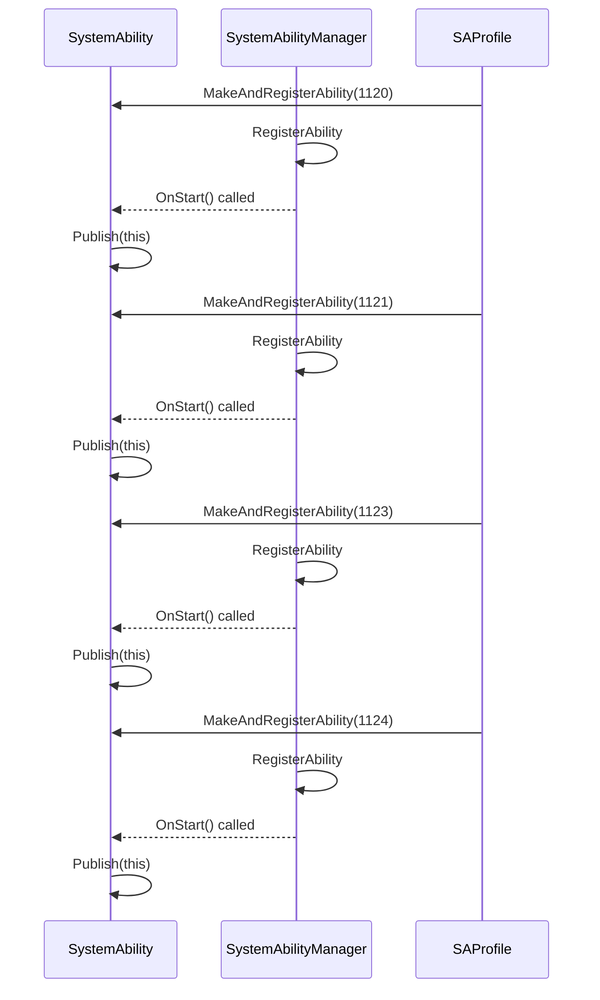
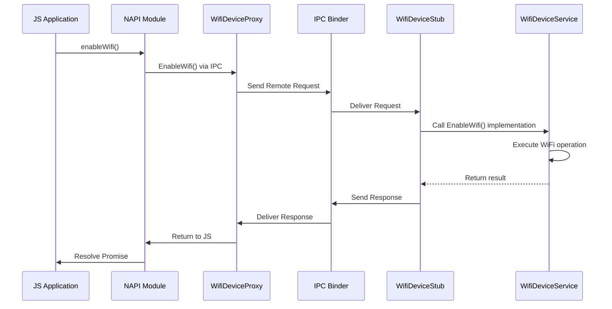
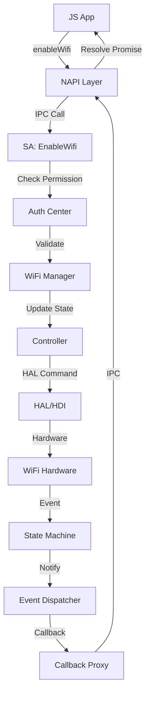
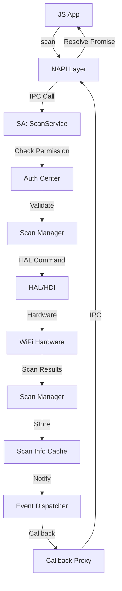
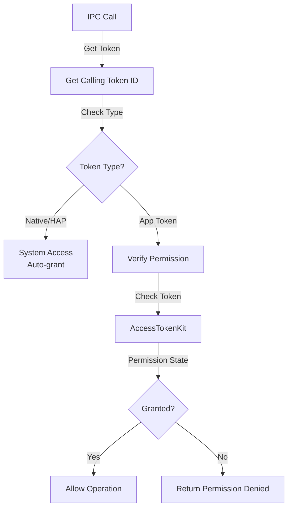
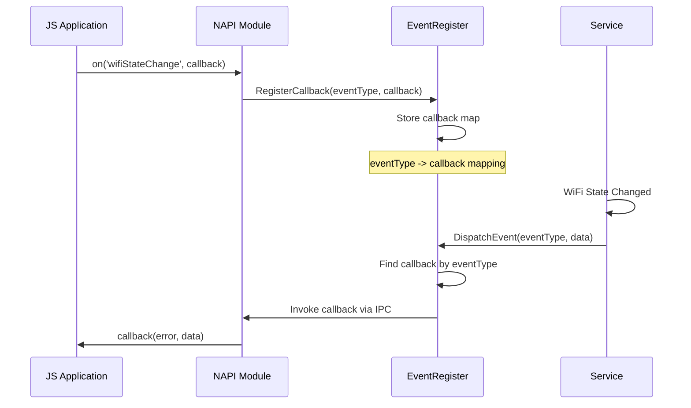
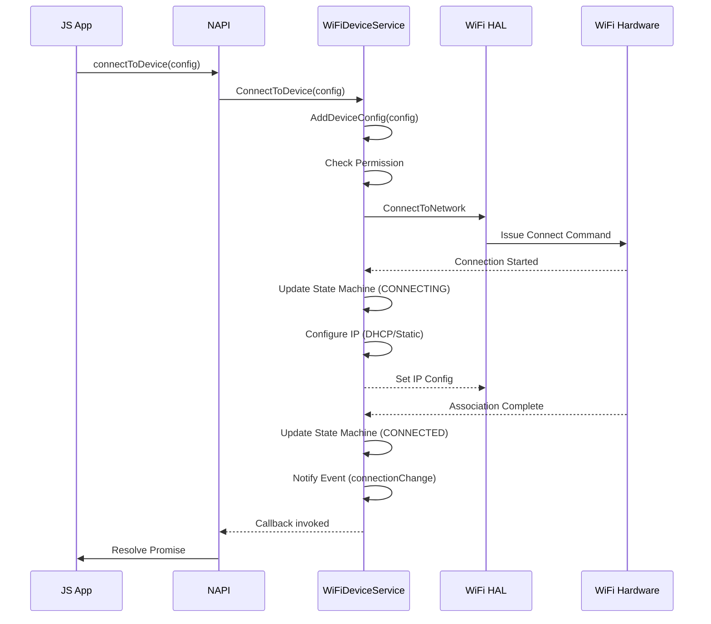
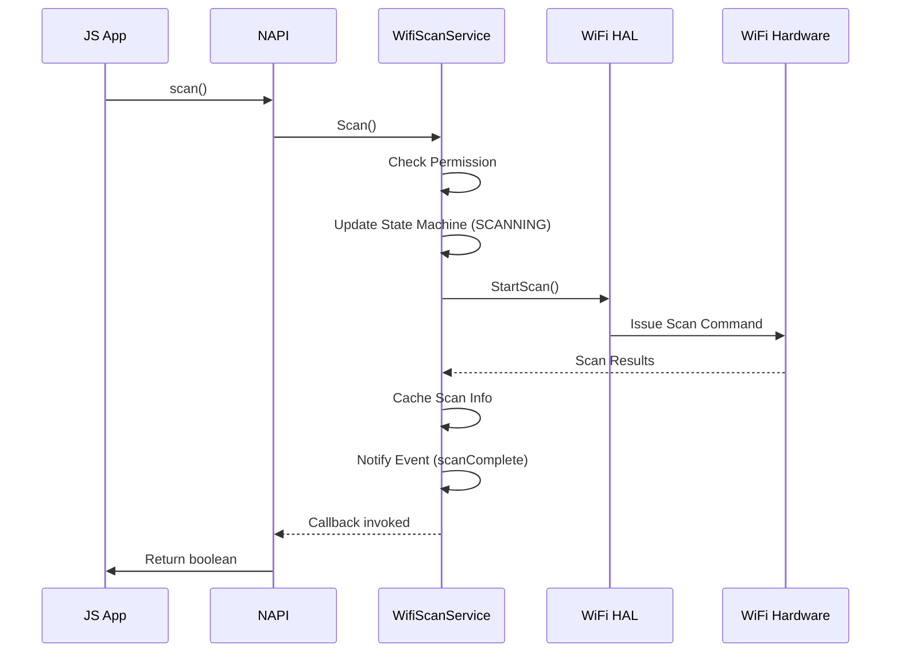

# WLAN 架构说明

**目的**: 描述 WLAN 组件的架构设计，包括组件图、数据流、线程模型和关键时序

**适用范围**: 架构师、高级开发者、系统集成者

**生成时间**: 2026-02-06

---

## 架构概述

WLAN 组件采用分层架构，分为应用层、框架层、服务层和硬件抽象层。

### 架构分层

```
┌─────────────────────────────────────────────────────────────────┐
│                   应用层 (Application Layer)                 │
│  ┌─────────────┐  ┌─────────────┐  ┌─────────────┐               │
│  │ PortalLogin │  │ WiFi Direct  │  │  JS Apps    │               │
│  │ (HAP)      │  │ Demo (HAP) │  │              │               │
│  └─────────────┘  └─────────────┘  └─────────────┘               │
└──────────────────────────┬──────────────────────────────────────────┘
                       │ JS API 调用
                       ▼
┌─────────────────────────────────────────────────────────────────┐
│              N-API 绑定层 (N-API Layer)              │
│  ┌─────────────────────┐  ┌─────────────────────┐        │
│  │ @ohos.wifi       │  │ @ohos.wifiext    │        │
│  │ (wifi.z.so)      │  │ (wifiext.z.so)   │        │
│  └─────────────────────┘  └─────────────────────┘        │
└──────────────────────────┬──────────────────────────────────────────┘
                       │ IPC / Proxy
                       ▼
┌─────────────────────────────────────────────────────────────────┐
│            Native SDK 层 (Native SDK Layer)            │
│  ┌──────────────────────────────────────────────────────┐  │
│  │ libwifi_sdk.so (Proxy + NDK)               │  │
│  │  - WifiDeviceProxy                            │  │
│  │  - WifiScanProxy                             │  │
│  │  - WifiHotspotProxy                           │  │
│  │  - WifiP2pProxy                               │  │
│  │  - IWifiDevice/Hotspot/P2p/Scan interfaces   │  │
│  └──────────────────────────────────────────────────────┘  │
└──────────────────────────┬──────────────────────────────────────────┘
                       │ Binder IPC
                       ▼
┌─────────────────────────────────────────────────────────────────┐
│        System Ability 层 (SA Layer)                       │
│  ┌──────────────┐  ┌──────────────┐  ┌──────────────┐        │
│  │ 1120 (STA) │  │ 1124 (Scan)  │  │ 1121 (AP)  │        │
│  │ WifiDevice  │  │ WifiScan     │  │ WifiHotspot  │        │
│  │ MgrService  │  │ MgrService   │  │ MgrService  │        │
│  └──────────────┘  └──────────────┘  └──────────────┘        │
│  ┌──────────────┐  ┌──────────────┐                        │
│  │ 1123 (P2P) │  │ Common Utils │                        │
│  │ WifiP2pService│  │ (Auth/Perm/ │                        │
│  │               │  │ Events/Config)│                        │
│  └──────────────┘  └──────────────┘                        │
│  ┌──────────────────────────────────────────────────────┐  │
│  │  WiFi Manager Service (Orchestrator)        │  │
│  │  - wifi_controller                          │  │
│  │  - sub_services (STA/AP/P2P/Scan)     │  │
│  │  - toolkit (Config/NetHelper)            │  │
│  └──────────────────────────────────────────────┘  │
└──────────────────────────┬──────────────────────────────────────────┘
                       │ Internal API / HAL Interface
                       ▼
┌─────────────────────────────────────────────────────────────────┐
│         HAL/HDI 抽象层 (HAL/HDI Layer)              │
│  ┌──────────────────────────────────────────────────────┐  │
│  │ WifiNative (HDI Client)                 │  │
│  │  - 调用 HAL 接口                          │  │
│  └──────────────────────────────────────────────┘  │
└──────────────────────────┬──────────────────────────────────────────┘
                       │
                       ▼
                ┌─────────────────────┐
                │ 硬件驱动层        │
                │ (Driver/WPA)      │
                └─────────────────────┘
```

---

## System Ability 架构

### SA 注册流程


### SA 信息
| SA ID | 名称 | 服务类 | 库文件 | 进程 |
|-------|------|---------|---------|------|
| 1120 | WifiDeviceMgrServiceImpl | libwifi_device_ability.z.so | wifi_manager_service |
| 1121 | WifiHotspotMgrServiceImpl | libwifi_hotspot_ability.z.so | wifi_manager_service |
| 1123 | WifiP2pServiceImpl | libwifi_p2p_ability.z.so | wifi_manager_service |
| 1124 | WifiScanMgrServiceImpl | libwifi_scan_ability.z.so | wifi_manager_service |

---

## IPC 通信架构

### Proxy-Stub 模式
WLAN 组件使用 OpenHarmony 的标准 IPC 模式：

- **Proxy（客户端）**: 封装远程调用，向服务发送请求
- **Stub（服务端）**: 实现接口，处理来自 Proxy 的请求
- **Binder**: 底层 IPC 传输机制

### IPC 数据流


---

## 线程模型

### 进程分布

| 进程 | 运行的组件 | 线程模型 |
|------|-----------|---------|
| `wifi_manager_service` | 所有 SA 服务 | 主线程 + Event Handler 线程 |
| `wifi_hal_service` | HAL 适配（可选） | 主线程 + 异步任务线程 |

### 线程类型

#### 主线程（Main Thread）
- 处理 SA 的 `OnStart()`/`OnStop()` 生命周期
- 处理同步 IPC 调用（通过 Event Handler）
- 处理状态机事件

#### Event Handler 线程
- 处理异步任务
- 执行耗时的 WiFi 操作（扫描、连接等）
- 避免阻塞主线程

#### Worker 线程（Async）
- 用于 N-API 的异步操作
- 处理 Promise/Callback 回调
- 通过 `DoAsyncWork()` 机制实现

---

## 数据流

### WiFi 连接流程


### 扫描流程


---

## 权限验证流程

### 权限检查层次


### 同进程检查
如果调用者与服务在同一进程（相同 UID 和 PID）：
- 自动授予权限（`PERMISSION_GRANTED`）
- 跳过 AccessToken 验证

---

## 事件通知机制

### 事件订阅流程


### 事件类型
| 事件类型 | 触发时机 | 所需权限 |
|---------|---------|---------|
| `wifiStateChange` | WiFi 启用/禁用 | GET_WIFI_INFO |
| `wifiConnectionChange` | 连接状态变化 | GET_WIFI_INFO |
| `scanStateChange` | 扫描状态变化 | GET_WIFI_INFO |
| `rssiChange` | 信号强度变化 | GET_WIFI_INFO |
| `hotspotStateJoin` | 站点加入热点 | MANAGE_WIFI_HOTSPOT |
| `hotspotStateLeave` | 站点离开热点 | MANAGE_WIFI_HOTSPOT |
| `p2pStateChange` | P2P 状态变化 | GET_WIFI_INFO |
| `p2pPeerChange` | P2P 对端变化 | GET_WIFI_INFO + LOCATION |

---

## 配置管理

### 配置中心
**位置**: `wifi_common/wifi_config_center.cpp`
**职责**:
- WiFi 配置文件管理（`/data/service/el2/wifi/wpa/wpa_supplicant.conf`）
- 网络配置持久化
- 配置变更通知

### 配置文件路径
```
/data/service/el2/wifi/wpa/
├── wpa_supplicant.conf         # WPA_supplicant 主配置
├── wpa_supplicant_wlan0.conf  # wlan0 接口配置
└── wpa_supplicant_wlan1.conf  # wlan1 接口配置
```

---

## 状态机

### STA 状态机
**文件**: `wifi_sta/sta_state_machine.cpp`
**状态**:
- `DISABLED` - WiFi 禁用
- `SCANNING` - 扫描中
- `CONNECTING` - 连接中
- `CONNECTED` - 已连接
- `DISCONNECTING` - 断开连接中
- `UNKNOWN` - 未知状态

### AP 状态机
**文件**: `wifi_ap/ap_state_machine.cpp`
**状态**:
- `IDLE` - 空闲
- `STARTING` - 启动中
- `STARTED` - 已启动
- `STOPPING` - 停止中

---

## 关键时序

### WiFi 连接时序


### 扫描时序


---

## 数据结构

### 主要数据结构
| 结构 | 说明 | 文件位置 |
|------|------|----------|
| `WifiScanInfo` | 扫描结果信息 | `kits/c/wifi_scan_info.h` |
| `WifiLinkedInfo` | 连接信息 | `kits/c/wifi_linked_info.h` |
| `WifiDeviceConfig` | 设备配置 | `kits/c/wifi_device_config.h` |
| `WifiP2pConfig` | P2P 配置 | `kits/c/wifi_p2p_config.h` |
| `WifiHotspotConfig` | 热点配置 | `kits/c/wifi_hotspot_config.h` |

---

## 相关跳转

- [00_Overview.md](00_Overview.md) - 项目概览
- [01_Directory_Structure.md](01_Directory_Structure.md) - 目录结构与模块职责
- [03_Public_API_NAPI.md](03_Public_API_NAPI.md) - N-API 接口
- [04_Inner_API.md](04_Inner_API.md) - 内部 API

---

**下一步**: 阅读 [03_Public_API_NAPI.md](03_Public_API_NAPI.md) 学习如何使用 WLAN 对外 API。
