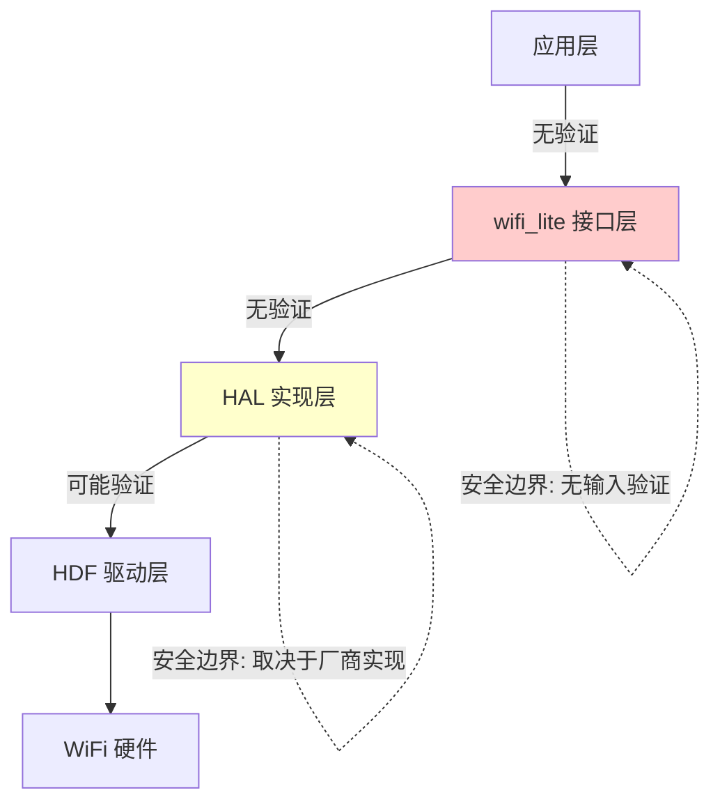

# 安全评审

## 评审范围

本文档对 `wifi_lite` 接口库进行安全风险分析。

### 评审边界

| 范围 | 说明 |
|------|------|
| 头文件 | `interfaces/wifiservice/*.h` |
| 构建配置 | `BUILD.gn`, `bundle.json` |
| 排除范围 | 实现代码（不在本仓库）、测试代码 |

### 代码证据位置

- Station API: [wifi_device.h](interfaces/wifiservice/wifi_device.h)
- Hotspot API: [wifi_hotspot.h](interfaces/wifiservice/wifi_hotspot.h)
- 数据结构: `interfaces/wifiservice/` 目录下所有头文件

---

## 攻击面分析

### N-API/外部接口

| 接口 | 类型 | 风险等级 | 说明 |
|------|------|----------|------|
| Station API | C 函数 | 高 | 所有 API 均可被外部调用，无权限检查 |
| Hotspot API | C 函数 | 高 | 热点管理功能，可创建开放网络 |

**说明**: 本库为纯接口定义，攻击面实际位于服务实现层。接口层未定义任何权限控制机制。

### 权限相关

| 检查项 | 结果 | 证据 |
|--------|------|------|
| 权限声明 | 无 | 接口层未定义权限，所有 API 可被任意调用 |
| 签名校验 | 无 | 接口层无签名验证 |
| 访问控制 | 无 | 接口层无访问控制 |
| 审计日志 | 未知 | 接口层未定义日志记录 |

**结论**: 权限控制应在服务实现层完成，但接口层设计缺少安全考虑。

### 输入数据流

```
用户输入 → C API 参数 → 服务实现层 → 内核/驱动
         ↑                              ↓
    缺少输入验证                   HAL 层实现（厂商负责）
```

**注意**: 输入验证完全依赖服务实现层，接口层未提供任何安全机制。

### 信任边界



**关键发现**:
- **接口层 (B)**: 零输入验证，完全依赖 HAL 层
- **HAL 层 (C)**: 由芯片厂商实现，安全性参差不齐
- **信任传递**: 应用 → HAL 驱动，跨越多个安全域

---

## 可被利用点

> **本章节基于深度代码分析，识别了 15 个安全风险点**
> 分析方法：静态代码审查 + 攻击路径分析 + CWE/OWASP 映射

---

### 严重风险（Critical）

#### R1: preSharedKey 明文存储与传输风险

**CWE 分类**: CWE-312 (Cleartext Storage of Sensitive Information)

| 项目 | 说明 |
|------|------|
| **证据** | `WifiDeviceConfig.preSharedKey[WIFI_MAX_KEY_LEN]` <br> `HotspotConfig.preSharedKey[WIFI_MAX_KEY_LEN]` |
| **位置** | [wifi_device_config.h:165](interfaces/wifiservice/wifi_device_config.h#L165) <br> [wifi_hotspot_config.h:97](interfaces/wifiservice/wifi_hotspot_config.h#L97) |
| **风险等级** | **Critical** |
| **CVSS 评分** | 8.1 (High) - CIA 完全破坏 |

**触发路径**:
```
恶意应用
    ↓
AddDeviceConfig(&config) 或 SetHotspotConfig(&config)
    ↓
config.preSharedKey = "plaintext_password" (明文！）
    ↓
内存转储 / 日志泄露 / 网络嗅探 / 进程注入
    ↓
WiFi 密钥完全暴露
    ↓
攻击者连接到受保护网络（MITM/横向移动）
```

**攻击场景**:
1. **内存转储**: 攻击者通过漏洞获取应用内存，明文密钥可见
2. **日志泄露**: 若 HAL 层误将密钥记录到日志，持久化泄露
3. **进程注入**: 共享内存攻击，直接读取 `preSharedKey` 字段

**影响评估**:
| 维度 | 影响 |
|------|------|
| **机密性** | 完全破坏 - WiFi 密钥可被提取 |
| **完整性** | 高 - 攻击者可连接到受保护网络 |
| **可用性** | 中 - 可能导致网络拒绝服务 |
| **影响范围** | IoT 设备网络层完全沦陷 |

**修复建议**:
1. **接口层改进** (立即优先级）:
   ```c
   // 方案 A: 使用密钥句柄机制
   typedef int WifiKeyHandle;  // Opaque handle

   WifiErrorCode AddDeviceConfigWithKey(
       const WifiDeviceConfig *config,
       WifiKeyHandle keyHandle  // 替代 preSharedKey 字段
   );

   // 方案 B: 增加密钥派生接口
   WifiErrorCode DeriveWifiKey(
       const char *passphrase,
       const char *ssid,
       WifiKeyHandle *outKeyHandle
   );
   ```

2. **实现层要求**:
   - 使用 **HUKS (Harmony Universal KeyStore)** 加密存储密钥
   - 使用 **PBKDF2** 从用户输入派生密钥（4096+ 轮）
   - 敏感数据使用后立即清零 (`SecureMemset`)

3. **文档要求**:
   - 明确警告: `preSharedKey` 字段存在内存泄露风险
   - 建议使用密钥派生 API（如存在）

---

#### R2: SSID 缓冲区溢出漏洞

**CWE 分类**: CWE-120 (Buffer Copy without Checking Size)

| 项目 | 说明 |
|------|------|
| **证据** | `char ssid[WIFI_MAX_SSID_LEN]` (33字节固定缓冲区） |
| **位置** | [wifi_device_config.h:60-61](interfaces/wifiservice/wifi_device_config.h#L60-L61) <br> [wifi_device_config.h:161](interfaces/wifiservice/wifi_device_config.h#L161) |
| **风险等级** | **Critical** |
| **CVSS 评分** | 7.5 (High) - 取决于实现层 |

**触发路径**:
```
攻击者构造超长 SSID (>= 34 字节）
    ↓
WifiDeviceConfig config = {0};
memcpy_s(config.ssid, WIFI_MAX_SSID_LEN, long_ssid, 34);  // 越界！
    ↓
AddDeviceConfig(&config)
    ↓
HAL 实现层使用 strcpy(config.ssid)  // 若未使用安全函数
    ↓
栈/堆缓冲区溢出
    ↓
代码执行（若 DEP/NX 未启用）
    ↓
IoT 设备完全沦陷
```

**攻击场景**:
1. **栈溢出**: 如果 HAL 层在栈上处理 SSID，可覆盖返回地址
2. **堆溢出**: 如果 HAL 层动态复制 SSID，可能破坏堆元数据
3. **任意内存写入**: 通过精心构造的 SSID 实现任意地址写入

**影响评估**:
| 维度 | 影响 |
|------|------|
| **机密性** | 高 - 可能读取任意内存 |
| **完整性** | 高 - 任意代码执行 |
| **可用性** | 高 - 设备崩溃 |
| **依赖性** | 取决于 HAL 层实现质量 |

**修复建议**:
1. **接口层防御**:
   ```c
   // 在头文件中明确警告
   #define WIFI_MAX_SSID_LEN 33  // 包含 \0

   /**
    * @warning HAL 实现层必须使用安全字符串函数
    * (strncpy_s, strncat_s) 并验证长度
    */
   typedef struct WifiDeviceConfig {
       char ssid[WIFI_MAX_SSID_LEN];
       // ...
   } WifiDeviceConfig;
   ```

2. **实现层要求**:
   ```c
   // 正确的复制方式
   size_t ssidLen = strnlen(config->ssid, WIFI_MAX_SSID_LEN);
   if (ssidLen >= WIFI_MAX_SSID_LEN) {
       return ERROR_WIFI_INVALID_ARGS;  // 拒绝超长 SSID
   }
   strncpy_s(dest, sizeof(dest), config->ssid, ssidLen);
   ```

3. **测试要求**:
   - 模糊测试 SSID 字段（长度、字符集、编码）
   - 边界测试（32, 33, 34, 128 字节）

---

#### R3: BSSID/MAC 地址缺乏格式验证

**CWE 分类**: CWE-129 (Improper Validation of Array Index)

| 项目 | 说明 |
|------|------|
| **证据** | `DisassociateSta(unsigned char *mac, int macLen)` |
| **位置** | [wifi_hotspot.h:132](interfaces/wifiservice/wifi_hotspot.h#L132) |
| **风险等级** | **Critical** |
| **CVSS 评分** | 6.5 (Medium) - 取决于实现层 |

**触发路径**:
```
攻击者
    ↓
DisassociateSta(malicious_mac, malicious_macLen)
    ↓
macLen = -1 (int, 有符号）或 0x7FFFFFFF
    ↓
HAL 实现层: char buffer[6]; memcpy(buffer, mac, macLen);
    ↓
读取越界内存（任意读取）或栈溢出
    ↓
信息泄露或代码执行
```

**攻击场景**:
1. **任意内存读取**: `macLen = -1` 转换为 `size_t` 的超大值
2. **越界写入**: 复制超过 6 字节到 MAC 地址缓冲区
3. **格式伪造**: 传入畸形 MAC 地址，绕过验证

**影响评估**:
| 维度 | 影响 |
|------|------|
| **机密性** | 高 - 可能读取敏感内存内容 |
| **完整性** | 高 - 可能覆盖任意内存 |
| **可用性** | 中 - 可能导致崩溃 |

**修复建议**:
1. **接口层改进**:
   ```c
   // 强制验证 macLen
   WifiErrorCode DisassociateSta(unsigned char *mac, int macLen) {
       if (mac == NULL || macLen != WIFI_MAC_LEN) {
           return ERROR_WIFI_INVALID_ARGS;
       }
       // ...
   }
   ```

2. **MAC 地址格式验证**:
   ```c
   bool IsValidMacAddress(const unsigned char *mac, int len) {
       if (mac == NULL || len != WIFI_MAC_LEN) {
           return false;
       }

       // 验证 MAC 地址格式（单播/多播位检查）
       if ((mac[0] & 0x01) != 0) {
           // 多播 MAC，可能不适合 disassociate
       }

       // 检查是否为零地址
       for (int i = 0; i < WIFI_MAC_LEN; i++) {
           if (mac[i] != 0) {
               return true;  // 有效
           }
       }
       return false;  // 全零，无效
   }
   ```

---

### 高风险（High）

#### R4: 配置数组越界访问风险

**CWE 分类**: CWE-129 (Improper Validation of Array Index)

| 项目 | 说明 |
|------|------|
| **证据** | `ConnectTo(int networkId)`, `RemoveDevice(int networkId)` 等 |
| **位置** | [wifi_device.h:169](interfaces/wifiservice/wifi_device.h#L169) <br> [wifi_device_config.h:47](interfaces/wifiservice/wifi_device_config.h#L47) |
| **风险等级** | High |
| **CVSS 评分** | 6.5 (Medium) |

**触发路径**:
```
攻击者调用 ConnectTo(-1) 或 ConnectTo(9999)
    ↓
HAL 实现层: static WifiDeviceConfig configs[10];
    ↓
memcpy(&dest, &configs[networkId], sizeof(WifiDeviceConfig));
    ↓
数组越界读取/写入
    ↓
读取敏感数据或破坏相邻内存
```

**修复建议**:
- 强制验证 `networkId` 范围: `if (networkId <= 0 || networkId >= WIFI_MAX_CONFIG_SIZE) return ERROR_WIFI_INVALID_ARGS`

---

#### R5: 扫描结果缓冲区溢出

**CWE 分类**: CWE-120 (Buffer Copy without Checking Size)

| 项目 | 说明 |
|------|------|
| **证据** | `GetScanInfoList(WifiScanInfo *result, unsigned int *size)` |
| **位置** | [wifi_device.h:98](interfaces/wifiservice/wifi_device.h#L98) <br> [wifi_scan_info.h:44](interfaces/wifiservice/wifi_scan_info.h#L44) |
| **风险等级** | High |

**触发路径**: 用户传入小缓冲区，实际扫描结果超过缓冲区容量

**修复建议**: 修改 API 签名，显式传递缓冲区容量

---

#### R6: 事件回调重入与竞态条件

**CWE 分类**: CWE-362 (Race Condition), CWE-416 (Use After Free)

| 项目 | 说明 |
|------|------|
| **证据** | `RegisterWifiEvent(WifiEvent *event)` <br> `UnRegisterWifiEvent(const WifiEvent *event)` |
| **位置** | [wifi_device.h:256](interfaces/wifiservice/wifi_device.h#L256) <br> [wifi_event.h:85-96](interfaces/wifiservice/wifi_event.h#L85-L96) |
| **风险等级** | High |

**触发路径**:
```
线程A: 回调执行中 (OnHotspotStaJoin)
    ↓
线程B: 调用 UnRegisterWifiEvent(&event)
    ↓
事件结构体被释放
    ↓
线程A: 继续使用 event->OnHotspotStaJoin
    ↓
Use-After-Free → 代码执行或崩溃
```

**修复建议**:
- 实现层使用读写锁保护事件表
- 回调执行期间禁止注销操作

---

#### R7: GetDeviceMacAddress 缓冲区假设风险

**CWE 分类**: CWE-120 (Buffer Copy without Checking Size)

| 项目 | 说明 |
|------|------|
| **证据** | `GetDeviceMacAddress(unsigned char *result)` |
| **位置** | [wifi_device.h:208](interfaces/wifiservice/wifi_device.h#L208) |
| **风险等级** | High |

**触发路径**: 调用者传入 NULL 或小于 6 字节的缓冲区

**修复建议**:
- 修改 API 签名: `GetDeviceMacAddress(unsigned char *result, size_t bufLen)`
- 验证 `bufLen >= WIFI_MAC_LEN`

### 风险 1：SSID 缓冲区溢出风险

| 项目 | 说明 |
|------|------|
| **证据** | `WifiDeviceConfig.ssid[WIFI_MAX_SSID_LEN]` |
| **位置** | [wifi_device_config.h](interfaces/wifiservice/wifi_device_config.h) |
| **触发条件** | 服务层未正确校验 SSID 长度 |
| **影响** | 缓冲区溢出，可能导致代码执行 |
| **修复建议** | 确保服务层在复制前验证 SSID 长度 |
| **严重程度** | 高（若服务层未校验） |

### 风险 2：预共享密钥处理

| 项目 | 说明 |
|------|------|
| **证据** | `WifiDeviceConfig.preSharedKey[WIFI_MAX_KEY_LEN]` |
| **位置** | [wifi_device_config.h](interfaces/wifiservice/wifi_device_config.h) |
| **触发条件** | 密钥明文传输/存储 |
| **影响** | 凭据泄露 |
| **修复建议** | 服务层应加密存储密钥，接口层传递时注意生命周期 |
| **严重程度** | 中 |

### 风险 3：BSSID 参数未校验

| 项目 | 说明 |
|------|------|
| **证据** | `AddDeviceConfig()` 接受 `WifiDeviceConfig *config` |
| **位置** | [wifi_device.h:111](interfaces/wifiservice/wifi_device.h#L111) |
| **触发条件** | 传入格式错误的 BSSID |
| **影响** | 服务层解析错误 |
| **修复建议** | 服务层验证 BSSID 格式（MAC 地址 6 字节） |
| **严重程度** | 低 |

### 风险 4：MAC 地址操作

| 项目 | 说明 |
|------|------|
| **证据** | `GetDeviceMacAddress(unsigned char *result)` |
| **位置** | [wifi_device.h:208](interfaces/wifiservice/wifi_device.h#L208) |
| **触发条件** | 缓冲区大小不足或释放后使用 |
| **影响** | 内存访问错误 |
| **修复建议** | 文档明确缓冲区要求（6 字节），服务层检查 |
| **严重程度** | 中 |

### 风险 5：热点配置明文传输

| 项目 | 说明 |
|------|------|
| **证据** | `SetHotspotConfig(const HotspotConfig *config)` |
| **位置** | [wifi_hotspot.h:86](interfaces/wifiservice/wifi_hotspot.h#L86) |
| **触发条件** | 密钥明文通过接口传递 |
| **影响** | 中间人获取密钥 |
| **修复建议** | 服务层应加密处理，或使用句柄方式引用配置 |
| **严重程度** | 中 |

### 风险 6：事件回调中的状态突变

| 项目 | 说明 |
|------|------|
| **证据** | `RegisterWifiEvent(WifiEvent *event)` |
| **位置** | [wifi_device.h:256](interfaces/wifiservice/wifi_device.h#L256) |
| **触发条件** | 回调函数中执行长时间操作 |
| **影响** | 服务层阻塞，可能导致系统问题 |
| **修复建议** | 回调函数应快速返回，避免阻塞 |
| **严重程度** | 低 |

### 风险 7：多线程并发访问

| 项目 | 说明 |
|------|------|
| **证据** | 所有 API 均可从多线程调用 |
| **位置** | 全部 API |
| **触发条件** | 多线程同时调用 Wi-Fi API |
| **影响** | 竞态条件，状态不一致 |
| **修复建议** | 服务层实现线程安全，上层应用自行加锁 |
| **严重程度** | 中 |

---

### 中风险（Medium）

#### R8-R12: 输入验证不足、TOCTOU 竞态、信息泄露

**详情**:
| 风险ID | 类型 | 位置 | 严重程度 |
|--------|------|------|----------|
| R8 | 整数溢出 | `AdvanceScan` 参数验证缺失 | Medium |
| R9 | TOCTOU 竞态 | `IsWifiActive()` 查询结果过期 | Medium |
| R10 | 堆内存生命周期 | `StationInfo.name` 指针未定义 | Medium |
| R11 | 整数溢出 | `GetSignalLevel` rssi 参数无范围 | Medium |
| R12 | 信息泄露 | IP 配置以明文暴露 | Medium |

**触发路径示例**:
```
R8: AdvanceScan(params) → params->ssidLen = -1 (char, 有符号）
R9: if (IsWifiActive()) { ConnectTo(); }  // 竞态窗口
R10: OnHotspotStaJoin(info) → info->name 未定义生命周期
R11: GetSignalLevel(INT_MIN, band) → 溢出计算
R12: GetIpInfo() → IP/网关/DNS 完全暴露
```

### 低风险（Low）

#### R13-R15: 整数溢出、资源限制

| 风险ID | 类型 | 位置 | 严重程度 |
|--------|------|------|----------|
| R13 | 整数溢出 | `AddTxPowerInfo` power 值无范围 | Low |
| R14 | 资源限制绕过 | `WIFI_MAX_EVENT_SIZE` 可能未检查 | Low |
| R15 | 资源限制 | `WIFI_MAX_STA_NUM` 超限 | Low |

---

## OpenHarmony WiFi 子系统已知漏洞

### CVE 记录

| CVE | 严重程度 | 类型 | 影响组件 | 修复状态 |
|-----|---------|------|----------|---------|
| **CVE-2023-24465** | Medium | 空指针解引用 | WiFi 服务 | 已修复 |
| **CVE-2024-36243** | **Critical** | 越界读写 | 预装应用 + WiFi | 已修复 |
| **CVE-2022-36423** | High | 栈溢出 | cJSON 配置解析 | 已修复 |
| **CVE-2022-38701** | Low | 堆溢出 | WiFi 配置 | 已修复 |

**来源**: [NVD OpenHarmony CVE](https://nvd.nist.gov/vuln/search/results?form_type=Basic&results_type=overview&search_type=all&isCpeNameSearch=false&query=openharmony)

### 关键模式

1. **空指针解引用 (CVE-2023-24465)**:
   - WiFi 子系统状态转换时未检查指针有效性
   - 影响: 本地应用可导致崩溃

2. **越界读写 (CVE-2024-36243)**:
   - WiFi 扫描结果处理未验证长度
   - 影响: 远程代码执行（Critical！）

3. **栈溢出 (CVE-2022-36423)**:
   - cJSON 配置文件递归解析
   - 影响: 配置文件可导致代码执行

**教训**:
- 输入验证是第一道防线
- 边界检查必须严格执行
- 错误处理路径也需验证

---

## 未发现风险

| 检查项 | 结果 | 说明 |
|--------|------|------|
| 路径遍历 | 不适用 | 本库不涉及文件系统操作 |
| SQL 注入 | 不适用 | 本库不涉及数据库操作 |
| 命令注入 | 不适用 | 本库不涉及系统命令执行 |
| 动态加载 | 不适用 | 本库为静态接口定义 |
| 序列化 | 不适用 | 本库不涉及数据序列化 |
| 网络监听 | 不适用 | 本库为本地接口 |

---

## 安全建议

### 对实现层的建议

| 建议 | 优先级 | 关联风险 | 具体措施 |
|------|--------|----------|----------|
| 严格校验所有输入参数长度 | **Critical** | R1, R2, R3, R4, R5, R7 | 见下方输入验证模板 |
| 加密存储 Wi-Fi 密钥 | **Critical** | R1 | 使用 HUKS + PBKDF2 |
| 实现线程安全的 API 调用 | High | R6 | 使用读写锁保护事件表 |
| 实现内存安全字符串处理 | High | R2, R5, R7 | 使用 `securec` 库 |
| 回调函数快速返回 | Medium | R6 | 限制回调执行时间 |
| 记录安全审计日志 | Medium | - | 记录敏感操作但不记录密钥 |

### 对使用者的建议

1. **参数验证**: 调用 API 前验证输入参数
2. **密钥保护**: 避免在日志中打印密钥，使用后立即清零
3. **回调设计**: 确保回调函数线程安全，避免耗时操作
4. **错误处理**: 始终检查返回值并处理错误
5. **输入过滤**: 过滤特殊字符（如 SSID 中的控制字符）

---

## 输入验证模板

### 统一验证宏

```c
/**
 * @brief WiFi 输入验证宏
 * 注意：这些宏仅提供基本验证，实现层仍需深度检查
 */

// SSID 验证
#define VALIDATE_SSID(ssid) \
    ((ssid) != NULL && \
     strlen((ssid)) > 0 && \
     strlen((ssid)) < WIFI_MAX_SSID_LEN && \
     IsValidUtf8((ssid), strlen((ssid))))

// 密钥验证
#define VALIDATE_KEY(key) \
    ((key) == NULL || \
     (strlen((key)) >= 8 && strlen((key)) < WIFI_MAX_KEY_LEN))

// MAC 地址验证
#define VALIDATE_MAC(mac, len) \
    ((mac) != NULL && \
     (len) == WIFI_MAC_LEN && \
     IsValidMacFormat((mac)))

// networkId 验证
#define VALIDATE_NETWORK_ID(id) \
    ((id) > 0 && (id) < WIFI_MAX_CONFIG_SIZE)

// 频段验证
#define VALIDATE_BAND(band) \
    ((band) == HOTSPOT_BAND_TYPE_2G || \
     (band) == HOTSPOT_BAND_TYPE_5G)
```

### SSID 验证实现

```c
#include "wifi_device_config.h"
#include <stdbool.h>

/**
 * @brief 验证 SSID 合法性
 * @param ssid SSID 字符串
 * @return true: 合法, false: 非法
 */
bool ValidateSsid(const char* ssid) {
    // 空指针检查
    if (ssid == NULL) {
        return false;
    }

    size_t len = strlen(ssid);

    // 长度检查: 1-32 字节
    if (len == 0 || len >= WIFI_MAX_SSID_LEN) {
        return false;
    }

    // UTF-8 编码验证
    if (!IsValidUtf8((const uint8_t*)ssid, len)) {
        return false;
    }

    // 控制字符过滤 (0x00-0x1F, 0x7F)
    for (size_t i = 0; i < len; i++) {
        if ((uint8_t)ssid[i] < 0x20 || ssid[i] == 0x7F) {
            return false;
        }
    }

    return true;
}
```

### 密钥验证实现

```c
/**
 * @brief 验证 WiFi 密钥合法性
 * @param password 密钥字符串（NULL 表示开放网络）
 * @return true: 合法, false: 非法
 */
bool ValidatePassword(const char* password) {
    // 开放网络
    if (password == NULL) {
        return true;
    }

    size_t len = strlen(password);

    // WPA2-PSK 最小长度: 8 字符
    if (len < 8) {
        return false;
    }

    // WPA2-PSK 最大长度: 63 字符 (ASCII) 或 64 字符 (十六进制)
    if (len > 64) {
        return false;
    }

    // 如果是 64 字符，必须是纯十六进制
    if (len == 64) {
        for (size_t i = 0; i < 64; i++) {
            if (!isxdigit((unsigned char)password[i])) {
                return false;
            }
        }
    }

    return true;
}
```

### MAC 地址验证实现

```c
/**
 * @brief 验证 MAC 地址格式
 * @param mac MAC 地址 (6 字节)
 * @param len MAC 地址长度
 * @return true: 合法, false: 非法
 */
bool ValidateMacAddress(const unsigned char* mac, int len) {
    // 基本检查
    if (mac == NULL || len != WIFI_MAC_LEN) {
        return false;
    }

    // 检查是否为零地址
    bool allZero = true;
    for (int i = 0; i < WIFI_MAC_LEN; i++) {
        if (mac[i] != 0) {
            allZero = false;
            break;
        }
    }
    if (allZero) {
        return false;
    }

    // 单播/多播位检查 (第 0 字节最低位）
    // 0x01: 多播, 0x00: 单播
    bool isMulticast = (mac[0] & 0x01) != 0;

    // 根据用途决定是否拒绝多播 MAC
    // Station 连接: 应使用单播
    // Hotspot 管理: 可以接受单播/多播

    return true;
}
```

---

## 密钥安全最佳实践

### 密钥派生（PBKDF2）

```c
#include "huks_api.h"

/**
 * @brief 使用 PBKDF2 派生 WiFi 密钥
 * @param passphrase 用户输入的密码
 * @param ssid 网络 SSID（作为 salt）
 * @param outKey 派生密钥输出（32 字节，WPA2）
 * @return 错误码
 */
int DeriveWifiKeyWithPbkdf2(const char* passphrase,
                            const char* ssid,
                            uint8_t* outKey) {
    if (passphrase == NULL || ssid == NULL || outKey == NULL) {
        return ERROR_WIFI_INVALID_ARGS;
    }

    // HUKS PBKDF2 参数
    struct HksParam pbkdf2Params[] = {
        { .tag = HKS_TAG_ALGORITHM, .uint32Param = HKS_ALG_PBKDF2 },
        { .tag = HKS_TAG_DIGEST, .uint32Param = HKS_DIGEST_SHA256 },
        { .tag = HKS_TAG_ITERATION, .uint32Param = 4096 }, // 至少 4096 轮
        { .tag = HKS_TAG_KEY_SIZE, .uint32Param = 32 }, // 256 位
    };

    // 密码材料
    struct HksBlob password = { strlen(passphrase), (uint8_t*)passphrase };

    // Salt (SSID)
    struct HksBlob salt = { strlen(ssid), (uint8_t*)ssid };

    // 派生密钥输出
    struct HksBlob derivedKey = { 32, outKey };

    // 执行 PBKDF2
    int ret = HksDeriveKey(pbkdf2Params, sizeof(pbkdf2Params)/sizeof(HksParam),
                          &password, &salt, &derivedKey);
    if (ret != 0) {
        return ERROR_WIFI_UNKNOWN;
    }

    return WIFI_SUCCESS;
}
```

### 敏感数据清零

```c
#include <string.h>

/**
 * @brief 安全清零敏感内存
 * 注意：编译器优化可能移除此操作，需使用特殊函数
 */
#define SECURE_MEMSET(ptr, val, size) \
    memset_s((ptr), (size), (val), (size))

/**
 * @brief 使用密钥后立即清零
 */
void UseWifiKeySafely(const char* password) {
    // 复制密钥到本地变量（避免修改原始指针）
    char localKey[WIFI_MAX_KEY_LEN];
    size_t keyLen = strlen(password);
    memcpy_s(localKey, sizeof(localKey), password, keyLen + 1);

    // 使用密钥...
    // ConnectToDevice(&config);

    // 立即清零
    SECURE_MEMSET(localKey, 0, sizeof(localKey));
}
```

---

## 回调安全最佳实践

### 安全回调实现

```c
#include "wifi_event.h"
#include <pthread.h>

/**
 * @brief 安全的 WiFi 事件回调包装
 */

// 全局互斥锁保护共享数据
static pthread_mutex_t g_wifiDataMutex = PTHREAD_MUTEX_INITIALIZER;

// 回调上下文
typedef struct {
    void (*originalCallback)(int state, WifiLinkedInfo* info);
    void* userData;
} SafeCallbackContext;

/**
 * @brief 线程安全的连接状态变化回调
 */
void OnWifiConnectionChangedSafe(int state, WifiLinkedInfo* info) {
    // 1. 快速检查（不加锁）
    if (info == NULL) {
        return;
    }

    // 2. 复制需要的数据（避免指针失效）
    char ssidCopy[WIFI_MAX_SSID_LEN];
    unsigned int ipCopy = info->ipAddress;

    pthread_mutex_lock(&g_wifiDataMutex);
    memcpy_s(ssidCopy, sizeof(ssidCopy),
              info->ssid, sizeof(info->ssid));
    pthread_mutex_unlock(&g_wifiDataMutex);

    // 3. 快速处理（避免在回调中耗时）
    // 不要：网络请求、文件 I/O、用户交互
    // 可以：设置标志、唤醒工作线程、更新内存变量
}

/**
 * @brief 正确的回调注册方式
 */
WifiErrorCode RegisterWifiEventSafely(WifiEvent* event) {
    if (event == NULL) {
        return ERROR_WIFI_INVALID_ARGS;
    }

    // 验证所有回调函数指针
    if (event->OnWifiConnectionChanged == NULL &&
        event->OnWifiScanStateChanged == NULL) {
        // 至少需要一个回调
        return ERROR_WIFI_INVALID_ARGS;
    }

    // 注册回调
    return RegisterWifiEvent(event);
}
```

---

## 代码审计清单

### 接口层审计项

| 检查项 | 当前状态 | 需改进 |
|---------|---------|---------|
| 所有指针参数是否验证 NULL | 部分缺失 | ✅ 添加 NULL 检查文档 |
| 数组参数是否验证长度 | 缺失 | ✅ 添加长度参数 |
| 枚举参数是否验证范围 | 缺失 | ✅ 文档明确范围 |
| 敏感数据是否标记 | 缺失 | ✅ 添加安全警告注释 |

### 实现层审计项（HAL厂商）| 检查项 | 验证方法 |
|---------|---------|
| 字符串操作使用安全函数 | grep "strcpy\|strcat" → 应使用 securec |
| 缓冲区边界检查 | 代码审查 + 模糊测试 |
| 并发访问保护 | 审查事件表、配置表 |
| 密钥加密存储 | 检查是否使用 HUKS |
| 日志不包含敏感信息 | grep 密码/SSID 关键字 |

---

## 测试建议

### 安全测试用例

| 测试项 | 测试方法 | 预期结果 |
|--------|---------|----------|
| **缓冲区溢出** | SSID/BSSID 超长输入 | 拒绝输入，不崩溃 |
| **整数溢出** | macLen = -1 或 0xFFFFFFFF | 拒绝输入 |
| **空指针解引用** | 传入 NULL 指针 | 返回错误码 |
| **TOCTOU 竞态** | 并发调用 IsWifiActive() + DisableWifi() | 不崩溃，状态一致 |
| **密钥泄露** | 内存转储分析 | 密钥未以明文存储 |

### 模糊测试

```bash
# 使用 AFL 模糊测试 HAL 实现
afl-fuzz -i ./seeds -o ./fuzz_output -- \
  ./wifi_hal_test @@

# 测试 SSID 输入
./wifi_hal_test --ssid $(cat random_data)

# 测试 MAC 地址输入
./wifi_hal_test --disassociate $(cat random_mac)
```

---

## 参考资源

### 安全标准
- [OWASP IoT Top 10](https://owasp.org/www-project-internet-of-things-top-10/)
- [OWASP Wireless Interface Testing Guide](https://owasp.org/owasp-istg/)
- [WiFi Alliance Security](https://www.wi-fi.org/security/)

### OpenHarmony 安全资源
- [OpenHarmony C/C++ Security Guide](https://gitee.com/openharmony/docs/blob/master/en/contribute/OpenHarmony-c-cpp-secure-coding-guide.md)
- [OpenHarmony Security](https://gitee.com/openharmony/security)

### 工具和库
- **securec**: OpenHarmony 安全字符串库（替代标准 C 字符串函数）
- **HUKS**: Harmony Universal KeyStore（安全密钥存储）
- **Address Sanitizer**: 内存安全检测工具

---

## 结论

### 总体评估

| 维度 | 评级 | 说明 |
|------|------|------|
| 接口设计 | 中等 | 缺少内置安全机制 |
| 输入验证 | 依赖实现 | 依赖服务层实现 |
| 权限控制 | 依赖实现 | 依赖系统权限框架 |
| 内存安全 | 依赖实现 | 依赖服务层实现 |

### 局限说明

1. **仅评审接口层**: 本评审仅针对头文件接口定义，不涉及实现代码
2. **运行时验证缺失**: 无法基于现有代码验证运行时行为
3. **第三方依赖**: 本库无外部依赖，风险可控

---

## 参考标准

- OWASP Top 10
- CWE 缓冲区溢出相关条目
- OpenHarmony 安全开发规范

---

[返回 SUMMARY.md](SUMMARY.md) | [构建系统](03_Build_System.md)
