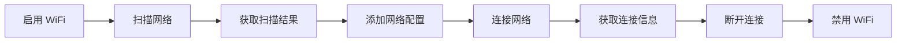

# WiFi Lite 使用指南

## 概述

本文档提供 `wifi_lite` 组件的完整使用示例，帮助开发者快速掌握 Station 模式和 Hotspot 模式的 API 使用方法。

**适用场景**:
- IoT 设备 WiFi 连接
- 设备间数据传输（热点模式）
- WiFi 网络管理应用

**前提条件**:
- OpenHarmony Mini 系统开发环境
- 支持 WiFi 的开发板（如 hi3861）
- 基础 C 语言编程能力

---

## Station 模式（客户端）完整流程

### 1.1 基础流程概览



### 1.2 启用/禁用 WiFi

**代码示例**:

```c
#include "wifi_device.h"

/**
 * @brief 启用 WiFi Station 模式
 */
WifiErrorCode EnableWifiStation() {
    WifiErrorCode error = EnableWifi();
    if (error != WIFI_SUCCESS) {
        printf("EnableWifi failed: %d\n", error);
        return error;
    }

    // 等待 WiFi 就绪（可选）
    int retries = 10;
    while (retries-- > 0) {
        if (IsWifiActive() == WIFI_STA_ACTIVE) {
            printf("WiFi enabled successfully\n");
            return WIFI_SUCCESS;
        }
        usleep(100000); // 100ms
    }

    printf("WiFi enable timeout\n");
    return ERROR_WIFI_NOT_AVAILABLE;
}

/**
 * @brief 禁用 WiFi Station 模式
 */
WifiErrorCode DisableWifiStation() {
    // 先断开连接
    WifiErrorCode error = Disconnect();
    if (error != WIFI_SUCCESS && error != ERROR_WIFI_NOT_STARTED) {
        printf("Disconnect failed: %d\n", error);
    }

    // 禁用 WiFi
    error = DisableWifi();
    if (error != WIFI_SUCCESS) {
        printf("DisableWifi failed: %d\n", error);
        return error;
    }

    printf("WiFi disabled\n");
    return WIFI_SUCCESS;
}
```

**注意事项**:
- 启用 WiFi 需要一定时间（1-3秒），应检查 `IsWifiActive()`
- 禁用前建议先断开连接
- 错误处理: 返回值检查是必需的

---

### 1.3 扫描 WiFi 网络

**代码示例**:

```c
#include "wifi_device.h"
#include <stdio.h>
#include <stdlib.h>

#define SCAN_TIMEOUT_MS 10000 // 10秒超时

/**
 * @brief 扫描 WiFi 网络
 */
WifiErrorCode ScanWifiNetworks() {
    // 检查 WiFi 是否已启用
    if (IsWifiActive() != WIFI_STA_ACTIVE) {
        printf("WiFi not enabled\n");
        return ERROR_WIFI_NOT_STARTED;
    }

    // 开始扫描
    WifiErrorCode error = Scan();
    if (error != WIFI_SUCCESS) {
        printf("Scan failed: %d\n", error);
        return error;
    }

    printf("Scanning...\n");

    // 等待扫描完成（实际应用应使用事件回调）
    usleep(SCAN_TIMEOUT_MS * 1000);

    return WIFI_SUCCESS;
}

/**
 * @brief 打印扫描结果
 */
WifiErrorCode PrintScanResults() {
    // 分配扫描结果缓冲区
    WifiScanInfo* scanInfoList = (WifiScanInfo*)malloc(
        sizeof(WifiScanInfo) * WIFI_SCAN_HOTSPOT_LIMIT
    );
    if (scanInfoList == NULL) {
        printf("malloc failed\n");
        return ERROR_WIFI_BUSY;
    }

    // 获取扫描结果
    unsigned int size = WIFI_SCAN_HOTSPOT_LIMIT;
    WifiErrorCode error = GetScanInfoList(scanInfoList, &size);
    if (error != WIFI_SUCCESS) {
        printf("GetScanInfoList failed: %d\n", error);
        free(scanInfoList);
        return error;
    }

    // 打印扫描结果
    printf("\nFound %u networks:\n", size);
    printf("%-32s %-18s %-10s %-6s\n", "SSID", "BSSID", "Security", "RSSI");
    printf("----------------------------------------------------------------------------\n");

    for (unsigned int i = 0; i < size; i++) {
        const char* secType = "Unknown";
        switch (scanInfoList[i].securityType) {
            case WIFI_SEC_TYPE_OPEN:
                secType = "OPEN";
                break;
            case WIFI_SEC_TYPE_WEP:
                secType = "WEP";
                break;
            case WIFI_SEC_TYPE_PSK:
                secType = "WPA/WPA2";
                break;
            case WIFI_SEC_TYPE_SAE:
                secType = "WPA3";
                break;
        }

        printf("%-32s %02X:%02X:%02X:%02X:%02X:%02X %-10s %d dBm\n",
               scanInfoList[i].ssid,
               scanInfoList[i].bssid[0], scanInfoList[i].bssid[1],
               scanInfoList[i].bssid[2], scanInfoList[i].bssid[3],
               scanInfoList[i].bssid[4], scanInfoList[i].bssid[5],
               secType, scanInfoList[i].rssi);
    }

    free(scanInfoList);
    return WIFI_SUCCESS;
}
```

**注意事项**:
- 缓冲区大小必须 >= `WIFI_SCAN_HOTSPOT_LIMIT` (64)
- `size` 参数是输入输出参数，初始值表示缓冲区容量
- 扫描可能需要几秒钟，应使用事件回调异步获取结果

---

### 1.4 添加网络配置并连接

**代码示例**:

```c
#include "wifi_device.h"
#include <string.h>
#include <stdio.h>

/**
 * @brief 添加 WiFi 网络配置
 * @param ssid 网络名称
 * @param password 密码（NULL 表示开放网络）
 * @param netId 输出参数，返回网络 ID
 */
WifiErrorCode AddWifiConfig(const char* ssid, const char* password, int* netId) {
    if (ssid == NULL || netId == NULL) {
        printf("Invalid parameters\n");
        return ERROR_WIFI_INVALID_ARGS;
    }

    // 验证 SSID 长度
    size_t ssidLen = strlen(ssid);
    if (ssidLen == 0 || ssidLen >= WIFI_MAX_SSID_LEN) {
        printf("Invalid SSID length\n");
        return ERROR_WIFI_INVALID_ARGS;
    }

    // 验证密码长度（如果有）
    if (password != NULL) {
        size_t pwdLen = strlen(password);
        if (pwdLen < 8 || pwdLen >= WIFI_MAX_KEY_LEN) {
            printf("Invalid password length\n");
            return ERROR_WIFI_INVALID_ARGS;
        }
    }

    // 准备配置
    WifiDeviceConfig config = {0};
    strncpy_s(config.ssid, WIFI_MAX_SSID_LEN, ssid, ssidLen);

    // 设置安全类型
    if (password == NULL) {
        config.securityType = WIFI_SEC_TYPE_OPEN;
    } else {
        config.securityType = WIFI_SEC_TYPE_PSK;
        strncpy_s(config.preSharedKey, WIFI_MAX_KEY_LEN,
                  password, strlen(password));
    }

    // 其他配置
    config.freq = 20; // 默认频宽
    config.ipType = DHCP; // 使用 DHCP
    config.isHiddenSsid = 0; // 非隐藏网络

    // 添加配置
    WifiErrorCode error = AddDeviceConfig(&config, netId);
    if (error != WIFI_SUCCESS) {
        printf("AddDeviceConfig failed: %d\n", error);
        return error;
    }

    printf("Added network config, netId = %d\n", *netId);
    return WIFI_SUCCESS;
}

/**
 * @brief 连接到指定网络
 * @param netId 网络ID（由 AddWifiConfig 返回）
 */
WifiErrorCode ConnectToNetwork(int netId) {
    // 验证 netId 范围
    if (netId <= 0 || netId >= WIFI_MAX_CONFIG_SIZE) {
        printf("Invalid netId: %d\n", netId);
        return ERROR_WIFI_INVALID_ARGS;
    }

    // 检查 WiFi 是否已启用
    if (IsWifiActive() != WIFI_STA_ACTIVE) {
        printf("WiFi not enabled\n");
        return ERROR_WIFI_NOT_STARTED;
    }

    // 连接到网络
    WifiErrorCode error = ConnectTo(netId);
    if (error != WIFI_SUCCESS) {
        printf("ConnectTo failed: %d\n", error);
        return error;
    }

    printf("Connecting to network %d...\n", netId);

    // 等待连接完成（实际应用应使用事件回调）
    int retries = 20; // 最多等待20秒
    while (retries-- > 0) {
        WifiLinkedInfo linkedInfo = {0};
        error = GetLinkedInfo(&linkedInfo);
        if (error == WIFI_SUCCESS &&
            linkedInfo.connState == WIFI_CONNECTED) {
            printf("Connected successfully!\n");
            printf("SSID: %s\n", linkedInfo.ssid);
            printf("IP: %u.%u.%u.%u\n",
                   (unsigned char)(linkedInfo.ipAddress >> 24),
                   (unsigned char)(linkedInfo.ipAddress >> 16),
                   (unsigned char)(linkedInfo.ipAddress >> 8),
                   (unsigned char)(linkedInfo.ipAddress));
            return WIFI_SUCCESS;
        }
        usleep(1000000); // 1秒
    }

    printf("Connection timeout\n");
    return ERROR_WIFI_NOT_AVAILABLE;
}

/**
 * @brief 断开当前连接
 */
WifiErrorCode DisconnectNetwork() {
    WifiErrorCode error = Disconnect();
    if (error != WIFI_SUCCESS && error != ERROR_WIFI_NOT_STARTED) {
        printf("Disconnect failed: %d\n", error);
        return error;
    }

    printf("Disconnected\n");
    return WIFI_SUCCESS;
}
```

**注意事项**:
- SSID 和密码长度必须先验证
- 开放网络设置 `securityType = WIFI_SEC_TYPE_OPEN`
- 连接可能需要几秒钟，应使用事件回调异步处理
- `netId` 有效范围: 1 到 `WIFI_MAX_CONFIG_SIZE - 1`

---

### 1.5 获取连接信息

**代码示例**:

```c
#include "wifi_device.h"
#include <stdio.h>
#include <arpa/inet.h>

/**
 * @brief 打印连接信息
 */
WifiErrorCode PrintLinkedInfo() {
    WifiLinkedInfo linkedInfo = {0};
    WifiErrorCode error = GetLinkedInfo(&linkedInfo);
    if (error != WIFI_SUCCESS) {
        printf("GetLinkedInfo failed: %d\n", error);
        return error;
    }

    if (linkedInfo.connState == WIFI_DISCONNECTED) {
        printf("Not connected\n");
        return WIFI_SUCCESS;
    }

    printf("\n=== WiFi Connection Info ===\n");
    printf("SSID: %s\n", linkedInfo.ssid);

    // 打印 BSSID
    printf("BSSID: %02X:%02X:%02X:%02X:%02X:%02X\n",
           linkedInfo.bssid[0], linkedInfo.bssid[1],
           linkedInfo.bssid[2], linkedInfo.bssid[3],
           linkedInfo.bssid[4], linkedInfo.bssid[5]);

    // 打印 RSSI 和信号等级
    printf("RSSI: %d dBm\n", linkedInfo.rssi);
    int signalLevel = GetSignalLevel(linkedInfo.rssi, linkedInfo.band);
    printf("Signal Level: %d/4\n", signalLevel);

    // 打印频段
    printf("Band: %s\n", linkedInfo.band == 2 ? "2.4G" : "5G");

    // 打印频率
    printf("Frequency: %d MHz\n", linkedInfo.frequency);

    // 打印 IP 地址
    struct in_addr addr;
    addr.s_addr = htonl(linkedInfo.ipAddress);
    printf("IP Address: %s\n", inet_ntoa(addr));

    return WIFI_SUCCESS;
}
```

---

### 1.6 完整示例：连接到 WiFi 网络

**代码示例**:

```c
#include "wifi_device.h"
#include <stdio.h>
#include <stdlib.h>

int main(int argc, char* argv[]) {
    if (argc < 3) {
        printf("Usage: %s <ssid> <password>\n", argv[0]);
        return 1;
    }

    const char* ssid = argv[1];
    const char* password = argv[2];

    // 1. 启用 WiFi
    printf("Step 1: Enable WiFi\n");
    if (EnableWifiStation() != WIFI_SUCCESS) {
        printf("Failed to enable WiFi\n");
        return 1;
    }

    // 2. 扫描网络
    printf("Step 2: Scan networks\n");
    if (ScanWifiNetworks() != WIFI_SUCCESS) {
        printf("Failed to scan\n");
        DisableWifiStation();
        return 1;
    }

    // 3. 打印扫描结果
    printf("Step 3: Print scan results\n");
    PrintScanResults();

    // 4. 添加配置
    printf("Step 4: Add network config\n");
    int netId = 0;
    if (AddWifiConfig(ssid, password, &netId) != WIFI_SUCCESS) {
        printf("Failed to add config\n");
        DisableWifiStation();
        return 1;
    }

    // 5. 连接到网络
    printf("Step 5: Connect to network\n");
    if (ConnectToNetwork(netId) != WIFI_SUCCESS) {
        printf("Failed to connect\n");
        DisableWifiStation();
        return 1;
    }

    // 6. 打印连接信息
    printf("Step 6: Print connection info\n");
    PrintLinkedInfo();

    // 7. 等待用户输入后断开
    printf("\nPress Enter to disconnect...\n");
    getchar();

    // 8. 断开并禁用
    printf("Step 7: Disconnect and disable WiFi\n");
    DisconnectNetwork();
    DisableWifiStation();

    return 0;
}
```

---

## Hotspot 模式（热点）完整流程

### 2.1 基础流程概览


### 2.2 配置并启用热点

**代码示例**:

```c
#include "wifi_hotspot.h"
#include <string.h>
#include <stdio.h>

/**
 * @brief 配置热点
 */
WifiErrorCode ConfigureHotspot(const char* ssid, const char* password) {
    if (ssid == NULL || password == NULL) {
        printf("Invalid parameters\n");
        return ERROR_WIFI_INVALID_ARGS;
    }

    // 验证 SSID 长度
    size_t ssidLen = strlen(ssid);
    if (ssidLen == 0 || ssidLen >= WIFI_MAX_SSID_LEN) {
        printf("Invalid SSID length\n");
        return ERROR_WIFI_INVALID_ARGS;
    }

    // 验证密码长度
    size_t pwdLen = strlen(password);
    if (pwdLen < 8 || pwdLen >= WIFI_MAX_KEY_LEN) {
        printf("Invalid password length\n");
        return ERROR_WIFI_INVALID_ARGS;
    }

    // 准备配置
    HotspotConfig config = {0};
    strncpy_s(config.ssid, WIFI_MAX_SSID_LEN, ssid, ssidLen);
    strncpy_s(config.preSharedKey, WIFI_MAX_KEY_LEN, password, pwdLen);
    config.securityType = WIFI_SEC_TYPE_PSK;
    config.band = HOTSPOT_BAND_TYPE_2G; // 2.4GHz
    config.channelNum = HOTSPOT_DEFAULT_CHANNEL; // 默认信道6
    config.maxConn = 6; // 最大连接数

    // 设置配置
    WifiErrorCode error = SetHotspotConfig(&config);
    if (error != WIFI_SUCCESS) {
        printf("SetHotspotConfig failed: %d\n", error);
        return error;
    }

    printf("Hotspot configured\n");
    printf("SSID: %s\n", ssid);
    printf("Channel: %d\n", config.channelNum);
    printf("Max Connections: %d\n", config.maxConn);

    return WIFI_SUCCESS;
}

/**
 * @brief 启用热点
 */
WifiErrorCode StartHotspot() {
    WifiErrorCode error = EnableHotspot();
    if (error != WIFI_SUCCESS) {
        printf("EnableHotspot failed: %d\n", error);
        return error;
    }

    // 等待热点启动
    int retries = 10;
    while (retries-- > 0) {
        if (IsHotspotActive() == WIFI_HOTSPOT_ACTIVE) {
            printf("Hotspot enabled successfully\n");
            return WIFI_SUCCESS;
        }
        usleep(100000); // 100ms
    }

    printf("Hotspot enable timeout\n");
    return ERROR_WIFI_NOT_AVAILABLE;
}

/**
 * @brief 禁用热点
 */
WifiErrorCode StopHotspot() {
    WifiErrorCode error = DisableHotspot();
    if (error != WIFI_SUCCESS) {
        printf("DisableHotspot failed: %d\n", error);
        return error;
    }

    printf("Hotspot disabled\n");
    return WIFI_SUCCESS;
}
```

---

### 2.3 管理已连接设备

**代码示例**:

```c
#include "wifi_hotspot.h"
#include <stdio.h>
#include <arpa/inet.h>
#include <stdlib.h>

/**
 * @brief 获取并打印已连接设备列表
 */
WifiErrorCode PrintConnectedStations() {
    // 检查热点是否已启用
    if (IsHotspotActive() != WIFI_HOTSPOT_ACTIVE) {
        printf("Hotspot not enabled\n");
        return ERROR_WIFI_NOT_STARTED;
    }

    // 分配缓冲区
    StationInfo* stationList = (StationInfo*)malloc(
        sizeof(StationInfo) * WIFI_MAX_STA_NUM
    );
    if (stationList == NULL) {
        printf("malloc failed\n");
        return ERROR_WIFI_BUSY;
    }

    // 获取已连接设备
    unsigned int size = WIFI_MAX_STA_NUM;
    WifiErrorCode error = GetStationList(stationList, &size);
    if (error != WIFI_SUCCESS) {
        printf("GetStationList failed: %d\n", error);
        free(stationList);
        return error;
    }

    // 打印设备列表
    printf("\nConnected Stations (%u):\n", size);
    printf("%-20s %-18s %-16s %-10s\n", "Name", "MAC", "IP Address", "Reason");
    printf("----------------------------------------------------------------\n");

    for (unsigned int i = 0; i < size; i++) {
        // 打印 MAC
        printf("%-20s %02X:%02X:%02X:%02X:%02X:%02X ",
               stationList[i].name ? stationList[i].name : "(unknown)",
               stationList[i].macAddress[0], stationList[i].macAddress[1],
               stationList[i].macAddress[2], stationList[i].macAddress[3],
               stationList[i].macAddress[4], stationList[i].macAddress[5]);

        // 打印 IP
        struct in_addr addr;
        addr.s_addr = htonl(stationList[i].ipAddress);
        printf("%-16s ", inet_ntoa(addr));

        // 打印断开原因（如果有效）
        if (stationList[i].disconnectedReason != 0) {
            printf("%d\n", stationList[i].disconnectedReason);
        } else {
            printf("-\n");
        }
    }

    free(stationList);
    return WIFI_SUCCESS;
}

/**
 * @brief 断开指定设备
 * @param macStr MAC 地址字符串，格式 "XX:XX:XX:XX:XX:XX"
 */
WifiErrorCode DisconnectStation(const char* macStr) {
    if (macStr == NULL) {
        printf("Invalid MAC address\n");
        return ERROR_WIFI_INVALID_ARGS;
    }

    // 检查热点是否已启用
    if (IsHotspotActive() != WIFI_HOTSPOT_ACTIVE) {
        printf("Hotspot not enabled\n");
        return ERROR_WIFI_NOT_STARTED;
    }

    // 解析 MAC 地址
    unsigned char mac[WIFI_MAC_LEN];
    if (sscanf(macStr, "%hhx:%hhx:%hhx:%hhx:%hhx:%hhx",
                &mac[0], &mac[1], &mac[2],
                &mac[3], &mac[4], &mac[5]) != 6) {
        printf("Invalid MAC format\n");
        return ERROR_WIFI_INVALID_ARGS;
    }

    // 断开设备
    WifiErrorCode error = DisassociateSta(mac, WIFI_MAC_LEN);
    if (error != WIFI_SUCCESS) {
        printf("DisassociateSta failed: %d\n", error);
        return error;
    }

    printf("Disconnected station %s\n", macStr);
    return WIFI_SUCCESS;
}
```

**注意事项**:
- `StationInfo.name` 是 `char*`，生命周期不明确（**API 设计缺陷**）
- 建议不依赖 `name` 字段，或立即复制内容
- MAC 地址格式: `XX:XX:XX:XX:XX:XX` (十六进制)

---

### 2.4 完整示例：创建 WiFi 热点

**代码示例**:

```c
#include "wifi_hotspot.h"
#include <stdio.h>

int main(int argc, char* argv[]) {
    if (argc < 3) {
        printf("Usage: %s <ssid> <password>\n", argv[0]);
        return 1;
    }

    const char* ssid = argv[1];
    const char* password = argv[2];

    // 1. 配置热点
    printf("Step 1: Configure hotspot\n");
    if (ConfigureHotspot(ssid, password) != WIFI_SUCCESS) {
        printf("Failed to configure hotspot\n");
        return 1;
    }

    // 2. 启用热点
    printf("Step 2: Enable hotspot\n");
    if (StartHotspot() != WIFI_SUCCESS) {
        printf("Failed to start hotspot\n");
        return 1;
    }

    printf("\nHotspot is running!\n");
    printf("SSID: %s\n", ssid);
    printf("Password: %s\n", password);

    // 3. 定期打印已连接设备
    char cmd;
    while (1) {
        printf("\nPress 's' to show stations, 'q' to quit: ");
        cmd = getchar();

        if (cmd == 's') {
            PrintConnectedStations();
        } else if (cmd == 'q') {
            break;
        }

        // 清空输入缓冲区
        while (getchar() != '\n');
    }

    // 4. 禁用热点
    printf("\nStep 3: Disable hotspot\n");
    StopHotspot();

    return 0;
}
```

---

## 事件回调使用

### 3.1 注册 WiFi 事件

**代码示例**:

```c
#include "wifi_device.h"
#include <stdio.h>

// 全局回调上下文（可选）
typedef struct {
    int scanCount;
    int connectCount;
} CallbackContext;

static CallbackContext g_callbackCtx = {0};

/**
 * @brief WiFi 连接状态变化回调
 */
void OnWifiConnectionChanged(int state, WifiLinkedInfo* info) {
    if (state == WIFI_STATE_AVAILABLE) {
        printf("WiFi connected: %s\n", info->ssid);
        g_callbackCtx.connectCount++;
    } else {
        printf("WiFi disconnected: %s\n",
               info ? info->ssid : "(unknown)");
    }
}

/**
 * @brief WiFi 扫描状态变化回调
 */
void OnWifiScanStateChanged(int state, int size) {
    if (state == WIFI_STATE_AVAILABLE) {
        printf("WiFi scan completed, found %d networks\n", size);
        g_callbackCtx.scanCount++;

        // 获取扫描结果（如果在回调中执行）
        // 注意：避免在回调中执行耗时操作
    }
}

/**
 * @brief 注册 WiFi 事件回调
 */
WifiErrorCode RegisterWifiCallbacks() {
    // 准备事件结构
    WifiEvent event = {0};
    event.OnWifiConnectionChanged = OnWifiConnectionChanged;
    event.OnWifiScanStateChanged = OnWifiScanStateChanged;
    // Hotspot 回调（如果需要）
    // event.OnHotspotStateChanged = OnHotspotStateChanged;
    // event.OnHotspotStaJoin = OnHotspotStaJoin;
    // event.OnHotspotStaLeave = OnHotspotStaLeave;

    // 注册回调
    WifiErrorCode error = RegisterWifiEvent(&event);
    if (error != WIFI_SUCCESS) {
        printf("RegisterWifiEvent failed: %d\n", error);
        return error;
    }

    printf("WiFi callbacks registered\n");
    return WIFI_SUCCESS;
}

/**
 * @brief 注销 WiFi 事件回调
 */
WifiErrorCode UnregisterWifiCallbacks() {
    // 使用与注册时相同的结构体指针
    WifiEvent event = {0};
    event.OnWifiConnectionChanged = OnWifiConnectionChanged;
    event.OnWifiScanStateChanged = OnWifiScanStateChanged;

    WifiErrorCode error = UnRegisterWifiEvent(&event);
    if (error != WIFI_SUCCESS) {
        printf("UnRegisterWifiEvent failed: %d\n", error);
        return error;
    }

    printf("WiFi callbacks unregistered\n");
    return WIFI_SUCCESS;
}
```

**注意事项**:
- 回调函数在 WiFi 服务线程中调用，**必须快速返回**
- 避免在回调中执行耗时操作（如打印、网络请求）
- 回调中不要调用可能阻塞的 WiFi API
- 最多注册 `WIFI_MAX_EVENT_SIZE` (10) 个回调

---

## 错误处理最佳实践

### 4.1 错误码处理模式

```c
#include "wifi_error_code.h"
#include <stdio.h>

/**
 * @brief 打印错误信息
 */
void PrintWifiError(WifiErrorCode error) {
    switch (error) {
        case WIFI_SUCCESS:
            printf("Success\n");
            break;
        case ERROR_WIFI_INVALID_ARGS:
            printf("Error: Invalid arguments\n");
            break;
        case ERROR_WIFI_CHIP_INVALID:
            printf("Error: WiFi chip invalid\n");
            break;
        case ERROR_WIFI_IFACE_INVALID:
            printf("Error: WiFi interface invalid\n");
            break;
        case ERROR_WIFI_NOT_SUPPORTED:
            printf("Error: Feature not supported\n");
            break;
        case ERROR_WIFI_NOT_AVAILABLE:
            printf("Error: WiFi not available\n");
            break;
        case ERROR_WIFI_NOT_STARTED:
            printf("Error: WiFi not started\n");
            break;
        case ERROR_WIFI_BUSY:
            printf("Error: WiFi busy\n");
            break;
        case ERROR_WIFI_INVALID_PASSWORD:
            printf("Error: Invalid password\n");
            break;
        case ERROR_WIFI_UNKNOWN:
        default:
            printf("Error: Unknown error (%d)\n", error);
            break;
    }
}

/**
 * @brief 带 重试的错误处理
 */
WifiErrorCode WifiOperationWithRetry(WifiErrorCode (*operation)(void),
                                    int maxRetries,
                                    int intervalMs) {
    int retry = 0;
    while (retry < maxRetries) {
        WifiErrorCode error = operation();
        if (error == WIFI_SUCCESS) {
            return WIFI_SUCCESS;
        }

        // 某些错误不应重试
        if (error == ERROR_WIFI_INVALID_ARGS ||
            error == ERROR_WIFI_NOT_SUPPORTED ||
            error == ERROR_WIFI_CHIP_INVALID) {
            printf("Fatal error, no retry: %d\n", error);
            return error;
        }

        retry++;
        if (retry < maxRetries) {
            printf("Operation failed (attempt %d/%d), retrying...\n",
                   retry, maxRetries);
            usleep(intervalMs * 1000);
        }
    }

    printf("Operation failed after %d attempts\n", maxRetries);
    return ERROR_WIFI_UNKNOWN;
}
```

---

## 常见问题和解决方案

### Q1: WiFi 启用后立即调用 ConnectTo 失败

**原因**: WiFi 硬件初始化需要时间

**解决方案**:
```c
// 启用后等待就绪
EnableWifi();
int retries = 20;
while (retries-- > 0) {
    if (IsWifiActive() == WIFI_STA_ACTIVE) {
        break;
    }
    usleep(100000); // 100ms
}
// 然后再调用 ConnectTo
```

### Q2: 扫描结果数量为 0

**可能原因**:
1. 扫描时间太短
2. WiFi 硬件不支持扫描
3. 扫描未完成就调用 GetScanInfoList

**解决方案**:
```c
// 使用事件回调确保扫描完成
void OnWifiScanStateChanged(int state, int size) {
    if (state == WIFI_STATE_AVAILABLE && size > 0) {
        // 扫描完成，可以获取结果
    }
}
```

### Q3: 连接超时

**可能原因**:
1. 密码错误
2. 目标网络不在扫描结果中
3. 频段不匹配（2.4G vs 5G）

**解决方案**:
```c
// 1. 先扫描确认目标网络存在
ScanWifiNetworks();
PrintScanResults();

// 2. 检查信号强度（太弱可能无法连接）
// RSSI > -80 dBm 比较可靠

// 3. 验证密码长度（WPA2 最少 8 字符）
```

### Q4: StationInfo.name 字段访问崩溃

**原因**: `StationInfo.name` 是堆指针，生命周期不明确

**解决方案**:
```c
// 方案 1: 不依赖 name 字段
printf("Station MAC: %02X:%02X:%02X:%02X:%02X:%02X\n",
       ...);

// 方案 2: 立即复制（如果需要 name）
if (stationInfo.name != NULL) {
    char nameCopy[DEVICE_NAME_LEN];
    strncpy_s(nameCopy, sizeof(nameCopy),
              stationInfo.name, strlen(stationInfo.name));
    // 使用 nameCopy...
}
```

---

## 安全最佳实践

### 5.1 输入验证

```c
// 始终验证输入参数
bool ValidateSsid(const char* ssid) {
    if (ssid == NULL) return false;
    size_t len = strlen(ssid);
    if (len == 0 || len >= WIFI_MAX_SSID_LEN) return false;
    return true;
}

bool ValidatePassword(const char* password) {
    if (password == NULL) return true; // 开放网络
    size_t len = strlen(password);
    if (len < 8 || len >= WIFI_MAX_KEY_LEN) return false;
    return true;
}
```

### 5.2 密码安全

```c
// ❌ 不要硬编码密码
// const char* password = "hardcoded_password";

// ✅ 从安全配置读取
const char* password = GetSecureConfig("wifi_password");

// ✅ 使用后立即清零
char password[WIFI_MAX_KEY_LEN];
// ... 使用密码 ...
SecureMemset(password, 0, sizeof(password));
```

---

## 编译和运行

### 6.1 BUILD.gn 配置

```gn
import("//build/lite/config/component/lite_component.gni")

lite_component("wifi_demo") {
    feature = "wifi_demo"
    sources = [
        "wifi_demo.c",
    ]
    include_dirs = [
        "//foundation/communication/wifi_lite/interfaces/wifiservice",
        "//utils/native/lite/include",
    ]
    deps = [
        "//foundation/communication/wifi_lite:wifi",
        "//utils/native/lite:utils",
    ]
}
```

### 6.2 编译命令

```bash
# 设置编译环境
hb set

# 编译组件
hb build -f //path/to/your:wifi_demo

# 或完整系统编译
hb build -b debug
```

---

## 总结

### 关键要点

1. **始终检查返回值**: 每个 WiFi API 调用后都应检查错误码
2. **异步处理**: 使用事件回调处理状态变化，避免轮询
3. **输入验证**: 调用 API 前验证所有输入参数
4. **资源管理**: 及时释放分配的内存（如扫描结果缓冲区）
5. **安全第一**: 不要硬编码密码，使用后清零敏感数据

### 推荐学习路径

1. **快速上手**: 运行 Station 模式完整示例
2. **深入理解**: 阅读事件回调章节，实现异步处理
3. **高级应用**: 尝试 Hotspot 模式，实现设备间通信
4. **安全加固**: 参考"安全最佳实践"章节

---

**相关文档**:
- [API 参考](02_API_Reference.md) - 完整 API 清单
- [项目概览](01_Overview.md) - 架构和模块职责
- [安全评审](04_Security_Review.md) - 安全风险和最佳实践
- [错误码参考](appendix/ErrorCodes.md) - 完整错误码列表

---

**最后更新**: 2026-02-07
