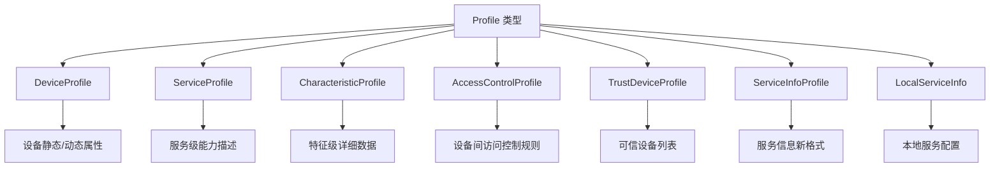
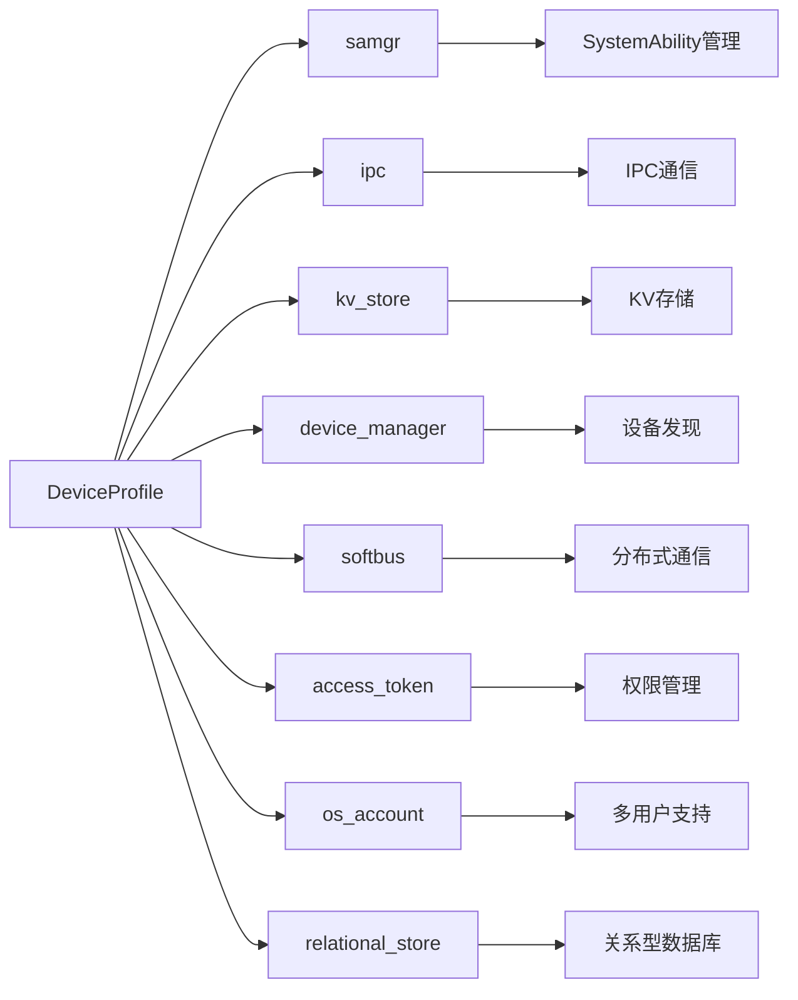

# 01 项目概览

**文档目的**: 帮助读者在 5 分钟内理解 DeviceProfile 是什么、能做什么、如何运行  
**适用范围**: 所有读者（新人、安全研究员、架构师）  

---

## 1.1 一句话定义

**DeviceProfile** 是 OpenHarmony 的分布式设备信息管理部件，负责存储、管理和同步设备的硬件能力与软件特征，为分布式业务的发现与连接提供数据基础。

---

## 1.2 核心能力

### 能力边界

| 能力 | 支持 | 说明 |
|------|------|------|
| ✅ 本地 Profile 管理 | 是 | 增删改查本地设备的 Profile 数据 |
| ✅ 远程 Profile 查询 | 是 | 查询已绑定设备的 Profile 信息 |
| ✅ 跨设备同步 | 是 | 通过 Softbus 同步 Profile 到远端 |
| ✅ 变更订阅通知 | 是 | 订阅远端 Profile 变更事件 |
| ✅ 访问控制 | 是 | ACL 控制设备间访问权限 |
| ❌ 应用直接调用 | 否 | 仅系统服务可通过 IPC 调用 |
| ❌ JS API | 否 | 无 N-API 暴露，纯 C++ 接口 |

**证据**: `README.md:11-16`, `bundle.json:70-105`

---

## 1.3 Profile 数据类型

DeviceProfile 管理 **7 种** Profile 数据：



| Profile 类型 | 存储方式 | 主要用途 |
|--------------|----------|----------|
| DeviceProfile | RDB | 设备型号、OS版本等 |
| ServiceProfile | KV Store | 服务标识和类型 |
| CharacteristicProfile | KV Store | 服务特征数据（JSON）|
| AccessControlProfile | RDB | ACL 访问控制规则 |
| TrustDeviceProfile | RDB | 可信设备信息 |
| ServiceInfoProfile | RDB | 新版服务信息（v2）|
| LocalServiceInfo | RDB | 本地服务绑定信息 |

**证据**: 
- `common/include/interfaces/device_profile.h`
- `common/include/interfaces/service_profile.h`
- `common/include/interfaces/characteristic_profile.h`
- `common/include/interfaces/access_control_profile.h`
- `common/include/interfaces/trust_device_profile.h`
- `common/include/interfaces/service_info_profile_new.h`
- `common/include/interfaces/local_service_info.h`

---

## 1.4 运行环境

### 1.4.1 系统要求

| 要求 | 说明 |
|------|------|
| **组网要求** | 设备必须在同一局域网 |
| **绑定要求** | 跨设备通信前需完成设备绑定 |
| **系统权限** | 需要 `ohos.permission.ACCESS_SERVICE_DP` |
| **调用者类型** | 仅限 Native 系统服务 (`TOKEN_NATIVE`) |

### 1.4.2 依赖子系统



**证据**: `bundle.json:24-53`

### 1.4.3 SA 配置

| 配置项 | 值 | 说明 |
|--------|-----|------|
| **SAID** | 6001 | System Ability ID |
| **进程名** | deviceprofile | 独立进程 |
| **启动模式** | 按需启动 | `run-on-create: false` |
| **启动条件** | BOOT_COMPLETED, deviceonline | 系统启动/设备上线 |
| **回收策略** | low-memory | 内存不足时回收 |

**证据**: `sa_profile/6001.json`

---

## 1.5 快速开始

### 1.5.1 使用 IPC 客户端

```cpp
#include "distributed_device_profile_client.h"

using namespace OHOS::DistributedDeviceProfile;

// 查询设备 Profile
void QueryDeviceProfile() {
    std::string deviceId = "...";  // 目标设备 ID
    std::string serviceId = "testService";
    ServiceCharacteristicProfile profile;
    
    int32_t result = DistributedDeviceProfileClient::GetInstance()
        .GetDeviceProfile(deviceId, serviceId, profile);
    
    if (result == DP_SUCCESS) {
        std::string jsonData = profile.GetCharacteristicProfileJson();
        // 处理 Profile 数据
    }
}
```

**证据**: `README.md:57-65`, `interfaces/innerkits/core/include/distributed_device_profile_client.h:57`

### 1.5.2 插入 Profile

```cpp
void PutProfile() {
    ServiceCharacteristicProfile profile;
    profile.SetServiceId("testService");
    profile.SetServiceType("testType");
    
    nlohmann::json j;
    j["version"] = "3.0.0";
    j["apiLevel"] = 9;
    profile.SetCharacteristicProfileJson(j.dump());
    
    int32_t result = DistributedDeviceProfileClient::GetInstance()
        .PutDeviceProfile(profile);
}
```

**证据**: `README.md:73-82`

---

## 1.6 关键概念

| 概念 | 说明 |
|------|------|
| **serviceId** | 服务唯一标识符，字符串类型 |
| **characteristicId** | 特征唯一标识符 |
| **deviceId** | 设备标识符（UDID）|
| **SyncMode** | 同步模式：PUSH(推)/PULL(拉)/PUSH_PULL(双向) |
| **TrustLevel** | 信任级别：表示设备间的信任程度 |
| **AccessControl** | 访问控制：定义哪些设备可以访问哪些 Profile |

---

## 1.7 常见错误码

| 错误码 | 名称 | 说明 |
|--------|------|------|
| 0 | DP_SUCCESS | 成功 |
| 98566144 | DP_INVALID_PARAMS | 无效参数 |
| 98566155 | DP_PERMISSION_DENIED | 权限被拒绝 |
| 98566147 | DP_GET_SERVICE_FAILED | 获取 SA 服务失败 |
| 98566148 | DP_INIT_DB_FAILED | 数据库初始化失败 |
| 98566204 | DP_KV_SYNC_FAIL | KV 同步失败 |
| 98566235 | DP_WRITE_PARCEL_FAIL | IPC 写入失败 |
| 98566236 | DP_READ_PARCEL_FAIL | IPC 读取失败 |

**证据**: `common/include/constants/distributed_device_profile_errors.h:21-219`

---

## 1.8 相关章节

| 目标 | 推荐阅读 |
|------|----------|
| 了解架构 | [02_Architecture.md](02_Architecture.md) |
| 查看 API 清单 | [04_Interface.md](04_Interface.md) |
| 安全分析 | [05_AttackSurface.md](05_AttackSurface.md) |
| 构建配置 | [07_Build.md](07_Build.md) |

---

## 1.9 关键结论

1. **DeviceProfile 是系统服务**，通过 IPC 为其他系统组件提供设备信息管理
2. **无 N-API 暴露**，仅限 Native 系统服务调用
3. **涉及分布式数据同步**，需要关注跨设备安全
4. **权限模型分层**：系统权限 + 接口级权限
