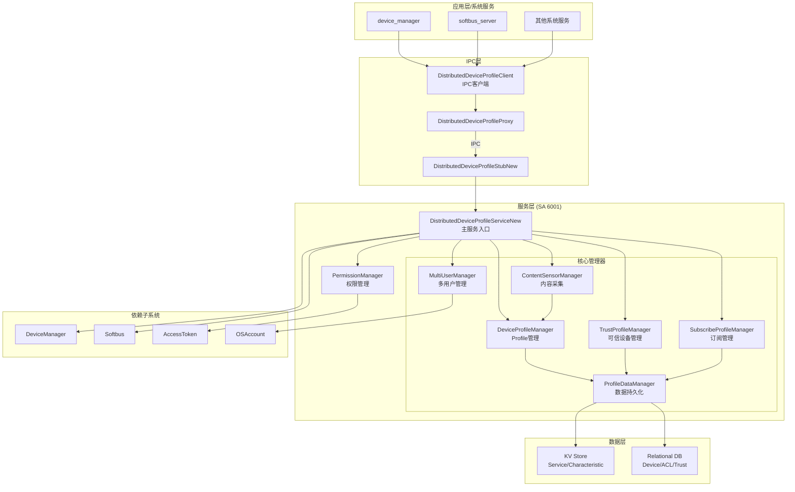
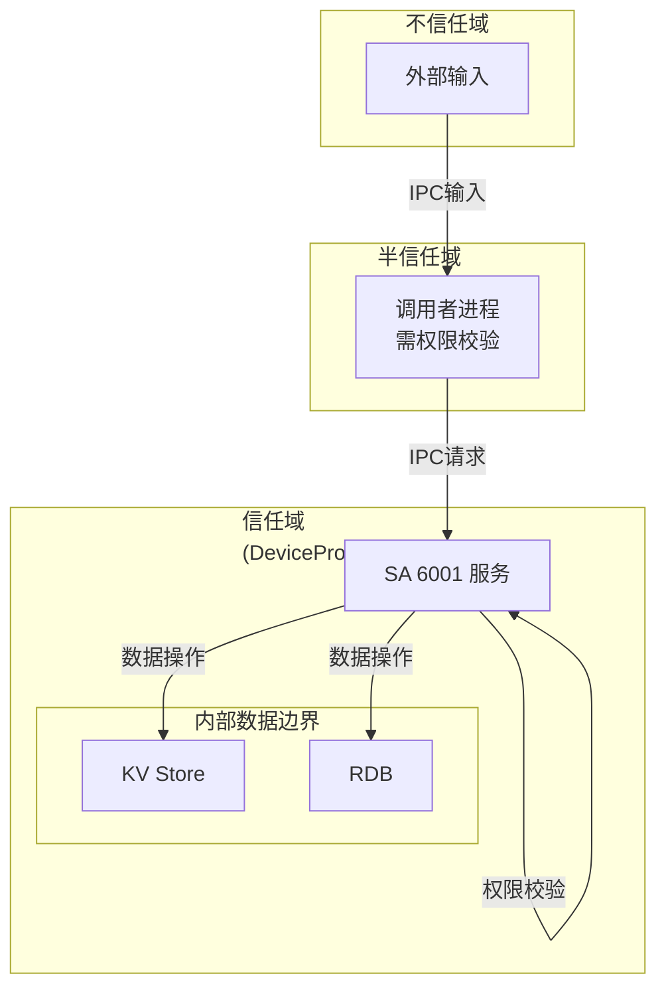
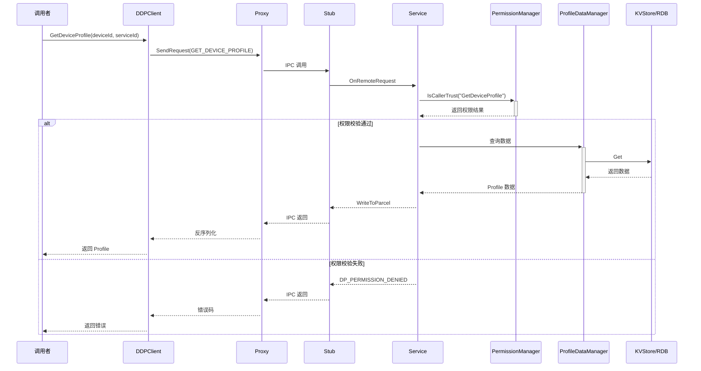
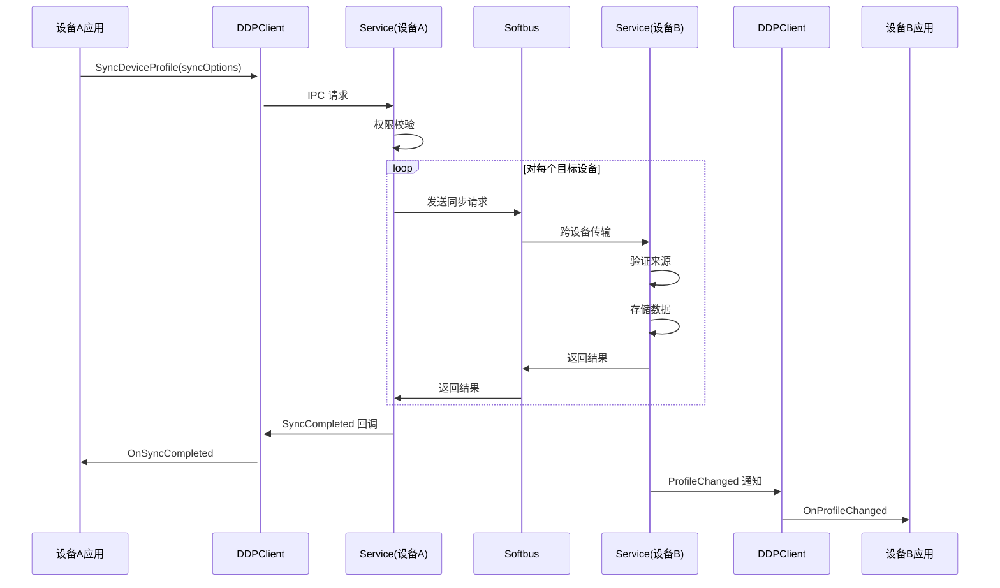
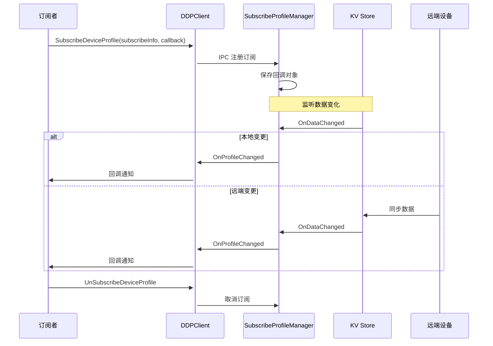
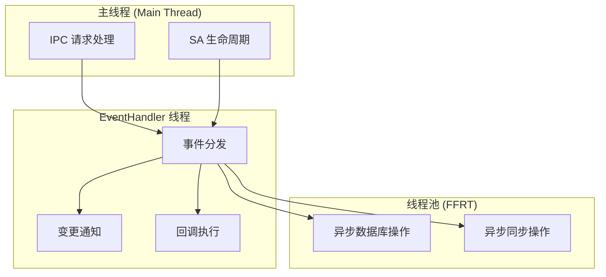
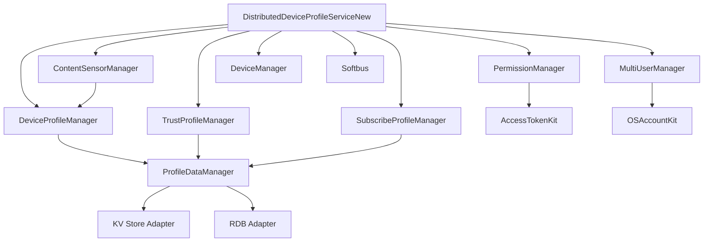
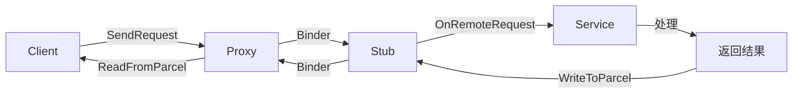

# 02 架构与数据流

**文档目的**: 帮助读者理解 DeviceProfile 的组件架构、模块关系和数据流转  
**适用范围**: 所有读者（新人理解架构、安全研究员识别信任边界）  

---

## 2.1 整体架构



---

## 2.2 核心组件

### 2.2.1 服务端组件 (SA 6001)

| 组件 | 文件位置 | 职责 |
|------|----------|------|
| **DistributedDeviceProfileServiceNew** | `services/core/include/distributed_device_profile_service_new.h:42` | SA 主入口，处理 IPC 请求 |
| **DeviceProfileManager** | `services/core/include/deviceprofilemanager/device_profile_manager.h` | Device/Service/Characteristic Profile 管理 |
| **TrustProfileManager** | `services/core/include/trustprofilemanager/trust_profile_manager.h` | 可信设备和 ACL 管理 |
| **SubscribeProfileManager** | `services/core/include/subscribeprofilemanager/subscribe_profile_manager.h` | 订阅和通知管理 |
| **ProfileDataManager** | `services/core/include/profiledatamanager/profile_data_manager.h` | 数据持久化抽象 |
| **ContentSensorManager** | `services/core/include/contentsensormanager/content_sensor_manager.h` | 内容传感器数据采集 |
| **PermissionManager** | `services/core/include/permissionmanager/permission_manager.h` | 权限校验和访问控制 |
| **MultiUserManager** | `services/core/include/multiusermanager/multi_user_manager.h` | 多用户支持 |

### 2.2.2 客户端组件

| 组件 | 文件位置 | 职责 |
|------|----------|------|
| **DistributedDeviceProfileClient** | `interfaces/innerkits/core/include/distributed_device_profile_client.h:46` | IPC 客户端单例，提供服务调用接口 |
| **DistributedDeviceProfileProxy** | `interfaces/innerkits/core/include/distributed_device_profile_proxy.h` | IPC 代理，封装 IPC 调用 |

### 2.2.3 通信组件

| 组件 | 文件位置 | 职责 |
|------|----------|------|
| **DistributedDeviceProfileStubNew** | `services/core/include/distributed_device_profile_stub_new.h` | IPC Stub，接收并分发 IPC 请求 |
| **IDistributedDeviceProfile** | `common/include/interfaces/i_distributed_device_profile.h` | IPC 接口定义 |

---

## 2.3 信任边界



**信任边界说明**:

| 边界 | 说明 | 防护机制 |
|------|------|----------|
| **IPC 边界** | 进程间通信边界 | 权限检查 + 接口白名单 |
| **数据边界** | 数据存储边界 | 文件权限 + 加密 |
| **网络边界** | 跨设备同步边界 | Softbus 安全通道 + 设备绑定 |

---

## 2.4 数据流分析

### 2.4.1 Profile 查询流程



**证据**: 
- `services/core/src/distributed_device_profile_stub_new.cpp`
- `services/core/src/distributed_device_profile_service_new.cpp:728-785`

### 2.4.2 Profile 同步流程



**证据**: `services/core/src/deviceprofilemanager/listener/`

### 2.4.3 Profile 变更订阅流程



---

## 2.5 线程模型



| 线程类型 | 用途 | 证据 |
|----------|------|------|
| **主线程** | IPC 请求分发、SA 生命周期 | `services/core/src/distributed_device_profile_service_new.cpp` |
| **EventHandler 线程** | 异步事件处理、回调通知 | `services/core/include/common/event_handler_factory.h` |
| **FFRT 线程池** | 数据库操作、跨设备同步 | `bundle.json:31` 依赖 `ffrt` |

---

## 2.6 模块依赖关系



**依赖说明**:
- **PermissionManager**: 所有管理器都需通过它进行权限校验
- **ProfileDataManager**: 数据持久化统一入口
- **ContentSensorManager**: 采集数据写入 DeviceProfileManager
- **MultiUserManager**: 用户切换时清理/恢复数据

---

## 2.7 IPC 通信机制

### 2.7.1 IPC 接口定义

```cpp
// common/include/interfaces/i_distributed_device_profile.h
class IDistributedDeviceProfile : public IRemoteBroker {
public:
    enum Code {
        PUT_DEVICE_PROFILE = 0,
        GET_DEVICE_PROFILE,
        DELETE_DEVICE_PROFILE,
        SUBSCRIBE_PROFILE_EVENT,
        UNSUBSCRIBE_PROFILE_EVENT,
        SYNC_DEVICE_PROFILE,
        // ... 40+ 个命令码
    };
    
    virtual int32_t PutDeviceProfile(const ServiceCharacteristicProfile& profile) = 0;
    virtual int32_t GetDeviceProfile(const std::string& deviceId, 
                                      const std::string& serviceId,
                                      ServiceCharacteristicProfile& profile) = 0;
    // ... 更多纯虚函数
};
```

### 2.7.2 IPC 调用流程



**证据**: 
- `common/include/interfaces/i_distributed_device_profile.h`
- `interfaces/innerkits/core/include/distributed_device_profile_proxy.h`
- `services/core/include/distributed_device_profile_stub_new.h`

---

## 2.8 关键结论

1. **分层架构**: Client-Proxy-Stub-Service-Manager-Data 六层架构，职责清晰
2. **权限控制集中**: PermissionManager 统一管理所有权限检查
3. **数据持久化抽象**: ProfileDataManager 屏蔽 KV Store 和 RDB 的差异
4. **异步处理**: 数据库和同步操作使用线程池，避免阻塞主线程
5. **跨设备信任**: 依赖 Softbus 的安全通道和设备绑定机制

---

## 2.9 相关章节

| 目标 | 推荐阅读 |
|------|----------|
| 代码位置 | [03_CodeMap.md](03_CodeMap.md) |
| API 详情 | [04_Interface.md](04_Interface.md) |
| 安全风险 | [05_AttackSurface.md](05_AttackSurface.md), [06_SecurityReview.md](06_SecurityReview.md) |
| 实现细节 | [08_Internals.md](08_Internals.md) |
