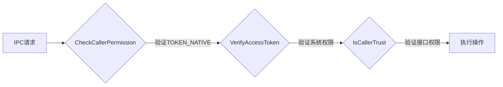

# 04 对外接口文档

**文档目的**: 详细描述 DeviceProfile 的 IPC 接口定义、参数、权限和错误码  
**适用范围**: 开发者、安全研究员  

---

## 4.1 接口概述

DeviceProfile 通过 **IPC (Binder)** 方式对外提供服务，无 N-API 暴露。调用方需满足：

1. **调用者类型**: Native 系统服务 (`TOKEN_NATIVE`)
2. **系统权限**: `ohos.permission.ACCESS_SERVICE_DP`
3. **接口权限**: 符合 `permission/permission.json` 的接口白名单

---

## 4.2 客户端接口清单

**入口**: `interfaces/innerkits/core/include/distributed_device_profile_client.h:46`

### 4.2.1 Access Control Profile 接口

| 接口名 | 参数 | 返回值 | 权限要求 |
|--------|------|--------|----------|
| `PutAccessControlProfile` | `const AccessControlProfile&` | `int32_t` | device_manager, softbus_server |
| `UpdateAccessControlProfile` | `const AccessControlProfile&` | `int32_t` | device_manager, softbus_server |
| `GetAccessControlProfile` | `map<string,string> params, vector<AccessControlProfile>&` | `int32_t` | device_manager, softbus_server, iShare |
| `GetAllAccessControlProfile` | `vector<AccessControlProfile>&` | `int32_t` | device_manager, softbus_server |
| `GetAllAclIncludeLnnAcl` | `vector<AccessControlProfile>&` | `int32_t` | device_manager, softbus_server |
| `DeleteAccessControlProfile` | `int32_t accessControlId` | `int32_t` | device_manager, softbus_server |

**证据**: `interfaces/innerkits/core/include/distributed_device_profile_client.h:50-58`

### 4.2.2 Trust Device Profile 接口

| 接口名 | 参数 | 返回值 | 权限要求 |
|--------|------|--------|----------|
| `GetTrustDeviceProfile` | `const string& deviceId, TrustDeviceProfile&` | `int32_t` | device_manager, softbus_server |
| `GetAllTrustDeviceProfile` | `vector<TrustDeviceProfile>&` | `int32_t` | device_manager, softbus_server |

**证据**: `interfaces/innerkits/core/include/distributed_device_profile_client.h:52-53`

### 4.2.3 Session Key 接口

| 接口名 | 参数 | 返回值 | 权限要求 |
|--------|------|--------|----------|
| `PutSessionKey` | `uint32_t userId, const vector<uint8_t>& sessionKey, int32_t& sessionKeyId` | `int32_t` | device_manager, softbus_server |
| `GetSessionKey` | `uint32_t userId, int32_t sessionKeyId, vector<uint8_t>& sessionKey` | `int32_t` | device_manager, softbus_server |
| `UpdateSessionKey` | `uint32_t userId, int32_t sessionKeyId, const vector<uint8_t>& sessionKey` | `int32_t` | device_manager, softbus_server |
| `DeleteSessionKey` | `uint32_t userId, int32_t sessionKeyId` | `int32_t` | device_manager, softbus_server |

**证据**: `interfaces/innerkits/core/include/distributed_device_profile_client.h:59-62`

### 4.2.4 Device/Service/Characteristic Profile 接口

| 接口名 | 参数 | 返回值 | 权限要求 |
|--------|------|--------|----------|
| `PutDeviceProfileBatch` | `vector<DeviceProfile>&` | `int32_t` | device_manager |
| `GetDeviceProfile` | `const string& deviceId, DeviceProfile&` | `int32_t` | all |
| `GetDeviceProfiles` | `DeviceProfileFilterOptions&, vector<DeviceProfile>&` | `int32_t` | device_manager |
| `DeleteDeviceProfileBatch` | `vector<DeviceProfile>&` | `int32_t` | device_manager |
| `PutServiceProfile` | `const ServiceProfile&` | `int32_t` | all |
| `PutServiceProfileBatch` | `const vector<ServiceProfile>&` | `int32_t` | all |
| `GetServiceProfile` | `const string& deviceId, const string& serviceName, ServiceProfile&` | `int32_t` | all |
| `DeleteServiceProfile` | `const string& deviceId, const string& serviceName, bool isMultiUser, int32_t userId` | `int32_t` | all |
| `PutCharacteristicProfile` | `const CharacteristicProfile&` | `int32_t` | all |
| `PutCharacteristicProfileBatch` | `const vector<CharacteristicProfile>&` | `int32_t` | all |
| `GetCharacteristicProfile` | `const string& deviceId, const string& serviceName, const string& characteristicId, CharacteristicProfile&` | `int32_t` | all |
| `DeleteCharacteristicProfile` | `const string& deviceId, const string& serviceName, const string& characteristicKey, bool isMultiUser, int32_t userId` | `int32_t` | all |

**证据**: `interfaces/innerkits/core/include/distributed_device_profile_client.h:63-78`

### 4.2.5 Product/DeviceIcon 信息接口

| 接口名 | 参数 | 返回值 | 权限要求 |
|--------|------|--------|----------|
| `PutProductInfoBatch` | `const vector<ProductInfo>&` | `int32_t` | device_manager |
| `PutDeviceIconInfoBatch` | `const vector<DeviceIconInfo>&` | `int32_t` | device_manager |
| `GetDeviceIconInfos` | `const DeviceIconInfoFilterOptions&, vector<DeviceIconInfo>&` | `int32_t` | device_manager |

**证据**: `interfaces/innerkits/core/include/distributed_device_profile_client.h:79-82`

### 4.2.6 订阅与同步接口

| 接口名 | 参数 | 返回值 | 权限要求 |
|--------|------|--------|----------|
| `SubscribeDeviceProfile` | `const SubscribeInfo&` | `int32_t` | all |
| `UnSubscribeDeviceProfile` | `const SubscribeInfo&` | `int32_t` | all |
| `SyncDeviceProfile` | `const DpSyncOptions&, sptr<ISyncCompletedCallback>` | `int32_t` | all |
| `SyncStaticProfile` | `const DpSyncOptions&, sptr<ISyncCompletedCallback>` | `int32_t` | all |

**证据**: `interfaces/innerkits/core/include/distributed_device_profile_client.h:83-86`

### 4.2.7 ServiceInfo Profile 接口 (v2)

| 接口名 | 参数 | 返回值 | 权限要求 |
|--------|------|--------|----------|
| `UpdateServiceInfoProfile` | `const ServiceInfoProfile&` | `int32_t` | device_manager |
| `GetServiceInfoProfileByUniqueKey` | `const ServiceInfoUniqueKey&, ServiceInfoProfile&` | `int32_t` | device_manager |
| `GetServiceInfoProfileListByTokenId` | `const ServiceInfoUniqueKey&, vector<ServiceInfoProfile>&` | `int32_t` | device_manager |
| `GetAllServiceInfoProfileList` | `vector<ServiceInfoProfile>&` | `int32_t` | device_manager |
| `GetServiceInfoProfileListByBundleName` | `const ServiceInfoUniqueKey&, vector<ServiceInfoProfile>&` | `int32_t` | device_manager |

**证据**: `interfaces/innerkits/core/include/distributed_device_profile_client.h:93-99`

### 4.2.8 Local Service Info 接口

| 接口名 | 参数 | 返回值 | 权限要求 |
|--------|------|--------|----------|
| `PutLocalServiceInfo` | `const LocalServiceInfo&` | `int32_t` | device_manager |
| `UpdateLocalServiceInfo` | `const LocalServiceInfo&` | `int32_t` | device_manager |
| `GetLocalServiceInfoByBundleAndPinType` | `const string& bundleName, int32_t pinExchangeType, LocalServiceInfo&` | `int32_t` | device_manager |
| `DeleteLocalServiceInfo` | `const string& bundleName, int32_t pinExchangeType` | `int32_t` | device_manager |

**证据**: `interfaces/innerkits/core/include/distributed_device_profile_client.h:100-104`

### 4.2.9 Business Event 接口

| 接口名 | 参数 | 返回值 | 权限要求 |
|--------|------|--------|----------|
| `PutBusinessEvent` | `const BusinessEvent&` | `int32_t` | TODO |
| `GetBusinessEvent` | `BusinessEvent&` | `int32_t` | TODO |

**证据**: `interfaces/innerkits/core/include/distributed_device_profile_client.h:108-109`

### 4.2.10 ServiceInfo Profile New 接口

| 接口名 | 参数 | 返回值 | 权限要求 |
|--------|------|--------|----------|
| `PutServiceInfoProfile` | `const ServiceInfoProfileNew&` | `int32_t` | device_manager |
| `DeleteServiceInfoProfile` | `int32_t regServiceId, int32_t userId` | `int32_t` | device_manager |
| `GetServiceInfoProfileByServiceId` | `int64_t serviceId, ServiceInfoProfileNew&` | `int32_t` | all |
| `GetServiceInfoProfileByTokenId` | `int64_t tokenId, vector<ServiceInfoProfileNew>&` | `int32_t` | all |
| `GetServiceInfoProfileByRegServiceId` | `int32_t regServiceId, ServiceInfoProfileNew&` | `int32_t` | all |

**证据**: `interfaces/innerkits/core/include/distributed_device_profile_client.h:110-114`

---

## 4.3 权限配置详解

### 4.3.1 权限文件位置

```json
// permission/permission.json
{
    "PutAccessControlProfile": ["device_manager", "softbus_server"],
    "GetTrustDeviceProfile": ["device_manager", "softbus_server"],
    "PutServiceProfile": ["all"],
    "SyncDeviceProfile": ["all"],
    ...
}
```

### 4.3.2 权限检查流程



**代码位置**: `services/core/src/permissionmanager/permission_manager.cpp:218`

### 4.3.3 权限等级划分

| 等级 | 接口类型 | 示例 |
|------|----------|------|
| **高** | ACL/Trust 管理 | PutAccessControlProfile, DeleteAccessControlProfile |
| **中** | ServiceInfo 管理 | PutServiceInfoProfile, UpdateServiceInfoProfile |
| **低** | Profile 查询 | GetDeviceProfile, GetServiceProfile |
| **开放** | 订阅/同步 | SyncDeviceProfile, SubscribeDeviceProfile |

---

## 4.4 错误码定义

### 4.4.1 错误码基值

```cpp
// common/include/constants/distributed_device_profile_errors.h:21
constexpr int32_t DP_ERR_OFFSET = -200;
constexpr int32_t DP_ERR_BASE = ErrCodeOffset(SUBSYS_DISTRIBUTEDHARDWARE) + DP_ERR_OFFSET;
```

实际基值: **98566143**

### 4.4.2 常见错误码

| 错误码 | 名称 | 说明 |
|--------|------|------|
| 0 | DP_SUCCESS | 成功 |
| 98566144 | DP_INVALID_PARAMS | 无效参数 |
| 98566146 | DP_GET_LOCAL_UDID_FAILED | 获取本地 UDID 失败 |
| 98566147 | DP_GET_SERVICE_FAILED | 获取 SA 服务失败 |
| 98566148 | DP_INIT_DB_FAILED | 数据库初始化失败 |
| 98566155 | DP_PERMISSION_DENIED | 权限被拒绝 |
| 98566157 | DP_NOT_INIT_DB | 数据库未初始化 |
| 98566170 | DP_PUT_ACL_PROFILE_FAIL | 写入 ACL Profile 失败 |
| 98566197 | DP_PUT_KV_DB_FAIL | 写入 KV 数据库失败 |
| 98566198 | DP_DEL_KV_DB_FAIL | 删除 KV 数据库失败 |
| 98566199 | DP_GET_KV_DB_FAIL | 查询 KV 数据库失败 |
| 98566204 | DP_KV_SYNC_FAIL | KV 同步失败 |
| 98566218 | DP_PUT_TRUST_DEVICE_PROFILE_FAIL | 写入可信设备失败 |
| 98566221 | DP_NOT_FIND_DATA | 未找到数据 |
| 98566235 | DP_WRITE_PARCEL_FAIL | IPC Parcel 写入失败 |
| 98566236 | DP_READ_PARCEL_FAIL | IPC Parcel 读取失败 |
| 98566331 | DP_SERVICE_STOPPED | 服务已停止 |

**证据**: `common/include/constants/distributed_device_profile_errors.h:21-219`

---

## 4.5 IPC 命令码

**文件**: `common/include/interfaces/dp_ipc_interface_code.h`

| 命令码 | 值 | 对应接口 |
|--------|-----|----------|
| PUT_ACCESS_CONTROL_PROFILE | 0 | PutAccessControlProfile |
| UPDATE_ACCESS_CONTROL_PROFILE | 1 | UpdateAccessControlProfile |
| GET_ACCESS_CONTROL_PROFILE | 2 | GetAccessControlProfile |
| DELETE_ACCESS_CONTROL_PROFILE | 3 | DeleteAccessControlProfile |
| GET_ALL_ACCESS_CONTROL_PROFILE | 4 | GetAllAccessControlProfile |
| ... | ... | ... |
| SYNC_DEVICE_PROFILE | 52 | SyncDeviceProfile |
| SUBSCRIBE_DEVICE_PROFILE_INITED | 54 | SubscribeDeviceProfileInited |

---

## 4.6 使用示例

### 4.6.1 查询 DeviceProfile

```cpp
#include "distributed_device_profile_client.h"
#include "device_profile.h"

using namespace OHOS::DistributedDeviceProfile;

int32_t QueryDeviceProfile() {
    std::string deviceId = "target_device_udid";
    DeviceProfile profile;
    
    int32_t ret = DistributedDeviceProfileClient::GetInstance()
        .GetDeviceProfile(deviceId, profile);
    
    if (ret == DP_SUCCESS) {
        std::string deviceName = profile.GetDeviceName();
        std::string deviceType = profile.GetDeviceType();
        // 处理数据
    } else if (ret == DP_PERMISSION_DENIED) {
        // 权限不足
    } else if (ret == DP_NOT_FIND_DATA) {
        // 未找到数据
    }
    return ret;
}
```

### 4.6.2 订阅 Profile 变更

```cpp
#include "distributed_device_profile_client.h"
#include "dp_subscribe_info.h"
#include "i_profile_change_listener.h"

class MyProfileListener : public IProfileChangeListener {
public:
    void OnProfileChanged(const ProfileChangeNotification& notification) override {
        // 处理变更通知
    }
};

int32_t SubscribeProfileChanges() {
    SubscribeInfo info;
    info.profileEvent = ProfileEvent::EVENT_PROFILE_CHANGED;
    info.extraInfo["deviceId"] = "target_device";
    
    sptr<IProfileChangeListener> listener = new MyProfileListener();
    
    return DistributedDeviceProfileClient::GetInstance()
        .SubscribeDeviceProfile(info);
}
```

---

## 4.7 接口安全注意事项

1. **权限验证**: 所有接口都有权限检查，失败返回 `DP_PERMISSION_DENIED`
2. **参数校验**: 对空指针、空字符串等做基础校验，失败返回 `DP_INVALID_PARAMS`
3. **IPC 安全**: 跨进程传输数据通过 Parcel 序列化，防止类型混淆
4. **输入长度**: 字符串参数建议有长度限制，防止内存占用过大

---

## 4.8 相关章节

| 目标 | 推荐阅读 |
|------|----------|
| 权限检查实现 | [08_Internals.md](08_Internals.md) |
| 安全风险 | [05_AttackSurface.md](05_AttackSurface.md) |
| 代码位置 | [03_CodeMap.md](03_CodeMap.md) |
