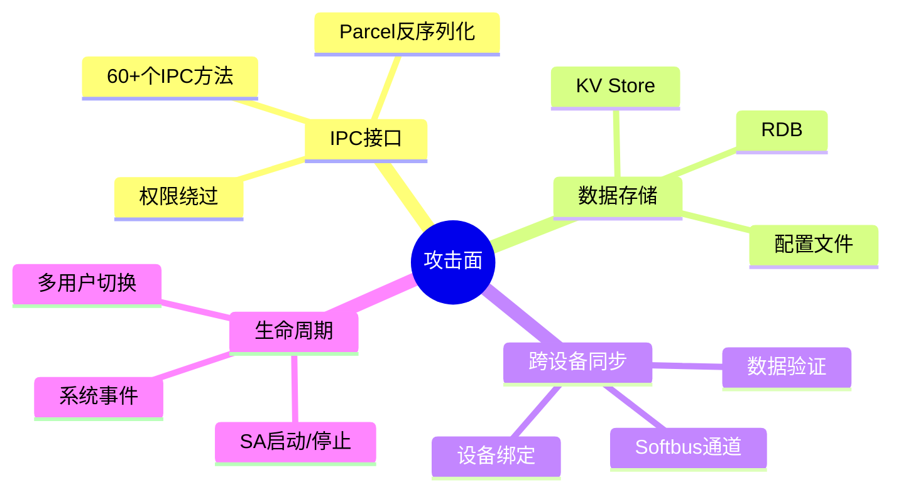
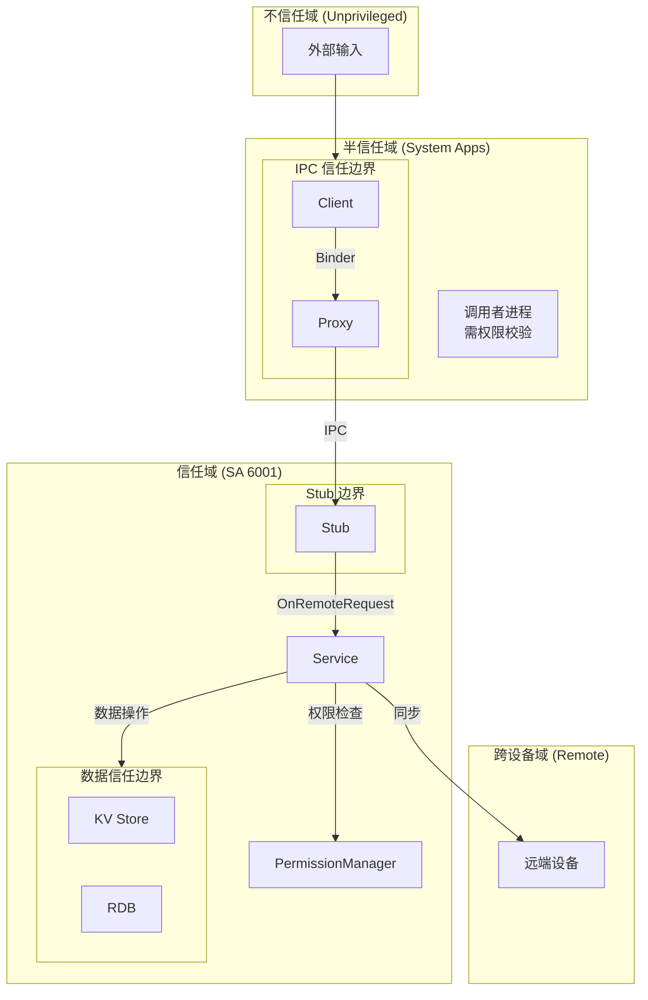

# 05 攻击面分析

**文档目的**: 识别 DeviceProfile 的所有外部输入入口、敏感操作点和信任边界  
**适用范围**: 安全研究员、审计人员  

---

## 5.1 攻击面概览



---

## 5.2 外部输入清单

### 5.2.1 IPC 参数输入 (高风险)

**入口**: `services/core/src/distributed_device_profile_stub_new.cpp`

| 输入点 | 代码位置 | 输入类型 | 处理函数 |
|--------|----------|----------|----------|
| **AccessControlProfile** | `stub_new.cpp:TODO` | 结构化数据 | `PutAccessControlProfile` |
| **DeviceProfile 列表** | `service_new.cpp:518` | `vector<DeviceProfile>` | `PutDeviceProfileBatch` |
| **ServiceProfile** | `service_new.cpp:533` | `ServiceProfile` | `PutServiceProfile` |
| **CharacteristicProfile** | `service_new.cpp:646` | `CharacteristicProfile` | `PutCharacteristicProfile` |
| **SyncOptions** | `service_new.cpp:1258` | `DpSyncOptions` | `SyncDeviceProfile` |
| **SubscribeInfo** | `service_new.cpp:876` | `SubscribeInfo` | `SubscribeDeviceProfile` |
| **BusinessEvent** | `service_new.cpp:1459` | `BusinessEvent` | `PutBusinessEvent` |
| **SessionKey** | `service_new.cpp:TODO` | `vector<uint8_t>` | `PutSessionKey` |

**证据**: `services/core/src/distributed_device_profile_service_new.cpp:518, 533, 646, 876, 1258, 1459`

### 5.2.2 配置文件输入 (中风险)

| 输入点 | 文件路径 | 输入类型 | 风险 |
|--------|----------|----------|------|
| **权限配置** | `/system/etc/deviceprofile/permission.json` | JSON | 权限定义被篡改 |
| **SA配置** | `sa_profile/6001.json` | JSON | 编译期固定 |

**处理代码**:
```cpp
// services/core/src/permissionmanager/permission_manager.cpp:71-96
int32_t PermissionManager::LoadPermissionCfg(const std::string& filePath) {
    char path[PATH_MAX + 1] = {0x00};
    if (filePath.length() == 0 || filePath.length() > PATH_MAX || 
        realpath(filePath.c_str(), path) == nullptr) {
        HILOGE("File canonicalization failed");
        return DP_PARSE_PERMISSION_JSON_FAIL;
    }
    // ... 解析 JSON
}
```

**防护**: 使用 `realpath()` 进行路径规范化，防止路径遍历

### 5.2.3 跨设备输入 (高风险)

| 输入点 | 来源 | 输入类型 | 风险 |
|--------|------|----------|------|
| **同步 Profile** | 远端设备 KV Store | `ServiceProfile` | 恶意 Profile 注入 |
| **设备信息** | DeviceManager | `TrustedDeviceInfo` | 伪造设备信息 |

**处理代码**:
```cpp
// services/core/src/deviceprofilemanager/listener/
// 跨设备同步数据通过 Softbus 接收，需验证设备绑定状态
```

---

## 5.3 敏感操作清单

### 5.3.1 权限敏感操作

| 操作 | 代码位置 | 影响 | 权限要求 |
|------|----------|------|----------|
| **写入 ACL** | `service_new.cpp:TODO` | 控制设备访问权限 | device_manager, softbus_server |
| **删除 ACL** | `service_new.cpp:TODO` | 移除访问控制 | device_manager, softbus_server |
| **写入可信设备** | `service_new.cpp:TODO` | 影响信任链 | device_manager |
| **同步 Profile** | `service_new.cpp:1258` | 跨设备数据传输 | all (权限过宽) |

### 5.3.2 数据存储操作

| 操作 | 代码位置 | 影响 |
|------|----------|------|
| **KV Store 写入** | `profiledatamanager/kvadapter/` | 持久化存储 Profile |
| **RDB 写入** | `profiledatamanager/rdbadapter/` | 持久化存储 Device/ACL |
| **数据库初始化** | `profile_data_manager.cpp` | 创建/升级数据表 |

### 5.3.3 IPC 通信操作

| 操作 | 代码位置 | 影响 |
|------|----------|------|
| **SendRequest** | `distributed_device_profile_proxy.cpp` | 发起 IPC 调用 |
| **WriteToParcel** | 各接口实现 | 序列化数据 |
| **ReadFromParcel** | `stub_new.cpp` | 反序列化数据 |

### 5.3.4 系统调用

| 调用 | 代码位置 | 用途 |
|------|----------|------|
| **realpath()** | `permission_manager.cpp:74` | 路径规范化 |
| **AccessTokenKit** | `permission_manager.cpp:201` | 权限查询 |
| **DeviceManager** | `service_new.cpp` | 设备信息获取 |
| **Softbus** | `sync_adapter.cpp` | 跨设备通信 |

---

## 5.4 信任边界图



### 5.4.1 信任边界说明

| 边界 | 位置 | 防护机制 |
|------|------|----------|
| **IPC 边界** | Client → Proxy → Stub | Binder + 权限检查 |
| **服务边界** | Stub → Service | OnRemoteRequest 分发 |
| **权限边界** | Service → PermissionManager | TOKEN_NATIVE + AccessToken |
| **数据边界** | Service → KV/RDB | 文件权限 + 数据库加密 |
| **跨设备边界** | Service → Softbus → Remote | 设备绑定 + 安全通道 |

---

## 5.5 攻击向量分析

### 5.5.1 IPC 层攻击向量

```
攻击者(恶意系统服务)
    ↓
1. 伪造 IPC 请求
    ↓
2. 尝试权限绕过
    - 伪造 caller process name
    - 利用接口权限为 "all" 的接口
    ↓
3. 输入验证绕过
    - 超长字符串
    - 特殊字符
    - JSON 注入
```

**防护点**:
- `permission_manager.cpp:201` - TOKEN_NATIVE 检查
- `permission_manager.cpp:208` - 接口权限检查
- 各接口入口 - 参数基础校验

### 5.5.2 数据层攻击向量

```
攻击者(已获取 root)
    ↓
1. 直接读取数据库文件
    - KV Store 数据文件
    - RDB 数据文件
    ↓
2. 修改配置文件
    - permission.json
    ↓
3. 注入恶意 Profile
```

**风险**: Profile 数据明文存储，root 后可读取

### 5.5.3 跨设备攻击向量

```
攻击者(控制远端设备)
    ↓
1. 向本机发送恶意 Profile
    ↓
2. 触发同步流程
    ↓
3. 本机接收并存储恶意数据
    ↓
4. 影响业务决策
```

**防护**: 依赖 Softbus 的设备绑定和加密通道

---

## 5.6 权限检查点清单

| 检查点 | 代码位置 | 检查内容 | 失败处理 |
|--------|----------|----------|----------|
| **TOKEN_NATIVE** | `permission_manager.cpp:203` | Token 类型 | 返回 false |
| **系统权限** | `permission_manager.cpp:234` | ACCESS_SERVICE_DP | 返回 false |
| **接口权限** | `permission_manager.cpp:208` | 接口白名单 | 返回 false |
| **同步权限** | `permission_manager.cpp:259` | SYNC_PROFILE_DP | 返回 false |

**代码片段**:
```cpp
// services/core/src/permissionmanager/permission_manager.cpp:218
bool PermissionManager::CheckCallerPermission() {
    auto tokenID = IPCSkeleton::GetCallingTokenID();
    if (tokenID == INVALID_TOKEN_ID) {
        return false;
    }
    
    // 1. 检查 TOKEN_NATIVE
    ATokenTypeEnum tokenType = AccessTokenKit::GetTokenTypeFlag(tokenID);
    if (tokenType != ATokenTypeEnum::TOKEN_NATIVE) {
        return false;
    }
    
    // 2. 检查系统权限
    int32_t ret = AccessTokenKit::VerifyAccessToken(tokenID, DP_SERVICE_ACCESS_PERMISSION);
    return ret == PermissionState::PERMISSION_GRANTED;
}
```

---

## 5.7 配置文件攻击面

### 5.7.1 permission.json

**位置**: `/system/etc/deviceprofile/permission.json`

**风险**:
- 若被篡改，可能导致权限绕过
- 但实际位于系统只读分区，需要 root 才能修改

**内容示例**:
```json
{
    "PutAccessControlProfile": ["device_manager", "softbus_server"],
    "SyncDeviceProfile": ["all"],        // 风险: 任何服务都可调用
    "GetDeviceProfile": ["all"]          // 风险: 信息泄露可能
}
```

### 5.7.2 6001.json (SA 配置)

**位置**: `system/etc/sa_profile/6001.json`

**关键配置**:
- `run-on-create: false` - 按需启动
- `recycle-strategy: low-memory` - 低内存回收
- `distributed: false` - 非分布式 SA

---

## 5.8 攻击面总结

| 攻击面 | 风险等级 | 可利用性 | 影响 |
|--------|----------|----------|------|
| **IPC 参数注入** | 中 | 中 | 依赖参数校验 |
| **权限绕过** | 中 | 低 | 多层权限检查 |
| **数据读取** | 中 | 高(root) | 明文存储 |
| **跨设备注入** | 高 | 中 | 依赖设备绑定 |
| **配置文件篡改** | 低 | 低(需root) | 系统分区只读 |

---

## 5.9 相关章节

| 目标 | 推荐阅读 |
|------|----------|
| 详细安全风险 | [06_SecurityReview.md](06_SecurityReview.md) |
| 接口详情 | [04_Interface.md](04_Interface.md) |
| 代码位置 | [03_CodeMap.md](03_CodeMap.md) |
| 架构设计 | [02_Architecture.md](02_Architecture.md) |
