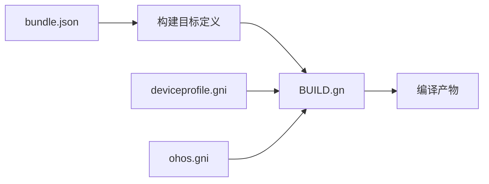

# 07 构建与产物

**文档目的**: 描述 DeviceProfile 的构建配置、编译产物和 Feature 开关  
**适用范围**: 开发工程师、集成工程师  

---

## 7.1 构建系统概览

DeviceProfile 使用 **GN (Generate Ninja)** 构建系统，与 OpenHarmony 整体构建体系一致。



---

## 7.2 GN 目标清单

### 7.2.1 核心 Targets

| Target | 类型 | 输出文件 | 路径 |
|--------|------|----------|------|
| **distributed_device_profile_sdk** | shared_library | libdistributed_device_profile_sdk.z.so | `interfaces/innerkits/core/BUILD.gn:30` |
| **distributed_device_profile_svr** | shared_library | libdistributed_device_profile_svr.z.so | `services/core/BUILD.gn:55` |
| **distributed_device_profile_common** | shared_library | libdistributed_device_profile_common.z.so | `common/BUILD.gn` |

### 7.2.2 配置 Targets

| Target | 类型 | 输出 | 路径 |
|--------|------|------|------|
| **dps_sa_profile** | 配置文件 | 6001.json | `sa_profile/BUILD.gn` |
| **permission_json** | 配置文件 | permission.json | `permission/BUILD.gn` |
| **deviceprofile_trust** | 配置文件 | trust 配置 | `etc/profile/BUILD.gn` |
| **etc** | 初始化脚本 | init 配置 | `etc/init/BUILD.gn` |

### 7.2.3 测试 Targets

| Target | 类型 | 路径 |
|--------|------|------|
| **dp_radar_helper_test_new** | unittest | `radar/test/unittest/BUILD.gn` |
| **unittest** | unittest | `services/core/test/BUILD.gn` |
| **common_test** | unittest | `common/test/BUILD.gn` |
| **fuzztest** | fuzzer | `services/core/test/fuzztest/BUILD.gn` |

**证据**: `bundle.json:55-112`

---

## 7.3 构建目标详解

### 7.3.1 SDK Target (distributed_device_profile_sdk)

**文件**: `interfaces/innerkits/core/BUILD.gn:30`

```gn
ohos_shared_library("distributed_device_profile_sdk") {
  branch_protector_ret = "pac_ret"
  ldflags = [
    "-Wl,-z,relro",
    "-Wl,-z,now",
  ]
  cflags = [
    "-fPIC",
    "-D_FORTIFY_SOURCE=2",
    "-O2",
  ]
  sanitize = {
    boundary_sanitize = true
    integer_overflow = true
    ubsan = true
    cfi = true
    cfi_cross_dso = true
    debug = false
  }
  
  sources = [
    "src/callback/device_profile_load_callback.cpp",
    "src/distributed_device_profile_client.cpp",
    "src/distributed_device_profile_proxy.cpp",
  ]
  
  external_deps = [
    "cJSON:cjson",
    "c_utils:utils",
    "eventhandler:libeventhandler",
    "hilog:libhilog",
    "ipc:ipc_core",
    "relational_store:native_rdb",
    "samgr:samgr_proxy",
  ]
}
```

**说明**:
- **安全编译选项**: `-D_FORTIFY_SOURCE=2`, CFI, UBSan
- **重定位保护**: `-Wl,-z,relro`, `-Wl,-z,now`
- **分支保护**: `pac_ret` (Pointer Authentication)

### 7.3.2 服务 Target (distributed_device_profile_svr)

**文件**: `services/core/BUILD.gn:55`

```gn
ohos_shared_library("distributed_device_profile_svr") {
  branch_protector_ret = "pac_ret"
  ldflags = [
    "-Wl,-z,relro",
    "-Wl,-z,now",
  ]
  cflags = [
    "-fPIC",
    "-D_FORTIFY_SOURCE=2",
    "-O2",
  ]
  
  # Feature 开关
  if (dp_os_account_part_exists) {
    cflags += [ "-DDP_OS_ACCOUNT_PART_EXISTS" ]
  }
  if (!device_info_manager_supported_switch || device_info_manager_common) {
    cflags += [ "-DDEVICE_PROFILE_SWITCH_DISABLE" ]
  }
  
  sanitize = {
    boundary_sanitize = true
    integer_overflow = true
    ubsan = true
    cfi = true
    cfi_cross_dso = true
    debug = false
  }
  
  install_enable = true
  # 源文件列表 (50+ 个 cpp 文件)
}
```

---

## 7.4 编译产物

### 7.4.1 动态库

| 产物 | 类型 | 安装路径 | 用途 |
|------|------|----------|------|
| `libdistributed_device_profile_sdk.z.so` | shared_library | `/system/lib/` | IPC 客户端库 |
| `libdistributed_device_profile_svr.z.so` | shared_library | `/system/lib/` | SA 服务库 |
| `libdistributed_device_profile_common.z.so` | shared_library | `/system/lib/` | 公共模块库 |

### 7.4.2 配置文件

| 产物 | 安装路径 | 用途 |
|------|----------|------|
| `6001.json` | `/system/etc/sa_profile/` | SA 声明配置 |
| `permission.json` | `/system/etc/deviceprofile/` | 接口权限配置 |
| `deviceprofile_trust.json` | `/system/etc/deviceprofile/` | 信任配置 |

### 7.4.3 初始化脚本

| 产物 | 安装路径 | 用途 |
|------|----------|------|
| `deviceprofile.cfg` | `/system/etc/init/` | 服务初始化配置 |

---

## 7.5 Feature 开关

### 7.5.1 编译期宏

| 宏 | 定义位置 | 说明 |
|----|----------|------|
| `DP_OS_ACCOUNT_PART_EXISTS` | `services/core/BUILD.gn:69` | OS Account 部件存在 |
| `DEVICE_PROFILE_SWITCH_DISABLE` | `services/core/BUILD.gn:72` | DeviceProfile 功能开关禁用 |

### 7.5.2 运行时特性

**bundle.json 特性开关**:
```json
{
  "component": {
    "features": [
      "device_info_manager_supported_switch"
    ]
  }
}
```

**证据**: `bundle.json:15-17`

---

## 7.6 安全编译选项

### 7.6.1 已启用的安全选项

| 选项 | 位置 | 说明 |
|------|------|------|
| `-D_FORTIFY_SOURCE=2` | BUILD.gn:39 | 运行时缓冲区检查 |
| `-Wl,-z,relro` | BUILD.gn:33 | 只读重定位 |
| `-Wl,-z,now` | BUILD.gn:34 | 立即绑定符号 |
| `pac_ret` | BUILD.gn:31 | 指针认证保护 |
| `cfi` | BUILD.gn:49 | 控制流完整性 |
| `ubsan` | BUILD.gn:48 | 未定义行为检测 |
| `boundary_sanitize` | BUILD.gn:46 | 边界检查 |
| `integer_overflow` | BUILD.gn:47 | 整数溢出检测 |

**证据**: 
- `interfaces/innerkits/core/BUILD.gn:30-52`
- `services/core/BUILD.gn:55-84`

### 7.6.2 安全选项说明

```
┌─────────────────────────────────────────────────────────────┐
│                    安全编译选项矩阵                          │
├─────────────────────────────────────────────────────────────┤
│ 编译选项              │ SDK │ SVC │ 说明                    │
├───────────────────────┼─────┼─────┼─────────────────────────┤
│ -D_FORTIFY_SOURCE=2   │  ✅  │  ✅  │ 运行时缓冲区溢出检测    │
│ -Wl,-z,relro          │  ✅  │  ✅  │ GOT 表只读保护          │
│ -Wl,-z,now            │  ✅  │  ✅  │ 立即符号解析            │
│ pac_ret               │  ✅  │  ✅  │ ARM 指针认证            │
│ CFI                   │  ✅  │  ✅  │ 控制流完整性            │
│ UBSan                 │  ✅  │  ✅  │ 未定义行为检测          │
│ BoundarySanitize      │  ✅  │  ✅  │ 数组边界检查            │
└───────────────────────┴─────┴─────┴─────────────────────────┘
```

---

## 7.7 依赖关系

### 7.7.1 SDK 依赖

```
distributed_device_profile_sdk
├── distributed_device_profile_common (内部)
├── device_profile_radar (内部)
├── cJSON:cjson (外部)
├── c_utils:utils (外部)
├── eventhandler:libeventhandler (外部)
├── hilog:libhilog (外部)
├── ipc:ipc_core (外部)
├── relational_store:native_rdb (外部)
└── samgr:samgr_proxy (外部)
```

### 7.7.2 服务依赖

```
distributed_device_profile_svr
├── distributed_device_profile_common (内部)
├── device_profile_radar (内部)
├── 30+ 外部依赖 (见 bundle.json:24-53)
```

**外部依赖清单** (来自 `bundle.json`):
- `cJSON`, `c_utils`, `ipc`, `samgr`, `kv_store`
- `device_manager`, `softbus`, `access_token`
- `os_account`, `relational_store`, `asset`
- 等等 (共 30+ 个)

---

## 7.8 构建命令示例

### 7.8.1 完整构建

```bash
# 在 OpenHarmony 源码根目录执行
./build.sh --product {product_name} \
           --target \"//foundation/deviceprofile/device_info_manager/services/core:distributed_device_profile_svr\"
```

### 7.8.2 仅构建 SDK

```bash
./build.sh --product {product_name} \
           --target \"//foundation/deviceprofile/device_info_manager/interfaces/innerkits/core:distributed_device_profile_sdk\"
```

### 7.8.3 运行测试

```bash
# 单元测试
./build.sh --product {product_name} \
           --target \"//foundation/deviceprofile/device_info_manager/services/core:unittest\"

# Fuzz 测试
./build.sh --product {product_name} \
           --target \"//foundation/deviceprofile/device_info_manager/services/core/test/fuzztest:fuzztest\"
```

---

## 7.9 相关章节

| 目标 | 推荐阅读 |
|------|----------|
| 代码位置 | [03_CodeMap.md](03_CodeMap.md) |
| 架构设计 | [02_Architecture.md](02_Architecture.md) |
| 安全分析 | [06_SecurityReview.md](06_SecurityReview.md) |
