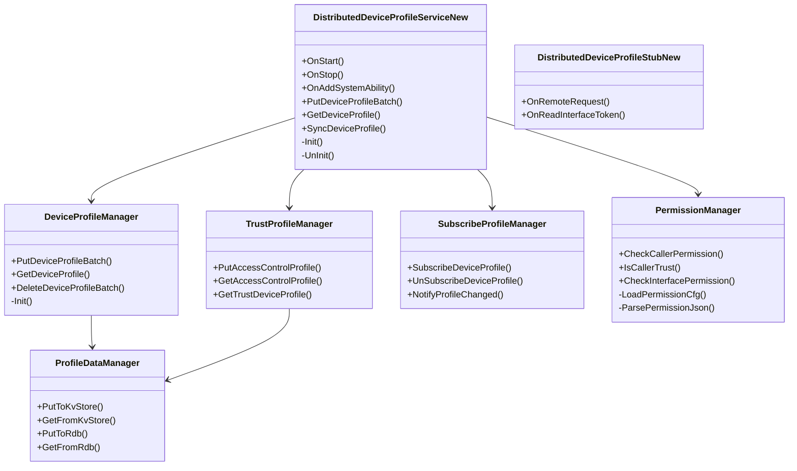
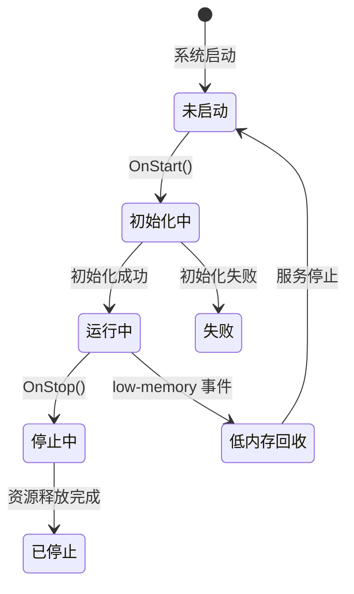
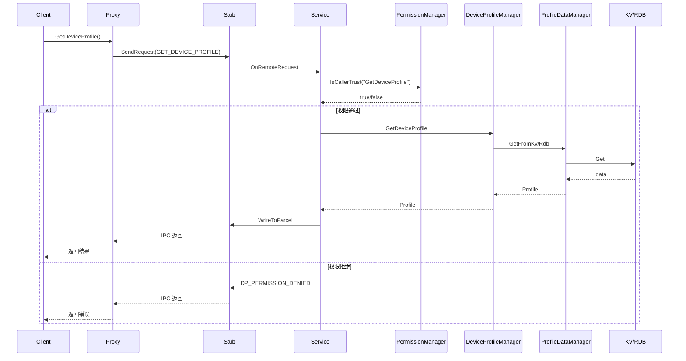

# 08 内部实现细节

**文档目的**: 深入描述 DeviceProfile 的核心类职责、内部 API 和资源生命周期  
**适用范围**: 深入开发者、安全研究员  

---

## 8.1 核心类职责

### 8.1.1 服务层核心类



---

## 8.2 类详细说明

### 8.2.1 DistributedDeviceProfileServiceNew

**文件**: `services/core/include/distributed_device_profile_service_new.h:42`

**职责**:
- SA 生命周期管理 (OnStart/OnStop)
- IPC 请求处理入口
- 各管理器的协调者

**关键方法**:

| 方法 | 位置 | 职责 |
|------|------|------|
| `OnStart()` | service_new.cpp | SA 启动，初始化各管理器 |
| `OnStop()` | service_new.cpp | SA 停止，资源释放 |
| `OnAddSystemAbility()` | service_new.cpp:200 | 监听依赖 SA 上线 |
| `PutDeviceProfileBatch()` | service_new.cpp:518 | 批量插入 DeviceProfile |
| `GetDeviceProfile()` | service_new.cpp:728 | 查询 DeviceProfile |
| `SyncDeviceProfile()` | service_new.cpp:1258 | 跨设备同步 |

### 8.2.2 PermissionManager

**文件**: `services/core/include/permissionmanager/permission_manager.h`

**职责**:
- 调用者身份验证
- 接口权限检查
- 权限配置加载

**关键方法**:

```cpp
// services/core/src/permissionmanager/permission_manager.cpp:218
bool CheckCallerPermission();
// 检查 TOKEN_NATIVE + ACCESS_SERVICE_DP 权限

// services/core/src/permissionmanager/permission_manager.cpp:192
bool IsCallerTrust(const std::string& interfaceName);
// 检查 TOKEN_NATIVE + 接口白名单

// services/core/src/permissionmanager/permission_manager.cpp:179
bool CheckInterfacePermission(const std::string& interfaceName);
// 检查调用者进程名是否在白名单中
```

**权限检查流程**:
```
IPC 请求 → CheckCallerPermission() → GetCallingTokenID()
                                   ↓
                              GetTokenTypeFlag() == TOKEN_NATIVE?
                                   ↓
                              VerifyAccessToken(ACCESS_SERVICE_DP)
                                   ↓
                              返回 true/false
```

### 8.2.3 DeviceProfileManager

**文件**: `services/core/include/deviceprofilemanager/device_profile_manager.h`

**职责**:
- DeviceProfile 的增删改查
- ServiceProfile 的增删改查
- CharacteristicProfile 的增删改查

**数据流向**:
```
IPC 请求 → DeviceProfileManager → ProfileDataManager → KV Store/RDB
```

### 8.2.4 ProfileDataManager

**文件**: `services/core/include/profiledatamanager/profile_data_manager.h`

**职责**:
- 数据持久化抽象
- KV Store 适配
- RDB 适配

**存储映射**:

| Profile 类型 | 存储方式 | 适配器 |
|--------------|----------|--------|
| ServiceProfile | KV Store | `kvadapter/kv_adapter.h` |
| CharacteristicProfile | KV Store | `kvadapter/kv_adapter.h` |
| DeviceProfile | RDB | `rdbadapter/rdb_adapter.h` |
| AccessControlProfile | RDB | `rdbadapter/rdb_adapter.h` |
| TrustDeviceProfile | RDB | `rdbadapter/rdb_adapter.h` |

---

## 8.3 资源生命周期

### 8.3.1 SA 生命周期



**代码证据**: `services/core/src/distributed_device_profile_service_new.cpp`

```cpp
void DistributedDeviceProfileServiceNew::OnStart() {
    // 1. 初始化权限管理器
    PermissionManager::GetInstance().Init();
    
    // 2. 初始化数据管理器
    ProfileDataManager::GetInstance().Init();
    
    // 3. 初始化各 Profile 管理器
    DeviceProfileManager::GetInstance().Init();
    TrustProfileManager::GetInstance().Init();
    SubscribeProfileManager::GetInstance().Init();
    // ...
    
    // 4. 发布 SA
    publish_ = true;
}
```

### 8.3.2 对象生命周期

| 对象 | 创建时机 | 销毁时机 | Owner |
|------|----------|----------|-------|
| ServiceNew | OnStart | OnStop | SystemAbility |
| Client | 首次 GetInstance | 进程退出 | Singleton |
| Proxy | 每次 IPC 调用 | 调用结束 | Client |
| Callback | Subscribe 时 | UnSubscribe/进程退出 | SubscribeManager |

---

## 8.4 内部 API 契约

### 8.4.1 稳定接口

以下接口相对稳定，可安全使用：

| 接口 | 位置 | 稳定性 |
|------|------|--------|
| `DistributedDeviceProfileClient` 公有方法 | client.h | 高 |
| `IDistributedDeviceProfile` 纯虚函数 | i_distributed_device_profile.h | 高 |
| Profile 数据结构 | common/include/interfaces/*.h | 高 |

### 8.4.2 内部实现细节

以下属于内部实现，可能变更：

| 组件 | 说明 |
|------|------|
| `ProfileDataManager` 具体实现 | 存储方式可能变更 |
| `PermissionManager` 内部 map | 权限结构可能变更 |
| 回调接口的实现类 | 内部机制 |

---

## 8.5 关键数据流

### 8.5.1 Profile 查询数据流



### 8.5.2 权限检查调用链

```
服务入口 (ServiceNew::XXX)
    ↓
PermissionManager::IsCallerTrust(interfaceName)
    ↓
IPCSkeleton::GetCallingTokenID()
    ↓
AccessTokenKit::GetTokenTypeFlag(tokenID)
    ↓ (验证 TOKEN_NATIVE)
PermissionManager::CheckInterfacePermission(interfaceName)
    ↓
IPCSkeleton::GetCallingUid() → GetCallerProcName()
    ↓
permissionMap_[interfaceName].count(callProcName)
    ↓
返回 true/false
```

**证据**: `services/core/src/permissionmanager/permission_manager.cpp:179-216`

---

## 8.6 线程安全说明

### 8.6.1 线程模型

| 组件 | 线程安全 | 机制 |
|------|----------|------|
| PermissionManager | ✅ 线程安全 | `permissionMutex_` |
| ProfileDataManager | ✅ 线程安全 | 依赖底层存储 |
| SubscribeProfileManager | ✅ 线程安全 | `subscribeMutex_` |
| Client/Proxy | ✅ 线程安全 | 局部变量 |

### 8.6.2 锁使用模式

```cpp
// PermissionManager 模式
std::unordered_set<std::string> permittedProcNames;
{
    std::lock_guard<std::mutex> lockGuard(permissionMutex_);
    permittedProcNames = permissionMap_[interfaceName];
} // 锁释放
// 在锁外使用拷贝的数据
return permittedProcNames.count(callProcName) != 0;
```

**优点**: 减小锁粒度，避免死锁

---

## 8.7 内存管理

### 8.7.1 所有权规则

| 对象 | 所有权 | 释放责任 |
|------|--------|----------|
| IPC 回调对象 | 客户端 | 客户端 UnSubscribe |
| Profile 对象 | 调用者 | 调用者管理 |
| 内部缓存 | Service | OnStop 时释放 |

### 8.7.2 智能指针使用

```cpp
// 回调对象使用 sptr (强引用)
sptr<IProfileChangeListener> listener;

// 内部对象使用单例模式
IMPLEMENT_SINGLE_INSTANCE(PermissionManager);
```

---

## 8.8 性能考虑

### 8.8.1 缓存机制

| 缓存 | 位置 | 说明 |
|------|------|------|
| 权限配置 | PermissionManager | 启动时加载，运行时不变 |
| Profile 缓存 | ProfileDataManager | 可选内存缓存 |

### 8.8.2 异步操作

| 操作 | 方式 | 说明 |
|------|------|------|
| 数据库操作 | 同步 | 可能阻塞线程 |
| 跨设备同步 | 异步 | 使用 FFRT 线程池 |
| 回调通知 | 异步 | 通过 EventHandler |

---

## 8.9 相关章节

| 目标 | 推荐阅读 |
|------|----------|
| 架构设计 | [02_Architecture.md](02_Architecture.md) |
| 代码位置 | [03_CodeMap.md](03_CodeMap.md) |
| 接口详情 | [04_Interface.md](04_Interface.md) |
| 安全分析 | [06_SecurityReview.md](06_SecurityReview.md) |
| 构建配置 | [07_Build.md](07_Build.md) |
