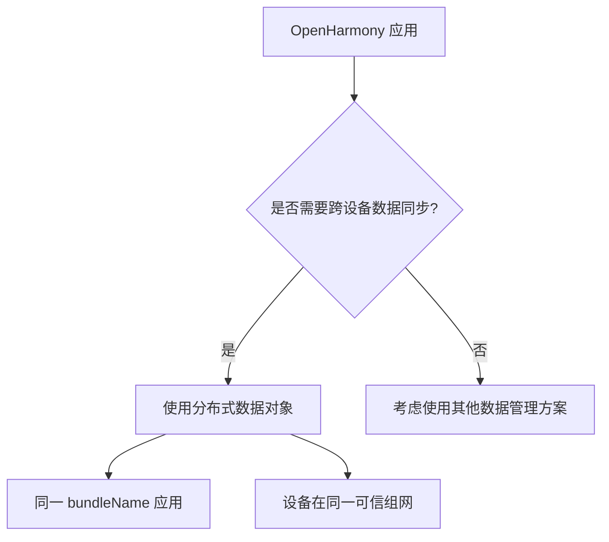

# 概览

> 分布式数据对象部件 (Distributed Data Object) 项目概览

## 项目定位

### 组件信息

| 属性 | 值 |
|------|-----|
| 组件名 | `@ohos/data_object` |
| 子系统 | `distributeddatamgr` |
| 版本 | 3.1.0 |
| 许可证 | Apache-2.0 |
| 代码仓库 | `foundation/distributeddatamgr/data_object` |

**证据**: `bundle.json:2-4` (组件名与版本)

### 核心定位

分布式数据对象管理框架是 **面向对象的内存数据管理框架**，向应用开发者提供：

1. **本地数据管理能力**：内存对象的创建、查询、删除、修改、订阅
2. **分布式协同能力**：超级终端场景下，相同应用多设备间的数据对象同步

**证据**: `README_zh.md:3-4` (框架描述)

### 适用范围



**证据**: `README_zh.md:9` (bundleName 约束)

---

## 核心能力

### 数据类型支持

| 类型 | 说明 | 约束 |
|------|------|------|
| 数字型 (Number) | double 类型 | - |
| 字符型 (String) | 字符串类型 | - |
| 布尔型 (Boolean) | true/false | - |
| 复杂类型 | JSON 对象、数组 | 仅支持修改根属性 |
| 资产型 (Asset) | 文件资源 | 需额外绑定操作 |

**证据**: `README_zh.md:5,17` (数据类型与约束)

### 关键能力列表

| 能力 | 描述 | 相关 API |
|------|------|----------|
| 对象创建 | 创建分布式对象实例 | `createDistributedObject()` |
| 会话管理 | 设置/取消设备组网会话 | `setSessionId()` |
| 数据读写 | 修改对象属性自动同步 | `obj.key = value` |
| 变更监听 | 订阅数据变更事件 | `on('change', callback)` |
| 状态监听 | 监听设备上下线状态 | `on('status', callback)` |
| 持久化 | 保存对象到本地设备 | `save(deviceId)` |
| 资产绑定 | 绑定文件资源进行同步 | `bindAssetStore()` |

**证据**: `README_zh.md:51-68` (API 列表)

---

## 约束与限制

### 硬性约束

| 约束 | 说明 | 原因 |
|------|------|------|
| bundleName 隔离 | 不同设备间只有相同 bundleName 的应用才能直接同步 | 安全隔离 |
| 对象数量 | 不建议创建过多分布式对象 | 内存占用 (100-150KB/对象) |
| 对象大小 | 每个对象大小不超过 500KB | 性能考虑 |
| 语言互通 | 仅支持 JS 接口间互通 | 技术架构限制 |
| 属性修改 | 复杂类型仅支持修改根属性 | 实现复杂度 |

**证据**: `README_zh.md:9-17` (约束列表)

### 资源限制

| 资源 | 限制值 | 说明 |
|------|--------|------|
| 单对象内存 | 100-150KB | 每个分布式对象占用 |
| 单对象大小 | ≤500KB | 超过可能影响性能 |
| 单对象数量 | 建议较少 | 过多影响整体性能 |

**证据**: `README_zh.md:11-13` (资源约束)

---

## 关键概念

### 1. 分布式对象 (Distributed Object)

**定义**：具有分布式同步能力的内存对象，修改后自动同步到同会话的所有设备。

**特点**：
- 以 JS 对象形式使用
- 自动跟踪属性变更
- 通过 sessionId 关联设备组

**证据**: `README_zh.md:3-5` (框架描述)

### 2. 会话 (Session)

**定义**：设备组网的标识，同一 sessionId 的设备自动进行数据同步。

**操作**：
- `setSessionId(sessionId)`：加入/切换会话
- `setSessionId('')` 或不设置：退出当前会话

**证据**: `README_zh.md:62` (sessionId 用法)

### 3. sessionId

**定义**：会话的唯一标识符，用于关联需要进行数据同步的设备。

**规则**：
- 格式：字母、数字、下划线组合
- 长度：不超过 128 字符
- 生成：`genSessionId()` 可随机生成

**证据**: `distributed_data_object.js:29-30` (sessionId 规则)

### 4. 设备组网

**定义**：通过软总线连接的设备网络，同组网设备可进行数据同步。

**约束**：
- 需在同一可信组网中
- 需具有 DATA_SYNC 权限
- bundleName 必须相同

**证据**: `README_zh.md:9` (组网约束)

### 5. 资产 (Asset)

**定义**：与分布式对象关联的文件资源，支持跨设备同步。

**资产结构**：
```javascript
{
  status: 0,        // 状态
  name: "file.txt", // 文件名
  uri: "path/to/file", // URI
  path: "/data/...",   // 路径
  createTime: "...",   // 创建时间
  modifyTime: "...",   // 修改时间
  size: 1234          // 大小
}
```

**证据**: `distributed_data_object.js:23` (Asset 键定义)

---

## 目录结构

```
data_object/
├── interfaces/                    # 接口层 ⭐
│   ├── innerkits/                # 内部接口声明 (C++)
│   │   ├── distributed_object.h          # 分布式对象抽象接口
│   │   ├── distributed_objectstore.h      # 对象存储工厂接口
│   │   ├── objectstore_errors.h           # 错误码定义
│   │   └── object_types.h                # 类型定义 (Asset, AssetBindInfo)
│   │
│   └── jskits/                   # JS 接口声明
│       ├── distributed_data_object.js     # JS API 实现 (577 行)
│       └── BUILD.gn                       # JS 接口构建配置
│
├── frameworks/                    # 框架层 ⭐
│   ├── innerkitsimpl/           # 内部接口实现 (C++)
│   │   ├── include/
│   │   │   ├── adaptor/         # 适配层实现
│   │   │   ├── communicator/   # 通信层
│   │   │   └── common/         # 公共工具
│   │   └── src/
│   │       ├── adaptor/         # 适配层源码
│   │       ├── communicator/   # 通信层源码
│   │       └── collaboration_edit/ # 协作编辑模块
│   │
│   ├── jskitsimpl/              # JS API 实现 (N-API)
│   │   ├── include/adaptor/     # JS 绑定头文件
│   │   └── src/adaptor/
│   │       ├── js_module_init.cpp      # ⭐ N-API 模块入口
│   │       ├── js_distributedobject.cpp     # 分布式对象 N-API
│   │       ├── js_distributedobjectstore.cpp # 对象存储 N-API
│   │       └── js_watcher.cpp          # 事件监听 N-API
│   │
│   └── ets/                     # ETS (Extended TypeScript) 接口
│       └── taihe/ohos.data.distributedDataObject/
│
├── picture/                      # 资源图库
├── samples/                     # 开发实例
│   └── distributedNotepad/     # 备忘录应用示例
└── wiki/                        # 本文档目录
```

**证据**: Phase 1 全局扫描结果

---

## 运行环境

### 系统要求

| 要求 | 说明 |
|------|------|
| OpenHarmony 版本 | 标准系统 (standard) |
| 系统能力 | SystemCapability.DistributedDataManager.DataObject.DistributedObject |
| 适配系统类型 | standard |

**证据**: `bundle.json:40-42` (系统适配)

### 依赖组件

| 组件名 | 用途 |
|--------|------|
| ability_runtime | 应用上下文与 Ability 支持 |
| dsoftbus | 设备间软总线通信 |
| kv_store | 分布式数据存储 |
| ipc | 进程间通信 |
| access_token | 权限管理 |
| hilog | 日志输出 |

**证据**: `bundle.json:45-66` (依赖组件列表)

### 资源占用

| 资源 | 大小 |
|------|------|
| ROM | 1024KB |
| RAM | 1024KB |

**证据**: `bundle.json:43-44` (资源占用)

---

## 快速开始

### 1. 导入模块

```javascript
import distributedObject from '@ohos.data.distributedDataObject'
```

### 2. 创建对象

```javascript
// 创建分布式对象
const obj = distributedObject.createDistributedObject({
  name: 'myData',
  value: 42,
  enabled: true
})
```

### 3. 设置会话 ID

```javascript
// 生成会话 ID
const sessionId = distributedObject.genSessionId()

// 设置会话 ID，同一 sessionId 的设备将自动同步
obj.setSessionId(sessionId)
```

### 4. 监听变更

```javascript
// 监听数据变更
obj.on('change', (data) => {
  console.log(`字段 ${data.fields} 已变更`)
})

// 监听设备状态
obj.on('status', (data) => {
  console.log(`设备 ${data.networkId} 状态: ${data.status}`) // online/offline
})
```

### 5. 完整示例

```javascript
import distributedObject from '@ohos.data.distributedDataObject'

// 创建对象
const obj = distributedObject.createDistributedObject({
  title: '会议笔记',
  content: '今天下午3点开会'
})

// 设置会话
const sessionId = distributedObject.genSessionId()
obj.setSessionId(sessionId)

// 监听变更
obj.on('change', ({ sessionId, fields }) => {
  console.log(`会话 ${sessionId} 的字段 ${fields} 已更新`)
})

// 监听状态
obj.on('status', ({ sessionId, networkId, status }) => {
  console.log(`设备 ${networkId} ${status === 'online' ? '上线' : '下线'}`)
})

// 修改数据（自动同步）
obj.title = '更新后的标题'
```

---

## 相关资源

| 资源 | 链接 |
|------|------|
| API 文档 | [JS API 文档](https://gitee.com/openharmony/docs/blob/master/zh-cn/application-dev/reference/apis/js-apis-data-distributedobject.md) |
| 开发指导 | [分布式数据对象开发指导](https://gitee.com/openharmony/docs/blob/master/zh-cn/application-dev/database/data-sync-of-distributed-data-object.md) |
| 源码仓库 | [distributeddatamgr_data_object](https://gitee.com/openharmony/distributeddatamgr_data_object) |
| 相关组件 | `distributeddatamgr_datamgr`, `third_party_sqlite` |

---

## 下一页

- [架构详解](./01_Architecture.md) → 了解组件内部结构与数据流
