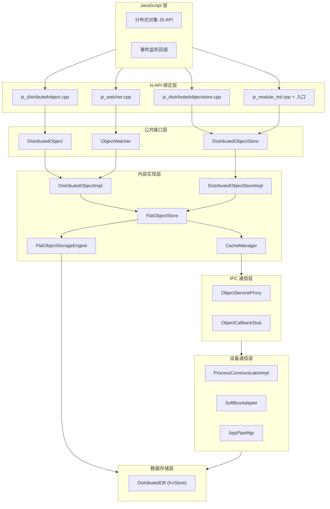
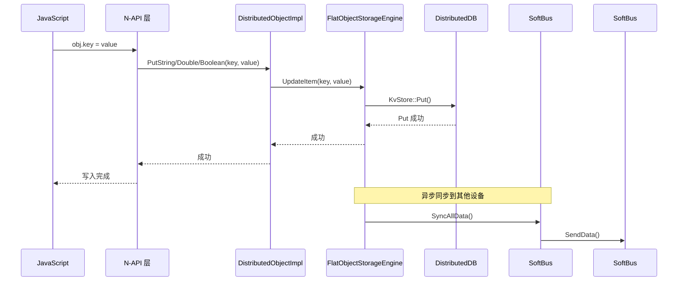
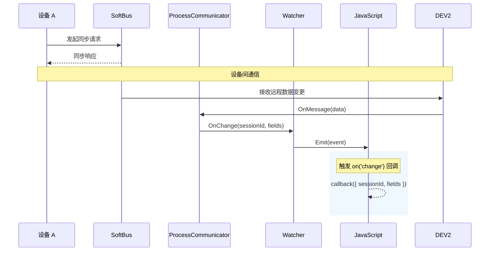
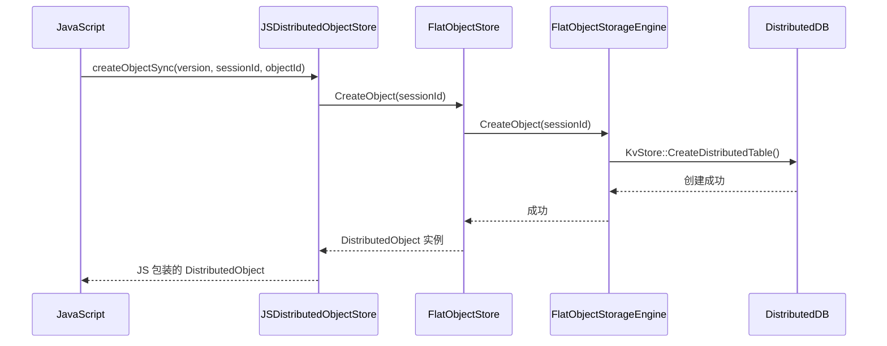
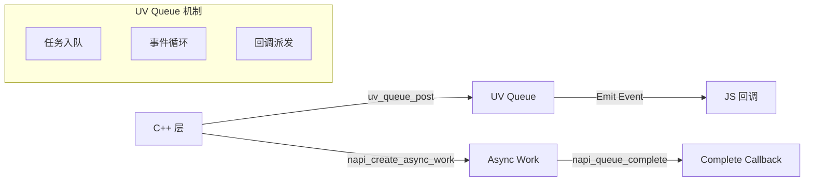
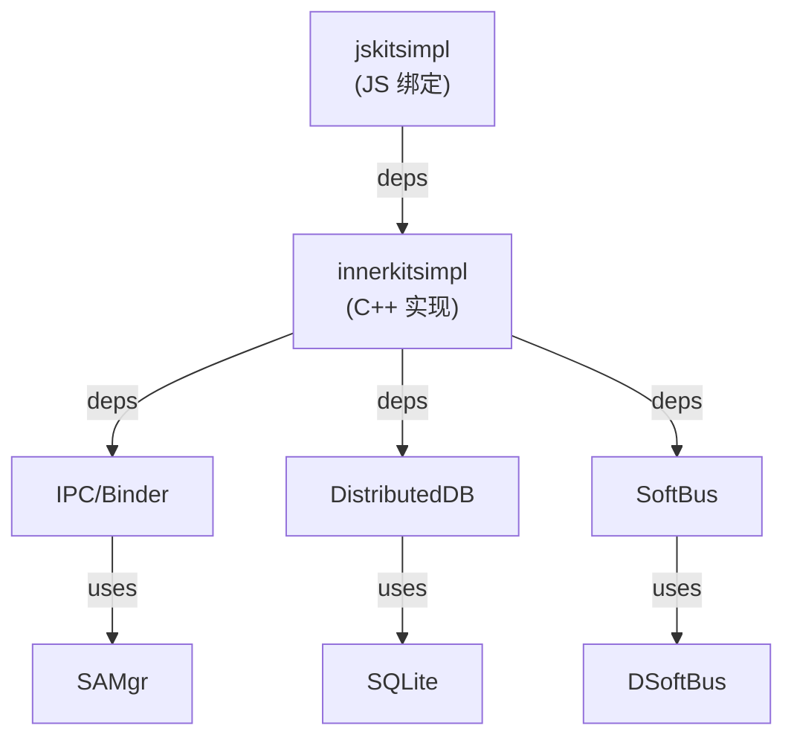
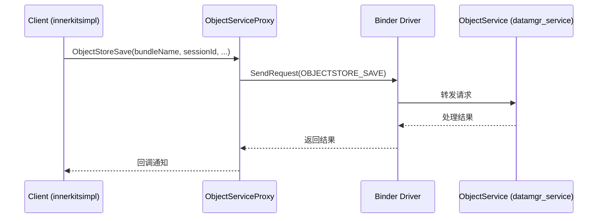

# 架构

> 分布式数据对象部件架构详解

## 整体架构

### 架构分层图



**证据**: Phase 1 全局扫描 + Phase 3 架构分析

### 模块职责

| 层级 | 模块 | 职责 |
|------|------|------|
| JS 层 | 分布式对象 JS API | 提供 JS 接口，创建和管理分布式对象 |
| N-API 层 | js_module_init | N-API 模块注册与导出 |
| N-API 层 | js_distributedobject | 分布式对象 N-API 绑定 |
| N-API 层 | js_distributedobjectstore | 对象存储 N-API 绑定 |
| N-API 层 | js_watcher | JS 事件监听器实现 |
| 公共接口 | DistributedObject | 分布式对象抽象接口 |
| 公共接口 | DistributedObjectStore | 对象存储工厂抽象接口 |
| 内部实现 | DistributedObjectImpl | 分布式对象具体实现 |
| 内部实现 | DistributedObjectStoreImpl | 对象存储具体实现 |
| 内部实现 | FlatObjectStore | 核心会话管理与缓存 |
| 内部实现 | FlatObjectStorageEngine | 基于 KvStore 的存储引擎 |
| IPC 层 | ObjectServiceProxy | IPC 远程服务调用代理 |
| 通信层 | ProcessCommunicatorImpl | 设备间通信实现 |
| 通信层 | SoftBusAdapter | 软总线适配器 |

---

## 数据流

### 1. 数据写入流程



**证据**:
- `js_distributedobject.cpp:66-95` (JSPut 实现)
- `distributed_object_impl.h` (Put 方法声明)
- `flat_object_storage_engine.h:54` (UpdateItem)

### 2. 远程数据同步流程



**证据**:
- `process_communicator_impl.h` (OnMessage)
- `js_watcher.cpp` (Emit 方法)
- `distributed_object.h:165` (ObjectWatcher::OnChanged)

### 3. 对象创建流程



**证据**:
- `js_distributedobjectstore.cpp:149-190` (JSCreateObjectSync)
- `flat_object_store.h:52` (CreateObject 声明)
- `flat_object_storage_engine.h:32` (CreateTable)

---

## 线程模型

### 线程划分

```mermaid
graph TB
    subgraph JSThread["JS 线程 (主线程)"]
        JSEvent["JS 事件循环"]
        NAPICB["N-API 回调"]
        JSCallback["JS 回调函数"]
    end

    subgraph WorkerThread["Worker 线程"]
        AsyncOp["异步操作"]
        UvQueue["UV Queue 消息队列"]
    end

    subgraph StorageThread["存储线程"]
        KvStore["DistributedDB 操作"]
        DiskIO["磁盘 I/O"]
    end

    subgraph IPCThread["IPC 线程"]
        Binder["Binder IPC 调用"]
        Callback["IPC 回调处理"]
    end

    subgraph CommThread["通信线程"]
        SoftBus["SoftBus 消息处理"]
        DeviceSync["设备同步"]
    end

    JSThread --> WorkerThread : 异步操作入队
    WorkerThread --> StorageThread : 存储请求
    StorageThread --> IPCThread : IPC 调用
    IPCThread --> CommThread : 通信请求
    CommThread --> JSThread : 回调通知
```

### 线程职责

| 线程 | 职责 | 关键组件 |
|------|------|----------|
| JS 线程 | JS 事件循环、JS 回调执行 | napi_env, JS 对象 |
| Worker 线程 | 异步操作执行、UV Queue | uv_queue, napi_queue |
| 存储线程 | KvStore 操作、磁盘 I/O | FlatObjectStorageEngine |
| IPC 线程 | Binder IPC 调用、回调 | ObjectServiceProxy |
| 通信线程 | SoftBus 消息收发 | SoftBusAdapter |

### 线程通信



**证据**:
- `js_watcher.cpp` (Emit 方法)
- `uv_queue.h` (UV Queue 定义)
- `napi_queue.cpp` (N-API 队列实现)

---

## 核心组件详解

### 1. FlatObjectStore

**职责**：核心会话管理者，管理对象生命周期和数据同步。

**关键方法**：

| 方法 | 功能 |
|------|------|
| `CreateObject(sessionId)` | 创建分布式对象 |
| `Delete(sessionId)` | 删除对象 |
| `PutString/Double/Boolean(key, value)` | 写入数据 |
| `GetString/Double/Boolean(key, value)` | 读取数据 |
| `Save(bundleName, sessionId, deviceId)` | 持久化保存 |
| `ResumeObject(bundleName, sessionId)` | 恢复对象 |

**证据**: `flat_object_store.h:36-47` (方法声明)

### 2. FlatObjectStorageEngine

**职责**：基于 DistributedDB KvStore 的存储引擎实现。

**关键方法**：

| 方法 | 功能 |
|------|------|
| `Open(bundleName)` | 打开/创建存储 |
| `CreateTable(sessionId)` | 创建分布式表 |
| `UpdateItem(key, value)` | 更新条目 |
| `GetItem(key, value)` | 获取条目 |
| `Delete(sessionId)` | 删除表 |
| `SyncAllData()` | 同步所有数据 |

**证据**: `flat_object_storage_engine.h:26-54` (方法声明)

### 3. CacheManager

**职责**：管理跨设备保存/恢复的缓存操作。

**关键方法**：

| 方法 | 功能 |
|------|------|
| `Save(bundleName, sessionId, deviceId)` | 保存对象到设备 |
| `ResumeObject(bundleName, sessionId)` | 从设备恢复对象 |
| `SubscribeDataChange(bundleName, sessionId)` | 订阅数据变更 |
| `RegisterProgressObserver(bundleName, sessionId)` | 注册进度观察者 |

**证据**: `flat_object_store.h:416-613` (CacheManager 方法实现)

### 4. ProcessCommunicatorImpl

**职责**：实现分布式数据库的进程间通信接口。

**实现接口**：
- `IProcessCommunicator` (DistributedDB)

**关键方法**：

| 方法 | 功能 |
|------|------|
| `SendData(const uint8_t *data, uint32_t len)` | 发送数据 |
| `OnMessage(const uint8_t *data, uint32_t len)` | 接收数据 |
| `WatchDeviceChange(AppDeviceStatusChangeListener)` | 监听设备变更 |
| `UnWatchDeviceChange()` | 取消设备监听 |

**证据**: `process_communicator_impl.h` (类定义)

---

## 依赖关系

### 模块依赖图



### 外部依赖

| 依赖组件 | 用途 |
|----------|------|
| `ability_runtime` | 应用上下文、Ability 支持 |
| `dsoftbus` | 设备间软总线通信 |
| `kv_store` | 分布式数据存储 |
| `ipc` | 进程间通信 |
| `samgr` | 系统能力管理 |
| `access_token` | 权限管理 |
| `device_manager` | 设备管理 |
| `hilog` | 日志输出 |

**证据**: `bundle.json:45-66` (完整依赖列表)

---

## IPC 接口

### ObjectService IPC 代码

| 代码 | 操作 | 描述 |
|------|------|------|
| 0 | OBJECTSTORE_SAVE | 保存对象到远程设备 |
| 1 | OBJECTSTORE_REVOKE_SAVE | 撤回保存 |
| 2 | OBJECTSTORE_RETRIEVE | 检索对象 |
| 3 | OBJECTSTORE_REGISTER_OBSERVER | 注册数据变更观察者 |
| 4 | OBJECTSTORE_UNREGISTER_OBSERVER | 取消注册 |
| 5 | OBJECTSTORE_ON_ASSET_CHANGED | 资产变更通知 |
| 6 | OBJECTSTORE_BIND_ASSET_STORE | 绑定资产存储 |
| 7 | OBJECTSTORE_DELETE_SNAPSHOT | 删除快照 |
| 9 | OBJECTSTORE_REGISTER_PROGRESS | 注册进度观察者 |
| 10 | OBJECTSTORE_UNREGISTER_PROGRESS | 取消注册进度 |

**证据**: `distributeddata_object_store_ipc_interface_code.h` (IPC 代码定义)

### IPC 调用流程



---

## 架构特点

### 1. 分层设计

- **接口层** (`interfaces/`)：定义公共 API，保持稳定
- **实现层** (`frameworks/`)：内部实现，可变更
- **绑定层** (`jskitsimpl/`)：语言绑定，隔离变化

### 2. 观察者模式

```
┌─────────────────────────────────────────┐
│           观察者模式应用                 │
├─────────────────────────────────────────┤
│  Subject (FlatObjectStorageEngine)      │
│    ├── TableWatcher (数据变更观察)       │
│    ├── WatcherProxy (代理)              │
│    └── ObjectWatcher (回调接口)          │
│                                         │
│  流程: 数据变更 → Watcher → Proxy →      │
│        ObjectWatcher → JS 回调           │
└─────────────────────────────────────────┘
```

### 3. 代理模式

| 代理类 | 被代理 | 用途 |
|--------|--------|------|
| WatcherProxy | FlatObjectWatcher | 转发数据变更到 ObjectWatcher |
| StatusNotifierProxy | StatusWatcher | 转发设备状态到 StatusNotifier |
| ProgressNotifierProxy | ProgressWatcher | 转发进度到 ProgressNotifier |
| ObjectServiceProxy | IObjectService | IPC 远程调用代理 |

### 4. 单例模式

| 类 | 获取方式 | 作用域 |
|----|----------|--------|
| DistributedObjectStore | `GetInstance(bundleName)` | 每个 bundleName 一个实例 |
| ClientAdaptor | `GetInstance()` | 全局单例 |

---

## 扩展点

### 可扩展接口

| 接口 | 扩展方式 | 用途 |
|------|----------|------|
| ObjectWatcher | 实现接口 | 自定义数据变更处理 |
| StatusNotifier | 实现接口 | 自定义设备状态处理 |
| ProgressNotifier | 实现接口 | 自定义进度处理 |
| CommunicationProvider | 实现接口 | 自定义通信方式 |
| ObjectStorageEngine | 实现接口 | 自定义存储引擎 |

### 稳定性标注

| 层级 | 稳定性 | 说明 |
|------|--------|------|
| interfaces/innerkits/ | **稳定** | 公共 API，保持向后兼容 |
| frameworks/innerkitsimpl/include/ | **稳定** | 内部接口文档化 |
| frameworks/innerkitsimpl/src/ | **不稳定** | 实现细节，可能变更 |
| 命名带 `_` 或 `Internal` | **不稳定** | 内部使用 |

---

## 相关章节

- [N-API 接口详解](./02_N-API.md) → JS API 详细规格
- [内部 API 参考](./03_Inner_API.md) → C++ 模块接口
- [安全评审](./05_Security.md) → 架构相关安全考量
