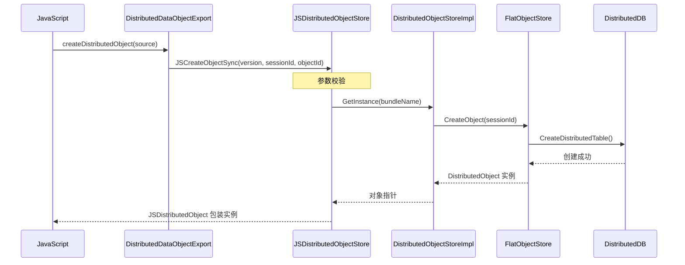
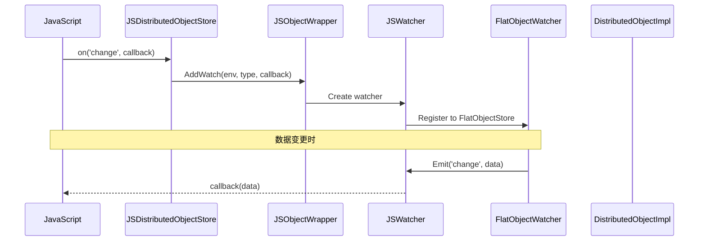
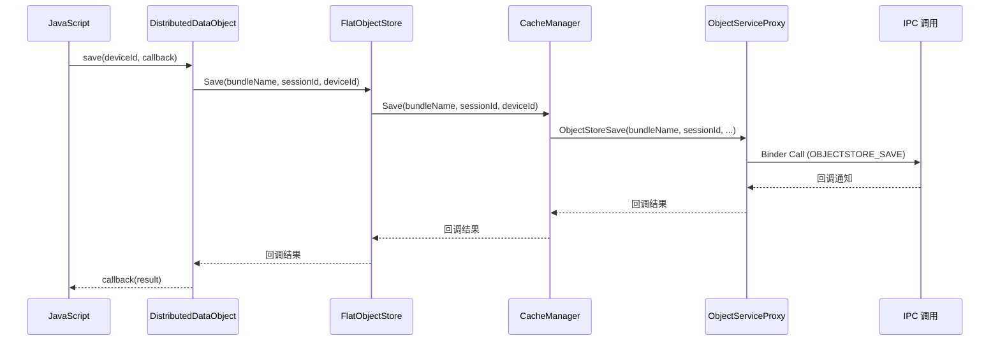

# N-API 接口

> 分布式数据对象 JS API 完整参考

## 模块注册信息

### N-API 模块定义

| 属性 | 值 |
|------|-----|
| 模块名 | `data.distributedDataObject` |
| 注册文件 | `frameworks/jskitsimpl/src/adaptor/js_module_init.cpp` |
| N-API 版本 | 1 |

**证据**: `js_module_init.cpp:47-55` (模块定义)

```cpp
static napi_module storageModule = {
    .nm_version = 1,
    .nm_flags = 0,
    .nm_filename = nullptr,
    .nm_register_func = DistributedDataObjectExport,
    .nm_modname = "data.distributedDataObject",
    .nm_priv = ((void *)0),
    .reserved = { 0 },
};
```

---

## 导出 API 清单

### 模块级 API

| JS API | C++ 实现 | 文件:行号 | 同步/异步 | 描述 |
|--------|----------|-----------|-----------|------|
| `createObjectSync` | `JSDistributedObjectStore::JSCreateObjectSync` | `js_distributedobjectstore.cpp:149` | 同步 | 创建分布式对象 |
| `destroyObjectSync` | `JSDistributedObjectStore::JSDestroyObjectSync` | `js_distributedobjectstore.cpp:193` | 同步 | 销毁分布式对象 |
| `on` | `JSDistributedObjectStore::JSOn` | `js_distributedobjectstore.cpp:230` | 同步 | 注册变更监听 |
| `off` | `JSDistributedObjectStore::JSOff` | `js_distributedobjectstore.cpp:274` | 同步 | 取消监听 |
| `recordCallback` | `JSDistributedObjectStore::JSRecordCallback` | `js_distributedobjectstore.cpp:398` | 同步 | 记录回调 |
| `deleteCallback` | `JSDistributedObjectStore::JSDeleteCallback` | `js_distributedobjectstore.cpp:447` | 同步 | 删除回调 |
| `sequenceNum` | `JSDistributedObjectStore::JSEquenceNum` | `js_distributedobjectstore.cpp:502` | 同步 | 生成会话 ID |

**证据**: `js_module_init.cpp:32-38` (导出函数声明)

---

## 默认导出 API

### distributedDataObject 对象

```javascript
export default {
  createDistributedObject: newDistributed,    // SDK v8
  create: newDistributedV9,                    // SDK v9 (带 Context)
  genSessionId: randomNum                      // 生成 sessionId
}
```

**证据**: `distributed_data_object.js:573-577` (导出定义)

---

## Distributed/DistributedV9 类 API

### SDK v8: Distributed 类

| 方法 | 参数 | 返回值 | 描述 |
|------|------|--------|------|
| `setSessionId(sessionId)` | `sessionId: string` | `boolean` | 设置会话 ID |
| `on(type, callback)` | `type: 'change'\|'status'`, `callback: Function` | `void` | 注册监听 |
| `off(type, callback?)` | `type: 'change'\|'status'`, `callback?: Function` | `void` | 取消监听 |
| `save(deviceId, callback)` | `deviceId: string`, `callback: AsyncCallback` | `void` | 持久化保存 |
| `revokeSave(callback)` | `callback: AsyncCallback` | `void` | 撤回保存 |

### SDK v9: DistributedV9 类

| 方法 | 参数 | 返回值 | 描述 |
|------|------|--------|------|
| `setSessionId(sessionId, callback?)` | `sessionId: string`, `callback?: AsyncCallback` | `Promise<boolean>\|boolean` | 设置会话 ID |
| `on(type, callback)` | `type: 'change'\|'status'`, `callback: Function` | `void` | 注册监听 |
| `off(type, callback?)` | `type: 'change'\|'status'`, `callback?: Function` | `void` | 取消监听 |
| `save(deviceId, callback)` | `deviceId: string`, `callback: AsyncCallback` | `void` | 持久化保存 |
| `revokeSave(callback)` | `callback: AsyncCallback` | `void` | 撤回保存 |
| `bindAssetStore(assetKey, bindInfo, callback)` | `assetKey: string`, `bindInfo: AssetBindInfo`, `callback: AsyncCallback` | `void` | 绑定资产存储 |
| `setAsset(assetKey, uri)` | `assetKey: string`, `uri: string` | `Promise<void>` | 设置单个资产 |
| `setAssets(assetsKey, uris)` | `assetsKey: string`, `uris: string[]` | `Promise<void>` | 设置多个资产 |

**证据**: `distributed_data_object.js:38-94, 415-571` (类定义)

---

## API 详细规格

### createDistributedObject / create

#### 函数签名

```javascript
// SDK v8
function createDistributedObject(source: object): DistributedObject

// SDK v9
function create(source: object, context?: Context): DistributedObject
```

#### 参数

| 参数 | 类型 | 必填 | 描述 |
|------|------|------|------|
| `source` | `object` | 是 | 分布式对象的初始属性 |
| `context` | `Context` | 否 | 应用上下文 (SDK v9) |

#### 返回值

| 类型 | 描述 |
|------|------|
| `DistributedObject` | 新创建的分布式对象实例 |

#### 调用链



#### C++ 实现

| 文件 | 函数 | 行号 |
|------|------|------|
| `js_distributedobjectstore.cpp` | `JSCreateObjectSync` | 149-190 |

**关键逻辑**:
```cpp
napi_value JSDistributedObjectStore::JSCreateObjectSync(napi_env env, napi_callback_info info)
{
    // 1. 解析参数
    double version;
    std::string sessionId;
    std::string objectId;
    napi_status status = napi_get_cb_info(env, info, &argc, argv, &thisVar, &data);
    
    // 2. 获取 bundleName
    std::string bundleName = JSDistributedObjectStore::GetBundleName(env);
    
    // 3. 权限检查
    NAPI_ASSERT_ERRCODE_V9(env, result != ERR_NO_PERMISSION, version, 
        std::make_shared<PermissionError>());
    
    // 4. 创建对象
    DistributedObject *object = objectInfo->CreateObject(sessionId, result);
    
    // 5. 返回 JS 包装对象
    return NewDistributedObject(env, objectInfo, object, objectId);
}
```

### setSessionId

#### 函数签名

```javascript
// SDK v8
function setSessionId(sessionId: string): boolean

// SDK v9
function setSessionId(sessionId: string, callback?: AsyncCallback<DistributedObject>): Promise<DistributedObject> | boolean
```

#### 参数

| 参数 | 类型 | 必填 | 描述 |
|------|------|------|------|
| `sessionId` | `string` | 是 | 会话 ID |
| `callback` | `AsyncCallback` | 否 | 回调函数 (SDK v9) |

#### 返回值

| 类型 | 描述 |
|------|------|
| `boolean` (SDK v8) | 设置是否成功 |
| `Promise<DistributedObject>` (SDK v9 async) | 异步结果 |
| `boolean` (SDK v9 sync) | 设置结果 |

#### 约束

| 约束 | 说明 |
|------|------|
| 格式 | 字母、数字、下划线组合 |
| 长度 | 不超过 128 字符 |
| 正则 | `/^\w+$/` |

**证据**: `distributed_data_object.js:441-445` (sessionId 校验)

```javascript
if (sessionId.length > SESSION_ID_MAX_LENGTH || !SESSION_ID_REGEX.test(sessionId)) {
    throw {
        code: 401,
        message: 'The sessionId allows only letters, digits, and underscores(_), and cannot exceed 128 in length.'
    };
}
```

### on / off (变更监听)

#### 函数签名

```javascript
// 注册监听
function on(type: 'change', callback: Callback<ChangeData>): void
function on(type: 'status', callback: Callback<ObjectStatus>): void

// 取消监听
function off(type: 'change', callback?: Callback<ChangeData>): void
function off(type: 'status', callback?: Callback<ObjectStatus>): void
```

#### 回调参数

**ChangeData**:
```typescript
interface ChangeData {
    sessionId: string      // 会话 ID
    fields: string[]      // 变更的字段名列表
}
```

**ObjectStatus**:
```typescript
interface ObjectStatus {
    sessionId: string     // 会话 ID
    networkId: string     // 设备网络 ID
    status: 'online' | 'offline'  // 设备状态
}
```

#### 调用链



### save / revokeSave

#### 函数签名

```javascript
function save(deviceId: string, callback: AsyncCallback<SaveSuccessResponse>): void
function revokeSave(callback: AsyncCallback<RevokeSaveSuccessResponse>): void
```

#### SaveSuccessResponse

| 字段 | 类型 | 描述 |
|------|------|------|
| `sessionId` | `string` | 会话 ID |
| `version` | `number` | 数据版本 |
| `deviceId` | `string` | 设备 ID |

#### revokeSaveSuccessResponse

| 字段 | 类型 | 描述 |
|------|------|------|
| `sessionId` | `string` | 会话 ID |

#### 调用链



### bindAssetStore

#### 函数签名

```javascript
function bindAssetStore(
    assetKey: string,
    bindInfo: AssetBindInfo,
    callback: AsyncCallback<void>
): void
```

#### AssetBindInfo

| 字段 | 类型 | 描述 |
|------|------|------|
| `storeName` | `string` | 存储名称 |
| `tableName` | `string` | 表名 |
| `primaryKey` | `string` | 主键 |
| `field` | `string` | 字段名 |

**证据**: `object_types.h` (AssetBindInfo 定义)

---

## 错误码

### 错误码表

| 错误码 | 名称 | 描述 | 处理建议 |
|--------|------|------|----------|
| 0 | SUCCESS | 操作成功 | - |
| 401 | Parameter Error | 参数错误 | 检查参数类型和格式 |
| 15400002 | Invalid Asset | 资产无效 | 检查 URI 是否有效 |
| 15400003 | Session Already Set | 会话已设置 | 先退出当前会话 |
| 1651 | ERR_DB_SET_PROCESS | 数据库设置失败 | 检查存储状态 |
| 1652 | ERR_EXIST | 对象已存在 | 使用现有对象 |
| 1653 | ERR_DATA_LEN | 数据长度超限 | 减少数据量 |
| 1654 | ERR_NOMEM | 内存不足 | 减少对象数量 |
| 1655 | ERR_DB_NOT_INIT | 数据库未初始化 | 重新创建对象 |
| 1656 | ERR_DB_GETKV_FAIL | KvStore 错误 | 检查分布式数据库状态 |
| 1673 | ERR_NO_PERMISSION | 无 DATA_SYNC 权限 | 申请权限 |

**证据**: `objectstore_errors.h:18-144` (错误码定义)

### 权限错误处理

```javascript
// 权限检查
try {
    const obj = distributedObject.createDistributedObject({ name: 'test' })
} catch (e) {
    if (e.code === 1673) {
        console.error('需要申请 ohos.permission.DISTRIBUTED_DATASYNC 权限')
    }
}
```

**错误消息**: `object_error.cpp:47-48` (权限错误描述)

```
"Permission verification failed. An attempt was made to join session forbidden by permission: 
ohos.permission.DISTRIBUTED_DATASYNC."
```

---

## 参数校验规则

### sessionId 校验

| 规则 | 描述 | 错误码 |
|------|------|--------|
| 非空 | 不能为 null 或空字符串 | 401 |
| 格式 | 只能是字母、数字、下划线 | 401 |
| 长度 | 不超过 128 字符 | 401 |

**证据**: `distributed_data_object.js:441-445`

### deviceId 校验

| 规则 | 描述 |
|------|------|
| 非空 | 不能为 null 或空字符串 |
| 用户自定义 | 用户可指定任意设备 ID，如 "local" |

### Asset 校验

| 规则 | 描述 | 错误码 |
|------|------|--------|
| URI 非空 | 不能为 null | 15400002 |
| 文件存在 | URI 对应的文件必须存在 | 15400002 |
| 数量限制 | 最多 50 个资产 | 15400002 |

**证据**: `distributed_data_object.js:382-412` (getDefaultAsset)

---

## 使用示例

### 基础使用

```javascript
import distributedObject from '@ohos.data.distributedDataObject'

// 1. 创建分布式对象
const obj = distributedObject.createDistributedObject({
    name: '张三',
    age: 25,
    enabled: true
})

// 2. 生成并设置会话 ID
const sessionId = distributedObject.genSessionId()
obj.setSessionId(sessionId)

// 3. 监听数据变更
obj.on('change', (data) => {
    console.log(`字段 ${data.fields} 已变更`)
})

// 4. 监听设备状态
obj.on('status', (data) => {
    console.log(`设备 ${data.networkId} ${data.status === 'online' ? '上线' : '下线'}`)
})

// 5. 修改数据（自动同步）
obj.name = '李四'
obj.age = 30
```

### 带 Context 的使用 (SDK v9)

```javascript
import distributedObject from '@ohos.data.distributedDataObject'
import Context from '@ohos.app.ability.context'

// 获取 Context
const context = getContext(this)

// 创建对象（带 Context）
const obj = distributedObject.create({
    title: '会议笔记',
    content: '今天下午3点开会'
}, context)

// 设置会话
obj.setSessionId('my-session', (err, result) => {
    if (err) {
        console.error('设置失败:', err)
        return
    }
    console.log('设置成功')
})
```

### 资产绑定

```javascript
import distributedObject from '@ohos.data.distributedDataObject'

const obj = distributedObject.create({
    avatar: null
})

// 设置单个资产
obj.setAsset('avatar', 'file:///data/avatar.jpg')
    .then(() => {
        console.log('资产设置成功')
    })
    .catch((err) => {
        console.error('资产设置失败:', err)
    })

// 绑定资产存储
const bindInfo = {
    storeName: 'AvatarStore',
    tableName: 'avatars',
    primaryKey: 'user001',
    field: 'data'
}

obj.bindAssetStore('avatar', bindInfo, (err) => {
    if (err) {
        console.error('绑定失败:', err)
    } else {
        console.log('绑定成功')
    }
})
```

### 保存与恢复

```javascript
import distributedObject from '@ohos.data.distributedDataObject'

const obj = distributedObject.create({
    data: { key: 'value' }
})

// 设置会话
obj.setSessionId('my-session')

// 保存到设备
obj.save('local', (err, result) => {
    if (err) {
        console.error('保存失败:', err)
        return
    }
    console.log('保存成功:', result)
})

// 撤回保存
obj.revokeSave((err) => {
    if (err) {
        console.error('撤回失败:', err)
    } else {
        console.log('撤回成功')
    }
})
```

---

## 相关章节

- [概览](./00_Overview.md) → JS API 快速开始
- [架构](./01_Architecture.md) → N-API 层与数据流
- [内部 API](./03_Inner_API.md) → C++ 接口实现
- [安全评审](./05_Security.md) → API 安全考量
