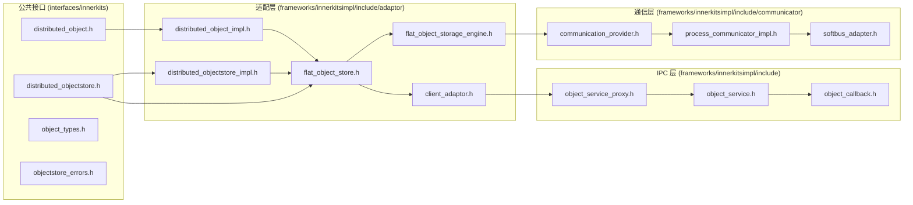
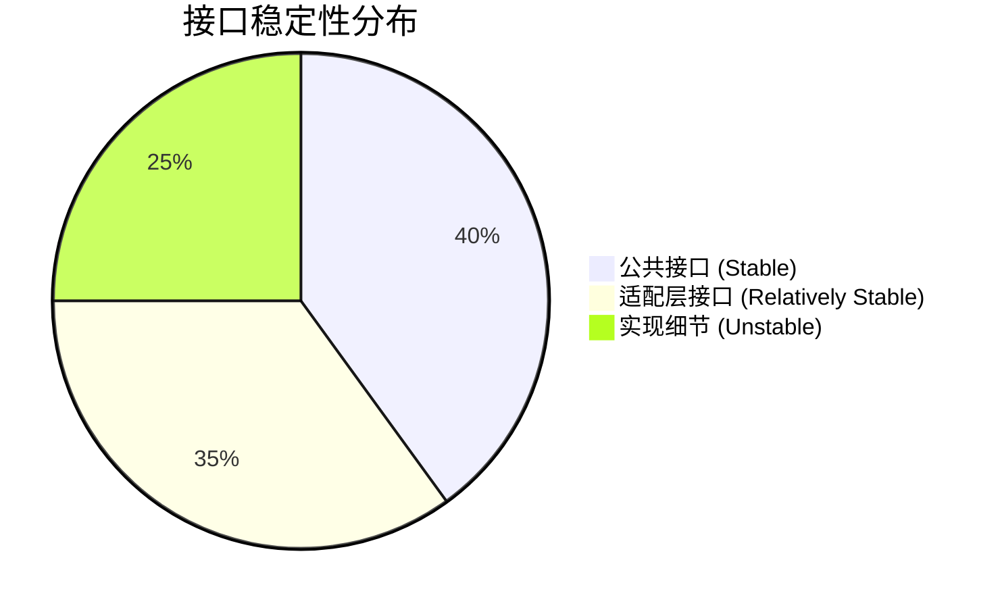

# 内部 API

> 分布式数据对象 C++ 模块接口参考

## 接口概览

### 公共接口层 (Stable)

| 头文件 | 稳定性 | 描述 |
|--------|--------|------|
| `interfaces/innerkits/distributed_object.h` | **稳定** | 分布式对象抽象接口 |
| `interfaces/innerkits/distributed_objectstore.h` | **稳定** | 对象存储工厂抽象接口 |
| `interfaces/innerkits/object_types.h` | **稳定** | 类型定义 (Asset, AssetBindInfo) |
| `interfaces/innerkits/objectstore_errors.h` | **稳定** | 错误码定义 |

### 内部实现层

| 头文件 | 稳定性 | 描述 |
|--------|--------|------|
| `frameworks/innerkitsimpl/include/adaptor/*.h` | **稳定** | 适配层接口文档化 |
| `frameworks/innerkitsimpl/src/*.cpp` | **不稳定** | 具体实现细节 |

---

## 核心接口详解

### DistributedObject

**头文件**: `interfaces/innerkits/distributed_object.h`

**职责**: 分布式对象的抽象接口，定义基本的数据操作方法。

```cpp
namespace OHOS::ObjectStore {
class DistributedObject {
public:
    virtual ~DistributedObject(){};

    // === 数据写入 ===

    /**
     * @brief 写入 double 类型数据
     * @param key 属性键
     * @param value 属性值
     * @return 0 成功，其他失败
     */
    virtual uint32_t PutDouble(const std::string &key, double value) = 0;

    /**
     * @brief 写入 boolean 类型数据
     * @param key 属性键
     * @param value 属性值
     * @return 0 成功，其他失败
     */
    virtual uint32_t PutBoolean(const std::string &key, bool value) = 0;

    /**
     * @brief 写入 string 类型数据
     * @param key 属性键
     * @param value 属性值
     * @return 0 成功，其他失败
     */
    virtual uint32_t PutString(const std::string &key, const std::string &value) = 0;

    /**
     * @brief 写入复杂类型 (bytes) 数据
     * @param key 属性键
     * @param value 属性值
     * @return 0 成功，其他失败
     */
    virtual uint32_t PutComplex(const std::string &key, const std::vector<uint8_t> &value) = 0;

    // === 数据读取 ===

    /**
     * @brief 读取 double 类型数据
     * @param key 属性键
     * @param value 输出值
     * @return 0 成功，其他失败
     */
    virtual uint32_t GetDouble(const std::string &key, double &value) = 0;

    /**
     * @brief 读取 boolean 类型数据
     * @param key 属性键
     * @param value 输出值
     * @return 0 成功，其他失败
     */
    virtual uint32_t GetBoolean(const std::string &key, bool &value) = 0;

    /**
     * @brief 读取 string 类型数据
     * @param key 属性键
     * @param value 输出值
     * @return 0 成功，其他失败
     */
    virtual uint32_t GetString(const std::string &key, std::string &value) = 0;

    /**
     * @brief 读取复杂类型数据
     * @param key 属性键
     * @param value 输出值
     * @return 0 成功，其他失败
     */
    virtual uint32_t GetComplex(const std::string &key, std::vector<uint8_t> &value) = 0;

    // === 类型操作 ===

    /**
     * @brief 获取属性类型
     * @param key 属性键
     * @param type 输出类型
     * @return 0 成功，其他失败
     */
    virtual uint32_t GetType(const std::string &key, Type &type) = 0;

    // === 持久化 ===

    /**
     * @brief 保存到设备
     * @param deviceId 设备 ID
     * @return 0 成功，其他失败
     */
    virtual uint32_t Save(const std::string &deviceId) = 0;

    /**
     * @brief 撤回保存
     * @return 0 成功，其他失败
     */
    virtual uint32_t RevokeSave() = 0;

    // === 会话管理 ===

    /**
     * @brief 获取会话 ID
     * @return 会话 ID 引用
     */
    virtual std::string &GetSessionId() = 0;

    // === 资产绑定 ===

    /**
     * @brief 绑定资产存储
     * @param assetKey 资产键
     * @param bindInfo 绑定信息
     * @return 0 成功，其他失败
     */
    virtual uint32_t BindAssetStore(const std::string &assetKey, AssetBindInfo &bindInfo) = 0;
};
```

**证据**: `distributed_object.h:27-161` (完整接口定义)

---

### ObjectWatcher

**头文件**: `interfaces/innerkits/distributed_object.h`

**职责**: 数据变更观察者接口。

```cpp
class ObjectWatcher {
public:
    /**
     * @brief 数据变更回调
     * @param sessionid 会话 ID
     * @param changedData 变更的属性列表
     */
    virtual void OnChanged(const std::string &sessionid, 
                          const std::vector<std::string> &changedData) = 0;
};
```

**证据**: `distributed_object.h:163-166` (ObjectWatcher 定义)

---

### DistributedObjectStore

**头文件**: `interfaces/innerkits/distributed_objectstore.h`

**职责**: 分布式对象存储工厂，管理对象的创建、获取和销毁。

```cpp
class DistributedObjectStore {
public:
    virtual ~DistributedObjectStore(){};

    /**
     * @brief 获取单例实例
     * @param bundleName 应用 bundleName
     * @return 对象存储实例指针
     */
    static DistributedObjectStore *GetInstance(const std::string &bundleName = "");

    // === 对象操作 ===

    /**
     * @brief 创建分布式对象
     * @param sessionId 会话 ID
     * @return 对象指针，失败返回 nullptr
     */
    virtual DistributedObject *CreateObject(const std::string &sessionId) = 0;

    /**
     * @brief 创建分布式对象（带状态返回）
     * @param sessionId 会话 ID
     * @param status 输出状态码
     * @return 对象指针，失败返回 nullptr
     */
    virtual DistributedObject *CreateObject(const std::string &sessionId, uint32_t &status) = 0;

    /**
     * @brief 获取已存在的对象
     * @param sessionId 会话 ID
     * @param object 输出对象指针
     * @return 0 成功，其他失败
     */
    virtual uint32_t Get(const std::string &sessionId, DistributedObject **object) = 0;

    /**
     * @brief 删除对象
     * @param sessionId 会话 ID
     * @return 0 成功，其他失败
     */
    virtual uint32_t DeleteObject(const std::string &sessionId) = 0;

    // === 观察者操作 ===

    /**
     * @brief 注册数据变更观察者
     * @param object 分布式对象
     * @param objectWatcher 观察者
     * @return 0 成功，其他失败
     */
    virtual uint32_t Watch(DistributedObject *object, 
                           std::shared_ptr<ObjectWatcher> objectWatcher) = 0;

    /**
     * @brief 取消数据变更观察者
     * @param object 分布式对象
     * @return 0 成功，其他失败
     */
    virtual uint32_t UnWatch(DistributedObject *object) = 0;

    // === 状态通知 ===

    /**
     * @brief 注册设备状态观察者
     * @param notifier 状态通知者
     * @return 0 成功，其他失败
     */
    virtual uint32_t SetStatusNotifier(std::shared_ptr<StatusNotifier> notifier) = 0;

    /**
     * @brief 通知缓存状态
     * @param sessionId 会话 ID
     */
    virtual void NotifyCachedStatus(const std::string &sessionId) = 0;

    // === 进度通知 ===

    /**
     * @brief 注册进度观察者
     * @param notifier 进度通知者
     * @return 0 成功，其他失败
     */
    virtual uint32_t SetProgressNotifier(std::shared_ptr<ProgressNotifier> notifier) = 0;

    /**
     * @brief 通知进度状态
     * @param sessionId 会话 ID
     */
    virtual void NotifyProgressStatus(const std::string &sessionId) = 0;
};
```

**证据**: `distributed_objectstore.h:32-136` (完整接口定义)

---

### StatusNotifier

**头文件**: `interfaces/innerkits/distributed_objectstore.h`

**职责**: 设备上下线状态通知者。

```cpp
class StatusNotifier {
public:
    /**
     * @brief 状态变更回调
     * @param sessionId 会话 ID
     * @param networkId 设备网络 ID
     * @param onlineStatus 'online' 或 'offline'
     */
    virtual void OnChanged(const std::string &sessionId, 
                          const std::string &networkId, 
                          const std::string &onlineStatus) = 0;
};
```

---

### ProgressNotifier

**头文件**: `interfaces/innerkits/distributed_objectstore.h`

**职责**: 同步进度通知者。

```cpp
class ProgressNotifier {
public:
    /**
     * @brief 进度变更回调
     * @param sessionId 会话 ID
     * @param progress 进度值 (0-100)
     */
    virtual void OnChanged(const std::string &sessionId, int32_t progress) = 0;
};
```

---

## 类型定义

### object_types.h

```cpp
// 数据类型枚举
enum Type : uint8_t {
    TYPE_STRING = 0,
    TYPE_BOOLEAN,
    TYPE_DOUBLE,
    TYPE_COMPLEX,
};

// 资产绑定信息
struct AssetBindInfo {
    std::string storeName;    // 存储名称
    std::string tableName;     // 表名
    std::string primaryKey;    // 主键
    std::string field;         // 字段名
};
```

**证据**: `object_types.h` (类型定义)

---

## 错误码定义

### objectstore_errors.h

```cpp
namespace OHOS::ObjectStore {
constexpr uint32_t BASE_ERR_OFFSET = 1650;

constexpr uint32_t SUCCESS = 0;                           // 成功
constexpr uint32_t ERR_DB_SET_PROCESS = BASE_ERR_OFFSET + 1;      // 数据库设置失败
constexpr uint32_t ERR_EXIST = BASE_ERR_OFFSET + 2;                // 已存在
constexpr uint32_t ERR_DATA_LEN = BASE_ERR_OFFSET + 3;            // 非法数据长度
constexpr uint32_t ERR_NOMEM = BASE_ERR_OFFSET + 4;                // 内存分配失败
constexpr uint32_t ERR_DB_NOT_INIT = BASE_ERR_OFFSET + 5;          // 数据库未初始化
constexpr uint32_t ERR_DB_GETKV_FAIL = BASE_ERR_OFFSET + 6;        // Kvstore 错误
constexpr uint32_t ERR_DB_NOT_EXIST = BASE_ERR_OFFSET + 7;         // 数据库不存在
constexpr uint32_t ERR_DB_GET_FAIL = BASE_ERR_OFFSET + 8;          // 获取数据库数据失败
constexpr uint32_t ERR_DB_ENTRY_FAIL = BASE_ERR_OFFSET + 9;       // 获取数据库条目失败
constexpr uint32_t ERR_CLOSE_STORAGE = BASE_ERR_OFFSET + 10;       // 关闭数据库失败
constexpr uint32_t ERR_NULL_OBJECT = BASE_ERR_OFFSET + 11;          // 对象为空
constexpr uint32_t ERR_REGISTER = BASE_ERR_OFFSET + 12;            // 注册失败
constexpr uint32_t ERR_NULL_OBJECTSTORE = BASE_ERR_OFFSET + 13;    // 对象存储为空
constexpr uint32_t ERR_GET_OBJECT = BASE_ERR_OFFSET + 14;          // 获取对象失败
constexpr uint32_t ERR_NO_OBSERVER = BASE_ERR_OFFSET + 15;         // 未注册
constexpr uint32_t ERR_UNREGISTER = BASE_ERR_OFFSET + 16;          // 取消注册失败
constexpr uint32_t ERR_SINGLE_DEVICE = BASE_ERR_OFFSET + 17;        // 仅一台设备
constexpr uint32_t ERR_NULL_PTR = BASE_ERR_OFFSET + 18;             // 指针为空
constexpr uint32_t ERR_PROCESSING = BASE_ERR_OFFSET + 19;           // 处理失败
constexpr uint32_t ERR_RESULTSET = BASE_ERR_OFFSET + 20;           // ResultSet 处理失败
constexpr uint32_t ERR_INVALID_ARGS = BASE_ERR_OFFSET + 21;        // 输入参数错误
constexpr uint32_t ERR_IPC = BASE_ERR_OFFSET + 22;                 // IPC 错误
constexpr uint32_t ERR_NO_PERMISSION = BASE_ERR_OFFSET + 23;        // 无 DATA_SYNC 权限
} // namespace OHOS::ObjectStore
```

**证据**: `objectstore_errors.h:19-141` (完整错误码定义)

---

## IPC 接口

### ObjectService 接口代码

| 代码 | 常量 | 描述 |
|------|------|------|
| 0 | OBJECTSTORE_SAVE | 保存对象到远程设备 |
| 1 | OBJECTSTORE_REVOKE_SAVE | 撤回保存 |
| 2 | OBJECTSTORE_RETRIEVE | 检索对象 |
| 3 | OBJECTSTORE_REGISTER_OBSERVER | 注册观察者 |
| 4 | OBJECTSTORE_UNREGISTER_OBSERVER | 取消注册 |
| 5 | OBJECTSTORE_ON_ASSET_CHANGED | 资产变更 |
| 6 | OBJECTSTORE_BIND_ASSET_STORE | 绑定资产存储 |
| 7 | OBJECTSTORE_DELETE_SNAPSHOT | 删除快照 |
| 8 | OBJECTSTORE_IS_CONTINUE | 检查继续 |
| 9 | OBJECTSTORE_REGISTER_PROGRESS | 注册进度 |
| 10 | OBJECTSTORE_UNREGISTER_PROGRESS | 取消进度 |

**证据**: `distributeddata_object_store_ipc_interface_code.h` (IPC 代码定义)

---

## 模块依赖关系

### 依赖方向图



### 关键依赖

| 模块 | 依赖 | 用途 |
|------|------|------|
| Adaptor | distributeddb (kv_store) | 本地存储与同步 |
| Adaptor | dsoftbus | 设备通信 |
| Adaptor | ipc | 进程通信 |
| Adaptor | access_token | 权限校验 |
| Adaptor | samgr | 系统能力管理 |

---

## 稳定性标注

### 稳定性级别

| 级别 | 符号 | 说明 |
|------|------|------|
| **稳定** | - | 公共 API，保持向后兼容 |
| **较稳定** | _ | 内部接口，可能变更 |
| **不稳定** | __ | 实现细节，随时变更 |

### 稳定性分布



---

## 相关章节

- [架构](./01_Architecture.md) → 模块交互与数据流
- [N-API 接口](./02_N-API.md) → JS 到 C++ 的映射
- [构建配置](./04_Build.md) → 模块构建配置
- [安全评审](./05_Security.md) → API 安全考量
