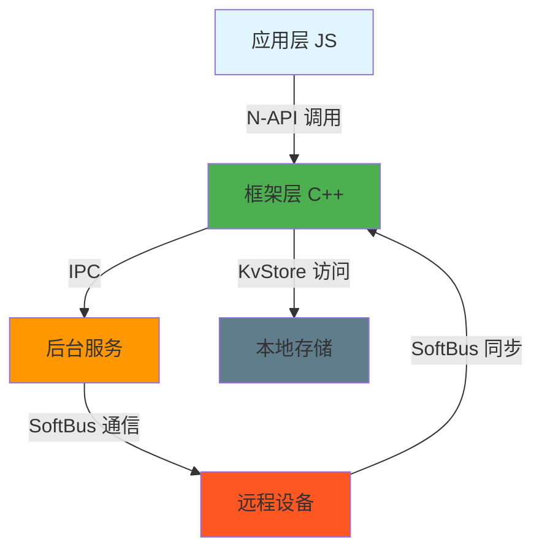

# 攻击面分析

> 分布式数据对象组件的攻击面、信任边界和潜在漏洞点

## 目的

本文档识别分布式数据对象组件的所有外部输入入口、敏感操作和信任边界，为安全研究员提供攻击面概览。

## 适用范围

- OpenHarmony 标准系统
- 组件版本 3.1.0
- 安全分析视角

---

## 外部输入清单

### 1. JS API 输入

**入口**: N-API 层

| 输入类型 | 接口 | 来源 | 位置 |
|---------|------|------|------|
| sessionId | `setSessionId()` | 应用层 JS 代码 | `js_distributedobject.cpp` |
| deviceId | `save()`, `revokeSave()` | 应用层 JS 代码 | `js_distributedobject.cpp` |
| assetKey, bindInfo | `bindAssetStore()` | 应用层 JS 代码 | `js_distributedobject.cpp` |
| 回调函数 | `on()`, `off()` | 应用层 JS 代码 | `js_watcher.cpp` |

**潜在风险**:
- sessionId 格式/长度未验证
- deviceId 可包含恶意路径遍历字符
- Asset URI 未验证有效性

**证据**: `frameworks/jskitsimpl/src/adaptor/js_module_init.cpp:31-39`

### 2. IPC 输入

**入口**: IPC 客户端

| 输入类型 | 接口码 | 来源 | 位置 |
|---------|--------|------|------|
| bundleName | 所有接口 | 远程服务 | `object_service_proxy.cpp` |
| sessionId | 所有接口 | 远程服务 | `object_service_proxy.cpp` |
| deviceId | OBJECTSTORE_SAVE | 远程设备 | `object_service_proxy.cpp` |
| bindInfo | OBJECTSTORE_BIND_ASSET_STORE | 远程设备 | `object_service_proxy.cpp` |

**潜在风险**:
- IPC 数据未充分序列化验证
- 跨设备 sessionId 欺骗
- 恶意 Asset URI 注入

**证据**: `frameworks/innerkitsimpl/src/object_service_proxy.cpp`

### 3. 网络输入

**入口**: SoftBus 通信层

| 输入类型 | 来源 | 位置 |
|---------|------|------|
| 设备同步数据 | 远程设备 | `process_communicator_impl.cpp` |
| 设备状态变更 | 远程设备 | `process_communicator_impl.cpp` |

**潜在风险**:
- 恶意设备注入
- 重放攻击
- 中间人攻击

**证据**: `frameworks/innerkitsimpl/include/communicator/process_communicator_impl.h`

### 4. 配置输入

**入口**: 无

**说明**: 本组件无配置文件暴露给应用层。

---

## 敏感操作清单

### 1. 权限相关操作

| 操作 | 权限要求 | 检查点 | 位置 |
|------|----------|---------|------|
| 创建对象 | `ohos.permission.DISTRIBUTED_DATASYNC` | `VerifyAccessToken` | `flat_object_storage_engine.cpp:43` |
| 保存对象 | `ohos.permission.DISTRIBUTED_DATASYNC` | `VerifyAccessToken` | `flat_object_storage_engine.cpp:43` |

**潜在风险**:
- 权限提升（如果检查逻辑有缺陷）
- 权限绕过

**证据**: `frameworks/innerkitsimpl/src/adaptor/flat_object_storage_engine.cpp:43-45`

### 2. 文件系统操作

| 操作 | 位置 | 潜在风险 |
|------|------|----------|
| Asset URI 处理 | `js_distributedobject.cpp` | 路径遍历 |
| 动态库加载 | `grd_api_manager.cpp:75` | 库劫持 |

**证据**: `frameworks/innerkitsimpl/collaboration_edit/src/grd_api_manager.cpp:75`

### 3. 数据库操作

| 操作 | 位置 | 潜在风险 |
|------|------|----------|
| KvStore 读写 | `flat_object_storage_engine.cpp` | SQL 注入、拒绝服务 |
| 本地存储持久化 | `flat_object_storage_engine.cpp` | 数据泄露 |

**证据**: `frameworks/innerkitsimpl/src/adaptor/flat_object_storage_engine.cpp`

### 4. 内存操作

| 操作 | 位置 | 潜在风险 |
|------|------|----------|
| `memcpy_s` | `js_util.cpp:169` | 缓冲区溢出（已使用安全版本） |
| `strcpy_s` | `cloud_db_proxy.cpp:132` | 缓冲区溢出（已使用安全版本） |

**证据**: Phase 1 Grep 搜索结果

---

## 信任边界

### 跨安全域点

### 信任边界说明

1. **应用层 → 框架层**
   - 边界：N-API 接口
   - 风险：JS 对象劫持、类型混淆

2. **框架层 → 后台服务**
   - 边界：IPC 接口
   - 风险：权限欺骗、重放攻击

3. **后台服务 → 远程设备**
   - 边界：SoftBus 通信
   - 风险：中间人攻击、设备伪造

4. **框架层 → 本地存储**
   - 边界：KvStore 接口
   - 风险：数据篡改、本地权限提升

---

## 证据

- N-API 接口: `js_module_init.cpp:31-39`
- 权限检查: `flat_object_storage_engine.cpp:43-45`
- IPC 接口: `distributeddata_object_store_ipc_interface_code.h`
- 内存操作: Phase 1 Grep 搜索

## 相关链接

- [安全风险评估](./05_SecurityReview.md)
- [接口文档](./03_Interface.md)
- [项目概览](./00_Overview.md)
