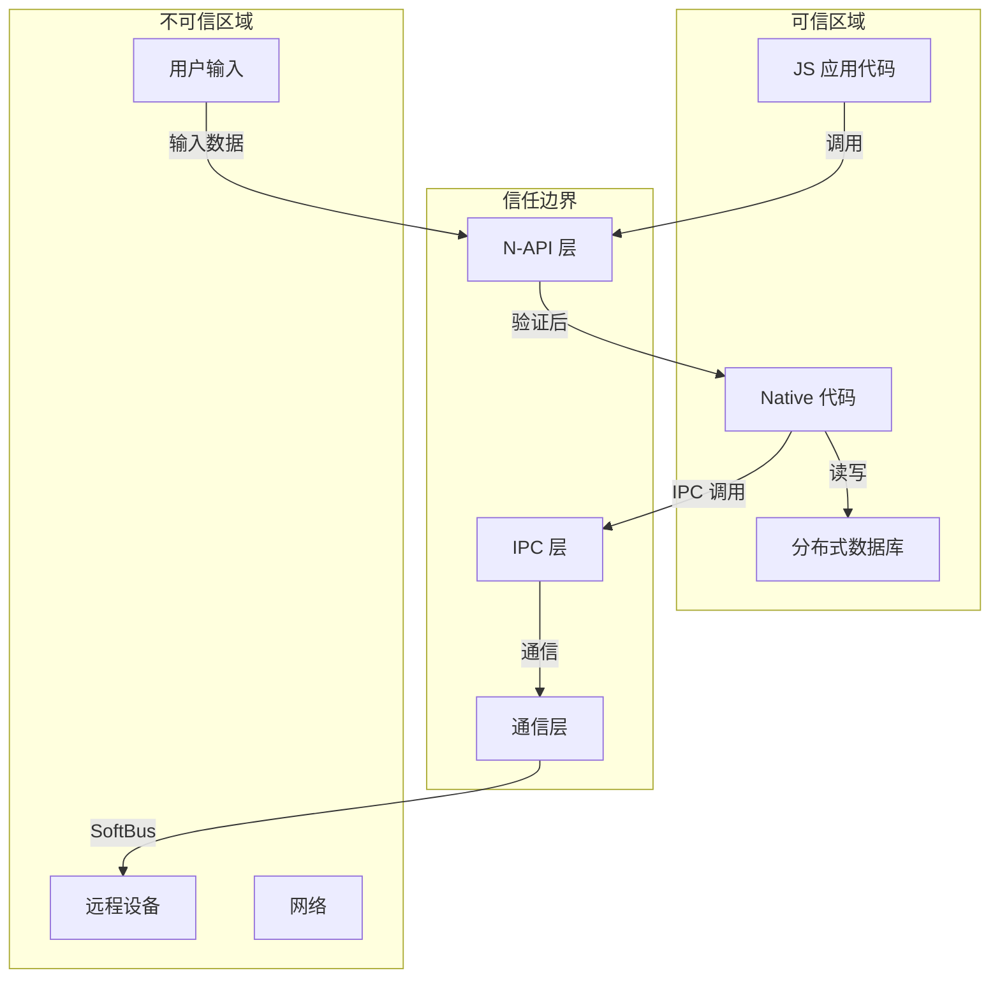

# 安全评审

> 分布式数据对象安全风险分析与修复建议

## 评审范围

| 范围 | 说明 |
|------|------|
| 代码扫描 | `interfaces/`, `frameworks/` (不含 test/) |
| 外部接口 | N-API、IPC、文件、网络 |
| 权限机制 | access_token、bundleName 隔离 |
| 数据流 | 输入校验、敏感操作 |

---

## 攻击面清单

### 1. N-API 接口 (高风险)

| 攻击面 | 描述 | 风险等级 |
|--------|------|----------|
| `createObjectSync` | 创建分布式对象 | 中 |
| `setSessionId` | 设置会话 ID | 高 |
| `on/off` | 注册/取消回调 | 中 |
| `save/revokeSave` | 持久化操作 | 中 |
| `bindAssetStore` | 资产绑定 | 高 |

**证据**: `js_module_init.cpp:32-38` (N-API 导出列表)

### 2. IPC 接口 (高风险)

| 攻击面 | 描述 | 风险等级 |
|--------|------|----------|
| OBJECTSTORE_SAVE | 保存到远程设备 | 高 |
| OBJECTSTORE_RETRIEVE | 检索远程数据 | 高 |
| OBJECTSTORE_BIND_ASSET_STORE | 绑定资产存储 | 中 |
| 注册/取消观察者 | 回调注册 | 低 |

**证据**: `distributeddata_object_store_ipc_interface_code.h` (IPC 代码)

### 3. 文件系统

| 攻击面 | 描述 | 风险等级 |
|--------|------|----------|
| Asset URI | 文件路径解析 | 中 |
| 分布式文件目录 | 资产文件操作 | 中 |
| 数据库文件 | SQLite/KvStore | 低 |

**证据**: `distributed_data_object.js:382-412` (getDefaultAsset)

### 4. 网络通信

| 攻击面 | 描述 | 风险等级 |
|--------|------|----------|
| SoftBus 通信 | 设备间数据同步 | 高 |
| 设备发现 | DeviceManager | 中 |
| 会话管理 | sessionId 传输 | 中 |

**证据**: `softbus_adapter.h` (软总线适配器)

### 5. 系统能力

| 攻击面 | 描述 | 风险等级 |
|--------|------|----------|
| DATA_SYNC 权限 | 分布式同步 | 高 |
| bundleName 隔离 | 应用数据隔离 | 中 |
| 进程间通信 | Binder IPC | 中 |

**证据**: `flat_object_store.h:92` (权限常量定义)

---

## 信任边界



### 边界说明

| 边界 | 信任级别 | 说明 |
|------|----------|------|
| JS 应用 → N-API | 不可信 | 所有输入需要校验 |
| N-API → Native | 半可信 | 类型转换需要验证 |
| Native → IPC | 可信 | 内部调用路径 |
| IPC → 远程设备 | 不可信 | 网络通信需加密 |
| Native → DB | 可信 | 本地存储 |

---

## 可被利用点分析

### 风险 1: sessionId 注入

**风险等级**: 🟠 中

**证据**: `distributed_data_object.js:441-445`

```javascript
// 当前实现
if (sessionId.length > SESSION_ID_MAX_LENGTH || !SESSION_ID_REGEX.test(sessionId)) {
    throw {
        code: 401,
        message: 'The sessionId allows only letters, digits, and underscores(_), and cannot exceed 128 in length.'
    };
}
```

**问题描述**:
- 正则 `/^\w+$/` 仅允许字母、数字、下划线
- 未校验 sessionId 是否已被使用
- 未校验 sessionId 是否来自其他 bundleName

**触发条件**:
```javascript
// 用户尝试使用其他应用的 sessionId
const obj = distributedObject.create({ key: 'value' });
obj.setSessionId('another-app-session-id');  // 可能访问其他应用数据
```

**影响**: 数据泄露、跨应用数据篡改

**修复建议**:
```cpp
// 在 C++ 层添加额外校验
uint32_t DistributedObjectStoreImpl::CreateObject(const std::string &sessionId, uint32_t &status) {
    // 1. 校验 sessionId 格式 (前端已校验)
    // 2. 校验 bundleName 匹配
    std::string callerBundleName = GetCallingBundleName();
    if (callerBundleName != authorizedBundleName_) {
        return ERR_NO_PERMISSION;
    }
    // 3. 校验 sessionId 归属
    if (IsSessionIdOwnedByOther(sessionId, callerBundleName)) {
        return ERR_NO_PERMISSION;
    }
}
```

---

### 风险 2: 权限绕过

**风险等级**: 🔴 高

**证据**: `js_distributedobjectstore.cpp:87`

```cpp
// 对象创建时的权限检查
NAPI_ASSERT_ERRCODE_V9(env, result != ERR_NO_PERMISSION, version, 
    std::make_shared<PermissionError>());
```

**问题描述**:
- 权限检查仅在对象创建时进行
- 未在每次数据操作时校验权限
- IPC 调用时权限传递可能不完整

**触发条件**:
```javascript
// 1. 获取已创建对象的引用
const obj = distributedObject.create({ data: 'test' });

// 2. 在权限被撤销后仍然可以操作
revokePermission('ohos.permission.DISTRIBUTED_DATASYNC');
obj.data = 'new data';  // 可能仍然成功
```

**影响**: 权限撤销后数据继续同步、敏感数据泄露

**修复建议**:
```cpp
// 在每次 Put/Get 操作时校验权限
uint32_t DistributedObjectImpl::PutString(const std::string &key, const std::string &value) {
    // 1. 校验权限
    if (!CheckPermission("ohos.permission.DISTRIBUTED_DATASYNC")) {
        return ERR_NO_PERMISSION;
    }
    // 2. 校验 sessionId 有效性
    if (!IsSessionValid()) {
        return ERR_INVALID_ARGS;
    }
    // 3. 执行操作
    return flatObjectStore_->PutString(sessionId_, key, value);
}
```

---

### 风险 3: Asset 路径遍历

**风险等级**: 🟠 中

**证据**: `distributed_data_object.js:389-390`

```javascript
const fileName = uri.substring(uri.lastIndexOf('/') + 1);
const filePath = distributedDir + '/' + fileName;
```

**问题描述**:
- 直接拼接路径，未校验 URI 是否包含路径遍历字符 (`../`)
- 未校验 URI 是否指向敏感目录 (`/data/`, `/system/`)

**触发条件**:
```javascript
// 尝试访问应用私有目录外的文件
obj.setAsset('key', 'file:///data/../../etc/passwd');
```

**影响**: 读取系统敏感文件

**修复建议**:
```javascript
function validateAssetUri(uri, distributedDir) {
    // 1. 校验 URI 格式
    if (!uri.startsWith('file://')) {
        throw { code: 15400002, message: 'Invalid URI format' };
    }
    
    // 2. 解析路径
    const path = uri.substring(7);  // 去掉 'file://'
    
    // 3. 校验是否包含路径遍历
    if (path.includes('..')) {
        throw { code: 15400002, message: 'Path traversal not allowed' };
    }
    
    // 4. 校验路径是否在允许目录内
    const resolvedPath = pathResolve(distributedDir, path);
    if (!pathStartsWith(resolvedPath, distributedDir)) {
        throw { code: 15400002, message: 'Access denied' };
    }
    
    return resolvedPath;
}
```

---

### 风险 4: 数据大小无限制

**风险等级**: 🟡 低

**证据**: `README_zh.md:13` (约束文档) 但代码中缺乏强制限制

```javascript
// 单个对象大小建议不超过 500KB，但代码中未强制校验
obj.largeData = '...'.repeat(1000000);  // 可能超过 500KB
```

**问题描述**:
- 文档建议限制但代码未强制校验
- 未对单个 key 的数据大小做限制
- 未对对象总大小做限制

**影响**: 内存耗尽、拒绝服务

**修复建议**:
```cpp
// 在存储层添加大小校验
constexpr size_t MAX_OBJECT_SIZE = 500 * 1024;  // 500KB
constexpr size_t MAX_KEY_SIZE = 64;
constexpr size_t MAX_VALUE_SIZE = 500 * 1024;

uint32_t FlatObjectStorageEngine::PutString(const std::string &sessionId, 
                                            const std::string &key, 
                                            const std::string &value) {
    // 1. 校验 key 大小
    if (key.size() > MAX_KEY_SIZE) {
        return ERR_DATA_LEN;
    }
    
    // 2. 校验 value 大小
    if (value.size() > MAX_VALUE_SIZE) {
        return ERR_DATA_LEN;
    }
    
    // 3. 校验对象总大小
    size_t currentSize = GetObjectSize(sessionId);
    if (currentSize + value.size() > MAX_OBJECT_SIZE) {
        return ERR_DATA_LEN;
    }
    
    // 4. 执行存储
    return DistributedDB::Put(key, value);
}
```

---

### 风险 5: 回调函数未校验

**风险等级**: 🟡 低

**证据**: `js_distributedobjectstore.cpp:263-264`

```cpp
// 注册回调时
bool addResult = wrapper->AddWatch(env, type, argv[3]);
NAPI_ASSERT_ERRCODE_V9(env, addResult, version, innerError);
```

**问题描述**:
- 未校验回调函数是否已注册
- 未限制同一回调的重复注册
- 未限制总回调数量

**触发条件**:
```javascript
// 无限注册回调导致内存耗尽
for (let i = 0; i < 10000; i++) {
    obj.on('change', () => {});  // 无限制
}
```

**影响**: 内存耗尽、拒绝服务

**修复建议**:
```cpp
// 添加回调数量限制
constexpr size_t MAX_CALLBACKS_PER_TYPE = 16;

bool JSObjectWrapper::AddWatch(napi_env env, const std::string &type, napi_value callback) {
    // 1. 检查回调总数
    auto &callbacks = g_changeCallBacks[objectId_];
    if (callbacks.size() >= MAX_CALLBACKS_PER_TYPE) {
        LOG_ERROR("Too many callbacks registered");
        return false;
    }
    
    // 2. 检查是否已注册相同回调
    for (auto ref : callbacks) {
        if (IsSameCallback(env, ref, callback)) {
            LOG_WARN("Callback already registered");
            return true;  // 视为成功
        }
    }
    
    // 3. 注册回调
    return AddCallback(env, callbacks, objectId_, callback);
}
```

---

### 风险 6: IPC 数据未加密传输

**风险等级**: 🔴 高

**证据**: `process_communicator_impl.cpp` (通信实现) - 数据明文传输

```cpp
// 数据发送实现
int32_t ProcessCommunicatorImpl::SendData(const uint8_t *data, uint32_t len) {
    return communicationProvider_->SendData(data, len);
}
```

**问题描述**:
- IPC/Binder 调用数据未加密
- SoftBus 通信依赖底层传输加密
- 未对敏感数据做额外加密

**触发条件**:
- 通过 Binder 接口监听 IPC 调用
- 抓取 SoftBus 网络包

**影响**: 敏感数据在传输中被窃取

**修复建议**:
```cpp
// 对敏感数据加密后传输
int32_t ProcessCommunicatorImpl::SendData(const uint8_t *data, uint32_t len) {
    // 1. 序列化数据
    std::vector<uint8_t> serializedData;
    Serialize(data, len, serializedData);
    
    // 2. 加密敏感字段
    std::vector<uint8_t> encryptedData;
    EncryptSensitiveFields(serializedData, encryptedData);
    
    // 3. 添加 MAC 用于完整性校验
    std::vector<uint8_t> mac;
    GenerateMAC(encryptedData, mac);
    
    // 4. 发送数据
    return communicationProvider_->SendData(encryptedData + mac);
}
```

---

### 风险 7: 内存安全 (C++)

**风险等级**: 🟠 中

**证据**: `js_distributedobject.cpp:54-55`

```cpp
// 从 thisVar 解包 wrapper
status = napi_unwrap(env, thisVar, (void **)&wrapper);
NOT_MATCH_RETURN_NULL(status == napi_ok && wrapper != nullptr && wrapper->GetObject() != nullptr);
```

**问题描述**:
- 解包后未校验 wrapper 完整性
- 多线程访问可能产生竞态
- delete 后指针未置空

**触发条件**:
```javascript
// 快速创建和销毁对象
for (let i = 0; i < 1000; i++) {
    const obj = distributedObject.create({});
    obj.setSessionId('session-' + i);
}
```

**影响**: 悬空指针、内存损坏

**修复建议**:
```cpp
// 使用智能指针管理生命周期
class DistributedObjectImpl : public DistributedObject {
private:
    std::shared_ptr<FlatObjectStore> store_;
    std::weak_ptr<SessionManager> session_;
    
    // 确保原子操作
    std::atomic<bool> isValid_{false};
};

// 在操作前检查有效性
uint32_t DistributedObjectImpl::PutString(const std::string &key, const std::string &value) {
    if (!isValid_.load(std::memory_order_acquire)) {
        return ERR_NULL_OBJECT;
    }
    // ...
}
```

---

## 风险汇总

| 风险 | 等级 | 可利用性 | 影响 | 优先级 |
|------|------|----------|------|--------|
| 权限绕过 | 🔴 高 | 中 | 数据泄露 | P1 |
| IPC 数据未加密 | 🔴 高 | 中 | 数据窃取 | P1 |
| sessionId 注入 | 🟠 中 | 低 | 数据篡改 | P2 |
| Asset 路径遍历 | 🟠 中 | 低 | 文件读取 | P2 |
| 数据大小无限制 | 🟡 低 | 低 | DoS | P3 |
| 回调函数未校验 | 🟡 低 | 低 | DoS | P3 |
| 内存安全 | 🟠 中 | 中 | 崩溃/RCE | P2 |

---

## 安全加固建议

### 1. 输入校验 (必须)

| 输入点 | 校验项 |
|--------|--------|
| sessionId | 格式、归属、大小 |
| Asset URI | 路径遍历、目录越权 |
| 对象数据 | 大小、类型 |
| bundleName | 长度、格式 |

### 2. 权限控制 (必须)

| 操作 | 权限要求 |
|------|----------|
| 创建对象 | DATA_SYNC |
| 设置会话 | DATA_SYNC |
| 数据读写 | DATA_SYNC |
| 资产绑定 | DATA_SYNC |

### 3. 数据保护 (建议)

| 数据 | 保护措施 |
|------|----------|
| 传输数据 | 加密+签名 |
| 存储数据 | 敏感字段加密 |
| sessionId | 随机生成 |

### 4. 监控告警 (建议)

| 事件 | 告警条件 |
|------|----------|
| 权限校验失败 | 次数 > 10/min |
| 大对象创建 | 大小 > 1MB |
| 异常 sessionId | 跨 bundleName |

---

## 相关章节

- [概览](./00_Overview.md) → 权限与约束
- [架构](./01_Architecture.md) → 信任边界图
- [N-API 接口](./02_N-API.md) → API 安全考量
- [内部 API](./03_Inner_API.md) → C++ 接口安全
