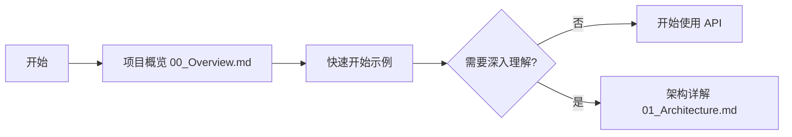
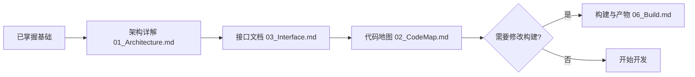
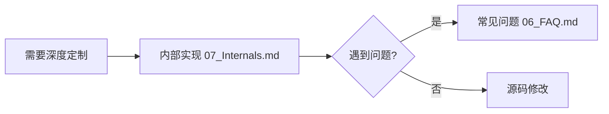
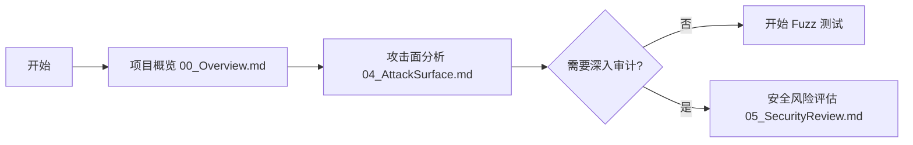

# Wiki 导航

> 全站导航 + 推荐阅读路径

---

## 新人学习路线 📚

### 阶段 1：快速入门（15 分钟）

**学习目标**：
- ✅ 理解项目定位和核心能力
- ✅ 掌握基本 API 使用方法
- ✅ 了解数据同步机制

**必读文档**：
1. [项目概览](./00_Overview.md) - 项目定位、核心能力、约束
2. [快速开始](./00_Overview.md#快速开始) - 5 分钟上手示例
3. [架构详解](./01_Architecture.md) - 理解模块关系和数据流

---

### 阶段 2：深入理解（30 分钟）

**学习目标**：
- ✅ 理解内部架构和组件依赖
- ✅ 掌握所有对外接口
- ✅ 了解构建系统和产物

**必读文档**：
1. [架构详解](./01_Architecture.md) - 组件图、数据流、线程模型
2. [接口文档](./03_Interface.md) - N-API、IPC、错误码
3. [代码地图](./02_CodeMap.md) - 核心文件定位

---

### 阶段 3：高级开发（可选）

**学习目标**：
- ✅ 理解内部实现细节
- ✅ 掌握资源生命周期管理
- ✅ 掌握调试技巧

**必读文档**：
1. [内部实现](./07_Internals.md) - 核心类、API 契约、生命周期

---

## 安全研究路线 🔒

### 阶段 1：攻击面分析（30 分钟）

**审计目标**：
- ✅ 识别所有外部输入入口
- ✅ 理解敏感操作和权限检查点
- ✅ 掌握信任边界

**必读文档**：
1. [项目概览](./00_Overview.md) - 快速了解项目类型和运行域
2. [攻击面分析](./04_AttackSurface.md) - 输入清单、敏感操作、信任边界

---

### 阶段 2：深度审计（2-4 小时）

**审计目标**：
- ✅ 分析 5+ 类安全风险
- ✅ 理解输入验证缺陷
- ✅ 评估内存安全和并发问题

**必读文档**：
1. [安全风险评估](./05_SecurityReview.md) - 5 类风险、可利用性评估、修复建议
2. [接口文档](./03_Interface.md) - 理解接口调用链
3. [内部实现](./07_Internals.md) - 理解资源管理和权限检查

---

### 阶段 3：Fuzz/渗透测试

**测试重点**（基于攻击面分析）：

| 输入类型 | 测试方法 | 对应文档 |
|---------|----------|----------|
| sessionId | 格式/长度/特殊字符 | [攻击面分析](./04_AttackSurface.md) |
| deviceId | 路径遍历/空值 | [安全风险评估](./05_SecurityReview.md#R1) |
| Asset URI | 路径遍历/协议注入 | [安全风险评估](./05_SecurityReview.md#R3) |
| IPC 数据 | 序列化/反序列化 | [攻击面分析](./04_AttackSurface.md) |
| 并发操作 | 竞态条件 | [安全风险评估](./05_SecurityReview.md#R4) |

---

## 文档索引

### 按功能分类

| 分类 | 文档 | 描述 |
|------|------|------|
| **基础** | [00_Overview.md](./00_Overview.md) | 项目定位、核心能力、约束 |
| **架构** | [01_Architecture.md](./01_Architecture.md) | 组件图、数据流、线程模型 |
| **代码导航** | [02_CodeMap.md](./02_CodeMap.md) | 目录职责、核心文件定位 |
| **接口** | [03_Interface.md](./03_Interface.md) | N-API、IPC、错误码 |
| **安全** | [04_AttackSurface.md](./04_AttackSurface.md) | 攻击面、信任边界 |
| **安全评审** | [05_SecurityReview.md](./05_SecurityReview.md) | 5 类风险、修复建议 |
| **构建** | [06_Build.md](./06_Build.md) | GN Targets、编译产物 |
| **内部** | [07_Internals.md](./07_Internals.md) | 核心类、API 契约、生命周期 |

### 按受众分类

| 受众 | 推荐阅读顺序 | 预计时间 |
|------|------------|----------|
| **新人开发者** | [00_Overview](./00_Overview.md) → [01_Architecture](./01_Architecture.md) → [03_Interface](./03_Interface.md) → [02_CodeMap](./02_CodeMap.md) | 1 小时 |
| **安全研究员** | [00_Overview](./00_Overview.md) → [04_AttackSurface](./04_AttackSurface.md) → [05_SecurityReview](./05_SecurityReview.md) → [07_Internals](./07_Internals.md) | 2-3 小时 |

---

## 快速查找

### 按关键词

| 关键词 | 相关文档 |
|--------|----------|
| API 使用 | [接口文档](./03_Interface.md), [项目概览](./00_Overview.md) |
| 架构设计 | [架构详解](./01_Architecture.md), [内部实现](./07_Internals.md) |
| 安全漏洞 | [安全风险评估](./05_SecurityReview.md), [攻击面分析](./04_AttackSurface.md) |
| 构建调试 | [构建与产物](./06_Build.md), [代码地图](./02_CodeMap.md) |
| 文件定位 | [代码地图](./02_CodeMap.md) |
| 错误码 | [接口文档](./03_Interface.md#错误码) |

### 按文件路径

| 文件路径 | 功能描述 | 文档 |
|----------|----------|------|
| `interfaces/jskits/distributed_data_object.js` | JS API 实现 | [接口文档](./03_Interface.md) |
| `frameworks/jskitsimpl/src/adaptor/js_module_init.cpp` | N-API 入口 | [接口文档](./03_Interface.md#N-API-接口清单) |
| `frameworks/innerkitsimpl/src/adaptor/flat_object_store.cpp` | 对象存储核心 | [内部实现](./07_Internals.md) |
| `frameworks/innerkitsimpl/src/adaptor/flat_object_storage_engine.cpp` | 存储引擎+权限检查 | [安全风险评估](./05_SecurityReview.md#R2) |
| `interfaces/innerkits/objectstore_errors.h` | 错误码定义 | [接口文档](./03_Interface.md#错误码) |

---

## 文档更新日志

| 日期 | 更新内容 | 版本 |
|------|----------|------|
| 2026-02-07 | 初始版本，完整覆盖 8 篇文档 | 1.0.0 |

---

## 贡献指南

如发现文档错误或需要补充内容：

1. **技术错误**：直接在对应文件提交 Issue 或 PR
2. **内容补充**：遵循现有格式，添加代码证据
3. **安全漏洞**：提交安全报告，包含可复现步骤
4. **证据缺失**：标注 `TODO(证据不足)`，等待后续补充

---

## 反馈与联系

- **源码仓库**: [distributeddatamgr_data_object](https://gitee.com/openharmony/distributeddatamgr_data_object)
- **组件名**: `@ohos/data_object`
- **子系统**: `distributeddatamgr`
