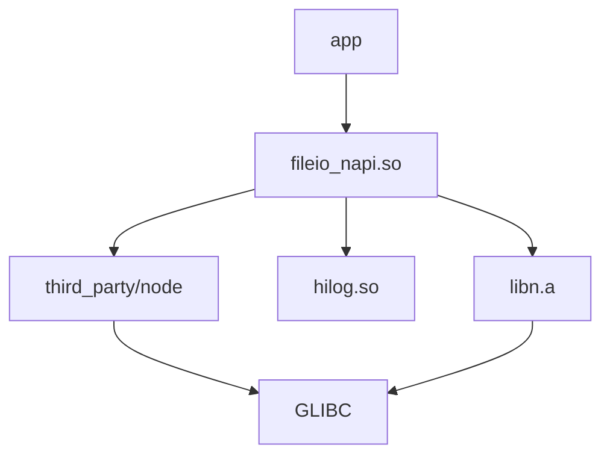

# GN 构建系统

> ⚠️ 本文档待代码仓库完整后补充

## 构建入口

### 根构建文件

| 文件 | 职责 |
|------|------|
| `BUILD.gn` | 根构建配置 |
| `ohos.build` | OpenHarmony 子系统配置 |

### 标准配置

```gn
# ohos.build 格式（推断）
{
    "subsystem": "distributeddatamgr",
    "modules": [
        {
            "name": "distributedfile",
            "targets": [
                "//foundation/distributeddatamgr/distributedfile:xxx"
            ]
        }
    ]
}
```

## 关键 Targets

> ⚠️ 以下基于 OpenHarmony 标准结构推断

### 1. 核心库 Target

```gn
# interfaces/kits/fileio/BUILD.gn（推断）

ohos_shared_library("fileio_napi") {
    sources = [
        "napi_fileio.cpp",
        "napi_file.cpp",
        "napi_dir.cpp",
        "napi_stream.cpp",
        "napi_stat.cpp",
        "napi_common.cpp",
    ]

    include_dirs = [
        "//foundation/distributeddatamgr/distributedfile/utils/filemgmt_libn/include",
        "//third_party/node/include",
    ]

    deps = [
        "//foundation/distributeddatamgr/distributedfile/utils/filemgmt_libn:libn",
        "//foundation/distributeddatamgr/distributedfile/utils/filemgmt_libhilog:hilog",
        "//third_party/node:node",
    ]

    public_configs = [ ":fileio_config" ]
}
```

### 2. LibN 静态库 Target

```gn
# utils/filemgmt_libn/BUILD.gn（推断）

ohos_static_library("libn") {
    sources = [
        "src/napi_util.cpp",
        "src/napi_env.cpp",
        "src/napi_callback.cpp",
    ]

    include_dirs = [
        "include",
        "include/napi",
        "include/types",
    ]

    configs = [ ":libn_config" ]
}
```

### 3. 日志库 Target

```gn
# utils/filemgmt_libhilog/BUILD.gn（推断）

ohos_shared_library("hilog") {
    sources = [
        "src/log.cpp",
    ]

    include_dirs = [
        "include",
    ]
}
```

## 依赖关系



## 编译产物

| 产物 | 路径（推断） | 用途 |
|------|-------------|------|
| `libfileio_napi.z.so` | `out/.../system/lib/` | N-API 库 |
| `libn.z.a` | `out/.../system/lib/` | 静态库（链接用） |
| `libhilog.z.so` | `out/.../system/lib/` | 日志库 |

## 构建命令

```bash
# 完整构建
./build.sh --product-name xxx --target-cpu arm64

# 仅构建 distributedfile
hb build -p distributeddatamgr -T //foundation/distributeddatamgr/distributedfile:xxx

# GN 检查
gn gen out/default
ninja -C out/default xxx
```

## 配置选项

### 编译开关（推断）

| 宏/开关 | 默认值 | 说明 |
|---------|--------|------|
| `FILEMGMT_ENABLE_LOG` | 1 | 启用日志 |
| `FILEMGMT_ENABLE_DEBUG` | 0 | 启用调试 |
| `NAPI_VERSION` | 8 | Node.js N-API 版本 |

### 配置头

```c
// utils/filemgmt_libn/include/config.h（推断）
#ifndef FILEMGMT_CONFIG_H
#define FILEMGMT_CONFIG_H

#define FILEMGMT_VERSION "1.0"
#define FILEMGMT_ENABLE_LOG 1

#endif // FILEMGMT_CONFIG_H
```

## 常见构建问题（待补充）

| 问题 | 原因 | 解决方案 |
|------|------|----------|
| TODO | 待代码补充 | 待代码补充 |

## 参考

- [目录结构](02_Directory_Structure.md)
- [运行时指南](05_Build_Runtime_Guide.md)
- [OpenHarmony 构建指南](https://docs.openharmony.cn)
