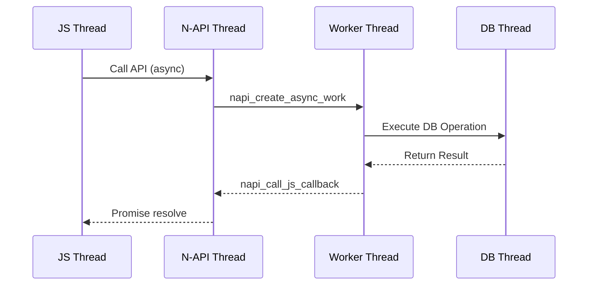

# 架构设计

## 整体架构

```
┌─────────────────────────────────────────────────────────────┐
│                     应用层 (App Layer)                      │
│  ┌─────────────────────────────────────────────────────┐  │
│  │              JS/ArkTS Application                     │  │
│  └─────────────────────────────────────────────────────┘  │
└─────────────────────────────────────────────────────────────┘
                            │
                            ▼
┌─────────────────────────────────────────────────────────────┐
│                   N-API 层 (N-API Layer)                   │
│  ┌─────────────────┐  ┌─────────────────────────────────┐│
│  │ distributeddata │  │     distributedkvstore          ││
│  │    (.js API)    │  │         (.js API)               ││
│  └─────────────────┘  └─────────────────────────────────┘│
│  ┌─────────────────────────────────────────────────────┐  │
│  │         frameworks/jskitsimpl/                       │  │
│  │  ├── distributeddata/src/                            │  │
│  │  │   ├── js_kv_manager.cpp                           │  │
│  │  │   ├── js_single_kv_store.cpp                      │  │
│  │  │   └── js_util.cpp                                 │  │
│  │  └── distributedkvstore/src/                         │  │
│  │      ├── js_single_kv_store.cpp                      │  │
│  │      ├── js_device_kv_store.cpp                     │  │
│  │      └── js_query.cpp                                │  │
│  └─────────────────────────────────────────────────────┘  │
└─────────────────────────────────────────────────────────────┘
                            │
                            ▼
┌─────────────────────────────────────────────────────────────┐
│                   Inner API 层 (Inner API Layer)           │
│  ┌─────────────────────────────────────────────────────┐  │
│  │         interfaces/innerkits/distributeddata/       │  │
│  │    ├── include/                                      │  │
│  │    │   ├── kvstore.h                                 │  │
│  │    │   ├── single_kvstore.h                         │  │
│  │    │   └── distributed_kv_data_manager.h            │  │
│  │    └── BUILD.gn                                      │  │
│  └─────────────────────────────────────────────────────┘  │
└─────────────────────────────────────────────────────────────┘
                            │
                            ▼
┌─────────────────────────────────────────────────────────────┐
│                   实现层 (Implementation Layer)             │
│  ┌─────────────────────────────────────────────────────┐  │
│  │     frameworks/innerkitsimpl/distributeddatafwk/    │  │
│  │     ├── src/                                         │  │
│  │     │   ├── distributed_kv_data_manager.cpp          │  │
│  │     │   └── kvdb_notifier_*.cpp                      │  │
│  │     └── include/                                      │  │
│  └─────────────────────────────────────────────────────┘  │
│  ┌─────────────────────────────────────────────────────┐  │
│  │       frameworks/libs/distributeddb/                │  │
│  │       ├── interfaces/src/                          │  │
│  │       ├── storage/src/                              │  │
│  │       │   ├── kv/                                   │  │
│  │       │   └── sqlite/                               │  │
│  │       └── syncer/src/                               │  │
│  │           ├── device/                                │  │
│  │           └── cloud/                                 │  │
│  └─────────────────────────────────────────────────────┘  │
└─────────────────────────────────────────────────────────────┘
                            │
                            ▼
┌─────────────────────────────────────────────────────────────┐
│                   存储层 (Storage Layer)                     │
│  ┌─────────────────────────────────────────────────────┐  │
│  │              SQLite (with Codec)                    │  │
│  │    ├── KV Storage (键值对存储)                       │  │
│  │    └── Relational Storage (关系型存储)                │  │
│  └─────────────────────────────────────────────────────┘  │
└─────────────────────────────────────────────────────────────┘
```

## 模块职责

### frameworks/jskitsimpl/

**职责**：N-API 绑定实现层

| 模块 | 路径 | 职责 |
|-----|------|------|
| distributeddata | `frameworks/jskitsimpl/distributeddata/` | 分布式数据管理 JS 绑定 |
| distributedkvstore | `frameworks/jskitsimpl/distributedkvstore/` | KV 存储 JS 绑定 |

**关键文件**：
- `entry_point.cpp`：N-API 模块注册入口 (`napi_module_register`)
- `js_kv_manager.cpp`：KV 管理器实现
- `js_single_kv_store.cpp`：单版本 KV 存储实现
- `js_device_kv_store.cpp`：设备协同 KV 存储实现
- `js_query.cpp`：查询构建器实现
- `js_util.cpp`：N-API 类型转换工具

### frameworks/libs/distributeddb/

**职责**：分布式数据库核心库

**子模块**：
| 子模块 | 路径 | 职责 |
|-------|------|------|
| storage | `storage/src/` | 存储引擎实现 |
| syncer | `syncer/src/` | 同步机制实现 |
| communicator | `communicator/` | 进程间通信 |
| gaussdb_rd | `gaussdb_rd/` | GaussDB 读副本 |

**关键文件**：
- `interfaces/include/kv_store_delegate_manager.h`：KV 存储委托管理器
- `interfaces/include/kv_store_nb_delegate.h`：非阻塞 KV 委托
- `storage/src/sqlite/kv/`：SQLite KV 存储实现

### frameworks/native/

**职责**：Native API 实现

| 模块 | 路径 | 职责 |
|-----|------|------|
| kv_store | `frameworks/native/kv_store/` | Native KV 存储接口 |
| dbm_kv_store | `frameworks/native/dbm_kv_store/` | DBM 风格的 KV 存储 |

## 线程模型

### N-API 层线程模型



### 关键线程相关类

| 类名 | 路径 | 职责 |
|-----|------|------|
| NapiQueue | `frameworks/jskitsimpl/*/src/napi_queue.cpp` | N-API 异步队列管理 |
| UvQueue | `frameworks/jskitsimpl/*/src/uv_queue.cpp` | libuv 队列实现 |

## 依赖方向

```
jskitsimpl (N-API) ──depends on──> innerkits (Inner API)
                                      │
                                      ▼
                         innerkitsimpl (实现) ──depends on──> distributeddb (核心库)
                                                                  │
                                                                  ▼
                                                        SQLite + OpenSSL
```

## 数据流

### 写入流程

```
JS API (put)
    │
    ▼
N-API Binding (js_single_kv_store.cpp)
    │
    ▼
Inner API (SingleKVStore::Put)
    │
    ▼
DistributedDB (KvStoreNbDelegate::Put)
    │
    ▼
SQLite Storage
```

### 读取流程

```
JS API (get)
    │
    ▼
N-API Binding (js_single_kv_store.cpp)
    │
    ▼
Inner API (SingleKVStore::Get)
    │
    ▼
DistributedDB (KvStoreNbDelegate::Get)
    │
    ▼
SQLite Storage
```

## 稳定性标注

### 稳定接口

| 接口类型 | 证据 |
|---------|------|
| N-API 导出函数 | `entry_point.cpp` 中通过 `napi_define_properties` 导出 |
| Inner API 头文件 | `interfaces/innerkits/` 下头文件带有完整文档注释 |

### 潜在变更接口

| 模块 | 原因 |
|-----|------|
| distributeddb 内部实现 | 核心库可能随版本优化调整 |
| native 层接口 | 与内核版本绑定可能变化 |

## 相关文档

- [代码地图](03_CodeMap.md) - 代码文件导航
- [N-API 接口参考](04_NAPI_Reference.md)
- [Inner API 参考](05_Inner_API.md)
- [GN 构建指南](06_Build_GN.md)
- [攻击面分析](07_AttackSurface.md) - 安全入口点
