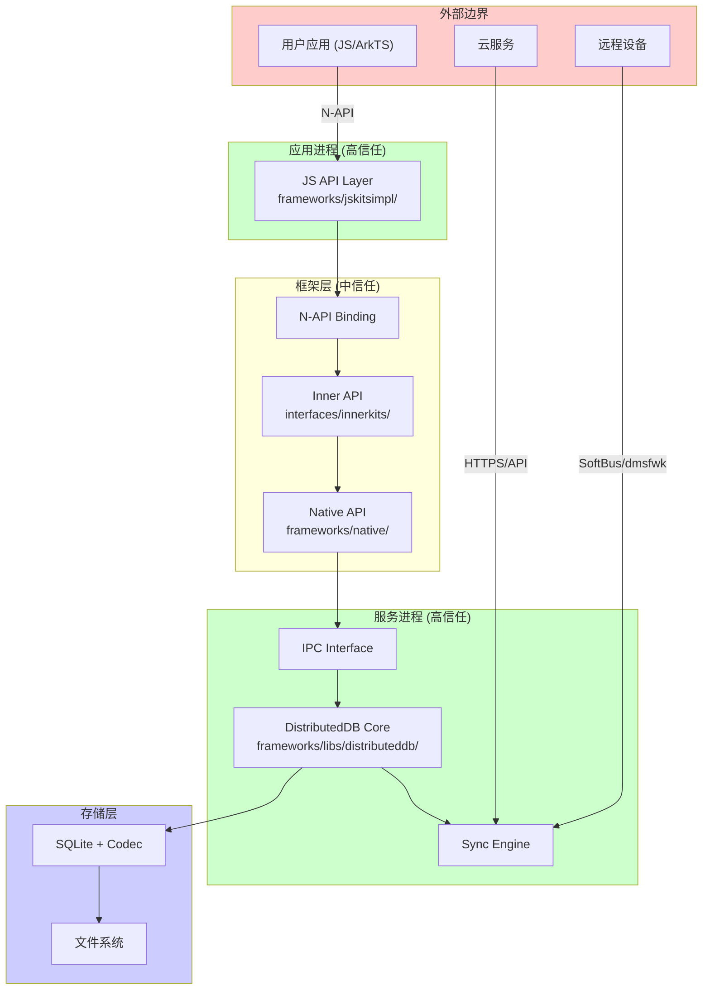

# 攻击面分析

## 概述

本文档系统梳理 KV Store 的所有外部输入入口和敏感操作点，为安全研究提供攻击面全景视图。

## 信任边界图



### 信任边界说明

| 边界 | 信任级别 | 威胁模型 |
|-----|---------|---------|
| 外部边界 → 应用进程 | 低 → 高 | 不可信应用输入、恶意JS代码 |
| 应用进程 → 服务进程 | 高 → 高 | 权限提升、IPC劫持 |
| 服务进程 → 存储层 | 高 → 高 | 物理访问、存储攻击 |
| 远程设备 → 服务进程 | 未知 → 高 | 中间人、设备伪造 |
| 云服务 → 服务进程 | 中 → 高 | 云凭证泄露、云API滥用 |

---

## 外部输入清单

### 1. N-API 参数输入

**入口位置**：`frameworks/jskitsimpl/*/src/*.cpp`

#### 1.1 字符串参数

| API | 参数名 | 位置 | 最大长度 | 验证点 |
|-----|-------|------|---------|-------|
| `createKVManager` | `bundleName` | `js_kv_manager.cpp:51` | 256 | 非空检查 |
| `getKVStore` | `storeId` | `js_kv_manager.cpp:132` | 128 | 格式校验 |
| `put` | `key` | `js_single_kv_store.cpp:175` | 1024 | 类型+长度 |
| `put` | `value` (string) | `js_single_kv_store.cpp:175` | 4MB | 类型+长度 |
| `backup` | `file` | `js_single_kv_store.cpp:555` | N/A | 类型检查 |

**验证代码证据**：`frameworks/libs/distributeddb/common/include/db_constant.h:24-28`
```cpp
static constexpr size_t MAX_KEY_SIZE = 1024;           // 1KB
static constexpr size_t MAX_VALUE_SIZE = 4 * 1024 * 1024;  // 4MB
static constexpr size_t MAX_SET_VALUE_SIZE = 64 * 1024 * 1024;  // 64MB
static constexpr size_t MAX_BATCH_SIZE = 128;
```

#### 1.2 二进制数据输入

| API | 参数名 | 位置 | 最大长度 | 风险 |
|-----|-------|------|---------|-----|
| `put` | `value` (Uint8Array) | `js_single_kv_store.cpp:175` | 4MB/64MB | 内存分配 |
| `putBatch` | `entries` | `js_single_kv_store.cpp:340` | 128条 | 批量DoS |

**验证代码证据**：`frameworks/libs/distributeddb/interfaces/src/intercepted_data_impl.cpp:27-36`
```cpp
if (key.empty() || key.size() > DBConstant::MAX_KEY_SIZE) {
    return false;
}
if (value.size() > DBConstant::MAX_VALUE_SIZE) {
    return false;
}
```

#### 1.3 查询对象输入

| API | 参数名 | 位置 | 风险点 |
|-----|-------|------|-------|
| `equalTo` | `field` | `js_query.cpp:124` | 字段名注入 |
| `like` | `value` | `js_query.cpp` | SQL LIKE注入 |
| `prefixKey` | `prefix` | `js_query.cpp` | 路径遍历 |

#### 1.4 设备ID输入

| API | 参数名 | 位置 | 风险 |
|-----|-------|------|-----|
| `sync` | `deviceIds` | `js_single_kv_store.cpp` | 设备伪造 |
| `get` (DeviceKVStore) | `deviceId` | `js_device_kv_store.cpp:83` | 越权访问 |

### 2. IPC 数据输入

**入口位置**：`frameworks/innerkitsimpl/kvdb/src/`

#### 2.1 IPC 接口方法

| 接口 | 方法 | 位置 | 输入类型 | 验证 |
|-----|------|------|---------|------|
| `IKVDBService` | `GetKVStore` | `kvdb_service_impl.cpp` | StoreId + Options | 权限检查 |
| `IKVDBService` | `Sync` | `kvdb_service_impl.cpp` | DeviceId + Mode | 设备认证 |
| `IKVDBService` | `Put` | `kvdb_service_impl.cpp` | Key + Value | 长度检查 |

**IPC 接口代码证据**：`frameworks/innerkitsimpl/kvdb/include/kvdb_service.h`
```cpp
class IKVDBService : public IRemoteBroker {
    virtual Status GetKVStore(const AppId &appId, const StoreId &storeId, 
                              const Options &options, 
                              sptr<IKvStoreObserver> observer) = 0;
    virtual Status Sync(const AppId &appId, const StoreId &storeId,
                        SyncInfo &syncInfo) = 0;
};
```

### 3. 同步协议输入

**入口位置**：`frameworks/libs/distributeddb/syncer/src/`

#### 3.1 设备间同步

| 协议层 | 输入点 | 位置 | 风险 |
|-------|-------|------|-----|
| 能力协商 | `AbilitySyncRequestPacket` | `ability_sync.cpp` | 版本降级 |
| 数据同步 | `SingleVerDataSync::SyncStart` | `single_ver_data_sync.cpp` | 数据伪造 |
| 设备管理 | `OnDeviceConnectCallback` | `device_manager.cpp` | 设备伪装 |

**设备认证代码证据**：`frameworks/libs/distributeddb/syncer/src/device/ability_sync.cpp`
```cpp
// 安全级别协商
if (request.secLabel != targetSecLabel || request.secFlag != targetSecFlag) {
    return SECURITY_OPTION_CHECK_ERROR;
}
```

#### 3.2 云端同步

| 输入点 | 位置 | 风险 |
|-------|------|-----|
| `ICloudDb` 接口 | `cloud_db_proxy.cpp` | 云API伪造 |
| 同步任务 | `cloud_syncer.cpp` | 任务注入 |
| 游标数据 | `cloud_syncer_extend.cpp` | 游标篡改 |

### 4. 文件系统输入

**入口位置**：备份/恢复操作

#### 4.1 备份路径

| API | 参数 | 位置 | 风险 |
|-----|------|------|-----|
| `backup` | `file` | `js_single_kv_store.cpp:555` | 路径遍历 |
| `restore` | `file` | `js_single_kv_store.cpp:608` | 任意文件读取 |
| `deleteBackup` | `files` | `js_single_kv_store.cpp:657` | 批量删除 |

**路径验证代码证据**：`frameworks/libs/distributeddb/common/src/param_check_utils.cpp:28-38`
```cpp
bool ParamCheckUtils::CheckDataDir(const std::string &dataDir, std::string &canonicalDir) {
    if (dataDir.empty() || (dataDir.length() > DBConstant::MAX_DATA_DIR_LENGTH)) {
        return false;
    }
    return (OS::GetRealPath(dataDir, canonicalDir) == E_OK);
}
```

#### 4.2 数据库文件

| 文件类型 | 位置 | 权限 |
|---------|------|------|
| `.db` 主数据库 | `/data/service/el1/.../kvdb/` | 0600 |
| `.db-wal` WAL日志 | 同目录 | 0600 |
| `.backup` 备份文件 | 用户指定或默认目录 | 依赖父目录 |
| `.key` 加密密钥 | `/data/service/el1/.../keys/` | 0600 |

---

## 敏感操作清单

### 1. 权限检查点

#### 1.1 系统API权限

**检查位置**：`frameworks/jskitsimpl/distributedkvstore/src/js_single_kv_store.cpp`

**代码证据**：
```cpp
// Line 系统API检查
ASSERT_PERMISSION_ERR(ctxt,
    !JSUtil::IsSystemApi(statusMsg.jsApiType) ||
    reinterpret_cast<JsSingleKVStore *>(ctxt->native)->IsSystemApp(), 
    Status::PERMISSION_DENIED, "");
```

**涉及的系统API**：
- `putBatch`
- `getResultSet`
- `DeviceKVStore.getResultSet`

#### 1.2 ACL权限检查

**实现位置**：`databaseutils/src/acl.cpp`

**代码证据**：`databaseutils/include/acl.h:31-66`
```cpp
enum class ACL_TAG : uint16_t {
    USER_OBJ = 0x01,   // 文件所有者
    USER = 0x02,       // 特定用户
    GROUP_OBJ = 0x04,  // 用户组
    GROUP = 0x08,      // 特定组
    MASK = 0x10,       // 权限掩码
    OTHER = 0x20,      // 其他用户
};

class ACL_PERM {
    uint16_t value_ = 0;
    enum Value : uint16_t {
        READ = 0x04,
        WRITE = 0x02,
        EXECUTE = 0x01,
    };
};
```

### 2. 加密操作点

#### 2.1 密钥管理

**位置**：`frameworks/innerkitsimpl/kvdb/src/security_manager.cpp`

**操作**：
| 操作 | 函数 | 行号 |
|-----|------|------|
| 根密钥生成 | `GenerateRootKey` | 61-81 |
| 数据库密钥加密 | `Encrypt` | 269-320 |
| 数据库密钥解密 | `Decrypt` | 269-320 |
| 密钥文件锁定 | `KeyFiles::Lock` | 安全头文件 |

**代码证据**：`security_manager.cpp:61-81`
```cpp
bool SecurityManager::Retry() {
    auto status = CheckRootKey();
    if (status == HKS_SUCCESS) {
        hasRootKey_ = true;
        return true;
    }
    if (status == HKS_ERROR_NOT_EXIST && GenerateRootKey() == HKS_SUCCESS) {
        hasRootKey_ = true;
        return true;
    }
    // 100ms间隔重试
}
```

#### 2.2 加密算法

**证据**：`security_manager.cpp:269-320`
```cpp
struct HksParam hksParam[] = {
    { .tag = HKS_TAG_ALGORITHM, .uint32Param = HKS_ALG_AES },
    { .tag = HKS_TAG_PURPOSE, .uint32Param = HKS_KEY_PURPOSE_ENCRYPT },
    { .tag = HKS_TAG_BLOCK_MODE, .uint32Param = HKS_MODE_GCM },
    { .tag = HKS_TAG_PADDING, .uint32Param = HKS_PADDING_NONE },
    { .tag = HKS_TAG_NONCE, .blob = { SecurityContent::NONCE_SIZE, ... } },
    { .tag = HKS_TAG_ASSOCIATED_DATA, .blob = { ... } },
};
```

### 3. 网络通信点

#### 3.1 设备同步通信

**协议栈**：
```
SyncEngine → CommunicatorProxy → Communicator → SoftBus (dmsfwk)
```

**关键文件**：
- `frameworks/libs/distributeddb/communicator/src/communicator.cpp`
- `frameworks/libs/distributeddb/syncer/src/device/communicator_proxy.cpp`

#### 3.2 云同步通信

**接口**：`ICloudDb` 抽象接口

**实现**：`frameworks/libs/distributeddb/syncer/src/cloud/cloud_db_proxy.cpp`

### 4. 文件系统操作点

#### 4.1 数据库文件操作

| 操作 | 位置 | 风险 |
|-----|------|-----|
| 创建数据库 | `store_factory.cpp:84-102` | 路径遍历 |
| 删除数据库 | `kvdb_service_impl.cpp` | 误删 |
| 备份导出 | `backup_manager.cpp:141-158` | 信息泄露 |
| 备份导入 | `backup_manager.cpp` | 数据注入 |

#### 4.2 权限设置

**代码证据**：`security_manager.cpp:265`
```cpp
StoreUtil::RemoveRWXForOthers(keyFullPath);  // 移除其他用户读写执行权限
```

---

## 攻击路径分析

### 路径1：N-API → 数据库操作

```
攻击者控制JS代码
    ↓
构造恶意参数调用N-API
    ↓
frameworks/jskitsimpl/*/src/js_*.cpp
    ↓
参数验证 (可能绕过)
    ↓
Inner API调用
    ↓
frameworks/libs/distributeddb/ 核心操作
    ↓
SQLite执行
```

**关键检查点**：
1. `js_util.cpp` 类型转换
2. `param_check_utils.cpp` 参数校验
3. `intercepted_data_impl.cpp` 数据拦截

### 路径2：远程同步 → 本地数据库

```
攻击者控制远程设备/中间人
    ↓
SoftBus/dmsfwk通信
    ↓
frameworks/libs/distributeddb/syncer/
    ↓
能力协商 (ability_sync.cpp)
    ↓
数据同步 (single_ver_data_sync.cpp)
    ↓
本地数据库写入
```

**关键检查点**：
1. `ability_sync.cpp` 设备能力协商
2. `single_ver_data_sync.cpp` 数据包解析
3. `param_check_utils.cpp` 数据校验

### 路径3：云同步 → 本地数据库

```
攻击者控制云服务/凭证
    ↓
HTTPS/API调用
    ↓
frameworks/libs/distributeddb/syncer/src/cloud/
    ↓
cloud_syncer.cpp 任务执行
    ↓
cloud_merge_strategy.cpp 冲突解决
    ↓
本地数据库更新
```

**关键检查点**：
1. `cloud_db_proxy.cpp` 云接口认证
2. `cloud_syncer.cpp` 任务验证
3. `cloud_merge_strategy.cpp` 合并策略

### 路径4：备份恢复 → 文件系统

```
攻击者控制备份文件
    ↓
调用restore API
    ↓
js_single_kv_store.cpp:608
    ↓
backup_manager.cpp 恢复逻辑
    ↓
文件系统写入
```

**关键检查点**：
1. `js_single_kv_store.cpp` 路径参数校验
2. `backup_manager.cpp` 文件验证

---

## 风险等级矩阵

| 攻击向量 | 难度 | 影响 | 风险等级 |
|---------|------|------|---------|
| N-API参数注入 | 低 | 中 | 🟡 中 |
| 缓冲区溢出 | 中 | 高 | 🔴 高 |
| 路径遍历 | 低 | 高 | 🔴 高 |
| SQL注入 | 高 | 中 | 🟡 中 |
| 设备伪造 | 中 | 高 | 🔴 高 |
| 中间人攻击 | 中 | 高 | 🔴 高 |
| 云凭证滥用 | 中 | 中 | 🟡 中 |
| 权限提升 | 高 | 高 | 🔴 高 |
| DoS (大输入) | 低 | 低 | 🟢 低 |

---

## 监控建议

### 关键日志点

| 组件 | 日志位置 | 关键事件 |
|-----|---------|---------|
| N-API | `js_error_utils.cpp` | 参数错误、权限拒绝 |
| Sync | `sync_engine.cpp` | 设备连接、同步失败 |
| IPC | `kvdb_service_impl.cpp` | 跨进程调用异常 |
| Security | `security_manager.cpp` | 密钥操作失败 |

### 异常指标

- 短时间内大量参数错误
- 来自同一设备的频繁同步失败
- 异常大的value写入尝试
- 备份路径包含`../`
- 权限检查失败次数激增

---

## 相关文档

- [安全风险评审](08_Security_Review.md) - 详细风险分析和修复建议
- [架构设计](02_Architecture.md) - 模块架构和信任边界
- [代码地图](03_CodeMap.md) - 关键代码文件定位
