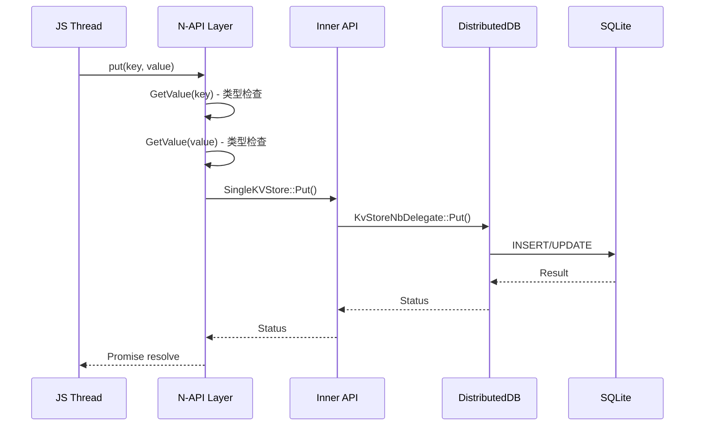
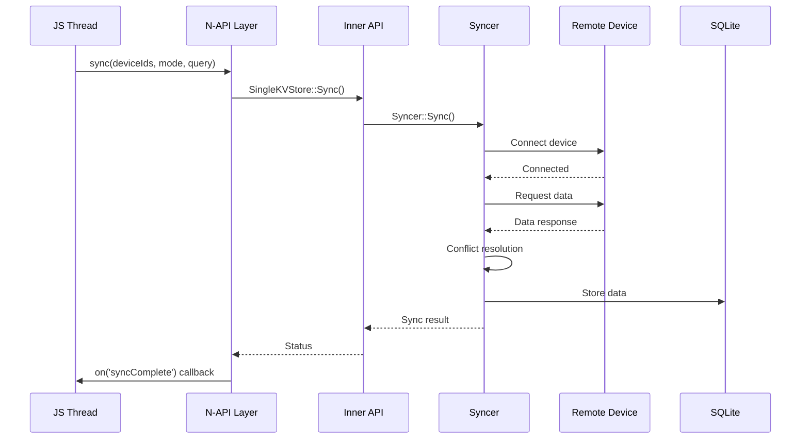

# 关键调用链

## 概述

本文档描述 KV Store 核心操作的调用链路，用于理解代码执行流程和调试分析。

## 关键调用链

### 1. 创建 KVManager

```
JS (createKVManager)
    │
    ▼
frameworks/jskitsimpl/distributeddata/src/js_kv_manager.cpp
└── JsKVManager::CreateKVManager()
    │
    ├── JSUtil::GetNamedProperty() [bundleName]
    ├── JSUtil::GetNamedProperty() [userInfo]
    ├── JSUtil::NewWithRef()
    └── DistributedKvDataManager::GetInstance()
        │
        └── (Inner API 调用)
```

**关键代码路径**：

| 步骤 | 文件 | 函数 |
|-----|------|------|
| 1 | `js_kv_manager.cpp:55` | `JsKVManager::CreateKVManager()` |
| 2 | `js_kv_manager.cpp:67` | `JSUtil::GetNamedProperty(env, argv[0], "bundleName", bundleName)` |
| 3 | `js_kv_manager.cpp:73` | `JSUtil::NewWithRef()` |

### 2. 打开 KV Store

```
JS (getKVStore)
    │
    ▼
frameworks/jskitsimpl/distributeddata/src/js_kv_manager.cpp
└── JsKVManager::GetKVStore()
    │
    ├── JSUtil::GetValue() [storeId]
    ├── JSUtil::GetValue() [options]
    └── DistributedKvDataManager::GetKvStore()
        │
        ├── SingleKVStore::Open()
        └── (IPC 调用到服务进程)
```

**关键代码路径**：

| 步骤 | 文件 | 函数 |
|-----|------|------|
| 1 | `js_kv_manager.cpp:88-107` | `GetKVStoreContext::GetCbInfo()` |
| 2 | `distributed_kv_data_manager.h` | `DistributedKvDataManager::GetKvStore()` |

### 3. Put 操作

```
JS (kvStore.put(key, value))
    │
    ▼
frameworks/jskitsimpl/distributedkvstore/src/js_single_kv_store.cpp
└── JsSingleKVStore::Put()
    │
    ├── NapiAsyncExecute()
    ├── JSUtil::GetValue() [key]
    ├── JSUtil::GetValue() [value]
    │
    └── SingleKVStore::Put()
        │
        └── KvStoreNbDelegate::Put()
            │
            └── SQLiteStorage::Put()
```

**关键代码路径**：

| 步骤 | 文件 | 函数 |
|-----|------|------|
| 1 | `js_single_kv_store.cpp:175` | `JsSingleKVStore::Put()` |
| 2 | `js_single_kv_store.cpp:182-190` | `JSUtil::GetValue()` 参数解析 |
| 3 | `single_kvstore.h` | `SingleKVStore::Put()` |

### 4. Get 操作

```
JS (kvStore.get(key))
    │
    ▼
frameworks/jskitsimpl/distributedkvstore/src/js_single_kv_store.cpp
└── JsSingleKVStore::Get()
    │
    ├── JSUtil::GetValue() [key]
    ├── SingleKVStore::Get()
    │
    └── KvStoreNbDelegate::Get()
        │
        └── SQLiteStorage::Get()
            │
            └── SQLite query execution
```

**关键代码路径**：

| 步骤 | 文件 | 函数 |
|-----|------|------|
| 1 | `js_single_kv_store.cpp:957` | `JsSingleKVStore::Get()` |
| 2 | `js_single_kv_store.cpp:964-988` | `JSUtil::GetValue()` + `Get()` |
| 3 | `js_single_kv_store.cpp:990-1002` | 结果转换 |

### 5. Sync 操作

```
JS (kvStore.sync(deviceIds, mode, query))
    │
    ▼
frameworks/jskitsimpl/distributedkvstore/src/js_single_kv_store.cpp
└── JsSingleKVStore::Sync()
    │
    ├── JSUtil::GetValue() [deviceIds]
    ├── JSUtil::GetValue() [mode]
    ├── JSUtil::GetValue() [query]
    │
    └── SingleKVStore::Sync()
        │
        ├── DeviceSyncManager::Sync()
        │
        └── Syncer::Sync()
            │
            ├── Device discovery
            ├── Data transfer
            └── Conflict resolution
```

**关键代码路径**：

| 步骤 | 文件 | 函数 |
|-----|------|------|
| 1 | `js_single_kv_store.cpp:1314` | `JsSingleKVStore::Sync()` |
| 2 | `js_single_kv_store.cpp:1266-1310` | 参数解析 |
| 3 | `single_kvstore.h` | `SingleKVStore::Sync()` |

### 6. 数据变更通知

```
Database Change
    │
    ▼
frameworks/libs/distributeddb/
└── ObserverManager::Notify()
    │
    ├── KvStoreObserver::OnChange()
    │
    └── JsSingleKVStore::OnDataChange()
        │
        └── napi_call_js_callback()
            │
            └── JS Listener
```

**关键代码路径**：

| 步骤 | 文件 | 函数 |
|-----|------|------|
| 1 | `distributeddb` | `ObserverManager::Notify()` |
| 2 | `js_single_kv_store.cpp:731-768` | `JsSingleKVStore::OnDataChange()` |
| 3 | `js_single_kv_store.cpp:932-956` | 回调参数构造 |

## 调用时序图

### Put 操作时序



### Sync 操作时序



## 入口点清单

| 功能 | 入口文件 | 主要函数 |
|-----|---------|---------|
| 创建 KVManager | `js_kv_manager.cpp` | `JsKVManager::CreateKVManager()` |
| 打开 Store | `js_kv_manager.cpp` | `JsKVManager::GetKVStore()` |
| 写操作 | `js_single_kv_store.cpp` | `JsSingleKVStore::Put()` |
| 读操作 | `js_single_kv_store.cpp` | `JsSingleKVStore::Get()` |
| 批量写 | `js_single_kv_store.cpp` | `JsSingleKVStore::PutBatch()` |
| 查询 | `js_single_kv_store.cpp` | `JsSingleKVStore::GetEntries()` |
| 同步 | `js_single_kv_store.cpp` | `JsSingleKVStore::Sync()` |
| 备份 | `js_single_kv_store.cpp` | `JsSingleKVStore::Backup()` |
| 恢复 | `js_single_kv_store.cpp` | `JsSingleKVStore::Restore()` |
| 查询构建 | `js_query.cpp` | `JsQuery::*()` |

## 相关文档

- [架构设计](02_Architecture.md)
- [N-API 接口参考](03_NAPI_Reference.md)
- [Inner API 参考](04_Inner_API.md)
