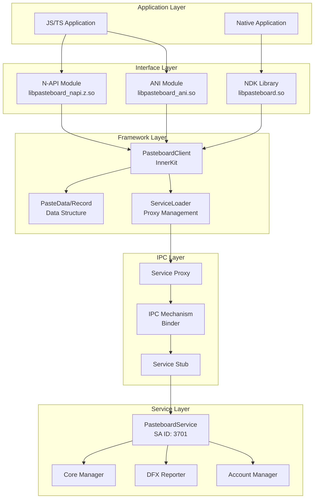
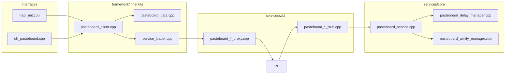
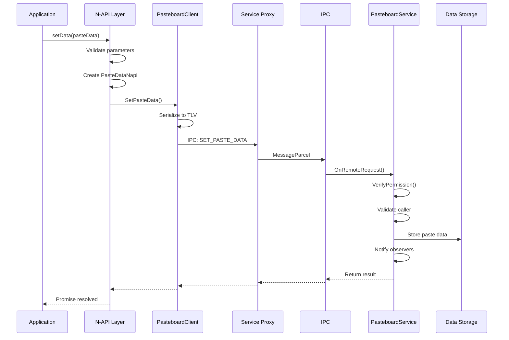
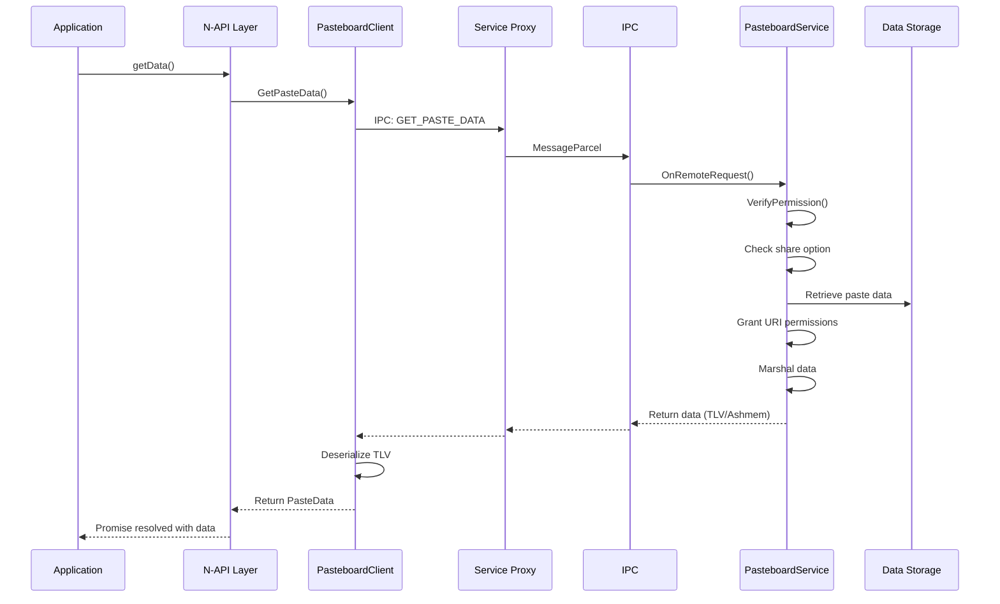
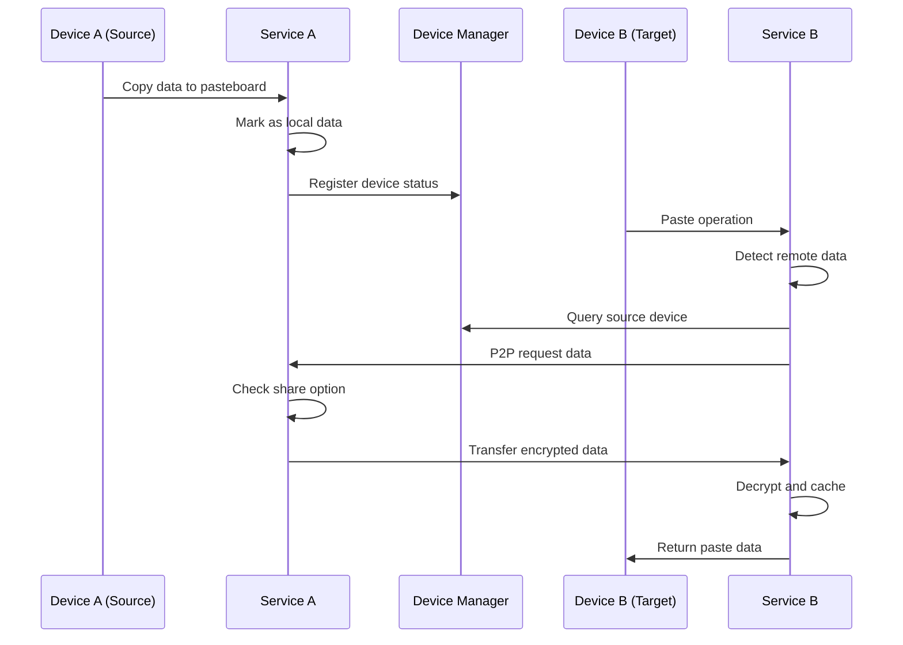
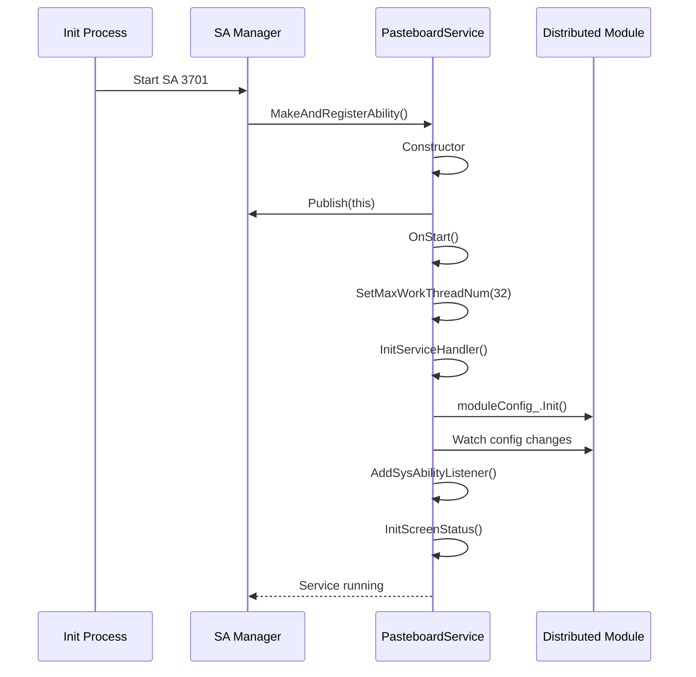
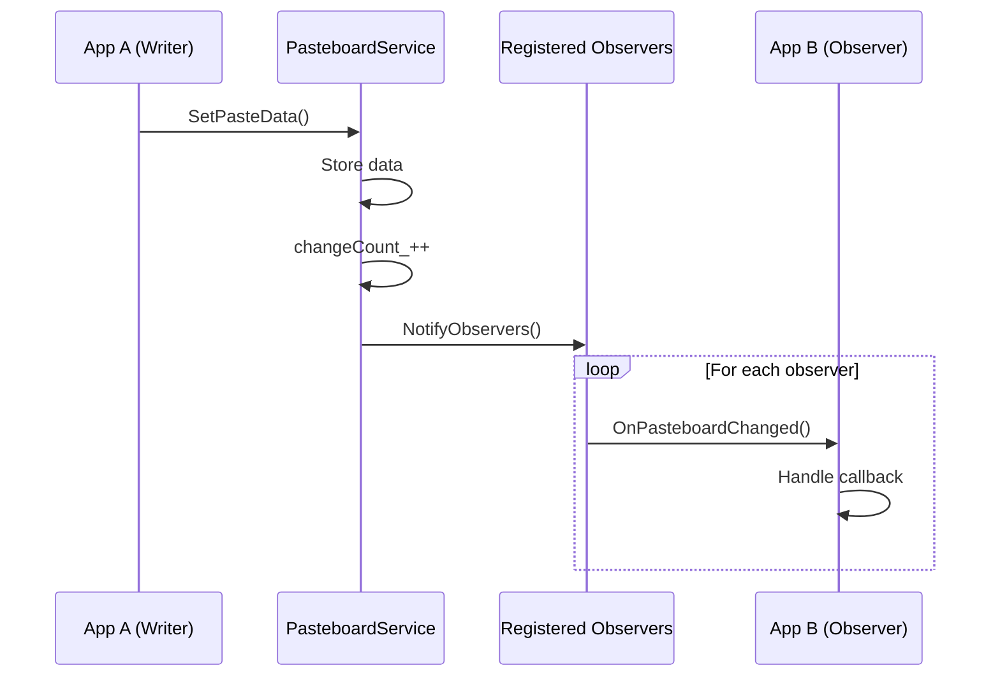
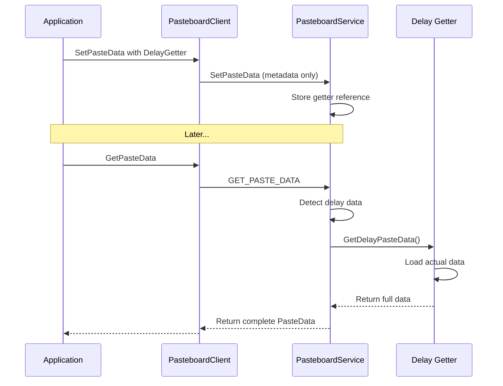

# 架构说明

## 目的

本文档详细说明 Pasteboard 剪贴板服务的系统架构，包括组件图、数据流、线程模型和关键时序。

## 适用范围

- 需要理解系统整体架构的开发者
- 进行模块设计或重构的架构师
- 进行性能优化或问题定位的工程师

## 系统架构图

### 整体架构



### 模块依赖关系



## 数据流图

### SetPasteData 数据流（写入剪贴板）



### GetPasteData 数据流（读取剪贴板）



### 分布式数据同步流



## 线程模型

### 服务线程架构

```mermaid
graph TB
    subgraph "Main Thread"
        OnStart[OnStart() - Service Init]
        Init[Init() - Publish SA]
        Handler[EventHandler<br/>Event Processing]
    end
    
    subgraph "IPC Thread Pool"
        IPC1[IPC Thread 1<br/>OnRemoteRequest]
        IPC2[IPC Thread 2<br/>OnRemoteRequest]
        IPC3[IPC Thread N<br/>...]
    end
    
    subgraph "FFRT Task Queue"
        FFRT1[Delay Getter Task]
        FFRT2[Data Sync Task]
        FFRT3[Entity Recognition]
    end
    
    OnStart --> Init
    Init --> Handler
    
    IPC1 --> Handler
    IPC2 --> Handler
    
    Handler --> FFRT1
    Handler --> FFRT2
    Handler --> FFRT3
```

### 线程配置

```cpp
// services/core/src/pasteboard_service.cpp:82
constexpr uint32_t MAX_IPC_THREAD_NUM = 32;  // IPC 线程池最大线程数

// OnStart() 中设置
IPCSkeleton::SetMaxWorkThreadNum(MAX_IPC_THREAD_NUM);
```

### 线程安全机制

| 资源 | 锁机制 | 代码位置 |
|------|--------|----------|
| pasteData_ | shared_mutex (pasteDataMutex_) | `pasteboard_service.cpp:122` |
| dataHistory_ | mutex (historyMutex_) | `pasteboard_service.cpp:121` |
| observerSet_ | mutex (observerSetMutex_) | `pasteboard_client.cpp:587` |
| clients_ | 内部封装 | `pasteboard_service.h:267` |

## 关键时序

### 服务启动时序



### 数据变化通知时序



### 延迟加载时序



## 组件职责

### Interface Layer

| 组件 | 职责 | 关键文件 |
|------|------|----------|
| **N-API** | JS/TS 接口封装，参数转换 | `interfaces/kits/napi/src/napi_*.cpp` |
| **NDK** | C 接口封装，内存管理 | `interfaces/ndk/src/oh_pasteboard.cpp` |
| **CJ FFI** | Cangjie 语言桥接 | `interfaces/cj/src/pasteboard_ffi.cpp` |
| **ANI** | ArkTS Native 接口 | `interfaces/ani/src/pasteboard_ani.cpp` |

### Framework Layer

| 组件 | 职责 | 关键文件 |
|------|------|----------|
| **PasteboardClient** | 客户端 API，服务发现 | `framework/innerkits/src/pasteboard_client.cpp` |
| **PasteData** | 数据模型，序列化 | `framework/innerkits/src/paste_data.cpp` |
| **ServiceLoader** | SA 连接管理 | `framework/innerkits/src/pasteboard_service_loader.cpp` |
| **TLV** | 数据序列化/反序列化 | `framework/tlv/tlv_*.cpp` |

### Service Layer

| 组件 | 职责 | 关键文件 |
|------|------|----------|
| **PasteboardService** | 核心服务，IPC 处理 | `services/core/src/pasteboard_service.cpp` |
| **DelayManager** | 延迟数据管理 | `services/core/src/pasteboard_delay_manager.cpp` |
| **AbilityManager** | Ability 生命周期 | `services/core/src/pasteboard_ability_manager.cpp` |
| **DFX** | 诊断、日志、事件 | `services/dfx/src/*.cpp` |

## 关键结论

1. **分层架构**: 清晰的 Interface → Framework → Service 三层结构，职责分离明确。

2. **异步设计**: 主要 API 支持异步调用（Promise/Callback），避免阻塞主线程。

3. **IPC 优化**: 32 线程 IPC 池处理并发请求，FFRT 任务队列处理异步操作。

4. **数据安全**: 权限验证在服务入口统一处理，ShareOption 控制数据分享范围。

5. **分布式支持**: DeviceManager 集成，P2P 数据传输，支持延迟加载优化性能。

## 相关链接

- [目录结构 → 02_Directory_Structure.md](02_Directory_Structure.md)
- [内部 API → 04_Inner_API.md](04_Inner_API.md)
- [调用链图 → appendix/Callgraphs.md](appendix/Callgraphs.md)
