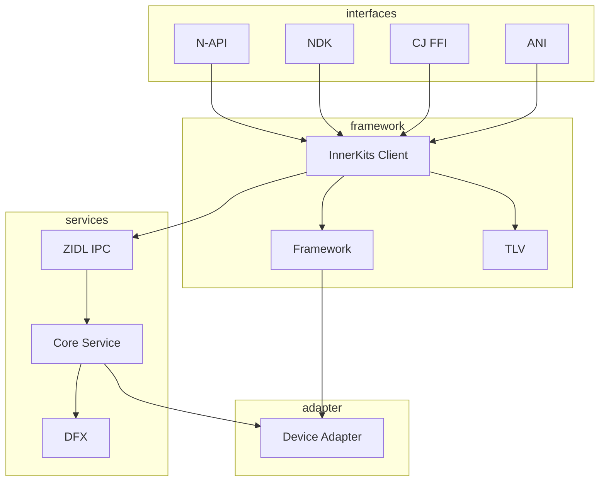

# 目录结构与模块职责

## 目的

本文档详细说明 Pasteboard 项目的目录结构、各模块职责和关键文件位置。

## 适用范围

- 需要定位代码文件的新手开发者
- 进行代码维护或重构的工程师
- 进行代码评审的人员

## 顶层目录

```
/foundation/distributeddatamgr/pasteboard/
├── adapter/           # 系统适配层
├── etc/              # 配置文件
├── figures/          # 文档图片
├── framework/        # 框架层 (InnerKits)
├── interfaces/       # 对外接口层
├── profile/          # SA 配置文件
├── services/         # 服务层
├── utils/            # 工具库
├── BUILD.gn          # 根构建文件
├── pasteboard.gni    # 构建配置
├── bundle.json       # 组件清单
└── wiki/             # 本文档
```

## 目录详解

### adapter/ - 系统适配层

**职责**: 封装与外部系统服务的交互，提供统一的适配接口。

```
adapter/
├── data_share/              # DataShare 适配
│   └── datashare_delegate.cpp    # 数据共享委托
├── pasteboard_progress/     # 进度报告适配
│   └── pasteboard_progress.cpp
├── security_level/          # 安全等级适配
│   └── security_level.cpp
├── include/                 # 公共头文件
└── src/                     # 设备画像适配
    ├── device_profile_adapter.cpp
    └── device_profile_client.cpp
```

**关键文件**:
- `data_share/datashare_delegate.cpp:32` - PASTEBOARD_SA_ID = 3701 定义
- `security_level/security_level.cpp` - 数据安全等级处理

---

### framework/ - 框架层

**职责**: 提供客户端 API 和数据模型，处理序列化、事件、设备管理。

#### framework/innerkits/ - 核心客户端库

```
framework/innerkits/
├── include/                 # 公共头文件
│   ├── pasteboard_client.h        # 客户端 API (606 行)
│   ├── paste_data.h               # 数据模型
│   ├── paste_data_record.h        # 记录模型
│   └── ...
└── src/                     # 实现
    ├── pasteboard_client.cpp      # 客户端实现
    ├── paste_data.cpp             # PasteData 实现
    ├── paste_data_record.cpp      # PasteDataRecord 实现
    ├── pasteboard_service_loader.cpp  # SA 加载器
    └── ...
```

**关键文件**:
| 文件 | 职责 | 行数 |
|------|------|------|
| `include/pasteboard_client.h` | 客户端 API 定义 | ~606 |
| `src/pasteboard_client.cpp` | 客户端实现 | ~1200+ |
| `src/paste_data.cpp` | 数据模型实现 | ~900+ |
| `src/pasteboard_service_loader.cpp` | 服务发现和连接 | ~267 |

#### framework/framework/ - 框架模块

```
framework/framework/
├── clip/                    # 剪贴板插件接口
│   ├── clip_plugin.cpp
│   └── default_clip.cpp
├── device/                  # 设备管理
│   ├── dm_adapter.cpp       # DeviceManager 适配
│   ├── dev_profile.cpp      # 设备画像
│   └── distributed_module_config.cpp
├── eventcenter/             # 事件中心
│   ├── event_center.cpp
│   ├── event.cpp
│   └── pasteboard_event.cpp
├── ffrt/                    # FFRT 任务工具
│   └── ffrt_utils.cpp
├── include/                 # 内部头文件
│   ├── clip/
│   ├── device/
│   ├── eventcenter/
│   ├── permission/
│   └── ...
├── permission/              # 权限工具
│   └── permission_utils.cpp
└── serializable/            # 序列化工具
    └── serializable.cpp
```

**关键文件**:
- `permission/permission_utils.cpp:23` - 权限检查核心实现
- `device/dm_adapter.cpp` - 分布式设备管理

#### framework/tlv/ - TLV 序列化

```
framework/tlv/
├── tlv_readable.h           # TLV 读取
├── tlv_writeable.cpp        # TLV 写入
├── tlv_utils.cpp            # TLV 工具
├── message_parcel_warp.cpp  # 消息封装
└── pasteboard_tlv.gni       # TLV 源文件列表
```

---

### interfaces/ - 对外接口层

**职责**: 提供多种语言的 API 接口。

#### interfaces/kits/napi/ - JavaScript/TypeScript 接口

```
interfaces/kits/napi/
├── include/                 # N-API 头文件
│   ├── napi_pasteboard.h
│   ├── napi_pastedata.h
│   └── ...
└── src/                     # N-API 实现
    ├── napi_init.cpp              # 模块注册入口 (line 55)
    ├── napi_pasteboard.cpp        # 主 API 实现
    ├── napi_systempasteboard.cpp  # SystemPasteboard
    ├── napi_pastedata.cpp         # PasteData
    ├── napi_pastedata_record.cpp  # PasteDataRecord
    ├── async_call.cpp             # 异步调用工具
    └── napi_data_utils.cpp        # 数据转换工具
```

**关键文件**:
| 文件 | 职责 | 关键行 |
|------|------|--------|
| `src/napi_init.cpp` | 模块注册 | 55: napi_module_register |
| `src/napi_pasteboard.cpp` | 静态方法导出 | 300: ShareOption 定义 |
| `src/napi_systempasteboard.cpp` | SystemPasteboard 方法 | 726: 权限错误处理 |
| `BUILD.gn` | N-API 构建配置 | 17: ohos_shared_library |

#### interfaces/ndk/ - C/C++ NDK 接口

```
interfaces/ndk/
├── include/                 # 公共头文件
│   ├── oh_pasteboard.h           # NDK 主头文件
│   └── oh_pasteboard_err_code.h  # 错误码
├── src/                     # 实现
│   └── oh_pasteboard.cpp         # NDK 实现
└── unittest/               # NDK 单元测试
```

**关键文件**:
- `include/oh_pasteboard.h` - NDK API 定义
- `src/oh_pasteboard.cpp:28` - MAX_PATH_LEN = 1024

#### interfaces/cj/ - Cangjie FFI 接口

```
interfaces/cj/
├── include/
├── src/
│   ├── pasteboard_ffi.cpp        # FFI 桥接
│   ├── system_pasteboard_impl.cpp
│   └── paste_data_impl.cpp
└── BUILD.gn
```

#### interfaces/ani/ - ArkTS Native Interface

```
interfaces/ani/
└── src/
    └── pasteboard_ani.cpp        # ANI 实现
```

#### interfaces/taihe/ - Taihe 接口

```
interfaces/taihe/
└── src/
    └── ohos.pasteboard.pasteboard.impl.cpp  # Taihe 实现
```

---

### services/ - 服务层

**职责**: 核心服务实现，处理 IPC 请求，管理剪贴板数据。

#### services/core/ - 核心服务

```
services/core/
├── include/                 # 服务头文件
│   ├── pasteboard_service.h           # 主服务类 (line 120)
│   ├── pasteboard_serv_ipc_interface_code.h  # IPC 代码
│   └── ...
└── src/                     # 服务实现
    ├── pasteboard_service.cpp           # 主服务实现 (5600+ 行)
    ├── pasteboard_delay_manager.cpp     # 延迟数据管理
    ├── pasteboard_ability_manager.cpp   # Ability 管理
    ├── pasteboard_dialog.cpp            # 对话框管理
    ├── pasteboard_disposable_manager.cpp # 一次性数据管理
    ├── pasteboard_pattern.cpp           # 模式识别
    └── pasteboard_window_manager.cpp    # 窗口管理
```

**关键文件**:
| 文件 | 职责 | 关键行 |
|------|------|--------|
| `src/pasteboard_service.cpp` | 主服务 | 89: SECURE_PASTE_PERMISSION |
| `include/pasteboard_service.h` | 类定义 | 120: class PasteboardService |
| `include/pasteboard_serv_ipc_interface_code.h` | IPC 代码 | SA ID = 3701 |

#### services/zidl/ - IPC 定义

```
services/zidl/
├── include/                 # Stub/Proxy 头文件
│   ├── pasteboard_observer_stub.h
│   ├── pasteboard_observer_proxy.h
│   ├── pasteboard_delay_getter_stub.h
│   ├── pasteboard_entry_getter_stub.h
│   └── entity_recognition_observer_stub.h
└── src/                     # Stub/Proxy 实现
    ├── pasteboard_observer_stub.cpp       # Observer Stub
    ├── pasteboard_observer_proxy.cpp      # Observer Proxy
    ├── pasteboard_delay_getter_stub.cpp   # Delay Getter Stub
    ├── pasteboard_delay_getter_proxy.cpp  # Delay Getter Proxy
    ├── pasteboard_entry_getter_stub.cpp   # Entry Getter Stub
    ├── pasteboard_entry_getter_proxy.cpp  # Entry Getter Proxy
    ├── entity_recognition_observer_stub.cpp
    └── entity_recognition_observer_proxy.cpp
```

**关键文件**:
- `src/pasteboard_observer_stub.cpp:33` - OnRemoteRequest 实现
- `src/pasteboard_observer_proxy.cpp` - IPC 调用封装

#### services/dfx/ - 诊断与遥测

```
services/dfx/
└── src/
    ├── pasteboard_event_dfx.cpp       # DFX 事件
    ├── pasteboard_trace.cpp           # 性能跟踪
    ├── reporter.cpp                   # 事件上报
    ├── pasteboard_dump_helper.cpp     # Dump 工具
    ├── hiview_adapter.cpp             # HiView 集成
    ├── command.cpp                    # 命令模式
    ├── calculate_time_consuming.cpp   # 耗时计算
    ├── fault/                         # 故障处理
    │   └── pasteboard_fault_impl.cpp
    ├── behaviour/                     # 行为报告
    │   └── pasteboard_behaviour_reporter_impl.cpp
    └── statistic/                     # 统计
        └── time_consuming_statistic_impl.cpp
```

#### services/account/ - 账户管理

```
services/account/
└── src/
    └── account_manager.cpp            # 多账户支持
```

#### services/load/ - 动态加载

```
services/load/
└── src/
    ├── loader.cpp                     # 动态库加载 (dlopen)
    └── config.cpp                     # 配置解析
```

#### services/dialog/ - 对话框 HAP

```
services/dialog/
└── BUILD.gn                         # 构建 HAP 包
```

---

### utils/ - 工具库

**职责**: 提供日志、错误码、时间等通用工具。

```
utils/
├── native/
│   ├── include/               # 工具头文件
│   │   ├── pasteboard_hilog.h       # 日志宏
│   │   ├── pasteboard_error.h       # 错误码
│   │   ├── pasteboard_time.h        # 时间工具
│   │   └── pasteboard_common.h      # 通用工具
│   └── src/                   # 工具实现
│       └── ...
└── mock/                      # Mock 数据
    └── include/
```

**关键文件**:
- `native/include/pasteboard_error.h` - 错误码定义
- `native/include/pasteboard_hilog.h` - 日志宏

---

### etc/ - 配置文件

```
etc/init/
├── BUILD.gn                   # 构建配置
└── pasteboardservice.cfg      # 服务启动配置
```

**关键文件**:
- `pasteboardservice.cfg` - SA 启动脚本

---

### profile/ - SA 配置文件

```
profile/
├── BUILD.gn
└── 3701.json                  # SA ID 3701 配置
```

**内容**:
```json
{
    "name": "pasteboard_service",
    "id": 3701,
    "distributed": true,
    "process": "pasteboardservice",
    "start-on-install": true
}
```

## 模块依赖图



## 关键结论

1. **清晰分层**: Interface → Framework → Service → Adapter 四层结构，职责明确。

2. **多语言支持**: interfaces/ 下提供 5 种语言绑定，共享 framework/innerkits 核心。

3. **IPC 分离**: services/zidl/ 独立管理 IPC stub/proxy，便于维护和扩展。

4. **配置集中**: etc/ 和 profile/ 集中管理启动配置和 SA 定义。

5. **工具复用**: utils/ 提供跨模块通用工具，避免重复实现。

## 相关链接

- [架构说明 → 01_Architecture.md](01_Architecture.md)
- [N-API 参考 → 03_NAPI_Reference.md](03_NAPI_Reference.md)
- [内部 API → 04_Inner_API.md](04_Inner_API.md)
