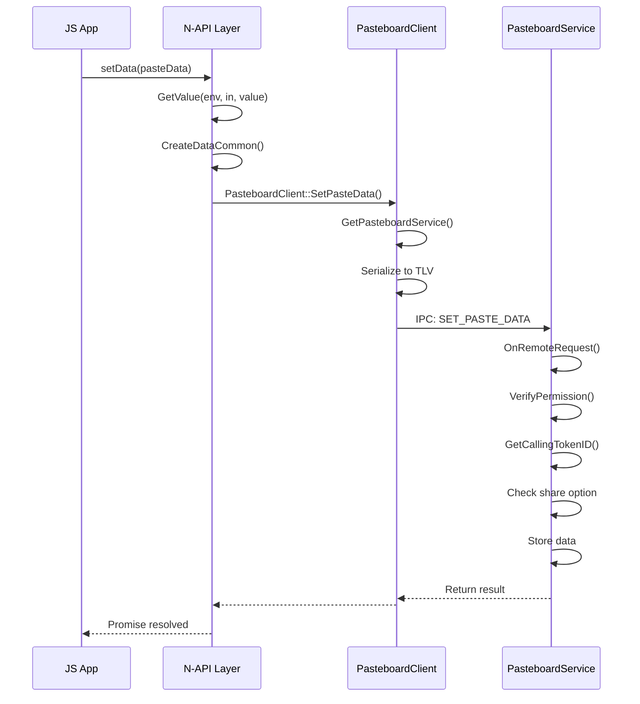
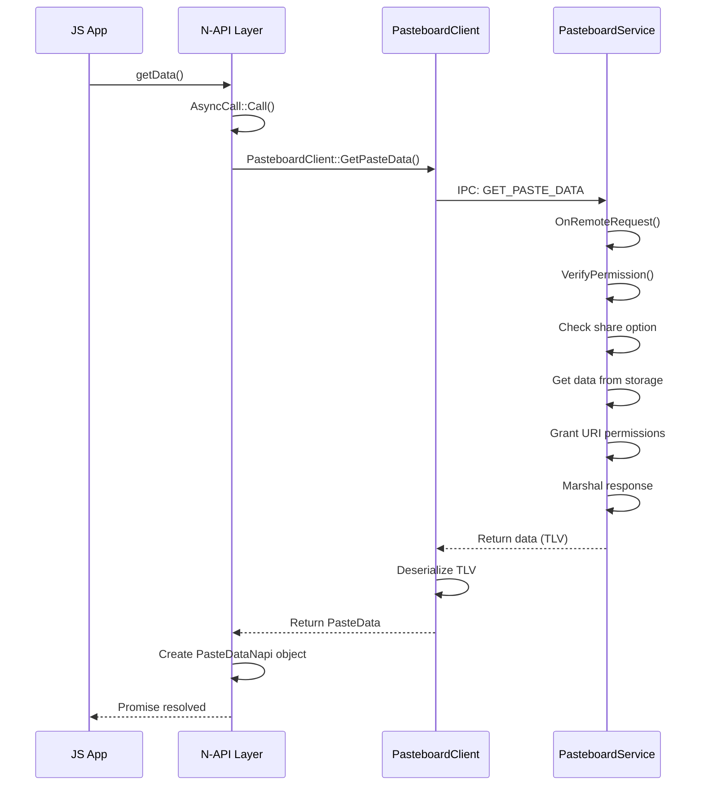

# N-API 参考

## 目的

本文档详细说明 Pasteboard N-API 的导出方法、参数校验、错误码和调用链。

## 适用范围

- 使用 JavaScript/TypeScript 开发应用的开发者
- 需要理解 JS API 实现的维护者
- 进行接口评审或安全审计的人员

## 模块注册

### 注册点

```cpp
// interfaces/kits/napi/src/napi_init.cpp:42-56
static napi_module _module = { 
    .nm_version = 1,
    .nm_flags = 0,
    .nm_filename = "pasteboard",
    .nm_register_func = NapiInit,
    .nm_modname = "pasteboard",
    .nm_priv = ((void *)0),
    .reserved = { 0 } 
};

extern "C" __attribute__((constructor)) void RegisterModule(void)
{
    napi_module_register(&_module);
}
```

### 初始化函数

```cpp
// interfaces/kits/napi/src/napi_init.cpp:25-36
static napi_value NapiInit(napi_env env, napi_value exports)
{
    PasteDataRecordNapi::PasteDataRecordInit(env, exports);
    PasteDataNapi::PasteDataInit(env, exports);
    SystemPasteboardNapi::SystemPasteboardInit(env, exports);
    PasteboardNapi::PasteBoardInit(env, exports);
    ProgressSignalNapi::ProgressSignalNapiInit(env, exports);
    return exports;
}
```

### JS 导入方式

```javascript
import pasteboard from '@ohos.pasteboard';
```

## 导出方法清单

### Pasteboard (静态方法)

| 方法名 | 参数 | 返回值 | 说明 | C++ 实现 |
|--------|------|--------|------|----------|
| `createPlainTextData` | `text: string` | `PasteData` | 创建纯文本数据 | `napi_pasteboard.cpp:138` |
| `createHtmlData` | `htmlText: string` | `PasteData` | 创建 HTML 数据 | `napi_pasteboard.cpp:123` |
| `createUriData` | `uri: string` | `PasteData` | 创建 URI 数据 | `napi_pasteboard.cpp:153` |
| `createWantData` | `want: Want` | `PasteData` | 创建 Want 数据 | `napi_pasteboard.cpp:189` |
| `createPixelMapData` | `pixelMap: PixelMap` | `PasteData` | 创建图片数据 | `napi_pasteboard.cpp:168` |
| `createRecord` | `mimeType: string, value: ValueType` | `PasteDataRecord` | 创建自定义记录 | `napi_pastedata_record.cpp` |
| `createDelayRecord` | `mimeTypes: string[], entryGetter: EntryGetter` | `PasteDataRecord` | 创建延迟加载记录 | `napi_pastedata_record.cpp` |
| `createPlainTextRecord` | `text: string` | `PasteDataRecord` | 创建纯文本记录 | `napi_pasteboard.cpp:42` |
| `createHtmlTextRecord` | `htmlText: string` | `PasteDataRecord` | 创建 HTML 记录 | `napi_pasteboard.cpp:27` |
| `createUriRecord` | `uri: string` | `PasteDataRecord` | 创建 URI 记录 | `napi_pasteboard.cpp:57` |
| `createPixelMapRecord` | `pixelMap: PixelMap` | `PasteDataRecord` | 创建图片记录 | `napi_pasteboard.cpp:72` |
| `createWantRecord` | `want: Want` | `PasteDataRecord` | 创建 Want 记录 | `napi_pasteboard.cpp:86` |
| `getSystemPasteboard` | - | `SystemPasteboard` | 获取系统剪贴板 | `napi_pasteboard.cpp:618` |

### SystemPasteboard 方法

| 方法名 | 参数 | 返回值 | 同步/异步 | C++ 实现 |
|--------|------|--------|-----------|----------|
| `setData` | `data: PasteData` | `void` | Promise | `napi_systempasteboard.cpp:500` |
| `setData` | `data: PasteData, callback: AsyncCallback` | `void` | Callback | `napi_systempasteboard.cpp:500` |
| `getData` | - | `PasteData` | Promise | `napi_systempasteboard.cpp:300` |
| `getData` | `callback: AsyncCallback` | `void` | Callback | `napi_systempasteboard.cpp:300` |
| `hasData` | - | `boolean` | Promise | `napi_systempasteboard.cpp:200` |
| `hasData` | `callback: AsyncCallback` | `void` | Callback | `napi_systempasteboard.cpp:200` |
| `clearData` | - | `void` | Promise | `napi_systempasteboard.cpp:100` |
| `clearData` | `callback: AsyncCallback` | `void` | Callback | `napi_systempasteboard.cpp:100` |
| `on('update')` | `callback: () => void` | `void` | 同步 | `napi_systempasteboard.cpp:700` |
| `off('update')` | `callback?: () => void` | `void` | 同步 | `napi_systempasteboard.cpp:750` |

### PasteData 方法

| 方法名 | 参数 | 返回值 | C++ 实现 |
|--------|------|--------|----------|
| `addRecord` | `record: PasteDataRecord` | `void` | `napi_pastedata.cpp:200` |
| `addTextRecord` | `text: string` | `void` | `napi_pastedata.cpp:220` |
| `addHtmlRecord` | `htmlText: string` | `void` | `napi_pastedata.cpp:240` |
| `addUriRecord` | `uri: string` | `void` | `napi_pastedata.cpp:260` |
| `addWantRecord` | `want: Want` | `void` | `napi_pastedata.cpp:280` |
| `getRecord` | `index: number` | `PasteDataRecord` | `napi_pastedata.cpp:300` |
| `getRecordCount` | - | `number` | `napi_pastedata.cpp:320` |
| `hasMimeType` | `mimeType: string` | `boolean` | `napi_pastedata.cpp:340` |
| `getMimeTypes` | - | `string[]` | `napi_pastedata.cpp:360` |
| `getPrimaryText` | - | `string` | `napi_pastedata.cpp:380` |
| `getPrimaryHtml` | - | `string` | `napi_pastedata.cpp:400` |
| `getPrimaryUri` | - | `string` | `napi_pastedata.cpp:420` |
| `getPrimaryWant` | - | `Want` | `napi_pastedata.cpp:440` |
| `getPrimaryPixelMap` | - | `PixelMap` | `napi_pastedata.cpp:460` |
| `getPrimaryMimeType` | - | `string` | `napi_pastedata.cpp:480` |
| `removeRecord` | `index: number` | `boolean` | `napi_pastedata.cpp:500` |
| `replaceRecord` | `index: number, record: PasteDataRecord` | `boolean` | `napi_pastedata.cpp:520` |
| `getProperty` | - | `PasteDataProperty` | `napi_pastedata.cpp:540` |
| `setProperty` | `property: PasteDataProperty` | `void` | `napi_pastedata.cpp:560` |
| `convertToText` | - | `Promise<string>` | `napi_pastedata.cpp:580` |

### PasteDataRecord 方法

| 方法名 | 参数 | 返回值 | C++ 实现 |
|--------|------|--------|----------|
| `convertToText` | - | `Promise<string>` | `napi_pastedata_record.cpp:400` |
| `convertToTextV9` | - | `Promise<string>` | `napi_pastedata_record.cpp:420` |

### 常量与枚举

```cpp
// interfaces/kits/napi/src/napi_pasteboard.cpp:284-305
// ShareOption 枚举
enum ShareOption {
    InApp = 0,       // 仅同应用
    LocalDevice = 1, // 仅本设备
    CrossDevice = 2  // 跨设备
};

// Pattern 枚举
enum Pattern {
    PatternText = 0,
    PatternNumber = 1,
    PatternEmail = 2,
    PatternUrl = 3
};

// 常量
MAX_RECORD_NUM = 128
MIMETYPE_TEXT_PLAIN = "text/plain"
MIMETYPE_TEXT_HTML = "text/html"
MIMETYPE_TEXT_URI = "text/uri"
MIMETYPE_TEXT_WANT = "text/want"
MIMETYPE_PIXELMAP = "image/pixelmap"
```

## 参数校验

### 字符串长度限制

| 参数 | 最大长度 | 校验位置 |
|------|----------|----------|
| `text` (纯文本) | 100MB | `paste_data_record.cpp:26` |
| `htmlText` | 100MB | `paste_data_record.cpp:26` |
| `mimeType` | 1024 字节 | 多处检查 |
| `bundleName` | 127 字节 | `pasteboard_service.cpp:108` |
| `pasteId` | 1024 字节 | `paste_data.cpp:63` |
| `uri` | 1024 字节 | `oh_pasteboard.cpp:28` |

### 类型校验示例

```cpp
// interfaces/kits/napi/src/napi_pasteboard.cpp:274-279
napi_valuetype valueType = napi_undefined;
NAPI_CALL(env, napi_typeof(env, argv[0], &valueType));
NAPI_ASSERT(env, valueType == napi_object, "Wrong argument type. Object expected.");
```

### 参数数量校验

```cpp
// interfaces/kits/napi/src/napi_pasteboard.cpp:257-262
NAPI_CALL(env, napi_get_cb_info(env, info, &argc, argv, &thisVar, NULL));
NAPI_ASSERT(env, argc > 0, "Wrong number of arguments");
```

## 错误码

### JS 错误码映射

```cpp
// interfaces/kits/napi/src/napi_data_utils.cpp:27
{JSErrorCode::NO_PERMISSION, "Permission verification failed. A non-permission application calls a API."}
```

| 错误码 | 错误信息 | 触发场景 |
|--------|----------|----------|
| 201 | Permission verification failed | 无权限调用 API |
| 401 | Parameter error | 参数类型/数量错误 |
| 12900001 | Invalid parameter | 无效参数 |
| 12900002 | Operation failed | 操作失败 |
| 12900003 | The clipboard is empty | 剪贴板为空 |
| 12900004 | Copy or paste is in progress | 复制/粘贴进行中 |
| 12900005 | The remote data is not ready | 远程数据未就绪 |
| 12900006 | The share option is InApp | 分享限制为 InApp |

### C++ 错误码

```cpp
// utils/native/include/pasteboard_error.h
enum class PasteboardError : int32_t {
    OK = 0,
    PERMISSION_VERIFICATION_ERROR = 201,
    INVALID_PARAM_ERROR = 401,
    DATA_NOT_FOUND = 12900003,
    // ...
};
```

## 调用链

### SetData 调用链



### GetData 调用链



## 权限要求

| API | 权限 | 说明 |
|-----|------|------|
| `getData()` | `ohos.permission.READ_PASTEBOARD` | 读取剪贴板需要权限 |
| `setData()` | 无需权限 | 写入剪贴板不需要权限 |
| `clearData()` | 无需权限 | 清除剪贴板不需要权限 |
| `hasData()` | 无需权限 | 检查剪贴板不需要权限 |

## 相关链接

- [内部 API → 04_Inner_API.md](04_Inner_API.md)
- [安全评审 → 06_Security.md](06_Security.md)
- [官方 API 文档](https://gitee.com/openharmony/docs/blob/master/zh-cn/application-dev/reference/apis/js-apis-pasteboard.md)
