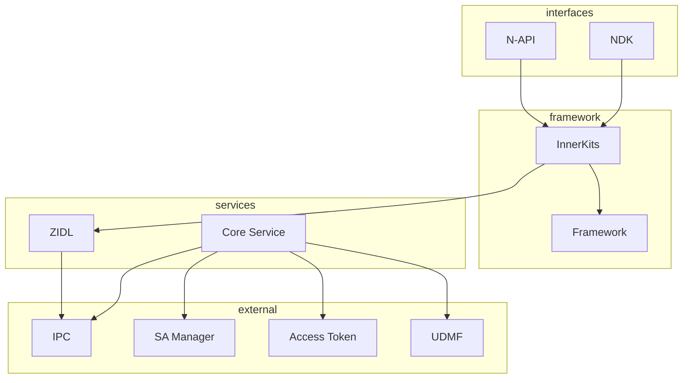

# 内部 API

## 目的

本文档详细说明 Pasteboard 内部 API，包括模块接口、依赖方向和稳定性评估。

## 适用范围

- 需要调用 InnerKit 的系统开发者
- 进行模块集成或扩展的工程师
- 进行架构评审的人员

## PasteboardClient

### 类定义

```cpp
// framework/innerkits/include/pasteboard_client.h:78
class API_EXPORT PasteboardClient {
public:
    static PasteboardClient *GetInstance();
    
    // Data creation
    std::shared_ptr<PasteData> CreatePlainTextData(const std::string &text);
    std::shared_ptr<PasteData> CreateHtmlData(const std::string &htmlText);
    std::shared_ptr<PasteData> CreateUriData(const OHOS::Uri &uri);
    std::shared_ptr<PasteData> CreatePixelMapData(std::shared_ptr<OHOS::Media::PixelMap> pixelMap);
    std::shared_ptr<PasteData> CreateWantData(std::shared_ptr<OHOS::AAFwk::Want> want);
    
    // Data operations
    int32_t SetPasteData(PasteData &pasteData);
    int32_t GetPasteData(PasteData &pasteData);
    bool HasPasteData();
    void Clear();
    
    // Observer
    bool Subscribe(PasteboardObserverType type, sptr<PasteboardObserver> callback);
    void Unsubscribe(PasteboardObserverType type, sptr<PasteboardObserver> callback);
};
```

### 主要方法

| 方法 | 参数 | 返回值 | 说明 | 代码位置 |
|------|------|--------|------|----------|
| `GetInstance` | - | `PasteboardClient*` | 获取单例 | `pasteboard_client.cpp:47` |
| `CreatePlainTextData` | `const string&` | `shared_ptr<PasteData>` | 创建纯文本 | `pasteboard_client.cpp:156` |
| `SetPasteData` | `PasteData&` | `int32_t` | 写入剪贴板 | `pasteboard_client.cpp:300` |
| `GetPasteData` | `PasteData&` | `int32_t` | 读取剪贴板 | `pasteboard_client.cpp:400` |
| `HasPasteData` | - | `bool` | 检查数据 | `pasteboard_client.cpp:500` |
| `Clear` | - | `void` | 清除剪贴板 | `pasteboard_client.cpp:550` |
| `Subscribe` | `PasteboardObserverType, sptr` | `bool` | 订阅变更 | `pasteboard_client.cpp:600` |
| `Unsubscribe` | `PasteboardObserverType, sptr` | `void` | 取消订阅 | `pasteboard_client.cpp:650` |

### 稳定性

| 级别 | 说明 |
|------|------|
| **稳定** | API_EXPORT 标记，公开头文件，可安全使用 |
| **版本** | 随 OpenHarmony 版本迭代，向后兼容 |

## IPC 接口

### IDL 定义

```idl
// services/IPasteboardService.idl
interface IPasteboardService {
    // Observer management (1-9)
    void RegisterClientDeathObserver(IPasteboardClientDeathObserver observer);
    void SubscribeObserver(PasteboardObserverType type, IPasteboardChangedObserver observer);
    void UnsubscribeObserver(PasteboardObserverType type, IPasteboardChangedObserver observer);
    // ...
    
    // Data write (100-106)
    void Clear();
    void SetPasteData(in PasteData pasteData);
    void SyncDelayedData();
    // ...
    
    // Data read (200-204)
    PasteData GetPasteData();
    void PasteStart(string pasteId);
    void PasteComplete(string deviceId, string pasteId);
    // ...
    
    // Query (300-308)
    boolean HasPasteData();
    boolean HasDataType(string mimeType);
    vector<string> GetMimeTypes();
    // ...
    
    // Share options (400-404)
    void SetGlobalShareOption(map<uint32_t, ShareOption> options);
    void SetAppShareOptions(ShareOption option);
    // ...
};
```

### IPC 命令码

```cpp
// services/core/include/pasteboard_serv_ipc_interface_code.h
enum PasteboardInterfaceCode {
    // Observer management
    REGISTER_CLIENT_DEATH_OBSERVER = 1,
    SUBSCRIBE_OBSERVER = 2,
    UNSUBSCRIBE_OBSERVER = 3,
    // ...
    
    // Data write
    CLEAR_ALL = 100,
    SET_PASTE_DATA = 104,
    SYNC_DELAYED_DATA = 106,
    
    // Data read
    GET_PASTE_DATA = 200,
    PASTE_START = 202,
    PASTE_COMPLETE = 203,
    
    // Query
    HAS_PASTE_DATA = 300,
    HAS_DATA_TYPE = 301,
    GET_MIME_TYPES = 302,
    DETECT_PATTERNS = 308,
    
    // Share options
    SET_GLOBAL_SHARE_OPTION = 400,
    SET_APP_SHARE_OPTIONS = 403,
};
```

### Stub/Proxy 实现

| 接口 | Stub | Proxy | 说明 |
|------|------|-------|------|
| `IPasteboardService` | `PasteboardServiceStub` (generated) | `PasteboardServiceProxy` (generated) | 主服务 IPC |
| `IPasteboardChangedObserver` | `PasteboardObserverStub` | `PasteboardObserverProxy` | 变更观察者 |
| `IPasteboardDelayGetter` | `PasteboardDelayGetterStub` | `PasteboardDelayGetterProxy` | 延迟获取 |
| `IEntityRecognitionObserver` | `EntityRecognitionObserverStub` | `EntityRecognitionObserverProxy` | 实体识别 |

## 模块依赖

### 依赖图



### 外部依赖

| 组件 | 用途 | 依赖类型 |
|------|------|----------|
| `ipc:ipc_single` | IPC 通信 | 必须 |
| `samgr:samgr_proxy` | SA 管理 | 必须 |
| `access_token:libaccesstoken_sdk` | 权限验证 | 必须 |
| `udmf:udmf_client` | 统一数据 | 必须 |
| `ffrt:libffrt` | 异步任务 | 必须 |
| `device_manager:devicemanagersdk` | 设备管理 | 可选 (feature) |
| `dlp_permission_service:libdlp_permission_sdk` | DLP | 可选 (feature) |
| `screenlock_mgr:screenlock_client` | 屏幕锁 | 可选 (feature) |

## 接口稳定性

### 稳定性等级

| 等级 | 接口 | 说明 |
|------|------|------|
| **稳定 (Stable)** | `PasteboardClient` 公共方法 | API_EXPORT 标记，公开文档 |
| **内部 (Internal)** | `PasteboardServiceLoader` | 内部使用，可能变更 |
| **私有 (Private)** | Service 内部类 | 不对外暴露 |
| **实验 (Experimental)** | 新特性接口 | 可能大幅变更 |

### 版本兼容性

```cpp
// framework/innerkits/include/pasteboard_client.h
// API_EXPORT 标记表示稳定接口
class API_EXPORT PasteboardClient {
    // 稳定接口，保证向后兼容
};
```

## 可替换点

### 1. Clip Plugin

```cpp
// framework/framework/clip/clip_plugin.h
class ClipPlugin {
public:
    virtual bool Copy(const std::string& content) = 0;
    virtual std::string Paste() = 0;
};
```

**用途**: 可替换剪贴板底层实现，如集成第三方剪贴板服务。

### 2. Device Adapter

```cpp
// framework/framework/device/dm_adapter.h
class DMAdapter {
public:
    virtual std::vector<std::string> GetTrustedDevices() = 0;
    virtual void SubscribeDeviceChange(std::function<void()> callback) = 0;
};
```

**用途**: 可替换设备管理实现，适配不同分布式框架。

### 3. Entry Getter

```cpp
// services/zidl/include/pasteboard_entry_getter_proxy.h
class IEntryGetter {
public:
    virtual std::shared_ptr<EntryValue> GetEntryValue() = 0;
};
```

**用途**: 延迟加载数据，可自定义数据获取逻辑。

## 关键结论

1. **稳定接口**: `PasteboardClient` 是主要对外接口，API_EXPORT 标记保证稳定性。

2. **IPC 隔离**: ZIDL 层隔离客户端和服务端，便于独立升级。

3. **可选依赖**: DeviceManager、DLP、ScreenLock 等通过 feature flag 控制，支持裁剪。

4. **可扩展性**: ClipPlugin、DMAdapter 等抽象接口支持自定义实现。

## 相关链接

- [目录结构 → 02_Directory_Structure.md](02_Directory_Structure.md)
- [N-API 参考 → 03_NAPI_Reference.md](03_NAPI_Reference.md)
- [GN 构建 → 05_GN_Targets.md](05_GN_Targets.md)
