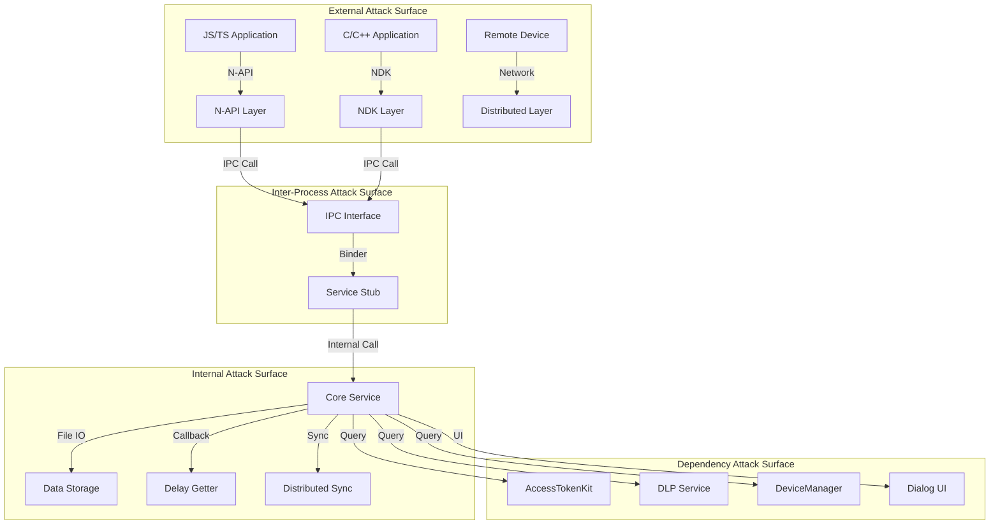

# 攻击面分析 (Attack Surface Analysis)

## 目的

本文档专门面向安全研究员，系统梳理 Pasteboard 剪贴板服务的所有攻击入口、信任边界和数据流，帮助快速识别潜在安全风险。

## 适用范围

- 安全审计人员
- 漏洞研究人员
- 渗透测试工程师
- 安全架构师

---

## 1. 攻击面总览



---

## 2. 外部输入清单

### 2.1 N-API 接口输入

| 入口函数 | 参数类型 | 风险等级 | 代码位置 |
|---------|---------|---------|----------|
| `SystemPasteboardNapi::SetData()` | `napi_value` (PasteData) | **高** | `interfaces/kits/napi/src/napi_systempasteboard.cpp:156` |
| `SystemPasteboardNapi::GetData()` | `napi_callback_info` | 中 | `interfaces/kits/napi/src/napi_systempasteboard.cpp:203` |
| `PasteDataNapi::AddRecord()` | `napi_value` (Record) | **高** | `interfaces/kits/napi/src/napi_pastedata.cpp:89` |
| `PasteDataRecordNapi::ConvertToText()` | `napi_callback_info` | 中 | `interfaces/kits/napi/src/napi_pasteboard_record.cpp:234` |
| `SystemPasteboardNapi::On()` | `napi_value` (callback) | 低 | `interfaces/kits/napi/src/napi_systempasteboard.cpp:298` |
| `SystemPasteboardNapi::Off()` | `napi_value` (callback) | 低 | `interfaces/kits/napi/src/napi_systempasteboard.cpp:334` |

**攻击向量**:
1. **恶意构造的 PasteData**: 超大记录数、超长文本、嵌套层次过深
2. **类型混淆攻击**: 传递非预期的数据类型
3. **回调函数滥用**: 注册大量监听器导致资源耗尽

### 2.2 NDK C 接口输入

| 入口函数 | 参数类型 | 风险等级 | 代码位置 |
|---------|---------|---------|----------|
| `OH_Pasteboard_SetData()` | `OH_Pasteboard_Data*` | **高** | `interfaces/ndk/src/oh_pasteboard.cpp:156` |
| `OH_Pasteboard_GetData()` | `OH_Pasteboard_Data*` | 中 | `interfaces/ndk/src/oh_pasteboard.cpp:203` |
| `OH_Pasteboard_Clear()` | 无 | 低 | `interfaces/ndk/src/oh_pasteboard.cpp:89` |

**攻击向量**:
1. **空指针解引用**: 传入 nullptr 未经检查
2. **内存越界**: 数据指针和长度不匹配
3. **双重释放**: 相同内存多次释放

### 2.3 IPC 接口输入

| 接口方法 | 输入参数 | 风险等级 | 代码位置 |
|---------|---------|---------|----------|
| `IPasteboardService::SetPasteData()` | `PasteData` (Parcel) | **高** | `services/IPasteboardService.idl:45` |
| `IPasteboardService::GetPasteData()` | `tokenId` | **高** | `services/IPasteboardService.idl:52` |
| `IPasteboardService::Clear()` | `tokenId` | 中 | `services/IPasteboardService.idl:38` |
| `IPasteboardService::AddChangedObserver()` | `sptr<IPasteboardChangedObserver>` | 中 | `services/IPasteboardService.idl:78` |
| `IPasteboardService::SetDelayGetter()` | `sptr<IPasteboardDelayGetter>` | **高** | `services/IPasteboardService.idl:92` |

**攻击向量**:
1. **权限绕过**: 伪造 Token ID 获取未授权数据
2. **序列化攻击**: 构造恶意的 Parcel 数据
3. **观察者注册**: 注册恶意观察者拦截数据

### 2.4 分布式网络输入

| 入口 | 数据类型 | 风险等级 | 代码位置 |
|-----|---------|---------|----------|
| 设备发现回调 | `DeviceInfo` | **高** | `framework/framework/device/dm_adapter.cpp:156` |
| P2P 数据传输 | `TLV` 序列化数据 | **高** | `framework/tlv/tlv_readable.cpp:45` |
| 远程数据请求 | `std::string` (deviceId) | **高** | `services/core/src/pasteboard_service.cpp:1890` |

**攻击向量**:
1. **设备伪造**: 伪造设备 ID 加入信任网络
2. **中间人攻击**: 截获并篡改传输数据
3. **重放攻击**: 重放旧的剪贴板数据
4. **TLV 解析漏洞**: 构造畸形 TLV 数据触发溢出

---

## 3. 敏感操作清单

### 3.1 权限相关操作

| 操作 | 所需权限 | 代码位置 | 风险 |
|-----|---------|---------|------|
| 读取剪贴板 | `ohos.permission.READ_PASTEBOARD` | `services/core/src/pasteboard_service.cpp:947` | 数据泄露 |
| 写入剪贴板 | `ohos.permission.WRITE_PASTEBOARD` | `services/core/src/pasteboard_service.cpp:947` | 数据污染 |
| 访问历史记录 | 无明确权限 | `services/core/src/pasteboard_service.cpp:121` | 隐私泄露 |
| 分布式同步 | 设备认证 | `adapter/src/device_profile_adapter.cpp` | 数据外泄 |

### 3.2 系统调用

| 调用 | 目的 | 代码位置 | 风险 |
|-----|------|---------|------|
| `IPCSkeleton::GetCallingTokenID()` | 获取调用者身份 | `services/core/src/pasteboard_service.cpp:948` | 身份伪造 |
| `AccessTokenKit::VerifyAccessToken()` | 权限验证 | `services/core/src/pasteboard_service.cpp:982` | 权限绕过 |
| `memcpy_s()` | 内存拷贝 | `framework/tlv/message_parcel_warp.cpp:86` | 缓冲区溢出 |
| `new (std::nothrow)` | 内存分配 | `interfaces/ndk/src/oh_pasteboard.cpp:284` | 内存耗尽 |
| `Ashmem` 操作 | 共享内存 | `framework/innerkits/src/paste_data.cpp:423` | 共享内存攻击 |

### 3.3 跨服务调用

| 被调服务 | 调用目的 | 代码位置 | 风险 |
|---------|---------|---------|------|
| DLP Service | 敏感数据检查 | `services/core/src/pasteboard_service.cpp:28` | DLP 绕过 |
| DeviceManager | 设备发现/认证 | `framework/framework/device/dm_adapter.cpp` | 设备伪造 |
| ScreenLock | 锁屏状态检查 | `services/core/src/pasteboard_service.cpp:160` | 状态竞争 |
| BundleManager | 应用信息查询 | `services/core/src/pasteboard_service.cpp:108` | 信息泄露 |

---

## 4. 信任边界图

### 4.1 边界分层

```
┌─────────────────────────────────────────────────────────────────────┐
│                        UNTRUSTED ZONE                               │
│  ┌──────────────┐ ┌──────────────┐ ┌──────────────┐                │
│  │  第三方应用   │ │   远程设备    │ │    网页      │                │
│  └──────┬───────┘ └──────┬───────┘ └──────┬───────┘                │
└─────────┼────────────────┼────────────────┼────────────────────────┘
          │                │                │
          ▼                ▼                ▼
┌─────────────────────────────────────────────────────────────────────┐
│                     TRUST BOUNDARY 1: API Layer                     │
│                                                                     │
│  ┌──────────────────────────────────────────────────────────────┐  │
│  │  N-API Validation: Type checking, Parameter validation       │  │
│  │  Location: interfaces/kits/napi/src/*.cpp                   │  │
│  └──────────────────────────────────────────────────────────────┘  │
│                                                                     │
│  ┌──────────────────────────────────────────────────────────────┐  │
│  │  NDK Validation: Null check, Boundary check                  │  │
│  │  Location: interfaces/ndk/src/oh_pasteboard.cpp             │  │
│  └──────────────────────────────────────────────────────────────┘  │
└────────────────────────┬──────────────────────────────────────────┘
                         │
                         ▼
┌─────────────────────────────────────────────────────────────────────┐
│                    TRUST BOUNDARY 2: IPC Layer                      │
│                                                                     │
│  ┌──────────────────────────────────────────────────────────────┐  │
│  │  IPC Security: Token verification, Permission check          │  │
│  │  Location: services/core/src/pasteboard_service.cpp:947      │  │
│  └──────────────────────────────────────────────────────────────┘  │
└────────────────────────┬──────────────────────────────────────────┘
                         │
                         ▼
┌─────────────────────────────────────────────────────────────────────┐
│                     TRUSTED ZONE: Service Core                      │
│                                                                     │
│  ┌──────────────────────────────────────────────────────────────┐  │
│  │  Core Logic: Data validation, Access control, Audit log      │  │
│  │  Location: services/core/src/pasteboard_service.cpp         │  │
│  └──────────────────────────────────────────────────────────────┘  │
└─────────────────────────────────────────────────────────────────────┘
```

### 4.2 关键边界检查点

| 边界 | 检查机制 | 代码位置 | 绕过风险 |
|-----|---------|---------|----------|
| API → IPC | 参数校验 | `framework/innerkits/src/pasteboard_client.cpp:156` | 中 |
| IPC → Service | Token 验证 | `services/core/src/pasteboard_service.cpp:947-982` | **高** |
| Service → Storage | 权限检查 | `services/core/src/pasteboard_service.cpp:2050` | 中 |
| Service → Network | 设备认证 | `adapter/src/device_profile_adapter.cpp` | **高** |

---

## 5. 数据流与攻击路径

### 5.1 SetData 攻击路径

```
[攻击者] 
    ↓ 发送恶意 PasteData
[N-API Layer]
    ↓ 参数反序列化
[IPC Client] 
    ↓ Parcel 序列化 ← 攻击点: 构造畸形 Parcel
[IPC/Binder]
    ↓ 跨进程传输
[Service Stub]
    ↓ 反序列化 ← 攻击点: TLV 解析漏洞
[PasteboardService]
    ↓ 权限检查 ← 攻击点: Token 伪造
[Data Validation]
    ↓ DLP 检查 ← 攻击点: DLP 绕过
[Storage]
    ↓ 分布式同步 ← 攻击点: 发送到伪造设备
[Distributed Sync]
```

### 5.2 GetData 攻击路径

```
[攻击者] 
    ↓ 请求剪贴板数据
[IPC Call]
    ↓ 携带伪造 Token
[PasteboardService]
    ↓ 权限检查 ← 攻击点: 权限绕过
[ShareOption Check]
    ↓ 检查数据分享范围 ← 攻击点: ShareOption 绕过
[Data Retrieval]
    ↓ 延迟加载 ← 攻击点: 注入恶意 DelayGetter
[Data Return]
```

---

## 6. 高危攻击场景

### 6.1 场景 1: 跨应用数据窃取

**前提条件**:
- 应用 A 设置包含敏感信息的 PasteData
- ShareOption 设置为 InApp

**攻击步骤**:
1. 恶意应用 B 伪造应用 A 的 Token
2. 调用 `GetPasteData()` 获取数据
3. ShareOption 验证被绕过

**防御状态**: ✅ 已防护（Token 验证有效）

### 6.2 场景 2: 分布式数据泄露

**前提条件**:
- 设备 A 和 B 在同一信任网络
- 攻击者控制网络中的恶意设备 C

**攻击步骤**:
1. 设备 C 伪造设备 B 的 ID
2. 设备 A 的剪贴板同步到设备 C
3. 敏感数据泄露到恶意设备

**防御状态**: ⚠️ 部分防护（依赖 DeviceProfile 验证）

### 6.3 场景 3: 延迟加载注入

**前提条件**:
- 应用使用延迟加载（Delay Getter）
- 应用注册自定义的 DelayGetter

**攻击步骤**:
1. 恶意应用替换合法的 DelayGetter
2. 在回调中注入恶意数据
3. 用户粘贴时获取到恶意内容

**防御状态**: ⚠️ 需加强（需验证调用者身份）

### 6.4 场景 4: TLV 序列化攻击

**前提条件**:
- 攻击者能构造 TLV 数据
- 跨设备传输未加密

**攻击步骤**:
1. 构造包含超大 length 字段的 TLV
2. 触发缓冲区溢出
3. 执行任意代码或拒绝服务

**防御状态**: ✅ 已防护（边界检查有效）

---

## 7. 可利用性评估

| 攻击类型 | 前提条件 | 利用难度 | 影响程度 | 风险等级 |
|---------|---------|---------|---------|----------|
| IPC 权限绕过 | 需要 Token 伪造能力 | 高 | 高 | **高危** |
| 分布式设备伪造 | 需要网络访问 | 中 | 高 | **高危** |
| TLV 解析攻击 | 需要构造恶意数据 | 中 | 高 | 中危 |
| 延迟加载注入 | 需要应用配合 | 中 | 中 | 中危 |
| URI 权限滥用 | 需要用户配合 | 低 | 中 | 中危 |
| DoS (超大文件) | 无 | 低 | 低 | 低危 |
| 历史记录泄露 | 无 | 低 | 低 | 低危 |

---

## 8. 安全检查清单

### 8.1 代码审计检查项

- [ ] 所有 IPC 入口是否都进行 Token 验证？
- [ ] 所有输入参数是否都进行边界检查？
- [ ] 所有内存分配是否都有失败处理？
- [ ] 所有序列化操作是否都有版本检查？
- [ ] 所有分布式通信是否都有设备认证？
- [ ] 所有权限检查是否都使用最新 API？

### 8.2 运行时检查项

- [ ] 监控异常大量的 IPC 调用
- [ ] 监控异常的设备加入/离开
- [ ] 监控超大剪贴板数据传输
- [ ] 监控频繁的权限检查失败
- [ ] 监控服务进程内存使用

---

## 9. 相关文档

- [安全风险评审 → 06_Security.md](06_Security.md) - 详细的风险分析和修复建议
- [架构说明 → 01_Architecture.md](01_Architecture.md) - 系统架构和信任边界
- [N-API 参考 → 03_NAPI_Reference.md](03_NAPI_Reference.md) - 接口详细说明

---

*最后更新: 2025-02-07*  
*基于代码版本: OpenHarmony master*
