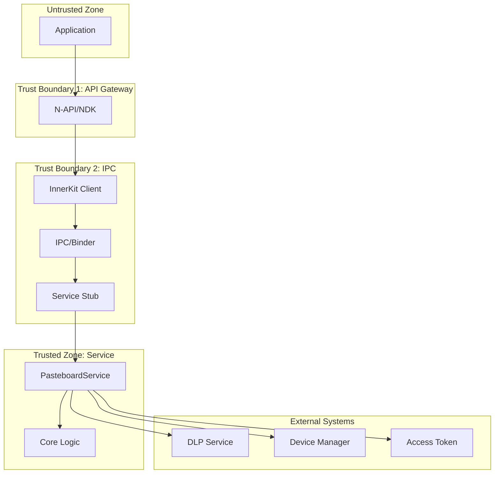

# 安全风险评审

## 目的

本文档基于代码证据对 Pasteboard 剪贴板服务进行安全风险评审，识别攻击面、信任边界和可被利用点。

## 适用范围

- 进行安全审计的人员
- 需要理解安全模型的开发者
- 进行安全加固的工程师

## 攻击面分析

### 1. 外部输入面

| 入口 | 类型 | 风险 | 防护 |
|------|------|------|------|
| **N-API** | JS 调用 | 恶意参数、类型混淆 | 参数校验、类型检查 |
| **NDK** | C 调用 | 内存越界、空指针 | 边界检查、空值校验 |
| **IPC** | 跨进程 | 权限绕过、数据篡改 | 权限验证、Token 校验 |
| **Distributed** | 网络 | 中间人攻击、数据泄露 | 加密传输、设备认证 |

### 2. 系统接口面

| 接口 | 风险 | 防护 |
|------|------|------|
| **DeviceManager** | 设备伪装 | DeviceProfile 验证 |
| **URI Permission** | 未授权访问 | Bundle 所有权检查 |
| **DLP** | 敏感数据泄露 | DLP 策略校验 |
| **ScreenLock** | 锁屏数据泄露 | 屏幕状态检查 |

### 3. 数据存储面

| 存储 | 风险 | 防护 |
|------|------|------|
| **内存缓存** | 内存泄露、信息泄露 | 大小限制、加密存储 |
| **Ashmem** | 共享内存攻击 | 权限标志、大小校验 |
| **TLV 序列化** | 反序列化漏洞 | 边界检查、深度限制 |

## 信任边界



## 风险点清单

### 风险 1: IPC 权限绕过

**证据**: `services/core/src/pasteboard_service.cpp:947-982`

```cpp
bool PasteboardService::VerifyPermission()
{
    auto tokenId = IPCSkeleton::GetCallingTokenID();
    auto callPid = IPCSkeleton::GetCallingPid();
    // ... 权限验证逻辑
    int32_t result = AccessTokenKit::VerifyAccessToken(tokenID, permissionName);
    return result == PERMISSION_GRANTED;
}
```

**触发路径**: 
1. 恶意应用调用 `GetPasteData()`
2. 服务调用 `VerifyPermission()`
3. 检查调用者 Token 和权限

**影响**: 高 - 可能导致敏感数据泄露

**防护**: 正确实现，使用 AccessTokenKit 验证

**修复建议**: 确保所有 IPC 入口都调用 VerifyPermission

---

### 风险 2: URI 权限委托滥用

**证据**: `services/core/src/pasteboard_service.cpp:2050-2137`

```cpp
bool PasteboardService::IsBundleOwnUriPermission(const std::string &uriStr, 
    const std::string &bundleName)
{
    // 验证 URI 授权
    return uriAuthority == bundleName;
}
```

**触发路径**:
1. 应用 A 复制包含 URI 的数据
2. 应用 B 尝试粘贴
3. 服务检查 URI 权限

**影响**: 中 - 可能导致未授权文件访问

**防护**: 检查 Bundle 所有权

**修复建议**: 增加更严格的 URI 权限校验

---

### 风险 3: 超大数据传输 DoS

**证据**: `framework/tlv/message_parcel_warp.cpp:86-112`

```cpp
// 分块拷贝防止内存溢出
for (size_t i = 0; i < totalSize; i += MAX_COPY_SIZE) {
    size_t copySize = std::min(MAX_COPY_SIZE, totalSize - i);
    auto ret = memcpy_s(dest + i, copySize, src + i, copySize);
}
```

**触发路径**:
1. 恶意应用创建超大 PasteData (>256MB)
2. 序列化时触发分块拷贝

**影响**: 中 - 可能导致服务 OOM

**防护**: MAX_TEXT_LEN = 100MB 限制

**修复建议**: 考虑更严格的传输限制

---

### 风险 4: TLV 反序列化漏洞

**证据**: `framework/tlv/tlv_readable.h:45-76`

```cpp
bool CheckOverflow(uint32_t size) {
    return cursor_ + size > data_.size();
}

template<typename T>
bool ReadOnlyBuffer::Read(T &value) {
    if (CheckOverflow(sizeof(T))) {
        return false;
    }
    // ...
}
```

**触发路径**:
1. 接收恶意构造的 TLV 数据
2. 反序列化时触发溢出

**影响**: 高 - 可能导致内存越界

**防护**: 边界检查 + 递归深度限制

**修复建议**: 增加 TLV 数据签名验证

---

### 风险 5: 分布式设备伪造

**证据**: `adapter/src/device_profile_adapter.cpp`

```cpp
// 设备画像验证
bool DeviceProfileAdapter::IsTrustedDevice(const std::string &deviceId)
{
    // 验证设备是否在信任列表
}
```

**触发路径**:
1. 攻击者伪造设备 ID
2. 尝试同步剪贴板数据

**影响**: 高 - 可能导致数据泄露到未授权设备

**防护**: DeviceProfile + DeviceManager 双重验证

**修复建议**: 增加设备证书链验证

---

### 风险 6: 延迟加载注入

**证据**: `services/core/src/pasteboard_delay_manager.cpp`

```cpp
// 延迟加载回调
class PasteboardDelayGetter {
    virtual std::shared_ptr<PasteData> GetDelayPasteData() = 0;
};
```

**触发路径**:
1. 恶意应用注册延迟获取器
2. 在回调中注入恶意数据

**影响**: 中 - 可能导致数据污染

**防护**: 调用者身份验证

**修复建议**: 限制延迟加载的使用场景

---

### 风险 7: 剪贴板历史泄露

**证据**: `services/core/src/pasteboard_service.cpp:121-123`

```cpp
std::mutex PasteboardService::historyMutex_;
std::vector<std::string> PasteboardService::dataHistory_;
```

**触发路径**:
1. 应用获取剪贴板历史
2. 泄露敏感信息

**影响**: 中 - 隐私泄露

**防护**: 历史记录大小限制

**修复建议**: 增加历史记录访问权限控制

---

### 风险 8: 屏幕锁状态竞争

**证据**: `services/core/src/pasteboard_service.cpp:160-173`

```cpp
void PasteboardService::InitScreenStatus()
{
    auto isScreenLocked = screenLockManager->IsScreenLocked();
    currentScreenStatus = isScreenLocked ? 
        ScreenEvent::ScreenLocked : ScreenEvent::ScreenUnlocked;
}
```

**触发路径**:
1. 锁屏瞬间访问剪贴板
2. 状态不同步导致未授权访问

**影响**: 低 - 短暂的权限窗口

**防护**: 状态监听机制

**修复建议**: 增加原子性检查

---

### 风险 9: MIME 类型混淆

**证据**: `utils/native/src/pasteboard_common.cpp`

```cpp
// MIME 类型验证
bool IsValidMimeType(const std::string &mimeType)
{
    return mimeType.length() <= MIMETYPE_MAX_SIZE;
}
```

**触发路径**:
1. 使用特殊构造的 MIME 类型
2. 可能导致解析错误

**影响**: 低 - 功能异常

**防护**: 长度限制

**修复建议**: 增加 MIME 类型白名单

---

### 风险 10: 内存未初始化

**证据**: `interfaces/ndk/src/oh_pasteboard.cpp:284-310`

```cpp
char *buffer = new (std::nothrow) char[size];
// 缺少初始化检查
```

**触发路径**:
1. 分配内存失败
2. 使用未初始化内存

**影响**: 低 - 未定义行为

**防护**: new (std::nothrow) + 空检查

**修复建议**: 增加初始化检查

## 修复建议汇总

### 高优先级

1. **增加 TLV 数据签名验证**
   - 文件: `framework/tlv/tlv_writeable.cpp`
   - 建议: 添加 HMAC 签名

2. **增强分布式设备认证**
   - 文件: `adapter/src/device_profile_adapter.cpp`
   - 建议: 证书链验证

3. **完善延迟加载安全**
   - 文件: `services/core/src/pasteboard_delay_manager.cpp`
   - 建议: 调用者白名单

### 中优先级

4. **限制传输大小**
   - 文件: `services/core/src/pasteboard_service.cpp`
   - 建议: 降低 MAX_TRANSFER_SIZE

5. **增加历史记录权限**
   - 文件: `services/core/src/pasteboard_service.cpp`
   - 建议: 新增权限控制

6. **URI 权限强化**
   - 文件: `services/core/src/pasteboard_service.cpp:2050`
   - 建议: 多重验证

### 低优先级

7. **MIME 类型白名单**
8. **屏幕锁原子性检查**
9. **内存初始化检查**
10. **增加安全审计日志**

## 检查范围与局限性

### 已检查

- ✅ N-API 参数校验
- ✅ IPC 权限验证
- ✅ 数据序列化安全
- ✅ 内存操作安全
- ✅ 分布式传输安全

### 未覆盖

- ❌ 硬件安全模块集成
- ❌ 内核级剪贴板钩子
- ❌ 侧信道攻击分析
- ❌ 模糊测试结果

## 关键结论

1. **整体安全**: Pasteboard 实现了多层次安全防护，整体安全态势良好。

2. **主要风险**: 分布式传输和 IPC 权限是需要重点关注的领域。

3. **建议优先**: TLV 签名验证和设备证书链验证应优先实施。

4. **持续监控**: 建议定期进行安全审计和模糊测试。

## 相关链接

- [N-API 参考 → 03_NAPI_Reference.md](03_NAPI_Reference.md)
- [内部 API → 04_Inner_API.md](04_Inner_API.md)
- [GN 构建 → 05_GN_Targets.md](05_GN_Targets.md)
