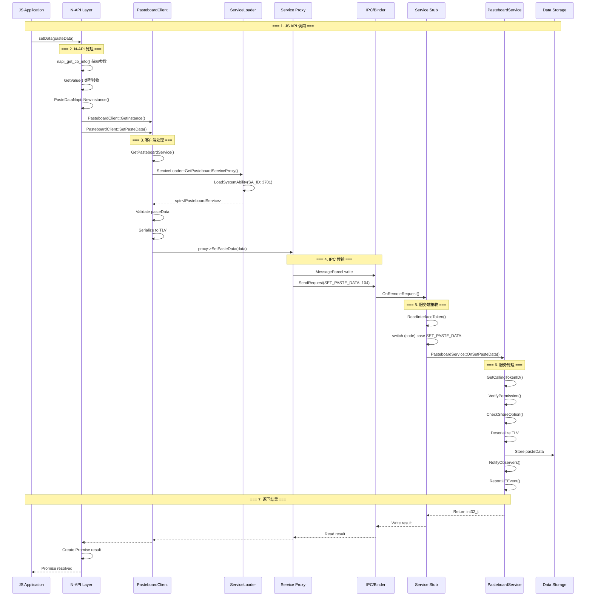
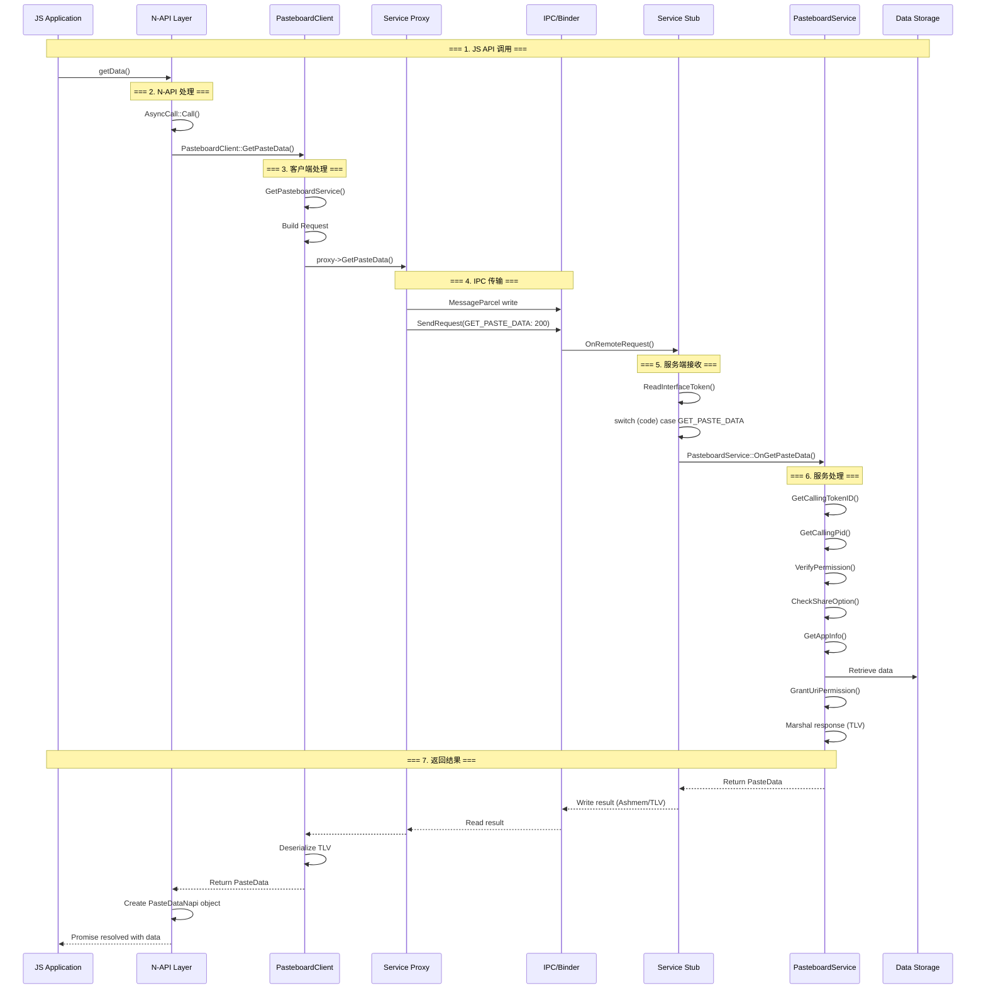
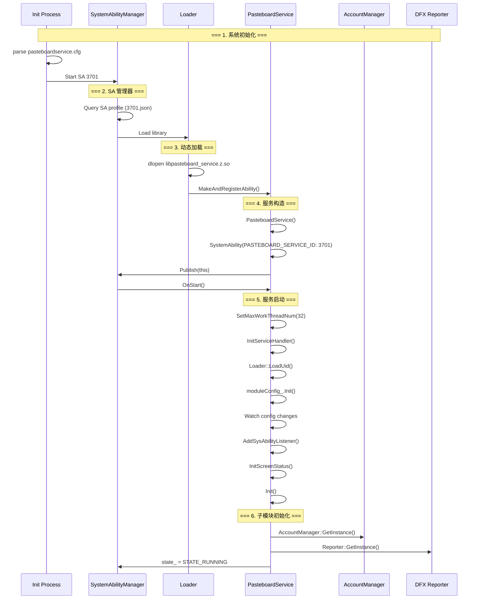
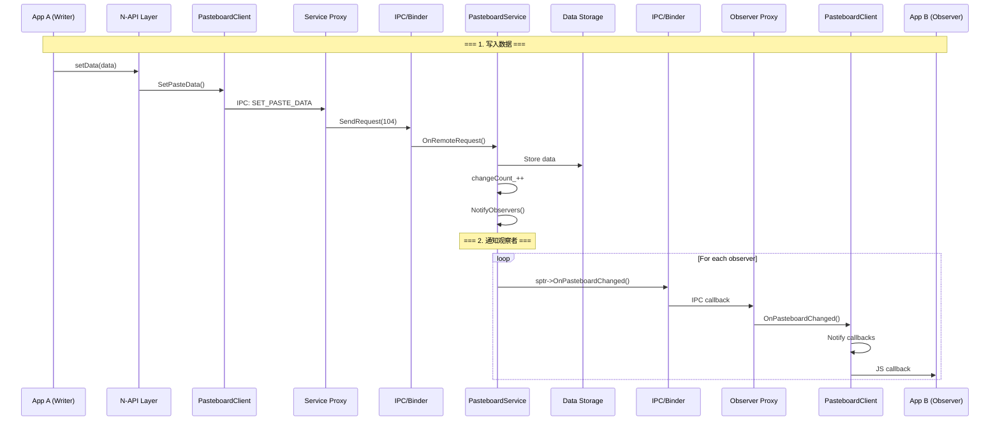
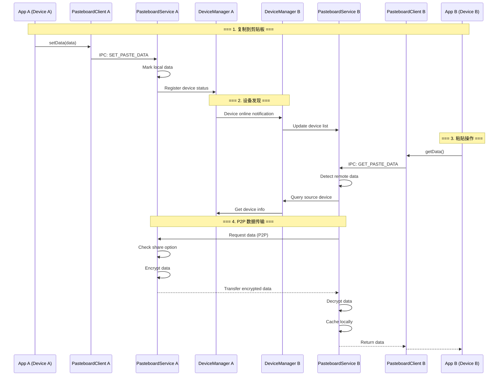
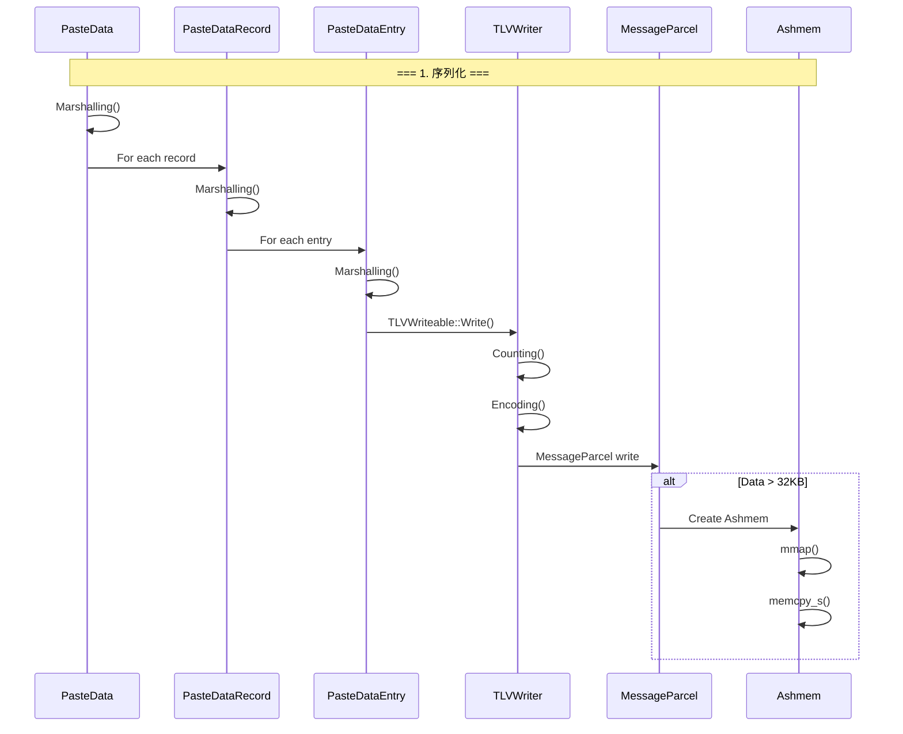

# 附录: 关键调用链

## 目的

本文档提供 Pasteboard 关键功能的调用链图，帮助理解代码执行流程。

## SetPasteData 调用链

**代码参考**:
- `interfaces/kits/napi/src/napi_systempasteboard.cpp:500`
- `framework/innerkits/src/pasteboard_client.cpp:300`
- `services/core/src/pasteboard_service.cpp:1267`

## GetPasteData 调用链

**代码参考**:
- `interfaces/kits/napi/src/napi_systempasteboard.cpp:300`
- `framework/innerkits/src/pasteboard_client.cpp:400`
- `services/core/src/pasteboard_service.cpp:831`

## 服务启动调用链

**代码参考**:
- `services/core/src/pasteboard_service.cpp:116`
- `services/load/src/loader.cpp`
- `etc/init/pasteboardservice.cfg`

## 数据变化通知调用链

**代码参考**:
- `services/core/src/pasteboard_service.cpp:2950`
- `framework/innerkits/src/pasteboard_client.cpp:600`

## 分布式同步调用链

**代码参考**:
- `framework/framework/device/dm_adapter.cpp`
- `services/core/src/pasteboard_service.cpp:3030`

## TLV 序列化调用链

**代码参考**:
- `framework/innerkits/src/paste_data.cpp:696`
- `framework/tlv/tlv_writeable.cpp:107`
- `framework/tlv/message_parcel_warp.cpp:86`

## 相关链接

- [架构说明 → 01_Architecture.md](01_Architecture.md)
- [内部 API → 04_Inner_API.md](04_Inner_API.md)
- [N-API 参考 → 03_NAPI_Reference.md](03_NAPI_Reference.md)
