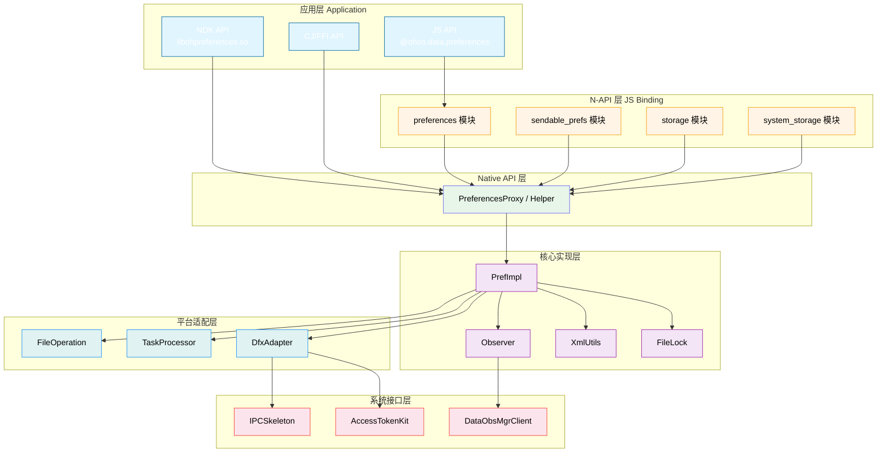
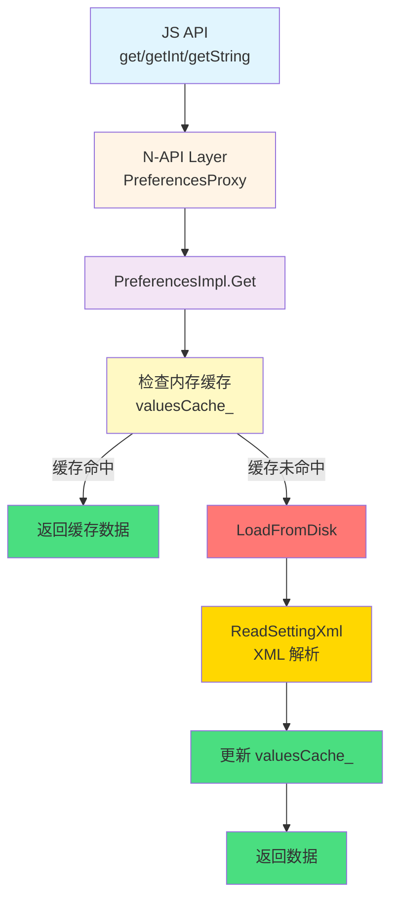
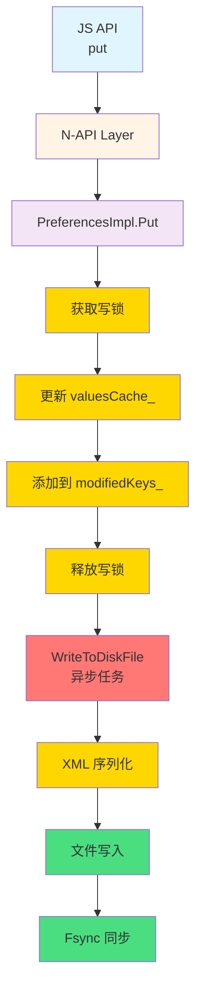
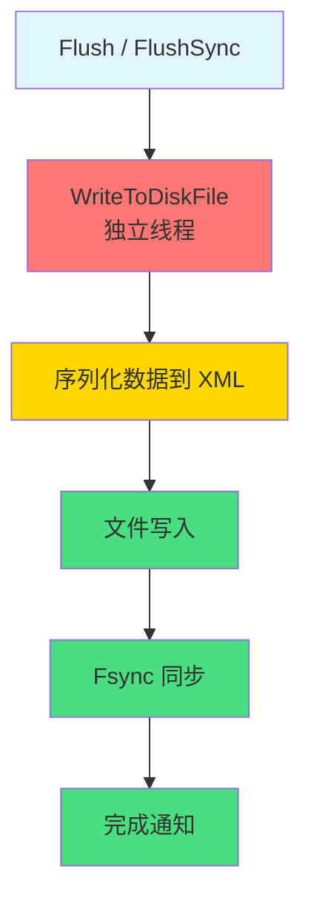
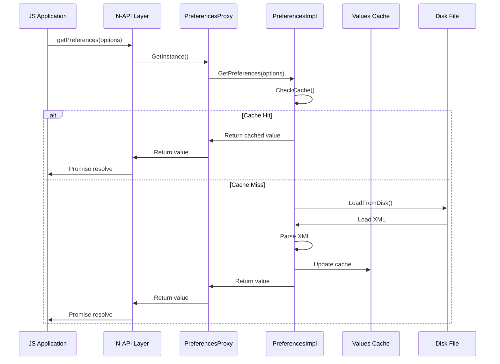
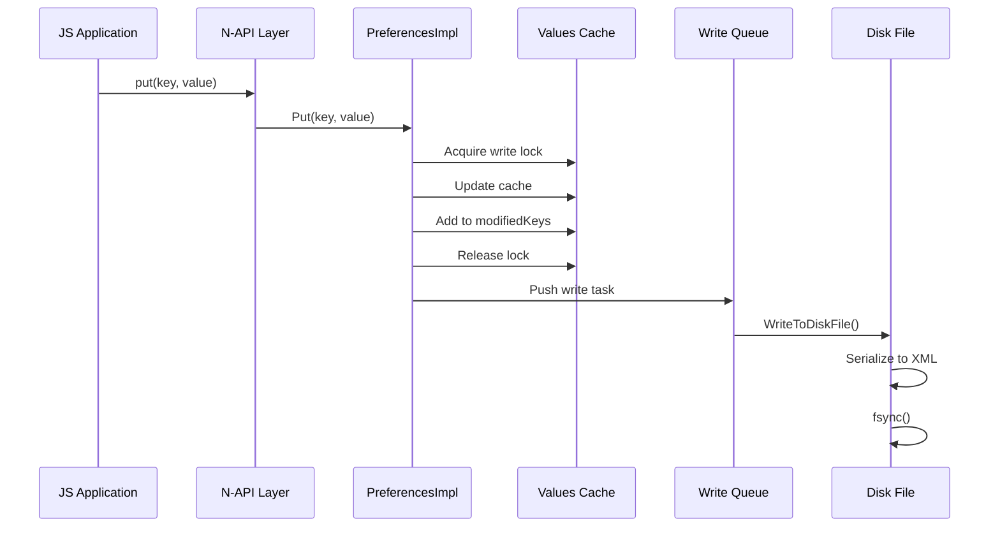
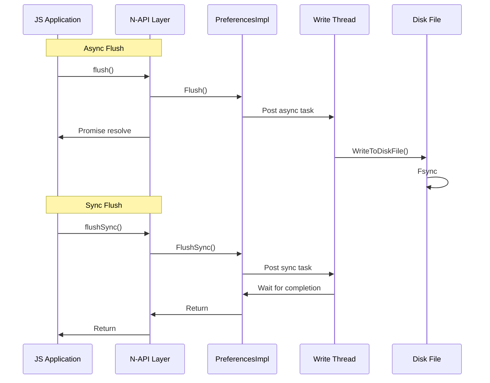

# 架构设计

本文档详细描述 Preferences 模块的内部架构、组件关系、数据流向和线程模型。

## 1 整体架构

### 1.1 架构分层图

#### Mermaid 组件图



#### 文本版架构图

```
┌─────────────────────────────────────────────────────────────┐
│                      应用层 (Application)                     │
├─────────────────────────────────────────────────────────────┤
│  JS API (@ohos.data.preferences)                            │
│  NDK API (libohpreferences.so)                              │
│  CJ/FFI API                                                 │
├─────────────────────────────────────────────────────────────┤
│                   N-API 层 (JS Binding)                      │
│  ┌─────────────────────────────────────────────────────┐   │
│  │ preferences      │ storage      │ system_storage  │   │
│  │ sendable_prefs  │              │                 │   │
│  └─────────────────────────────────────────────────────┘   │
├─────────────────────────────────────────────────────────────┤
│                   Native API 层                              │
│  ┌─────────────────────────────────────────────────────┐   │
│  │              PreferencesProxy / Helper               │   │
│  └─────────────────────────────────────────────────────┘   │
├─────────────────────────────────────────────────────────────┤
│                   核心实现层                                  │
│  ┌──────────┐  ┌──────────┐  ┌──────────┐  ┌──────────┐  │
│  │PrefImpl  │  │Observer  │  │XmlUtils  │  │FileLock │  │
│  └──────────┘  └──────────┘  └──────────┘  └──────────┘  │
├─────────────────────────────────────────────────────────────┤
│                   平台适配层                                  │
│  ┌─────────────────────────────────────────────────────┐   │
│  │ FileOperation │ TaskProcessor │ DfxAdapter          │   │
│  └─────────────────────────────────────────────────────┘   │
├─────────────────────────────────────────────────────────────┤
│                   系统接口层                                  │
│  IPCSkeleton │ AccessTokenKit │ DataObsMgrClient          │
└─────────────────────────────────────────────────────────────┘
```

### 1.2 模块职责

| 层级 | 组件 | 职责 |
|------|------|------|
| 应用层 | JS/NDK/CJ API | 对外提供开发接口 |
| N-API 层 | 各 N-API 模块 | JS 到 Native 的绑定 |
| Native API 层 | Proxy/Helper | 接口转发和参数校验 |
| 核心实现层 | PrefImpl/Observer | 核心业务逻辑 |
| 平台适配层 | File/Task/Dfx | 平台相关操作 |
| 系统接口层 | IPC/TokenKit | 系统能力调用 |

---

## 2 组件说明

### 2.1 N-API 组件

#### preferences 模块

**入口**：`frameworks/js/napi/preferences/src/entry_point.cpp:49`

**模块名**：`data.preferences`

**导出功能**：
- `getPreferences()` / `getPreferencesSync()` - 获取实例
- `deletePreferences()` / `deletePreferencesSync()` - 删除实例
- `removePreferencesFromCache()` / `removePreferencesFromCacheSync()` - 移除缓存
- `MAX_KEY_LENGTH` - Key 最大长度常量
- `MAX_VALUE_LENGTH` - Value 最大长度常量
- `StorageType` - 存储类型枚举

#### storage 模块

**入口**：`frameworks/js/napi/storage/src/entry_point_storage.cpp:50`

**导出功能**：
- `getStorageFromPath()` - 从路径获取存储

#### system_storage 模块

**入口**：`frameworks/js/napi/system_storage/src/entry_point_system_storage.cpp:45`

**导出功能**：
- 系统级存储操作

### 2.2 Native 组件

#### PreferencesImpl

**头文件**：`frameworks/native/include/preferences_impl.h`

**职责**：
- 键值数据的内存缓存管理
- 与磁盘文件的读写同步
- 观察者模式的数据变化通知

**核心成员**：

| 成员 | 类型 | 用途 |
|------|------|------|
| `valuesCache_` | `unordered_map<string, PreferencesValue>` | 内存缓存 |
| `modifiedKeys_` | `unordered_set<string>` | 修改的键集合 |
| `cacheMutex_` | `shared_mutex` | 读写锁 |
| `queue_` | `SafeBlockQueue<uint64_t>` | 任务队列 |

#### PreferencesProxy

**说明**：N-API 层的代理类，负责将 JS 调用转发到 Native 层

**位置**：`frameworks/js/napi/preferences/include/napi_preferences.h`

#### PreferencesHelper

**说明**：辅助工具类，提供实例管理和工具方法

**位置**：`frameworks/js/napi/preferences/include/napi_preferences_helper.h`

### 2.3 平台适配组件

#### 文件操作

**头文件**：`frameworks/native/platform/include/preferences_file_operation.h`

**功能**：
- 跨平台文件操作封装
- `Open()` - 打开/创建文件
- `Close()` - 关闭文件
- `Write()` - 写入数据
- `Fsync()` - 同步到磁盘

#### 文件锁

**头文件**：`frameworks/native/platform/include/preferences_file_lock.h`

**功能**：
- `PreferencesFileLock` - 文件锁实现
- 支持跨进程的文件访问同步

#### 任务处理器

**头文件**：`frameworks/native/platform/include/preferences_task_processor.h`

**功能**：
- 异步任务调度
- 支持 FFRT 任务队列

---

## 3 数据流向

### 3.1 读操作数据流

#### Mermaid 流程图



#### 文本版数据流

```
JS API (get/getInt/getString)
     ↓
N-API Layer (PreferencesProxy)
     ↓
PreferencesImpl.Get()
     ↓
[检查内存缓存 valuesCache_]
     ↓
[若缓存命中] → 返回缓存数据
[若缓存未命中] → LoadFromDisk()
     ↓
ReadSettingXml() ← XML 解析
     ↓
更新 valuesCache_
     ↓
返回数据
```

**关键代码**：

```cpp
// preferences_impl.cpp
PreferencesValue PreferencesImpl::Get(const std::string &key,
                                       const PreferencesValue &defValue)
{
    std::shared_lock<std::shared_mutex> lock(cacheMutex_);
    auto iter = valuesCache_.find(key);
    if (iter != valuesCache_.end()) {
        return iter->second;
    }
    return defValue;
}
```

### 3.2 写操作数据流

#### Mermaid 流程图



#### 文本版数据流

```
JS API (put)
     ↓
N-API Layer
     ↓
PreferencesImpl.Put()
     ↓
[获取写锁]
     ↓
更新 valuesCache_
添加 modifiedKeys_
     ↓
[释放写锁]
     ↓
WriteToDiskFile() → 异步任务
     ↓
XML 序列化
     ↓
文件写入
     ↓
Fsync() 同步
```

**关键代码**：

```cpp
// preferences_impl.cpp
int PreferencesImpl::Put(const std::string &key,
                         const PreferencesValue &value)
{
    std::unique_lock<std::shared_mutex> lock(cacheMutex_);
    valuesCache_[key] = value;
    modifiedKeys_.insert(key);
    return OK;
}
```

### 3.3 持久化数据流

#### Mermaid 流程图



#### 文本版数据流

```
Flush() / FlushSync()
     ↓
WriteToDiskFile() [独立线程]
     ↓
序列化数据到 XML
     ↓
文件写入
     ↓
Fsync() 同步
     ↓
完成通知
```

---

## 4 线程模型

### 4.1 线程划分

```
┌─────────────────────────────────────────┐
│              主线程 (JS Thread)           │
│  - JS API 调用                           │
│  - N-API 回调处理                        │
└─────────────────────────────────────────┘
                    ↓ IPC
┌─────────────────────────────────────────┐
│          Native 主线程 (UI Thread)        │
│  - API 参数校验                          │
│  - 内存缓存读写                          │
│  - 观察者回调                           │
└─────────────────────────────────────────┘
                    ↓ 任务队列
┌─────────────────────────────────────────┐
│        加载线程 (Load Thread)            │
│  - 从磁盘读取 XML                        │
│  - 解析并填充缓存                        │
└─────────────────────────────────────────┘
                    ↓ SafeBlockQueue
┌─────────────────────────────────────────┐
│        写入线程 (Write Thread)           │
│  - 异步写入磁盘                          │
│  - XML 序列化                            │
│  - Fsync 同步                            │
└─────────────────────────────────────────┘
```

### 4.2 线程安全机制

#### 读写锁

**代码位置**：`preferences_impl.h:98`

```cpp
std::shared_mutex cacheMutex_;  // 读写锁
```

**使用规则**：
- 读操作：`std::shared_lock<std::shared_mutex>`（共享锁）
- 写操作：`std::unique_lock<std::shared_mutex>`（排他锁）

#### 原子变量

| 变量 | 类型 | 用途 |
|------|------|------|
| `loaded_` | `std::atomic<bool>` | 加载状态 |
| `isCleared_` | `std::atomic<bool>` | 清空状态 |
| `isActive_` | `std::atomic<bool>` | 激活状态 |

#### 错误码

| 错误码 | 说明 |
|--------|------|
| `E_OPERAT_IS_LOCKED` (24) | 文件被锁定，无法操作 |
| `E_OPERAT_IS_CROSS_PROESS` (25) | 跨进程操作冲突 |

### 4.3 线程通信

#### SafeBlockQueue

**代码位置**：`preferences_impl.h:102`

```cpp
std::shared_ptr<SafeBlockQueue<uint64_t>> queue_;
```

**用途**：在主线程和写入线程之间传递任务

#### 任务类型

| 任务 | 说明 |
|------|------|
| 写入任务 | 持久化修改的数据 |
| 同步任务 | FlushSync 同步等待 |

---

## 5 时序图

### 5.1 Get 操作时序



### 5.2 Put 操作时序



### 5.3 Flush 操作时序



---

## 6 观察者模式

### 6.1 观察者架构

```
┌─────────────────────────────────────────┐
│              PreferencesImpl             │
├─────────────────────────────────────────┤
│ - observers_: vector<PreferencesObserver>│
├─────────────────────────────────────────┤
│ + RegisterObserver(obs)                  │
│ + UnRegisterObserver(obs)               │
│ # NotifyChange()                        │
└─────────────────────────────────────────┘
                    ↓
        ┌───────────┴───────────┐
        ↓                       ↓
┌───────────────┐       ┌───────────────┐
│  JS Observer   │       │ Native Observer│
│  (N-API 层)    │       │  (Inner API)  │
└───────────────┘       └───────────────┘
```

### 6.2 注册流程

**Inner API**：`preferences.h`

```cpp
virtual int RegisterObserver(std::shared_ptr<PreferencesObserver> observer) = 0;
virtual int UnRegisterObserver(std::shared_ptr<PreferencesObserver> observer) = 0;
```

### 6.3 通知流程

**代码位置**：`preferences_impl.cpp`

```cpp
void PreferencesImpl::NotifyPreferencesObserver(
    std::shared_ptr<PreferencesImpl> pref,
    std::shared_ptr<std::unordered_set<std::string>> keysModified,
    std::shared_ptr<std::unordered_map<std::string, PreferencesValue>> writeToDisk)
{
    // 通知所有观察者
    for (auto &observer : pref->observers_) {
        observer->OnChange(keysModified);
    }
}
```

---

## 7 文件存储结构

### 7.1 XML 文件格式

**默认路径**：`/data/app/el*/[bundleName]/pref/[preferencesName].xml`

**示例结构**：

```xml
<?xml version="1.0" encoding="utf-8"?>
<preferences>
    <item key="key1" value="value1" />
    <item key="key2" value="123" />
    <item key="key3" type="bool">true</item>
</preferences>
```

### 7.2 文件权限

**代码位置**：`preferences_file_operation.h:50-51, 101`

```cpp
#define FILE_MODE 0770

// 文件打开权限
return open(filePath.c_str(), O_WRONLY | O_CREAT | O_TRUNC, 0660);
```

| 权限 | 说明 |
|------|------|
| 0660 | owner 和 group 可读写 |
| 0770 | 目录创建默认权限 |

### 7.3 路径脱敏

**代码位置**：`preferences_file_operation.h:146-165`

日志输出时，敏感路径会被脱敏处理：

```cpp
// 脱敏前: /data/app/el1/base/xxx/pref/myprefs.xml
// 脱敏后: /data/***/***/***/myprefs.xml
```

---

## 8 相关文档

| 文档 | 说明 |
|------|------|
| [API 参考](./02_API_Reference.md) | 完整 API 清单 |
| [构建配置](./03_Build.md) | 构建流程说明 |
| [安全评审](./04_Security_Review.md) | 安全风险分析 |
| [调用链图谱](./appendix/Callgraphs.md) | 详细调用链 |
