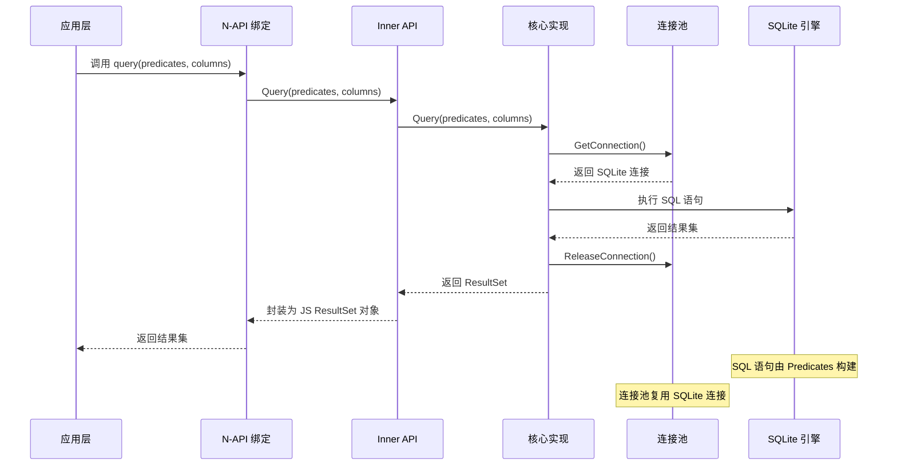
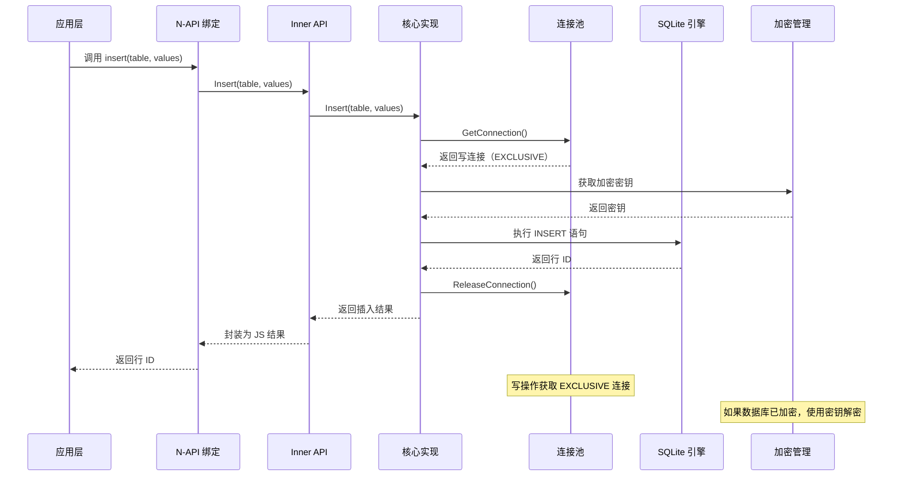
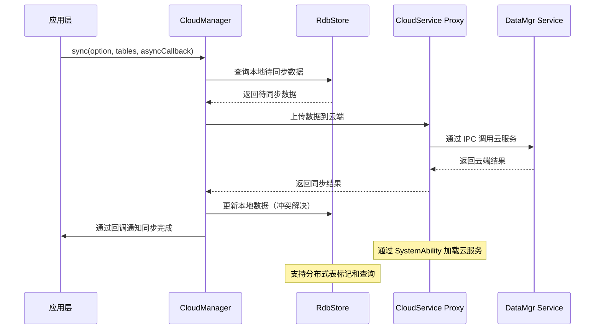
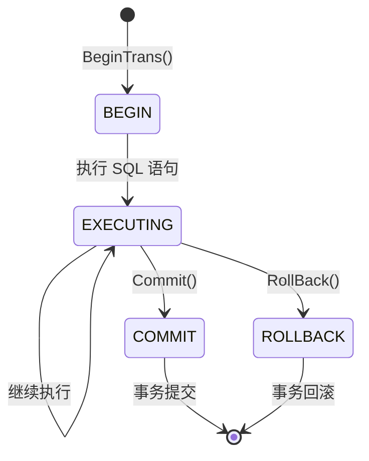
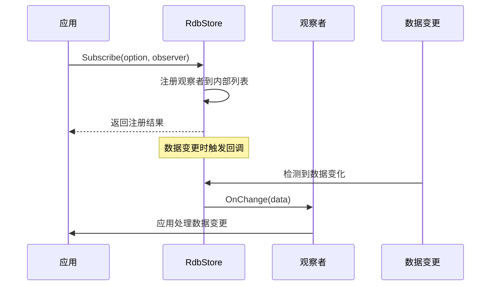
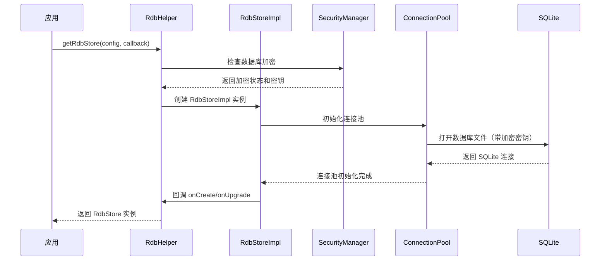
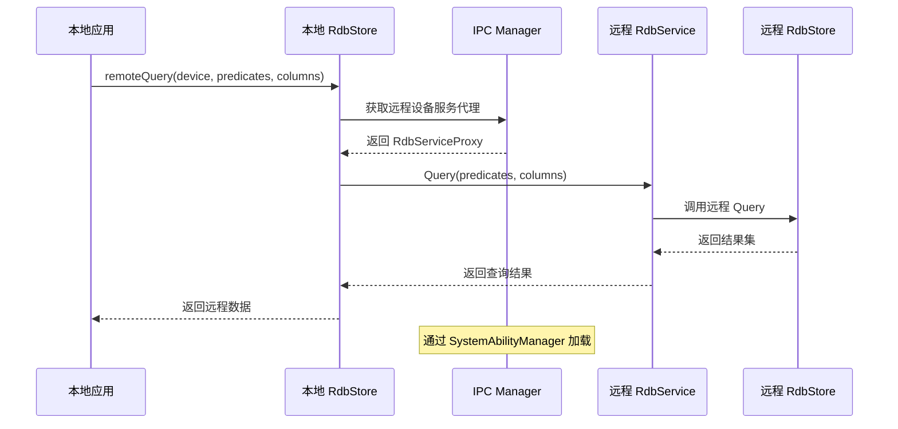
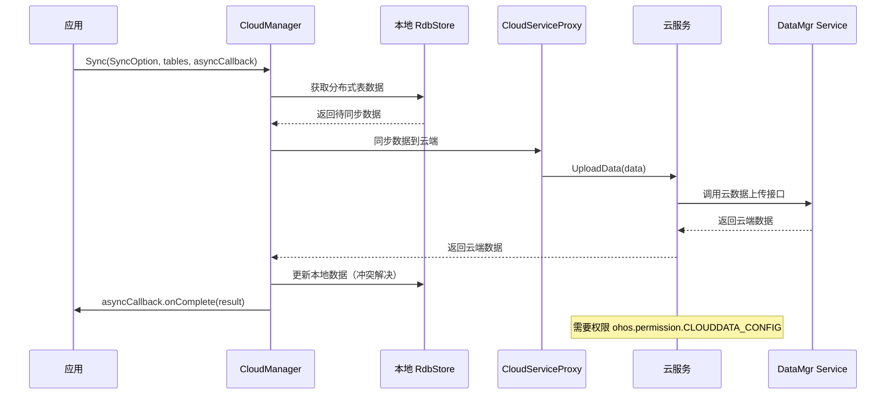
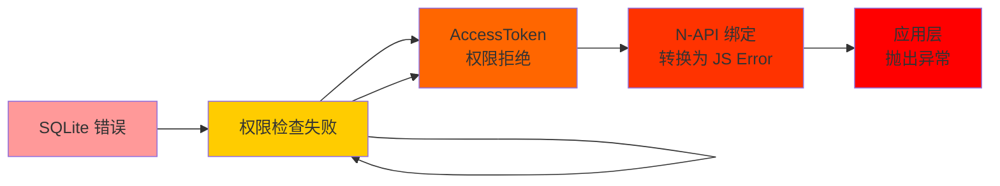

# 系统架构说明

## 目的

本文档详细描述 relational_store 组件的架构设计，包括组件图、数据流、线程模型和关键时序。

## 适用范围

- relational_store 架构设计
- 组件间交互关系
- 数据流转路径
- 并发模型与线程安全
- 关键时序与调用链

## 关键结论

### 1. 分层架构

```
┌─────────────────────────────────────────────────────────────┐
│                    应用层（Application Layer）           │
│  - JS 应用（ArkTS）                                    │
│  - ETS 应用（ArkTS）                                 │
│  - 仓颉应用（Cangjie）                              │
└──────────────────────────┬────────────────────────────────┘
                           │
                           ▼
┌─────────────────────────────────────────────────────────────┐
│                N-API 绑定层（N-API Layer）          │
│  - data.rdb (Legacy)                                    │
│  - data.relationalStore (New)                              │
│  - data.cloudData                                          │
│  - data.dataAbility                                         │
└──────────────────────────┬────────────────────────────────┘
                           │
                           ▼
┌─────────────────────────────────────────────────────────────┐
│              Inner API 接口层（Inner API Layer）        │
│  - RdbStore, RdbHelper (核心接口）                      │
│  - CloudManager, CloudService (云同步接口）                │
│  - ISharedResultSet, DataAbilityPredicates（适配接口）       │
└──────────────────────────┬────────────────────────────────┘
                           │
                           ▼
┌─────────────────────────────────────────────────────────────┐
│               核心实现层（Core Implementation）        │
│  - RdbStoreImpl (数据库操作）                            │
│  - ConnectionPool (连接池）                               │
│  - RdbSecurityManager (加密管理）                         │
│  - CloudManager (云同步管理）                              │
└──────────────────────────┬────────────────────────────────┘
                           │
            ┌──────────────┼──────────────┐
            │              │              │
            ▼              ▼              ▼
    ┌──────────────┐  ┌──────────────┐  ┌──────────────┐
    │   SQLite     │  │    IPC       │  │    HUKS       │
    │   引擎        │  │   通信        │  │   加密         │
    └──────────────┘  └──────────────┘  └──────────────┘
```

### 2. 组件图

#### 2.1 核心组件

| 组件 | 职责 | 位置 | 证据 |
|------|------|------|------|
| **RdbStore** | 数据库核心接口，定义 CRUD、事务、同步操作 | `interfaces/inner_api/rdb/include/rdb_store.h` |
| **RdbStoreImpl** | RdbStore 实现，封装 SQLite 操作 | `frameworks/native/rdb/src/rdb_store_impl.cpp` |
| **ConnectionPool** | SQLite 连接池，管理最多 4 个连接 | `frameworks/native/rdb/src/connection_pool.cpp` |
| **RdbHelper** | 数据库创建和升级助手 | `frameworks/native/rdb/src/rdb_helper.cpp` |
| **RdbPredicates** | 类型安全的查询谓词构建器 | `frameworks/native/rdb/src/rdb_predicates.cpp` |
| **ResultSet** | 查询结果集，支持迭代访问 | `frameworks/native/rdb/src/step_result_set.cpp` |
| **RdbSecurityManager** | 加密密钥管理和数据库加解密 | `frameworks/native/rdb/src/rdb_security_manager.cpp` |
| **CloudManager** | 云同步管理器，协调设备间和云端同步 | `frameworks/native/cloud_data/src/cloud_manager.cpp` |
| **RdbNotifierStub** | 数据变更通知的 IPC 存根 | `frameworks/native/rdb/src/rdb_notifier_stub.cpp` |

#### 2.2 IPC 组件

| 组件 | 职责 | 接口 | 证据 |
|------|------|------|------|
| **IRdbService** | RDB 服务接口 | IRemoteBroker | `frameworks/native/rdb/include/irdb_service.h` |
| **RdbServiceProxy** | RDB 服务客户端代理 | IRemoteProxy | `frameworks/native/rdb/include/rdb_service_proxy.h` |
| **ICloudService** | 云服务接口 | IRemoteBroker | `frameworks/native/cloud_data/include/icloud_service.h` |
| **CloudServiceProxy** | 云服务客户端代理 | IRemoteProxy | `frameworks/native/cloud_data/include/cloud_service_proxy.h` |
| **ISharedResultSet** | 跨进程共享结果集接口 | IRemoteBroker | `interfaces/inner_api/dataability/include/ishared_result_set.h` |

### 3. 数据流

#### 3.1 查询流程



#### 3.2 写操作流程



#### 3.3 云同步流程



### 4. 线程模型

#### 4.1 连接池模型

| 特性 | 说明 | 证据 |
|------|------|------|
| **连接池大小** | 最大 4 个 SQLite 连接 | `README_zh.md:46` |
| **读连接** | 支持多个并发读操作 | `connection_pool.cpp` |
| **写连接** | 同一时间只支持一个写操作 | `README_zh.md:47` |
| **连接复用** | 连接用完归还池中，不立即关闭 | `connection_pool.cpp` |
| **线程安全** | 使用互斥锁保护连接池 | `connection_pool.cpp` |

**连接池状态机**：
```
空闲状态 ←→ 借出状态 ←→ 使用中 ←→ 归还状态 ←→ 空闲状态
                      ↓
                     关闭状态（异常）
```

#### 4.2 事务模型

| 事务类型 | 隔离级别 | 说明 | 证据 |
|----------|----------|------|------|
| **EXCLUSIVE** | 独占式 | 开始事务时锁定数据库 | `rdb_store.h:597-614` |
| **IMMEDIATE** | 即时式 | 有其他 EXCLUSIVE 事务时失败 | SQLite 默认 |
| **DEFERRED** | 延迟式 | 第一次读操作时锁定 | SQLite 默认 |

**事务生命周期**：


#### 4.3 观察者模式

| 组件 | 职责 | 线程 | 证据 |
|------|------|------|------|
| **RdbStoreObserver** | 数据变更订阅 | 用户线程 | `rdb_store.h:714-729` |
| **SubscribeMode** | 订阅模式：LOCAL、REMOTE、LOCAL_DETAIL | - | `rdb_types.h` |
| **DetailProgressObserver** | 云同步进度观察者 | 工作线程 | `rdb_types.h:80-82` |
| **RdbNotifierStub** | IPC 存根，处理跨进程通知 | Binder 线程 | `rdb_notifier_stub.h` |

**观察者注册流程**：


### 5. 关键时序

#### 5.1 数据库打开流程



#### 5.2 分布式查询流程



#### 5.3 云同步详细流程



### 6. 内存管理与资源生命周期

| 资源类型 | 创建方式 | 销毁方式 | 所有权 | 证据 |
|----------|----------|----------|--------|------|
| **ResultSet** | Query() 返回共享指针 | Close() 或析构 | RdbStore | `result_set.h` |
| **Transaction** | CreateTransaction() 返回 | Commit()、RollBack() 或析构 | RdbStore | `transaction.h` |
| **Connection** | 连接池借出 | 归还连接池 | ConnectionPool | `connection_pool.cpp` |
| **观察者** | Subscribe() 注册 | Unsubscribe() 注销 | 用户代码 | `rdb_store.h` |

### 7. 错误传播机制



## 相关跳转

- [00_Overview.md](./00_Overview.md) - 项目概览
- [02_Directory_Structure.md](./02_Directory_Structure.md) - 目录结构与模块职责
- [05_Inner_API.md](./05_Inner_API.md) - 内部接口定义
- [appendix/Callgraphs.md](./appendix/Callgraphs.md) - 详细调用链

---

**文档版本**: 1.0
**生成日期**: 2026-02-06
**主要证据来源**: rdb_store.h, connection_pool.cpp, cloud_manager.cpp, rdb_notifier_stub.h, transaction.h
