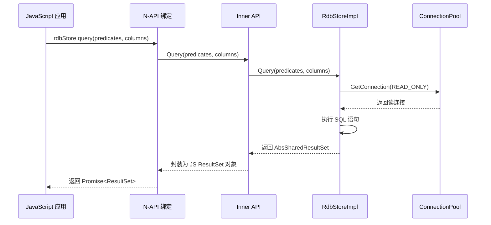
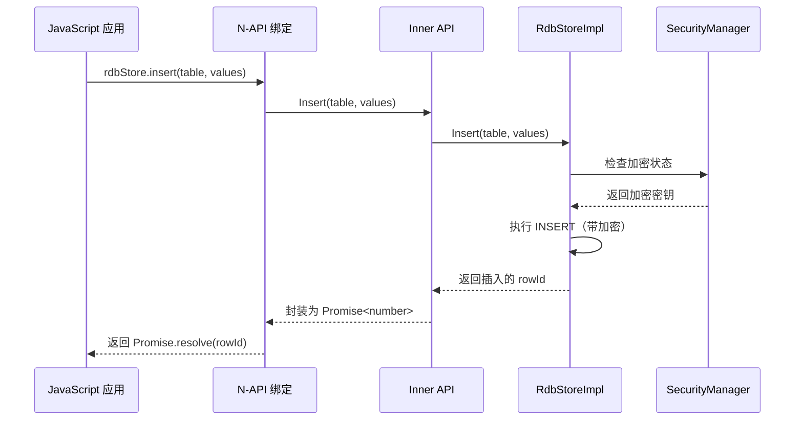
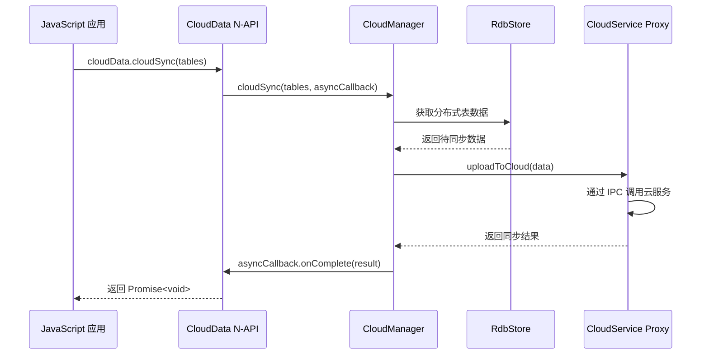

# 对外 N-API（JavaScript/TypeScript API）

## 目的

本文档详细梳理 relational_store 组件对外暴露的 N-API 接口，包括 API 清单、注册点、参数校验、调用链和错误处理。

## 适用范围

- 所有 N-API 导出模块
- JavaScript/TypeScript API 接口
- 参数校验与错误码
- 同步/异步模式

## 关键结论

### 1. N-API 模块清单

| 模块名 | 命名空间 | 入口文件 | 主要功能 | 证据 |
|--------|---------|----------|----------|------|
| **data.rdb** | - | `frameworks/js/napi/rdb/src/entry_point.cpp` | 旧版 RDB API | `entry_point.cpp:46-47` |
| **data.relationalStore** | data.relationalStore | `frameworks/js/napi/relationalstore/src/entry_point.cpp` | 新版 RDB API | `entry_point.cpp:52` |
| **data.cloudData** | data.cloudData | `frameworks/js/napi/cloud_data/src/entry_point.cpp` | 云数据同步 API | `entry_point.cpp:45` |
| **data.dataability** | - | `frameworks/js/napi/dataability/src/entry_point.cpp` | DataAbility 适配 API | `entry_point.cpp` |
| **data.sendableRelationalStore** | - | `frameworks/js/napi/sendablerelationalstore/src/entry_point.cpp` | 可发送数据 API | `entry_point.cpp` |
| **data.cloudExtension** | - | `frameworks/js/napi/cloud_extension/cloud_extension.cpp` | 云扩展 API | `cloud_extension.cpp` |

### 2. RdbStore API 详细说明

#### 2.1 RdbStore 类（data.relationalStore）

**注册位置**：`frameworks/js/napi/relationalstore/src/napi_rdb_store.cpp`

**导出方法清单**：

| JS 方法 | 同步/异步 | 参数 | 返回值 | 错误码 | C++ 实现 |
|----------|-----------|------|--------|--------|----------|
| **insert** | 异步 | table: string, values: ValuesBucket conflictResolution?: ConflictResolution | Promise<number> | RDB_E_INVALID_COLUMN_TYPE RDB_E_EMPTY_VALUES_BUCKET | RdbStoreProxy::Insert() |
| **batchInsert** | 异步 | table: string, values: ValuesBucket[] conflictResolution?: ConflictResolution | Promise<number> | 同上 | RdbStoreProxy::BatchInsert() |
| **update** | 异步 | table: string, values: ValuesBucket predicates?: RdbPredicates conflictResolution?: ConflictResolution | Promise<number> | 同上 | RdbStoreProxy::Update() |
| **delete** | 异步 | table: string, predicates?: RdbPredicates | Promise<number> | 同上 | RdbStoreProxy::Delete() |
| **query** | 异步 | predicates?: RdbPredicates, columns?: string[] distinct?: boolean | Promise<ResultSet> | RDB_E_INVALID_ARGS | RdbStoreProxy::Query() |
| **querySql** | 异步 | sql: string, args?: any[] | Promise<ResultSet> | 同上 | RdbStoreProxy::QuerySql() |
| **executeSql** | 异步 | sql: string, args?: any[] | Promise<number> | 同上 | RdbStoreProxy::ExecuteSql() |
| **replace** | 异步 | table: string, values: ValuesBucket | Promise<number> | 同上 | RdbStoreProxy::Replace() |
| **count** | 异步 | predicates?: RdbPredicates | Promise<number> | - | RdbStoreProxy::Count() |

#### 2.2 RdbStore 属性

| 属性 | 类型 | 说明 | 证据 |
|------|------|------|------|
| **path** | string | 数据库文件路径 | `rdb_store.h:624` |
| **isReadOnly** | boolean | 是否只读模式 | `rdb_store.h:639` |
| **isHoldingConnection** | boolean | 是否持有连接 | `rdb_store.h:629` |
| **isInTransaction** | boolean | 是否在事务中 | `rdb_store.h:619` |
| **isMemoryRdb** | boolean | 是否内存数据库 | `rdb_store.h:658` |

#### 2.3 RdbPredicates 类

**注册位置**：`frameworks/js/napi/relationalstore/src/napi_rdb_predicates.cpp`

**导出方法清单**：

| JS 方法 | 返回值 | 说明 |
|----------|--------|------|
| **equalTo** | RdbPredicates | 等于条件 |
| **notEqualTo** | RdbPredicates | 不等于条件 |
| **and** | RdbPredicates | AND 逻辑 |
| **or** | RdbPredicates | OR 逻辑 |
| **contains** | RdbPredicates | 包含条件 |
| **beginsWith** | RdbPredicates | 以...开始 |
| **endsWith** | RdbPredicates | 以...结束 |
| **like** | RdbPredicates | LIKE 模式匹配 |
| **between** | RdbPredicates | BETWEEN 条件 |
| **in** | RdbPredicates | IN 条件 |
| **orderBy** | RdbPredicates | 排序 |
| **limit** | RdbPredicates | 限制结果数 |
| **distinct** | RdbPredicates | 去重 |
| **groupBy** | RdbPredicates | 分组 |
| **indexedBy** | RdbPredicates | 索引查询 |

#### 2.4 ResultSet 类

**注册位置**：`frameworks/js/napi/relationalstore/src/napi_result_set.cpp`

**导出方法清单**：

| JS 方法 | 返回值 | 错误码 | 证据 |
|----------|--------|--------|------|
| **goToFirstRow** | boolean | RDB_E_INVALID_STATE | `result_set.h` |
| **goToNextRow** | boolean | 同上 | 同上 |
| **goToRow** | boolean | 同上 | 同上 |
| **isClosed** | boolean | - | 同上 |
| **isAtFirstRow** | boolean | - | 同上 |
| **isAtLastRow** | boolean | - | 同上 |
| **getColumnIndex** | number | RDB_E_INVALID_COLUMN_NAME | 同上 |
| **getColumnName** | string | 同上 | 同上 |
| **getRowCount** | number | - | 同上 |
| **getColumnCount** | number | - | 同上 |
| **getString** | string | RDB_E_INVALID_COLUMN_TYPE | 同上 |
| **getLong** | number | 同上 | 同上 |
| **getDouble** | number | 同上 | 同上 |
| **getBlob** | ArrayBuffer | 同上 | 同上 |
| **getAsset** | Asset | 同上 | 同上 |
| **close** | void | - | 同上 |

#### 2.5 Transaction 类

**注册位置**：`frameworks/js/napi/relationalstore/src/napi_transaction.cpp`

**导出方法清单**：

| JS 方法 | 返回值 | 说明 |
|----------|--------|------|
| **commit** | Promise<void> | 提交事务 |
| **rollBack** | Promise<void> | 回滚事务 |
| **isInTransaction** | boolean | 检查是否在事务中 |

### 3. RdbHelper API

**注册位置**：`frameworks/js/napi/relationalstore/src/napi_rdb_store_helper.cpp`

| JS 方法 | 参数 | 返回值 | 说明 |
|----------|------|--------|------|
| **getRdbStore** | config: StoreConfig, callback?: OpenCallback | Promise<RdbStore> | 创建或获取 RdbStore 实例 |

**OpenCallback 接口**：
| 方法 | 说明 |
|------|------|
| **onCreate** | 数据库创建时回调 |
| **onUpgrade** | 数据库版本升级时回调 |
| **onDowngrade** | 数据库版本降级时回调 |

### 4. CloudData API 详细说明

#### 4.1 Config 类

**注册位置**：`frameworks/js/napi/cloud_data/src/js_config.cpp`

| JS 方法 | 参数 | 返回值 | 证据 |
|----------|------|--------|------|
| **enableCloud** | - | Promise<void> | `js_config.cpp` |
| **disableCloud** | - | Promise<void> | 同上 |
| **cloudSync** | tables: string[], mode?: number | Promise<void> | 同上 |
| **changeAppCloudSwitch** | enable: boolean | Promise<void> | 同上 |
| **clean** | - | Promise<void> | 同上 |
| **queryStatistics** | - | Promise<Statistics> | 同上 |

#### 4.2 Sharing 类

**注册位置**：`frameworks/js/napi/cloud_data/src/js_cloud_share.cpp`

| JS 方法 | 参数 | 返回值 | 证据 |
|----------|------|--------|------|
| **allocResourceAndShare** | - | Promise<Resource> | `js_cloud_share.cpp` |
| **share** | - | Promise<void> | 同上 |
| **unshare** | - | Promise<void> | 同上 |
| **exit** | - | Promise<void> | 同上 |
| **query** | - | Promise<ShareInfo[]> | 同上 |
| **queryByInvitation** | - | Promise<ShareInfo> | 同上 |
| **confirmInvitation** | - | Promise<void> | 同上 |

#### 4.3 常量定义

**注册位置**：`frameworks/js/napi/cloud_data/src/js_const_properties.cpp`

| 常量名 | 类型 | 值 | 说明 |
|----------|------|-----|------|
| **Action** | enum | ADD、UPDATE、DELETE 等 | 数据操作类型 |
| **Role** | enum | OWNER、COLLABORATOR、VIEWER | 分享角色 |
| **State** | enum | INITIALIZING、INITIALIZED 等 | 数据状态 |
| **Strategy** | enum | DEFAULT、NETWORK_FIRST、CLOUD_FIRST | 同步策略 |
| **NetStrategy** | enum | WIFI_ONLY、CELLULAR_ONLY 等 | 网络策略 |
| **SyncStatus** | enum | SUCCESS、FAILED、CANCELLED 等 | 同步状态 |

### 5. 参数校验

#### 5.1 类型校验

| 参数类型 | 校验逻辑 | 错误码 | 证据 |
|----------|----------|--------|------|
| **ValuesBucket** | 检查是否为对象 | RDB_E_INVALID_VALUES_BUCKET | `napi_rdb_store.cpp` |
| **表名** | 非空字符串检查 | RDB_E_EMPTY_TABLE_NAME | 同上 |
| **SQL 语句** | 长度限制、注入检查 | RDB_E_INVALID_SQL | `sqlite_statement.cpp` |
| **Predicates** | 非空检查 | RDB_E_INVALID_PREDICATES | `napi_rdb_predicates.cpp` |
| **列名** | 非空数组、非空字符串 | RDB_E_INVALID_COLUMN_NAME | `result_set.cpp` |

#### 5.2 范围校验

| 参数 | 范围 | 校验 | 证据 |
|------|------|------|------|
| **LIMIT/OFFSET** | 非负整数 | 检查 < 0 | `rdb_predicates.cpp` |
| **表名长度** | ≤ 128 字符 | 检查 SQLite 限制 | 同上 |
| **列名长度** | ≤ 128 字符 | 检查 SQLite 限制 | 同上 |
| **BLOB 大小** | ≤ 1GB | 检查 SQLite 限制 | 同上 |

#### 5.3 权限校验

| 操作 | 权限检查 | 证据 |
|------|----------|------|
| **打开数据库** | 检查包名权限（信任列表） | `oh_data_utils.cpp` |
| **云同步** | 需要 CLOUDDATA_CONFIG 权限 | `test/ets/cloud_data_system/entry/src/main/module.json:13` |
| **分布式操作** | 需要 AccessToken 验证 | `rdb_store.h:87-88` |

### 6. 同步/异步模式

| API | 模式 | 实现方式 | 证据 |
|-----|------|----------|------|
| **CRUD 操作** | 异步（Promise） | napi_create_promise + napi_queue_async_work | `napi_queue.cpp` |
| **查询操作** | 异步（Promise） | 同上 | 同上 |
| **Cloud 同步** | 异步（Callback + Promise） | napi_create_promise + AsyncDetail | `js_config.cpp` |
| **事务** | 异步（Promise） | 同上 | `napi_transaction.cpp` |

**异步工作队列**：
- 使用 libuv 事件循环
- 支持取消异步任务
- 线程池执行（避免阻塞主线程）

### 7. 错误码与异常封装

#### 7.1 RDB 错误码

| 错误码 | 值 | 说明 | 证据 |
|--------|-----|------|------|
| **RDB_OK** | 0 | 成功 | `relational_store_error_code.h` |
| **RDB_E_INVALID_ARGS** | -1 | 无效参数 | 同上 |
| **RDB_E_INVALID_COLUMN_NAME** | -2 | 无效列名 | 同上 |
| **RDB_E_INVALID_COLUMN_TYPE** | -3 | 无效列类型 | 同上 |
| **RDB_E_INVALID_VALUES_BUCKET** | -4 | 无效值桶 | 同上 |
| **RDB_E_EMPTY_TABLE_NAME** | -5 | 空表名 | 同上 |
| **RDB_E_EMPTY_VALUES_BUCKET** | -6 | 空值桶 | 同上 |
| **RDB_E_INVALID_SQL** | -7 | 无效 SQL | 同上 |
| **RDB_E_NOT_IN_TRANS** | -8 | 不在事务中 | 同上 |
| **RDB_E_IN_TRANS** | -9 | 已在事务中 | 同上 |
| **RDB_E_INVALID_DB** | -10 | 无效数据库 | 同上 |
| **RDB_E_INVALID_STATE** | -11 | 无效状态 | 同上 |
| **RDB_E_EXECUTE_FAIL** | -12 | 执行失败 | 同上 |

#### 7.2 JS 错误封装

| C++ 错误码 | JS 错误类型 | 错误消息格式 | 证据 |
|------------|------------|-------------|------|
| RDB_OK | 不抛出 | - | `napi_rdb_error.cpp` |
| RDB_E_* | Error("Native RDB Error: {code}") | 标准错误 | 同上 |
| SQLite 错误 | Error("SQLite Error: {msg}") | SQLite 错误 | 同上 |

### 8. 调用链示例

#### 8.1 查询调用链

#### 8.2 插入调用链

#### 8.3 云同步调用链

## 相关跳转

- [00_Overview.md](./00_Overview.md) - 项目概览
- [03_Architecture.md](./03_Architecture.md) - 架构与数据流
- [05_Inner_API.md](./05_Inner_API.md) - 内部接口定义
- [appendix/Callgraphs.md](./appendix/Callgraphs.md) - 详细调用链示例

---

**文档版本**: 1.0
**生成日期**: 2026-02-06
**主要证据来源**: entry_point.cpp 文件、各 N-API 实现文件、napi_rdb_error_code.h
