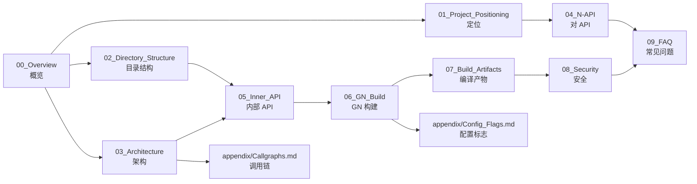

# relational_store 文档导航

## 新人阅读顺序

### 快速入门（30 分钟）
1. [00_Overview.md](./00_Overview.md) - 项目概览与关键概念
2. [01_Project_Positioning.md](./01_Project_Positioning.md) - 定位、边界、核心能力
3. [04_N-API.md](./04_N-API.md) - 如何使用 JavaScript/TypeScript API

### 深入理解（2-3 小时）
4. [02_Directory_Structure.md](./02_Directory_Structure.md) - 目录结构与模块职责
5. [03_Architecture.md](./03_Architecture.md) - 架构设计、数据流、时序
6. [05_Inner_API.md](./05_Inner_API.md) - 内部接口与依赖关系

### 构建与部署（1-2 小时）
7. [06_GN_Build.md](./06_GN_Build.md) - GN 构建系统详解
8. [07_Build_Artifacts.md](./07_Build_Artifacts.md) - 编译产物与安装路径

### 安全与运维（1-2 小时）
9. [08_Security.md](./08_Security.md) - 安全风险评审与修复建议
10. [09_FAQ.md](./09_FAQ.md) - 常见问题与定位路径

### 附录（参考）
- [appendix/Callgraphs.md](./appendix/Callgraphs.md) - 关键调用链
- [appendix/Config_Flags.md](./appendix/Config_Flags.md) - 配置标志与特性开关

---

## 文档索引

### 核心概念

| 主题 | 文档 | 说明 |
|------|------|------|
| 项目概览 | [00_Overview.md](./00_Overview.md) | 项目定位、核心能力、运行环境 |
| 项目定位 | [01_Project_Positioning.md](./01_Project_Positioning.md) | 边界、职责、与其它子系统关系 |

### 架构与实现

| 主题 | 文档 | 说明 |
|------|------|------|
| 目录结构 | [02_Directory_Structure.md](./02_Directory_Structure.md) | 顶层目录、模块职责、文件组织 |
| 系统架构 | [03_Architecture.md](./03_Architecture.md) | 组件图、数据流、线程模型、关键时序 |
| 内部 API | [05_Inner_API.md](./05_Inner_API.md) | 模块接口、依赖方向、稳定性标注 |

### 对外接口

| 主题 | 文档 | 说明 |
|------|------|------|
| N-API 接口 | [04_N-API.md](./04_N-API.md) | JS/TS API 清单、绑定位置、参数校验、错误码 |

### 构建系统

| 主题 | 文档 | 说明 |
|------|------|------|
| GN 构建 | [06_GN_Build.md](./06_GN_Build.md) | BUILD.gn 解析、target 列表、依赖关系 |
| 编译产物 | [07_Build_Artifacts.md](./07_Build_Artifacts.md) | 产物清单、安装路径、运行时加载 |

### 安全与运维

| 主题 | 文档 | 说明 |
|------|------|------|
| 安全评审 | [08_Security.md](./08_Security.md) | 攻击面、信任边界、可被利用点、修复建议 |
| 常见问题 | [09_FAQ.md](./09_FAQ.md) | 构建问题、运行问题、调试技巧 |

### 附录

| 主题 | 文档 | 说明 |
|------|------|------|
| 调用链图 | [appendix/Callgraphs.md](./appendix/Callgraphs.md) | 关键路径：入口 → 核心逻辑 |
| 配置标志 | [appendix/Config_Flags.md](./appendix/Config_Flags.md) | 关键宏、feature flags |

---

## 术语表

| 术语 | 全称/含义 | 说明 |
|------|-------------|------|
| RDB | Relational Database | 关系型数据库 |
| N-API | Node-API | Node.js API，用于绑定 JS/C++ |
| NDK | Native Development Kit | 原生开发套件，C API |
| ETS | ArkTS / Extended TypeScript | OpenHarmony 扩展 TypeScript |
| ANI | Ark Native Interface | Ark 原生接口 |
| IPC | Inter-Process Communication | 进程间通信 |
| SA | System Ability | 系统能力 |
| CFI | Control Flow Integrity | 控制流完整性 |
| ACL | Access Control List | 访问控制列表 |
| ACID | Atomicity, Consistency, Isolation, Durability | 原子性、一致性、隔离性、持久性 |

---

## 按角色浏览

### 应用开发者

重点关注：
- [04_N-API.md](./04_N-API.md) - 如何调用数据库 API
- [01_Project_Positioning.md](./01_Project_Positioning.md) - 理解组件边界和限制
- [09_FAQ.md](./09_FAQ.md) - 常见问题解决方案

### 系统开发者

重点关注：
- [05_Inner_API.md](./05_Inner_API.md) - 内部接口使用
- [03_Architecture.md](./03_Architecture.md) - 理解数据流和调用关系
- [06_GN_Build.md](./06_GN_Build.md) - 如何构建和修改组件
- [appendix/Callgraphs.md](./appendix/Callgraphs.md) - 调用链分析

### 安全审计员

重点关注：
- [08_Security.md](./08_Security.md) - 安全风险点
- [02_Directory_Structure.md](./02_Directory_Structure.md) - 文件组织与权限
- [appendix/Config_Flags.md](./appendix/Config_Flags.md) - 安全相关配置

### 运维工程师

重点关注：
- [07_Build_Artifacts.md](./07_Build_Artifacts.md) - 安装路径和产物
- [06_GN_Build.md](./06_GN_Build.md) - 构建目标与依赖
- [09_FAQ.md](./09_FAQ.md) - 构建和运行问题定位

---

## 文档图示

---

**最后更新**: 2026-02-06
**维护者**: OpenCode Wiki Agent
