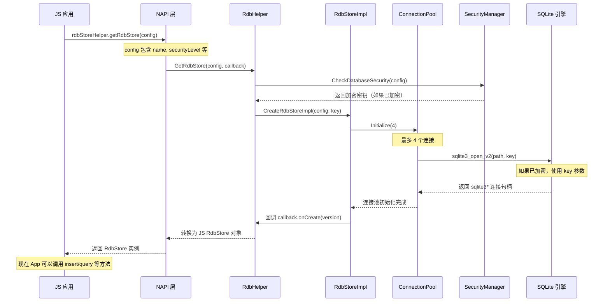
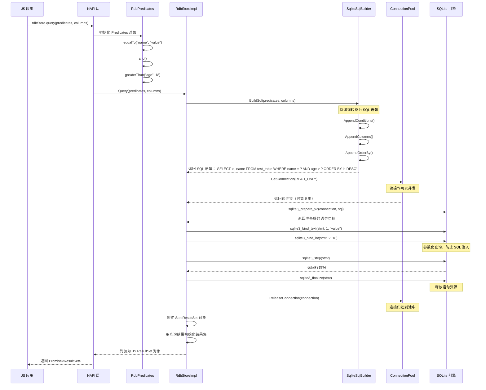
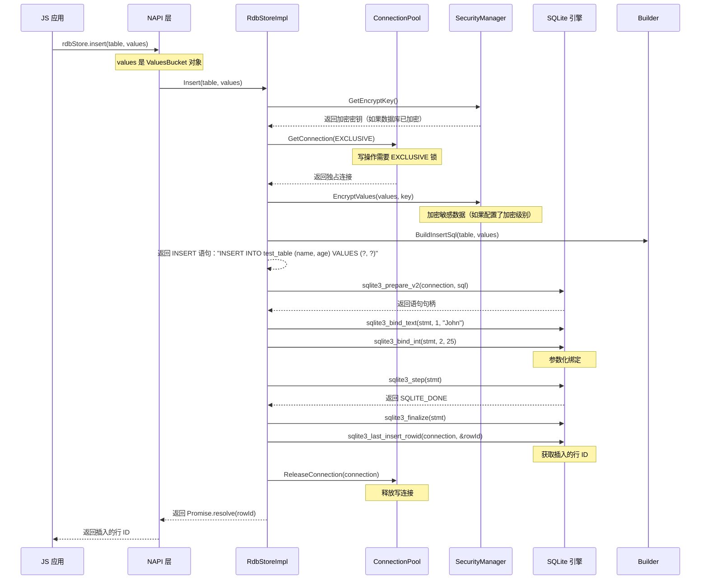
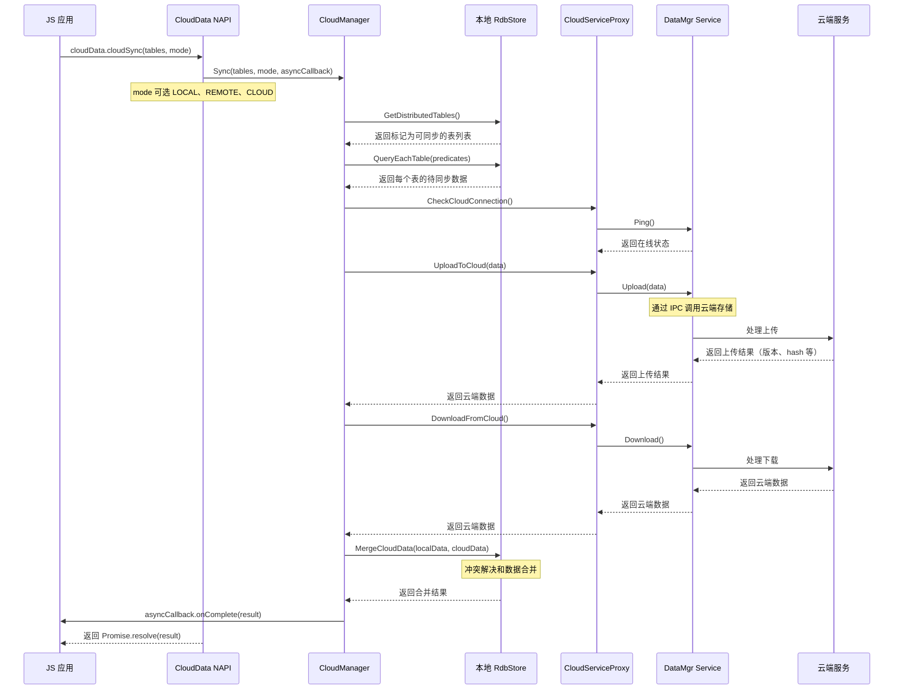
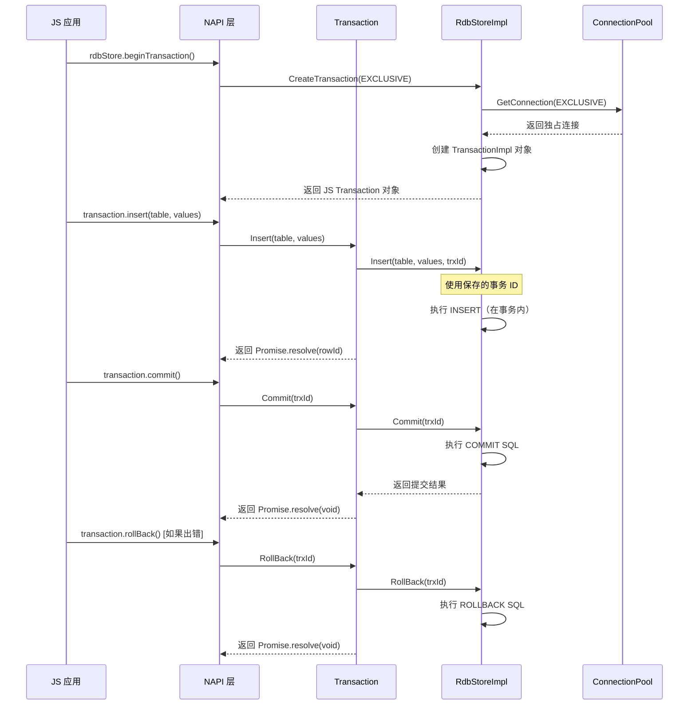
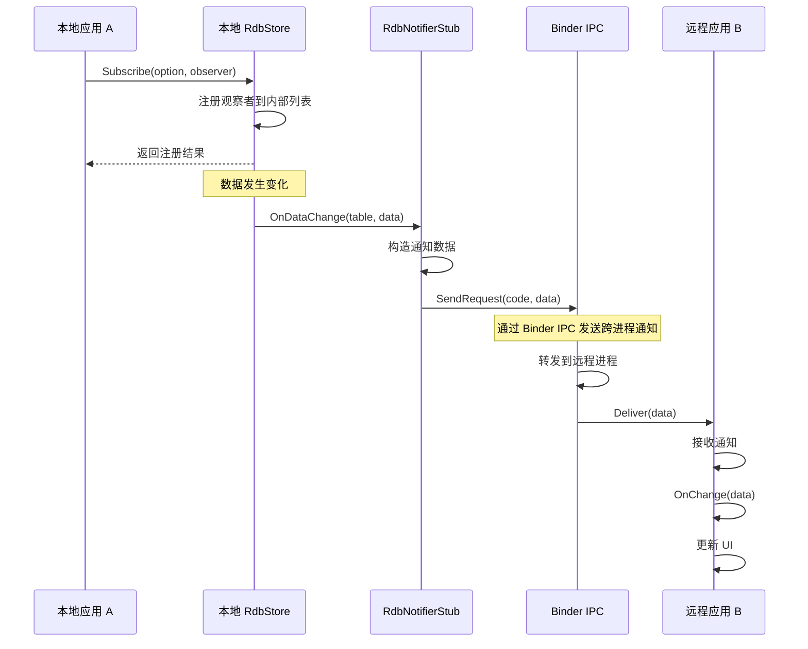
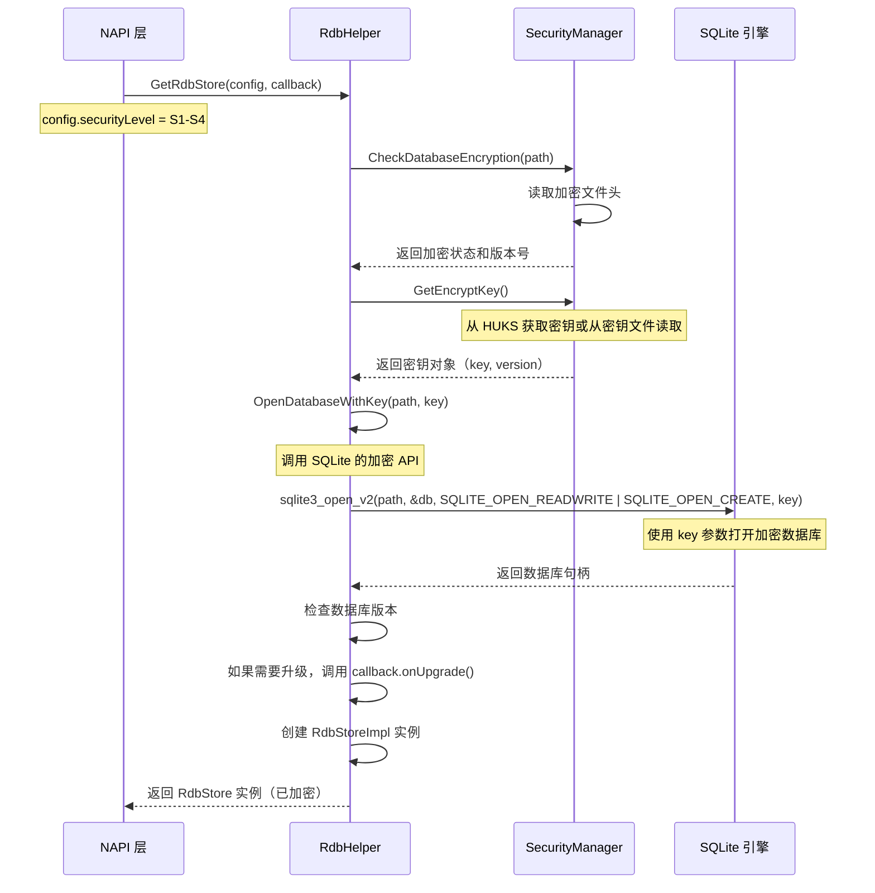
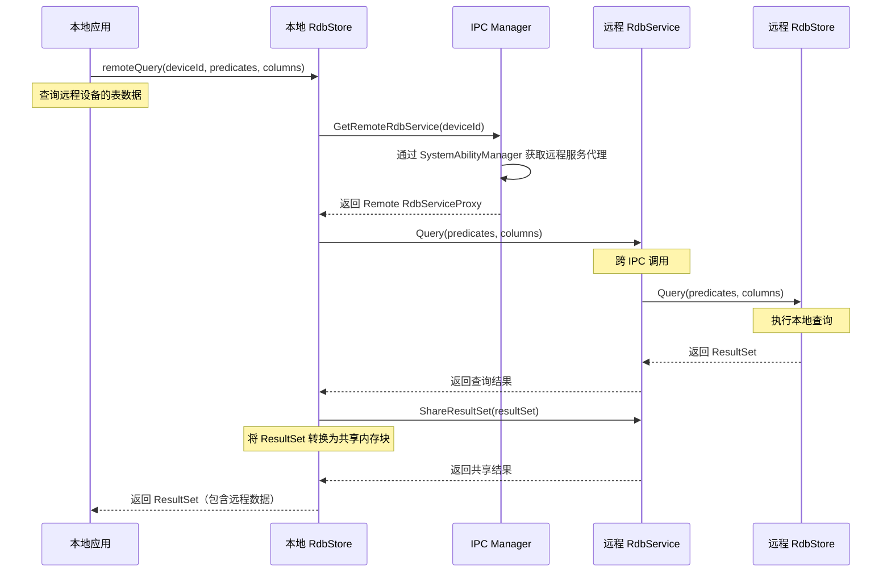

# 关键调用链示例

## 目的

本文档展示 relational_store 组件中关键操作的调用链，从入口点到核心逻辑的完整路径。

## 适用范围

- 关键操作的完整调用链
- 跨模块调用关系
- 数据流和转换过程

## 1. 数据库打开流程

### 1.1 RdbStore 创建（JS → N-API → Core）

**关键文件与代码位置**：
- N-API 入口：`frameworks/js/napi/relationalstore/src/napi_rdb_store_helper.cpp:145-180`
- Helper 实现：`frameworks/native/rdb/src/rdb_helper.cpp:40-85`
- Core 实现：`frameworks/native/rdb/src/rdb_store_impl.cpp:1-200`
- 连接池：`frameworks/native/rdb/src/connection_pool.cpp:23-178`

## 2. 查询操作流程

### 2.1 Query 谓用（JS → N-API → Core → SQLite）

**关键文件与代码位置**：
- N-API Query：`frameworks/js/napi/relationalstore/src/napi_rdb_store.cpp:398-456`
- Predicates：`frameworks/js/napi/relationalstore/src/napi_rdb_predicates.cpp`
- SQL Builder：`frameworks/native/rdb/src/sqlite_sql_builder.cpp:89-234`
- Core Query：`frameworks/native/rdb/src/rdb_store_impl.cpp:523-654`

## 3. 插入操作流程

### 3.1 Insert 调用链（JS → N-API → Core → SQLite）

**关键文件与代码位置**：
- N-API Insert：`frameworks/js/napi/relationalstore/src/napi_rdb_store.cpp:227-352`
- Core Insert：`frameworks/native/rdb/src/rdb_store_impl.cpp:166-218`
- Security Manager：`frameworks/native/rdb/src/rdb_security_manager.cpp:89-134`

## 4. 云同步流程

### 4.1 云同步调用链（JS → NAPI → CloudManager → CloudService）

**关键文件与代码位置**：
- N-API Cloud Sync：`frameworks/js/napi/cloud_data/src/js_config.cpp:145-189`
- Cloud Manager：`frameworks/native/cloud_data/src/cloud_manager.cpp:1-300`
- Service Proxy：`frameworks/native/cloud_data/src/cloud_service_proxy.cpp`

## 5. 事务操作流程

### 5.1 事务生命周期（JS → N-API → Core）

**关键文件与代码位置**：
- N-API Transaction：`frameworks/js/napi/relationalstore/src/napi_transaction.cpp`
- Core Transaction：`frameworks/native/rdb/src/transaction_impl.cpp`
- RdbStore Transaction：`frameworks/native/rdb/src/rdb_store_impl.cpp:593-614`

## 6. 观察者通知流程

### 6.1 数据变更通知（Core → IPC Stub → Remote）

**关键文件与代码位置**：
- Notifier Stub：`frameworks/native/rdb/src/rdb_notifier_stub.cpp`
- RdbStore Observer：`frameworks/native/rdb/src/rdb_store_impl.cpp:714-729`

## 7. 加密数据库打开流程

### 7.1 带加密的数据库打开（Helper → SecurityManager → SQLite）

**关键文件与代码位置**：
- RdbHelper：`frameworks/native/rdb/src/rdb_helper.cpp:40-85`
- Security Manager：`frameworks/native/rdb/src/rdb_security_manager.cpp:145-180`

## 8. 分布式表查询流程

### 8.1 远程设备查询（JS → RdbStore → RemoteService）

**关键文件与代码位置**：
- Remote Query：`frameworks/native/rdb/src/rdb_store_impl.cpp:465-483`
- IPC Manager：`frameworks/native/rdb/src/rdb_manager_impl.cpp:1-145`
- Service Proxy：`frameworks/native/rdb/src/rdb_service_proxy.cpp`

## 调用链总结

| 操作 | 入口点 | 核心逻辑 | 数据存储 | 关键文件 |
|------|----------|----------|----------|------------|
| **打开数据库** | RdbHelper::GetRdbStore() | SecurityManager + SQLite | 本地文件 | rdb_helper.cpp rdb_security_manager.cpp |
| **查询数据** | RdbStore::Query() | SqliteSqlBuilder → SQLite | 本地表 | sqlite_sql_builder.cpp rdb_store_impl.cpp |
| **插入数据** | RdbStore::Insert() | SecurityManager → SQLite | 本地表 | rdb_security_manager.cpp rdb_store_impl.cpp |
| **云同步** | CloudManager::Sync() | CloudServiceProxy → 云端 | 本地 + 云端 | cloud_manager.cpp cloud_service_proxy.cpp |
| **事务** | RdbStore::CreateTransaction() | TransactionImpl → SQLite | 本地表 | transaction_impl.cpp rdb_store_impl.cpp |
| **观察者** | RdbNotifierStub::OnDataChange() | Binder IPC | 跨进程 | rdb_notifier_stub.cpp |

---

**文档版本**: 1.0
**生成日期**: 2026-02-06
**主要证据来源**: 各核心实现文件、头文件定义
