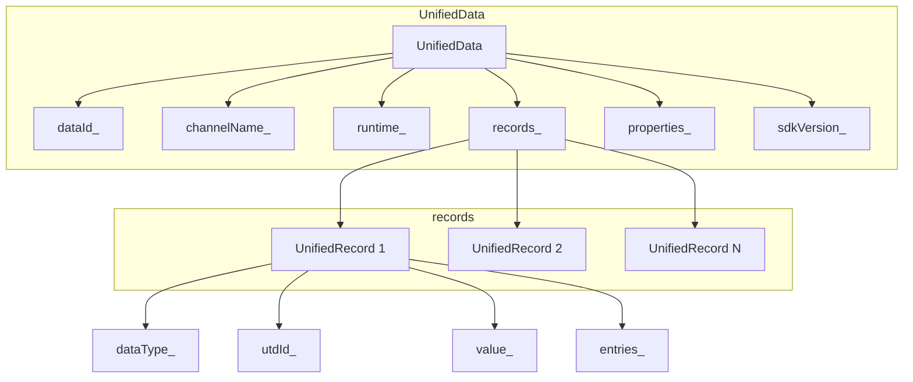

# 核心数据结构

## 数据结构概述

UDMF 核心数据结构定义在 `framework/innerkitsimpl/data/` 目录，是实现统一数据管理的基石。主要包含三个核心类：`UnifiedData`（统一数据容器）、`UnifiedRecord`（统一记录）和 `TypeDescriptor`（类型描述符）。这些数据结构通过 `ValueType` 变体类型支持多种数据格式的存储和传输。

根据源码证据（`framework/innerkitsimpl/`），数据结构设计遵循以下原则：首先，支持层次化的数据组织，`UnifiedData` 包含多个 `UnifiedRecord`；其次，支持多种数据类型，通过 `ValueType` 统一抽象；最后，支持懒加载，通过 `EntryGetter` 实现按需加载大文件。

## UnifiedData 详解

### 类定义

`UnifiedData` 是 UDMF 的核心数据容器（`framework/innerkitsimpl/data/unified_data.cpp`）：

```cpp
class UnifiedData {
public:
    // 构造函数
    UnifiedData();
    explicit UnifiedData(std::shared_ptr<UnifiedDataProperties> properties);

    // 数据大小
    int64_t GetSize();

    // 组 ID
    std::string GetGroupId() const;

    // 运行时信息
    std::shared_ptr<Runtime> GetRuntime() const;
    void SetRuntime(Runtime &runtime);

    // 记录管理
    void AddRecord(const std::shared_ptr<UnifiedRecord> &record);
    void AddRecords(const std::vector<std::shared_ptr<UnifiedRecord>> &records);
    std::shared_ptr<UnifiedRecord> GetRecordAt(std::size_t index) const;
    void SetRecords(std::vector<std::shared_ptr<UnifiedRecord>> records);
    std::vector<std::shared_ptr<UnifiedRecord>> GetRecords() const;

    // 类型查询
    std::vector<std::string> GetTypesLabels() const;
    bool HasType(const std::string &type) const;
    bool HasHigherFileType(const std::string &type) const;
    std::vector<std::string> GetEntriesTypes() const;
    bool HasTypeInEntries(const std::string &type) const;

    // 校验
    bool IsEmpty() const;
    bool IsValid();
    bool IsComplete();

    // 属性管理
    void SetProperties(std::shared_ptr<UnifiedDataProperties> properties);
    std::shared_ptr<UnifiedDataProperties> GetProperties() const;

    // 数据 ID 管理
    void SetDataId(uint32_t dataId);
    uint32_t GetDataId() const;

    // 通道名
    void SetChannelName(const std::string &name);

    // 文件 URI 列表
    std::vector<std::string> GetFileUris() const;

    // 数据转换
    bool IsNeedTransferToEntries() const;
    void ConvertRecordsToEntries();
    std::string GetSdkVersion() const;
    void SetSdkVersion(const std::string &version);

private:
    // 获取类型 ID 集合
    std::set<std::string> GetTypIds() const;

    // 成员变量
    uint32_t dataId_ = 0;
    uint32_t recordId_ = 0;
    std::string channelName_;
    std::shared_ptr<Runtime> runtime_;
    std::vector<std::shared_ptr<UnifiedRecord>> records_;
    std::shared_ptr<UnifiedDataProperties> properties_;
    std::string sdkVersion_;

    // 最大数据大小限制
    static constexpr int64_t MAX_DATA_SIZE = 200 * 1024 * 1024;  // 200MB
};
```

### 数据结构关系图



## UnifiedRecord 详解

### 类定义

`UnifiedRecord` 是 `UnifiedData` 中的单条记录（`framework/innerkitsimpl/data/unified_record.cpp`）：

```cpp
class UnifiedRecord {
public:
    // 构造函数
    UnifiedRecord();
    explicit UnifiedRecord(UDType type);
    UnifiedRecord(UDType type, ValueType value);

    // 类型管理
    UDType GetType() const;
    std::vector<std::string> GetTypes() const;
    void SetType(const UDType &type);
    virtual int64_t GetSize();

    // 唯一标识
    std::string GetUid() const;
    void SetUid(const std::string &id);

    // 值管理
    ValueType GetValue();
    void SetValue(const ValueType &value);
    ValueType GetOriginValue() const;

    // UTD 管理
    void SetUtdId(const std::string &utdId);
    std::set<std::string> GetUtdIds() const;
    std::set<std::string> GetUtdIdsWithAddFileType(bool isSpecific) const;
    std::string GetUtdId() const;
    void SetUtdId2(const std::string &utdId);
    std::string GetUtdId2() const;

    // Entry 管理
    bool HasType(const std::string &utdId) const;
    void AddEntry(const std::string &utdId, ValueType &&value);
    ValueType GetEntry(const std::string &utdId);
    std::shared_ptr<std::map<std::string, ValueType>> GetEntries();

    // Entry Getter（懒加载）
    void SetEntryGetter(const std::vector<std::string> &utdIds,
                         const std::shared_ptr<EntryGetter> &entryGetter);
    std::shared_ptr<EntryGetter> GetEntryGetter();

    // ID 管理
    void SetDataId(uint32_t dataId);
    uint32_t GetDataId() const;
    void SetRecordId(uint32_t recordId);
    uint32_t GetRecordId() const;

    // 初始化
    virtual void InitObject();

private:
    // 成员变量
    UDType dataType_ = UDType::INVALID;
    std::string utdId_;
    std::string utdId2_;
    ValueType value_;
    std::map<std::string, ValueType> entries_;
    std::string uid_;
    uint32_t dataId_ = 0;
    uint32_t recordId_ = 0;
    std::vector<UriInfo> uris_;
    std::shared_ptr<EntryGetter> entryGetter_;
    mutable std::recursive_mutex mutex_;
};
```

### 记录类型枚举

```cpp
// UDType 枚举（unified_meta.h）
enum class UDType {
    INVALID = 0,
    ENTITY,           // 实体
    OBJECT,           // 对象
    COMPOSITE_OBJECT, // 复合对象
    TEXT,             // 文本
    PLAIN_TEXT,       // 纯文本
    HTML,             // HTML
    HYPERLINK,        // 超链接
    IMAGE,            // 图像
    VIDEO,            // 视频
    AUDIO,            // 音频
    FILE,             // 文件
    FOLDER,           // 文件夹
    SYSTEM_DEFINED,   // 系统定义
    APPLICATION_DEFINED, // 应用定义
    // ... 更多类型
};
```

## ValueType 变体

### 变体类型定义

`ValueType` 是支持多种类型的变体（`unified_types.h`）：

```cpp
// 值类型定义
using ValueType = std::variant<
    std::nullptr_t,                    // 空值
    bool,                               // 布尔值
    int32_t,                            // 32 位整数
    int64_t,                            // 64 位整数
    float,                              // 单精度浮点
    double,                             // 双精度浮点
    std::string,                        // 字符串
    std::vector<uint8_t>,              // 字节数组
    std::vector<ValueType>,            // 数组
    std::map<std::string, ValueType>, // 对象
    std::shared_ptr<NativeObject>      // Native 对象
>;
```

## TypeDescriptor 详解

### 类定义

`TypeDescriptor` 描述 UTD 类型的元数据（`framework/innerkitsimpl/data/type_descriptor.cpp`）：

```cpp
class TypeDescriptor {
public:
    // 构造函数
    TypeDescriptor(const std::string &typeId,
                   const std::vector<std::string> &belongingToTypes,
                   const std::vector<std::string> &filenameExtensions,
                   const std::vector<std::string> &mimeTypes,
                   const std::string &description,
                   const std::string &referenceURL,
                   const std::string &iconFile);
    TypeDescriptor(const TypeDescriptorCfg& typeDescriptorCfg);
    TypeDescriptor();
    ~TypeDescriptor();

    // 层次查询
    Status BelongsTo(const std::string &typeId, bool &checkResult);
    Status IsLowerLevelType(const std::string &typeId, bool &checkResult);
    Status IsHigherLevelType(const std::string &typeId, bool &checkResult);

    // 比较
    bool Equals(std::shared_ptr<TypeDescriptor> descriptor);

    // 元数据获取
    const std::string& GetTypeId() const;
    std::vector<std::string> GetBelongingToTypes();
    std::string GetIconFile();
    std::string GetDescription();
    std::string GetReferenceURL();
    std::vector<std::string> GetFilenameExtensions();
    std::vector<std::string> GetMimeTypes();

    // 元数据设置
    void SetTypeId(const std::string &typeId);
    void SetBelongingToTypes(const std::vector<std::string> &belongingToTypes);
    void SetFilenameExtensions(const std::vector<std::string> &filenameExtensions);
    void SetMimeTypes(const std::vector<std::string> &mimeTypes);
    void SetDescription(const std::string &description);
    void SetReferenceURL(const std::string &referenceURL);
    void SetIconFile(const std::string &iconFile);

private:
    // 比较灵活类型层级
    bool CmpFlexibleTypeLevel(const std::string higherLevelTypeId, 
                              bool isFlexibleType);

    // 成员变量
    std::string typeId_;
    std::vector<std::string> belongingToTypes_;
    std::vector<std::string> filenameExtensions_;
    std::vector<std::string> mimeTypes_;
    std::string description_;
    std::string referenceURL_;
    std::string iconFile_;
    bool isFlexibleType_ = false;
};
```

## UnifiedDataProperties

### 属性结构

`UnifiedDataProperties` 定义数据的属性信息（`framework/innerkitsimpl/data/unified_data_properties.h`）：

```cpp
class UnifiedDataProperties {
public:
    // 时间戳
    int64_t GetTimestamp() const;
    void SetTimestamp(int64_t timestamp);

    // 标签
    std::string GetTag() const;
    void SetTag(const std::string &tag);

    // 共享选项
    ShareOption GetShareOption() const;
    void SetShareOption(ShareOption option);

    // 扩展参数
    std::map<std::string, ValueType> GetExtras() const;
    void SetExtras(const std::map<std::string, ValueType> &extras);

private:
    int64_t timestamp_ = 0;
    std::string tag_;
    ShareOption shareOption_ = ShareOption::IN_APP;
    std::map<std::string, ValueType> extras_;
};
```

## Runtime 运行时

### 运行时信息

`Runtime` 包含数据的运行时信息（`unified_types.h`）：

```cpp
struct Runtime {
    std::string key;              // 数据 key
    std::string intention;         // 使用意图
    bool isRemote = false;         // 是否远程数据
    int64_t expireTime = 0;        // 过期时间
    std::string sourceDevice;     // 来源设备
    std::string transferDevice;   // 传输设备
    int32_t recordCount = 0;       // 记录数量
    int32_t asyncCount = 0;        // 异步数量
    bool isAsync = false;         // 是否异步
};
```

## Summary 摘要

### 数据摘要

`Summary` 包含数据的摘要信息（`unified_types.h`）：

```cpp
struct Summary {
    // 数据来源
    std::string bundleName;        // 包名
    std::string abilityName;       // 能力名

    // 类型信息
    std::vector<std::string> udkeys;     // UTD key 列表
    std::vector<std::string> typeIds;    // 类型 ID 列表
    std::vector<std::string> values;     // 值列表

    // 权限信息
    Privilege privilege;          // 权限信息

    // 来源信息
    bool isLocal = true;           // 是否本地数据
    std::string deviceId;          // 设备 ID

    // 内容信息
    std::string contentUri;        // 内容 URI
    std::string label;             // 标签
    std::string description;       // 描述
    std::vector<std::string> uri; // URI 列表
};
```

## 预设类型定义

### PresetTypeDescriptors

`PresetTypeDescriptors` 管理预设的 UTD 类型（`framework/innerkitsimpl/data/preset_type_descriptors.h`）：

```cpp
class PresetTypeDescriptors {
public:
    // 获取单例
    static PresetTypeDescriptors &GetInstance();

    // 获取类型配置
    std::shared_ptr<TypeDescriptor> GetTypeDescriptor(const std::string &typeId);

    // 获取所有类型
    std::vector<std::shared_ptr<TypeDescriptor>> GetAllTypeDescriptors();

    // 检查是否为预设类型
    bool IsPresetType(const std::string &typeId);

private:
    // 构造函数私有化
    PresetTypeDescriptors();

    // 初始化预设类型
    void InitializePresetTypes();

    // 类型配置缓存
    std::map<std::string, std::shared_ptr<TypeDescriptor>> typeDescriptors_;
};
```

## TLV 序列化

### TLVUtil 工具

`TLVUtil` 提供 TLV（Type-Length-Value）序列化能力（`framework/common/tlv_util.h`）：

```cpp
namespace TLVUtil {

// 模板特化写操作
template<typename T>
Status Writing(std::shared_ptr<TLVObject> tlvObj, const T &value);

// 模板特化读操作
template<typename T>
Status Reading(std::shared_ptr<TLVObject> tlvObj, T &value);

// 计算缓冲区大小
template<typename T>
int32_t CountBufferSize(const T &value);

// 支持的类型
// - 基础类型: bool, int32_t, int64_t, float, double
// - 字符串类型: std::string
// - 容器类型: std::vector, std::map, std::set
// - 智能指针: std::shared_ptr
// - UDMF 类型: UnifiedData, UnifiedRecord
}  // namespace TLVUtil
```

### TLVObject 封装

```cpp
class TLVObject {
public:
    // 构造函数
    TLVObject();
    TLVObject(const std::vector<uint8_t> &buffer);
    TLVObject(const std::string &file);

    // TLV 操作
    Status WriteHead(TLVTag tag, TLVLength len);
    Status ReadHead(TLVTag &tag, TLVLength &len);
    Status Skip(TLVLength len);
    Status WriteBackHead(TLVTag tag, TLVLength len);

    // 数据读写
    template<typename T>
    Status Write(TLVTag tag, const T &value);
    template<typename T>
    Status Read(TLVTag tag, T &value);

    // 缓冲区管理
    const std::vector<uint8_t> &GetBuffer() const;
    std::vector<uint8_t> &GetBuffer();

private:
    std::vector<uint8_t> buffer_;
    size_t cursor_ = 0;
    size_t total_ = 0;
    std::shared_ptr<FILE> file_;
};
```

## 相关文档

- [00_Overview.md](./00_Overview.md)：项目概述
- [01_Directory_Structure.md](./01_Directory_Structure.md)：目录结构
- [02_Data_Types.md](./02_Data_Types.md)：数据类型体系
- [11_NDK_Reference.md](./11_NDK_Reference.md)：NDK 接口
- [12_InnerKit_Reference.md](./12_InnerKit_Reference.md)：InnerKit 接口
- [20_Service_Layer.md](./20_Service_Layer.md)：服务层架构
- [21_Client_Layer.md](./21_Client_Layer.md)：客户端层架构
