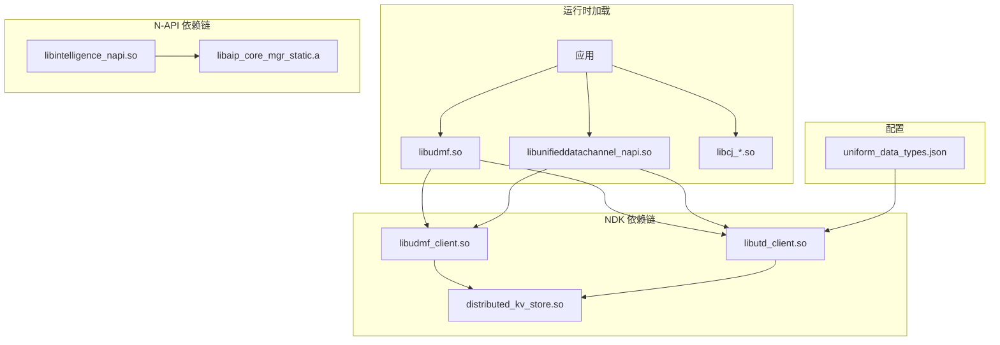

# 编译产物清单

## 产物概述

UDMF 项目编译后生成多种产物，包括共享库（.so）、静态库（.a）、字节码（.abc）和配置文件等。这些产物安装在系统的不同目录，供运行时加载使用。

根据源码证据（`BUILD.gn` 构建配置），UDMF 的编译产物主要分为五大类：接口层产物（NDK、InnerKit、N-API）、框架实现产物、组件产物、配置产物和测试产物。以下详细说明各类产物的清单、安装路径和加载关系。

## 接口层产物

### NDK 产物

**产物名称**：`libudmf.so`

**安装路径**：`system/lib/ndk/udmf.so`

**产物类型**：共享库（shared_library）

**大小**：约 636KB（根据 `bundle.json:25`）

**包含内容**：
- C API 实现（`udmf.cpp`、`uds.cpp`、`utd.cpp`）
- 数据提供者实现（`data_provider_impl.cpp`）
- NDK 桥接代码

**链接关系**：
```
应用 → libudmf.so → libudmf_client.so → libutd_client.so
```

**符号导出**（通过 `API_EXPORT` 宏）：
- `OH_UdmfData_*`：数据对象操作
- `OH_UdmfRecord_*`：记录操作
- `OH_Udmf_GetUnifiedData/SetUnifiedData`：数据存取
- `OH_Utd_*`：UTD 类型操作
- `OH_UdsPlainText_*` 等：UDS 结构操作

### InnerKit 产物

**产物名称**：`libudmf_client.so`

**安装路径**：`system/lib/`

**产物类型**：共享库（shared_library）

**包含内容**：
- `UdmfClient` 单例实现
- `UnifiedData`、`UnifiedRecord` 实现
- 各种 Record Type 实现（File、Image、Text 等）

**产物名称**：`libutd_client.so`

**安装路径**：`system/lib/`

**产物类型**：共享库（shared_library）

**包含内容**：
- `UtdClient` 单例实现
- `TypeDescriptor` 实现
- `UtdGraph` 类型层次图
- `PresetTypeDescriptors` 预设类型

**产物名称**：`libpixelmap_wrapper.so`

**安装路径**：`system/lib/`

**产物类型**：共享库（shared_library）

**包含内容**：
- 像素图加载包装器
- `PixelMapLoader` 实现

**产物名称**：`libaip_core_mgr_static.a`

**安装路径**：`system/lib/`

**产物类型**：静态库（static_library）

**包含内容**：
- AI 核心管理器实现

### N-API 产物

**产物名称**：`libunifieddatachannel_napi.so`

**安装路径**：`system/lib/module/data/`

**产物类型**：共享库（shared_library）

**包含内容**：
- `data.unifiedDataChannel` 模块
- `UnifiedData`、`UnifiedRecord` N-API 绑定
- `UnifiedDataChannel` API

**产物名称**：`libuniformtypedescriptor_napi.so`

**安装路径**：`system/lib/module/data/`

**产物类型**：共享库（shared_library）

**包含内容**：
- `data.uniformTypeDescriptor` 模块
- `TypeDescriptor` N-API 绑定
- UTD 查询 API

**产物名称**：`libintelligence_napi.so`

**安装路径**：`system/lib/module/data/`

**产物类型**：共享库（shared_library）

**包含内容**：
- `data.intelligence` 模块
- `TextEmbedding`、`ImageEmbedding` N-API 绑定

**产物名称**：`libudmf_data_napi.so`

**安装路径**：`system/lib/module/`

**产物类型**：共享库（shared_library）

**包含内容**：
- 基础数据 N-API 实现

**产物名称**：`libudmfcomponents.so`

**安装路径**：`system/lib/`

**产物类型**：共享库（shared_library）

**包含内容**：
- JS UI 组件
- 嵌入字节码数据

### Taihe 产物

**产物名称**：`libudmf_taihe_native.so`

**安装路径**：`/data/storage/el1/bundle/`（或 system 路径）

**产物类型**：Taihe 共享库（native library）

**包含内容**：
- ArkTS 原生实现
- ANI 接口绑定

**产物名称**：`udmf_abc.abc`

**安装路径**：`system/framework/`

**产物类型**：ETS 字节码

**包含内容**：
- ArkTS 接口实现
- 预编译字节码

**产物名称**：`udmf_etc`

**安装路径**：`system/framework/`

**产物类型**：系统配置文件

**包含内容**：
- Taihe 模块配置

### Cangjie 产物

**产物名称**：`libcj_unified_data_channel_ffi.so`

**安装路径**：`/data/storage/el1/bundle/`

**产物类型**：Cangjie FFI 库

**包含内容**：
- UnifiedDataChannel FFI 绑定

**产物名称**：`libcj_uniform_type_descriptor_ffi.so`

**安装路径**：`/data/storage/el1/bundle/`

**产物类型**：Cangjie FFI 库

**包含内容**：
- UTD FFI 绑定

## 配置产物

### UTD 类型配置

**产物名称**：`uniform_data_types.json`

**安装路径**：`system/etc/utd/conf/uniform_data_types.json`

**产物类型**：JSON 配置文件

**大小**：约 100KB

**包含内容**：
- 约 200 种预定义 UTD 类型定义
- 类型层次关系
- MIME 类型映射
- 文件扩展名映射

**加载时机**：
- 系统启动时由 UtdService 加载
- 应用安装时由 AppAbility 加载

## 框架内部库

### 公共工具库

这些库作为内部依赖，不直接安装：

| 产物名称 | 类型 | 包含内容 |
|----------|------|----------|
| `libudmf_js_common.a` | 静态库 | N-API 公共工具 |
| `libudmf_innerkits_common.a` | 静态库 | InnerKit 公共工具 |

## 测试产物

### 单元测试

| 产物名称 | 路径 | 说明 |
|----------|------|------|
| `udmf_unittest` | out/udmf/ | UDMF 单元测试 |
| `utd_unittest` | out/udmf/ | UTD 单元测试 |
| `uds_unittest` | out/udmf/ | UDS 单元测试 |

### 模糊测试

| 产物名称 | 路径 | 说明 |
|----------|------|------|
| `udmf_fuzzer` | out/udmf/ | UDMF 模糊测试 |
| `utd_fuzzer` | out/udmf/ | UTD 模糊测试 |
| `tlvutil_fuzzer` | out/udmf/ | TLV 序列化模糊测试 |

## 产物依赖关系图



## 安装路径汇总

| 产物 | 安装路径 | 安装时机 |
|------|----------|----------|
| `libudmf.so` | system/lib/ndk/ | 系统构建 |
| `libudmf_client.so` | system/lib/ | 系统构建 |
| `libutd_client.so` | system/lib/ | 系统构建 |
| `libpixelmap_wrapper.so` | system/lib/ | 系统构建 |
| `libaip_core_mgr_static.a` | system/lib/ | 系统构建 |
| `libunifieddatachannel_napi.so` | system/lib/module/data/ | 系统构建 |
| `libuniformtypedescriptor_napi.so` | system/lib/module/data/ | 系统构建 |
| `libintelligence_napi.so` | system/lib/module/data/ | 系统构建 |
| `libudmf_data_napi.so` | system/lib/module/ | 系统构建 |
| `libudmfcomponents.so` | system/lib/ | 系统构建 |
| `libudmf_taihe_native.so` | /data/storage/el1/bundle/ | 应用安装 |
| `udmf_abc.abc` | system/framework/ | 系统构建 |
| `uniform_data_types.json` | system/etc/utd/conf/ | 系统构建 |
| `libcj_*.so` | /data/storage/el1/bundle/ | 应用安装 |

## 运行时加载关系

### NDK 应用加载

```c
// 应用代码
#include <udmf/udmf.h>

// 链接：CMake 或 mk 文件中指定
// -ludmf -ludmf_client -lutd_client

// 运行时：dlopen 自动加载依赖
void LoadUDMF() {
    // dlopen("libudmf.so") 自动加载：
    // - libudmf_client.so
    // - libutd_client.so
    // - distributed_kv_store.so
}
```

### N-API 应用加载

```javascript
// ArkTS 代码
import { unifiedDataChannel } from '@ohos.udmf';

// 运行时：ArkTS 运行时自动加载
// - libunifieddatachannel_napi.so
// - libunifiedtypedescriptor_napi.so
// - libintelligence_napi.so
```

## 产物验证命令

### 检查安装产物

```bash
# 检查 NDK 库
ls -la system/lib/ndk/libudmf.so

# 检查 N-API 库
ls -la system/lib/module/data/libunifieddatachannel_napi.so

# 检查配置文件
ls -la system/etc/utd/conf/uniform_data_types.json

# 检查符号导出
nm -D system/lib/ndk/libudmf.so | grep "OH_Udmf"
```

### 检查依赖关系

```bash
# 检查 NDK 库依赖
ldd system/lib/ndk/libudmf.so

# 检查 N-API 库依赖
ldd system/lib/module/data/libunifieddatachannel_napi.so
```

## 相关文档

- [00_Overview.md](./00_Overview.md)：项目概述
- [01_Directory_Structure.md](./01_Directory_Structure.md)：目录结构
- [11_NDK_Reference.md](./11_NDK_Reference.md)：NDK 接口
- [10_NAPI_Reference.md](./10_NAPI_Reference.md)：N-API 接口
- [30_GN_Build_Targets.md](./30_GN_Build_Targets.md)：构建目标定义
- [40_Security_Analysis.md](./40_Security_Analysis.md)：安全分析
