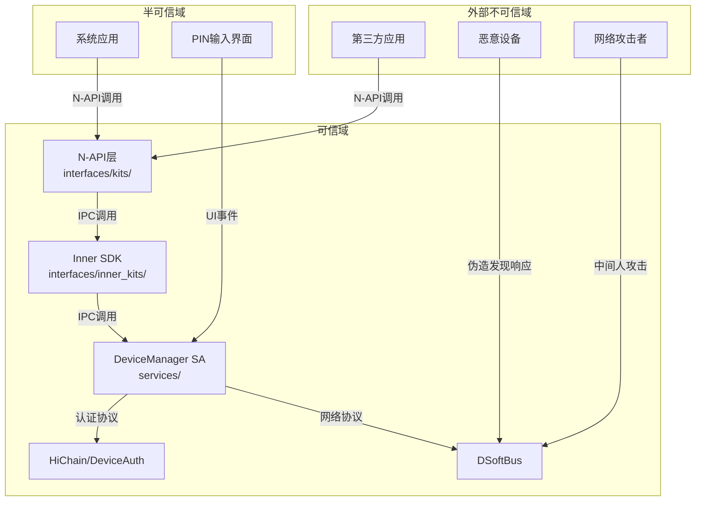

# 攻击面分析

> 文档目的：识别 DeviceManager 的所有外部输入入口和敏感操作点，为安全研究提供攻击面地图。

---

## 1. 攻击面总览

### 1.1 攻击面分类

| 攻击面类别 | 数量 | 风险等级 | 说明 |
|-----------|------|---------|------|
| N-API (JS接口) | 25+ | 🔴 高 | 应用层直接输入 |
| IPC 接口 | 15+ | 🔴 高 | 跨进程调用 |
| 网络输入 | 3 | 🔴 高 | DSoftBus 设备发现/认证 |
| 文件输入 | 2 | 🟡 中 | 配置文件、数据库 |
| UI 输入 | 2 | 🟡 中 | PIN码输入、用户操作 |

### 1.2 信任边界图



---

## 2. N-API 攻击面

### 2.1 入口点总览

**主入口文件**：`interfaces/kits/js4.0/src/native_devicemanager_js.cpp`

**模块注册点**：
```cpp
// native_devicemanager_js.cpp:3014
static napi_module g_dmModule = {
    .nm_version = 1,
    .nm_flags = 0,
    .nm_filename = nullptr,
    .nm_register_func = Init,
    .nm_modname = "distributedDeviceManager",
    .nm_priv = nullptr,
    .reserved = {0}
};
```

### 2.2 N-API 方法清单

| 方法名 | 参数类型 | 风险点 | 代码位置 |
|--------|---------|--------|----------|
| `createDeviceManager` | string (bundleName) | 字符串注入 | `native_devicemanager_js.cpp:2200` |
| `releaseDeviceManager` | object | 类型混淆 | `native_devicemanager_js.cpp:2760` |
| `startDiscovering` | object | JSON解析、字段注入 | `native_devicemanager_js.cpp:1620` |
| `stopDiscovering` | number | 数值范围 | `native_devicemanager_js.cpp:1840` |
| `bindTarget` | object | 复杂对象解析 | `native_devicemanager_js.cpp:1910` |
| `unbindTarget` | string | 路径遍历 | `dm_native_util.cpp:455` |
| `on` | string, function | 事件名注入 | `native_devicemanager_js.cpp:1850` |
| `off` | string, function | 事件名注入 | `native_devicemanager_js.cpp:1870` |
| `getTrustedDeviceList` | - | 信息泄露 | `native_devicemanager_js.cpp:1456` |
| `getAvailableDeviceList` | - | 信息泄露 | `native_devicemanager_js.cpp:1482` |
| `setUserOperation` | number, string | 操作码注入 | `native_devicemanager_js.cpp:2394` |
| `generatePinCode` | number | 数值范围 | `native_devicemanager_js.cpp:2394` |
| `destroyPinCode` | string | 路径遍历 | 待确认 |

### 2.3 关键输入验证点

**参数类型检查示例**：
```cpp
// native_devicemanager_js.cpp:1064
napi_typeof(env, argv[0], &valueType);
if (valueType != napi_string) {
    // 类型错误处理
}
```

**字符串长度检查**：
```cpp
// dm_native_util.cpp:56-67
NAPI_CALL_RETURN_VOID(env, napi_has_named_property(env, object, fieldStr.c_str(), &hasProperty));
if (hasProperty) {
    NAPI_CALL_RETURN_VOID(env, napi_typeof(env, field, &valueType));
    if (valueType == napi_string) {
        NAPI_CALL_RETURN_VOID(env, napi_get_value_string_utf8(env, field, dest, destLen, &result));
    }
}
```

### 2.4 N-API 风险矩阵

| 风险项 | 严重性 | 可利用性 | 证据 |
|--------|--------|---------|------|
| 参数类型混淆 | 中 | 高 | `native_devicemanager_js.cpp:41` 宏定义参数获取 |
| 字符串长度溢出 | 中 | 中 | 需要确认长度限制 |
| JSON字段注入 | 高 | 高 | `startDiscovering` 解析复杂对象 |
| 回调函数劫持 | 中 | 低 | 回调注册未验证来源 |

---

## 3. IPC 攻击面

### 3.1 IPC 接口总览

**IPC 头文件位置**：`interfaces/inner_kits/native_cpp/include/ipc/`

**主要 IPC 类**：
- `IDeviceManager` - 服务接口定义
- `DeviceManagerProxy` - 客户端代理
- `DeviceManagerStub` - 服务端存根

### 3.2 IPC 方法清单

| 方法 | 输入数据 | 敏感操作 | 风险 |
|------|---------|---------|------|
| `AuthenticateDevice` | 设备ID、认证参数 | 启动认证流程 | 未授权认证 |
| `UnAuthenticateDevice` | 设备ID | 删除信任关系 | 未授权解绑 |
| `StartDiscovering` | 发现参数 | 网络扫描 | DoS攻击 |
| `GetTrustedDeviceList` | - | 查询设备 | 信息泄露 |
| `SetUserOperation` | 操作码 | UI控制 | 越权操作 |

### 3.3 IPC 数据流

```
JS调用 → N-API → IPC Proxy → IPC Stub → ServiceImpl → 业务逻辑
              ↑                      ↓
              └──── MessageParcel ───┘
```

**MessageParcel 边界检查**：
- 写入前检查数据大小
- 读取时验证数据类型
- 字符串长度限制

---

## 4. 网络攻击面

### 4.1 DSoftBus 接口

**连接文件**：`services/implementation/src/dependency/softbus/softbus_connector.cpp`

**网络交互点**：

| 功能 | 输入源 | 处理方式 | 风险 |
|------|--------|---------|------|
| 设备发现 | 广播包 | 解析设备信息 | 伪造设备 |
| 设备上线 | 网络事件 | 状态更新 | 状态欺骗 |
| 认证通道 | 会话数据 | 消息转发 | 中间人攻击 |

### 4.2 设备发现协议

**发现响应处理**：
```cpp
// softbus_connector.cpp (待精确定位)
// 处理来自DSoftBus的设备发现结果
OnDeviceFound(const DeviceInfo* deviceInfo) {
    // 设备ID、名称、类型来自网络
    // 需要验证设备信息格式
}
```

**风险点**：
- ⚠️ 设备ID未验证格式
- ⚠️ 设备名称可能包含恶意字符
- ⚠️ 设备类型可能被伪造

### 4.3 认证通道

**会话建立**：
```cpp
// dm_auth_manager.cpp:906
DmAuthManager::EstablishAuthChannel(const std::string &deviceId)
```

**数据传输**：
```cpp
// dm_auth_manager.cpp:708
DmAuthManager::OnDataReceived(const int32_t sessionId, const std::string message)
```

**风险点**：
- 🔴 认证消息未验证来源
- 🔴 PIN码在内存中处理
- 🟡 会话ID可能被预测

---

## 5. 文件攻击面

### 5.1 配置文件

**SA配置**：`sa_profile/device_manager.cfg`
- 路径权限配置
- 能力声明

**系统参数**：`services/etc/ohos.para.dac`
- DAC权限配置

### 5.2 数据库

**KV存储路径**：`/data/service/el1/public/database/distributed_device_manager_service`

**存储内容**：
- 可信设备列表
- 认证凭据
- 设备状态

**风险点**：
- 🟡 路径硬编码
- 🟡 权限配置依赖配置文件

---

## 6. UI 攻击面

### 6.1 PIN 码输入

**输入来源**：
1. `DeviceManager_UI.hap` 系统对话框
2. 开发者自定义UI（`displayOwner=1`）

**处理流程**：
```
用户输入 → UI层 → setUserOperation → PIN验证 → 认证完成
```

**风险点**：
- 🔴 自定义UI可能劫持PIN码
- 🟡 PIN码在传输中是否加密
- 🟡 重试次数限制

### 6.2 用户操作

**操作码定义**：
```cpp
// operateAction 定义
0 - 允许认证
1 - 取消认证
2 - 用户操作超时
3 - 取消PIN码显示
4 - 取消PIN码输入
5 - 确认PIN码输入
```

**接口**：`setUserOperation(operateAction, params)`

---

## 7. 攻击向量汇总

### 7.1 攻击向量表

| 编号 | 攻击向量 | 入口点 | 目标 | 难度 |
|------|---------|--------|------|------|
| AV-01 | JS参数注入 | N-API | 服务崩溃/越权 | 低 |
| AV-02 | 伪造设备发现 | DSoftBus | 诱导认证 | 中 |
| AV-03 | 中间人攻击 | 网络层 | 窃听/篡改 | 中 |
| AV-04 | IPC调用伪造 | IPC接口 | 未授权操作 | 高 |
| AV-05 | PIN码暴力破解 | UI层 | 认证绕过 | 中 |
| AV-06 | 设备ID遍历 | 绑定接口 | 信息泄露 | 低 |
| AV-07 | 资源耗尽 | 发现接口 | DoS | 低 |
| AV-08 | 回调劫持 | 事件注册 | 代码执行 | 高 |

### 7.2 攻击链示例

**攻击链1：伪造设备诱导认证**
```
[攻击者] → 伪造设备发现响应 → [目标设备显示认证请求] 
    → 用户误确认 → 建立不信任关系 → [攻击者获得访问权限]
```

**攻击链2：参数注入导致崩溃**
```
[恶意App] → 传入畸形JSON参数 → [N-API解析失败] 
    → 未处理异常 → [服务崩溃]
```

---

## 8. 信任边界验证

### 8.1 边界检查点

| 边界 | 检查机制 | 位置 | 状态 |
|------|---------|------|------|
| App → N-API | 参数类型检查 | `dm_native_util.cpp` | ✅ 有 |
| App → N-API | 参数长度限制 | 待确认 | ⭕ 需验证 |
| N-API → IPC | 权限检查 | `permission/` | ✅ 有 |
| IPC → Service | UID验证 | IPC Skeleton | ✅ 有 |
| Service → 网络 | 加密传输 | DSoftBus | ✅ 有 |
| UI → Service | 无额外验证 | - | ⚠️ 风险 |

### 8.2 权限检查矩阵

| API | 权限要求 | 检查位置 | 绕过难度 |
|-----|---------|---------|----------|
| `createDeviceManager` | `DISTRIBUTED_DATASYNC` | Framework | 高 |
| `startDiscovering` | 4.0+无需权限 | - | - |
| `bindTarget` | `DISTRIBUTED_DATASYNC` | Service | 高 |
| `getTrustedDeviceList` | 无 | - | - |
| `setUserOperation` | 系统应用 | Service | 中 |

---

## 9. 待确认事项

- [ ] 确认所有N-API的完整参数校验逻辑
- [ ] 确认设备ID的格式验证规则
- [ ] 确认PIN码的最小/最大长度限制
- [ ] 确认认证重试次数和锁定机制
- [ ] 确认DSoftBus传输加密的实现细节
- [ ] 确认IPC权限检查的完整代码路径
- [ ] 确认自定义UI输入的安全验证

---

*证据收集时间: 2026-02-07*
*代码版本: OpenHarmony DeviceManager 主线*
