# 关键调用链

## 1. 设备发现调用链

### 1.1 发现流程

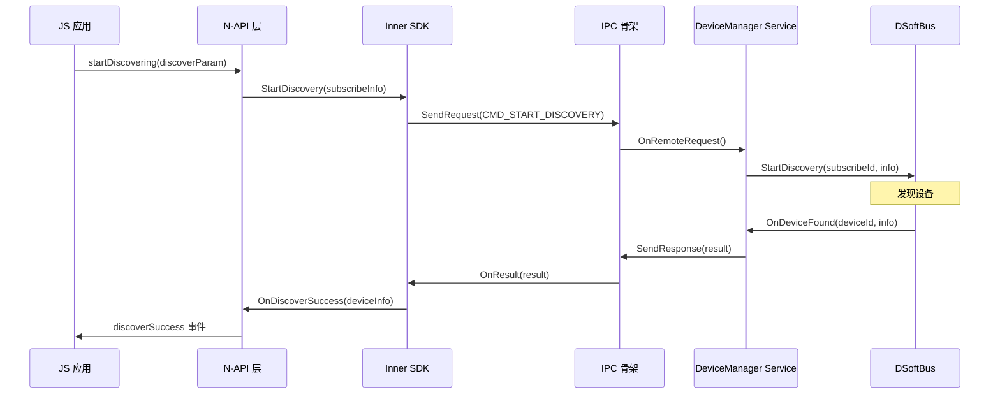

### 1.2 调用入口

| 阶段 | 函数 | 文件:行号 |
|-----|------|----------|
| JS | `DeviceManagerNapi::StartDiscovering()` | TODO |
| SDK | `DeviceManager::StartDiscovery()` | TODO |
| IPC | `IPCSkeleton::SendRequest()` | 系统 IPC |
| Service | `DeviceManagerServiceImpl::StartDiscovery()` | TODO |
| DSoftBus | `Discovery::StartDiscovery()` | dsoftbus |

## 2. 设备认证调用链

### 2.1 认证流程

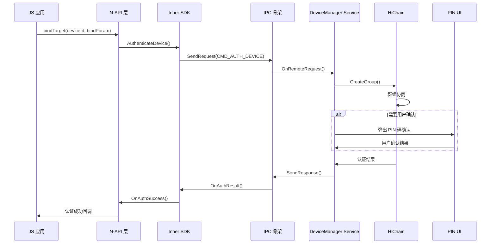

### 2.2 关键函数

| 阶段 | 函数 | 文件:行号 |
|-----|------|----------|
| JS | `DeviceManagerNapi::BindTarget()` | TODO |
| Service | `DmAuthManager::StartAuth()` | `services/implementation/src/authentication/dm_auth_manager.cpp` |
| HiChain | `HiChainConnector::AuthenticateDevice()` | TODO |
| UI | `DmDialogManager` | TODO |

## 3. 设备状态监听调用链

### 3.1 监听注册

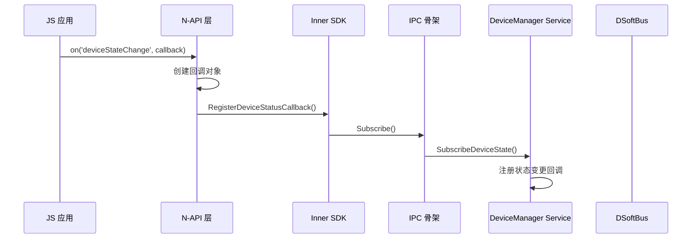

### 3.2 状态变更通知

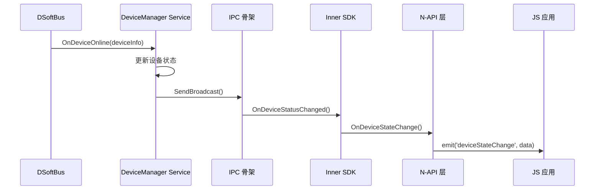

## 4. 设备发布调用链

### 4.1 发布流程

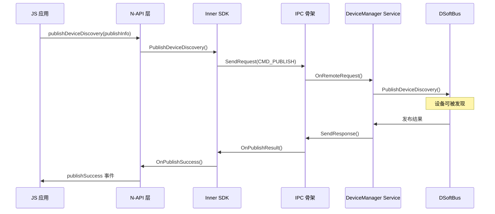

## 5. 初始化调用链

### 5.1 服务启动

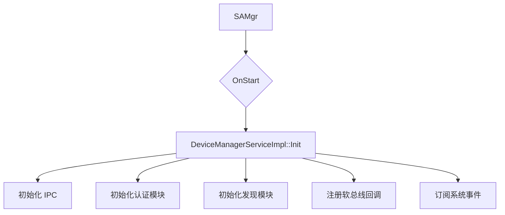

### 5.2 实例创建

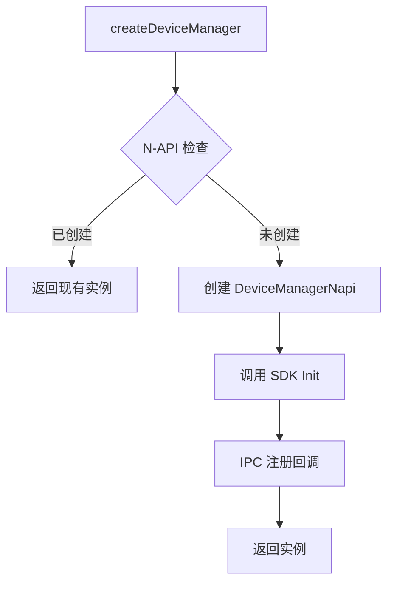

## 6. 释放调用链

### 6.1 实例释放

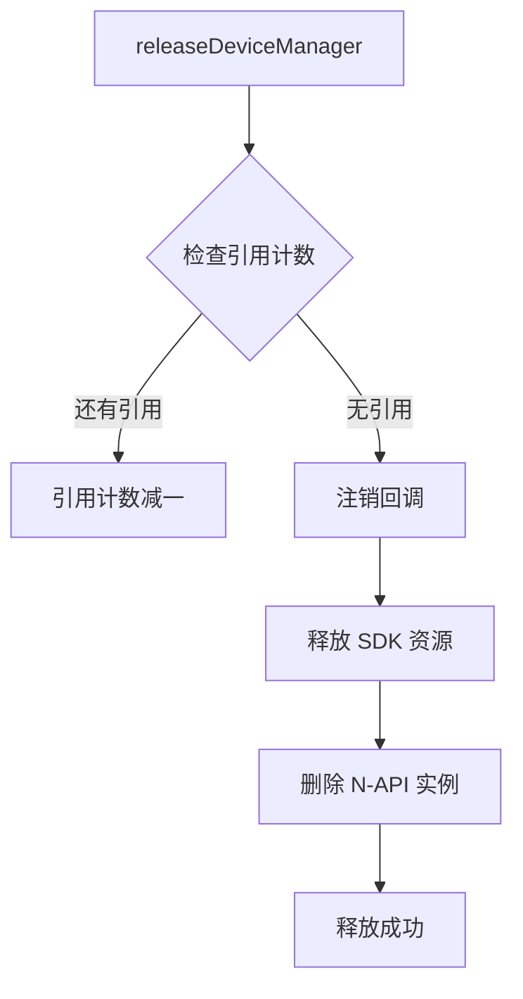

## 7. 关键内部调用

### 7.1 HiChain 交互

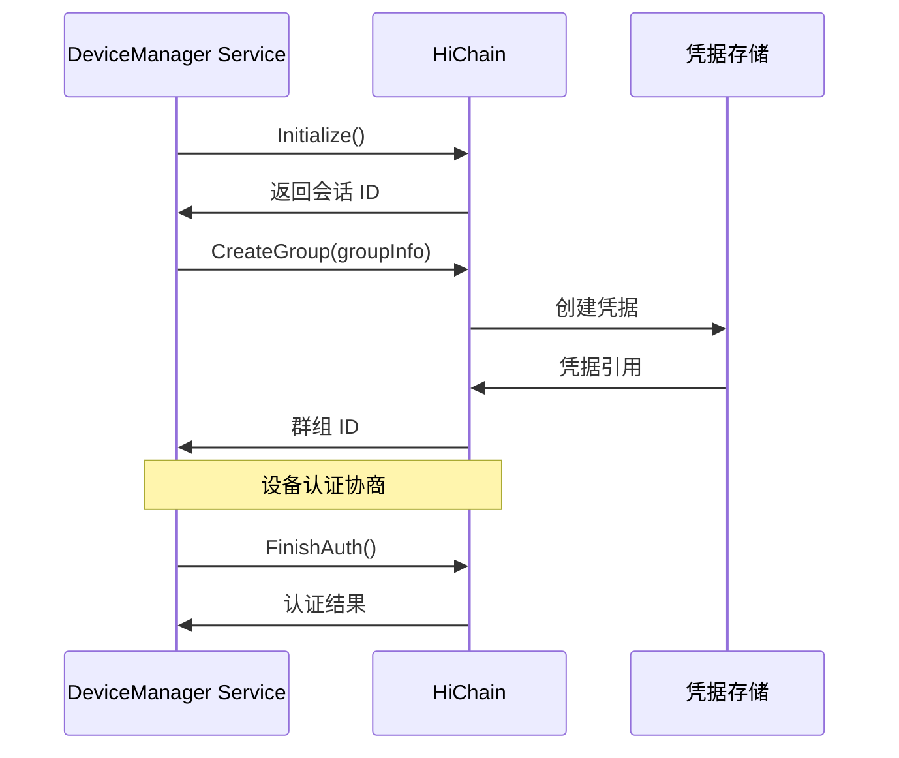

### 7.2 DSoftBus 交互

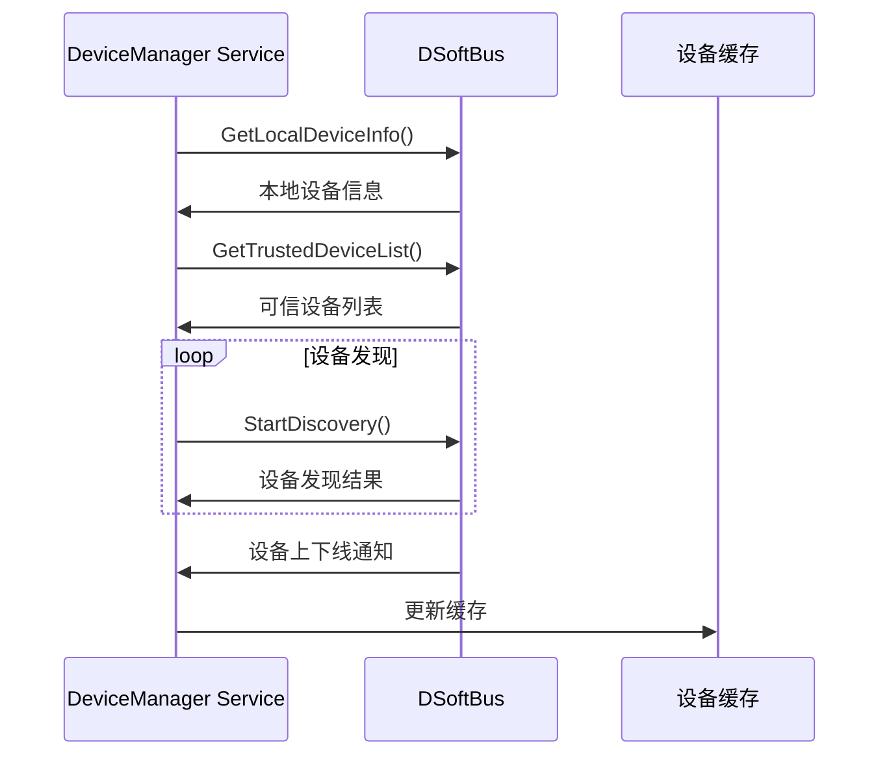

## 8. 逆向调用链

### 8.1 回调处理

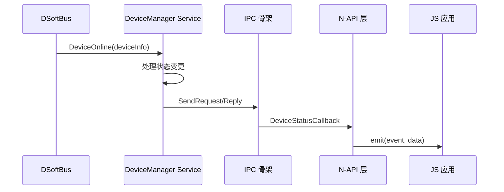

## 9. 错误处理调用链

### 9.1 错误传播

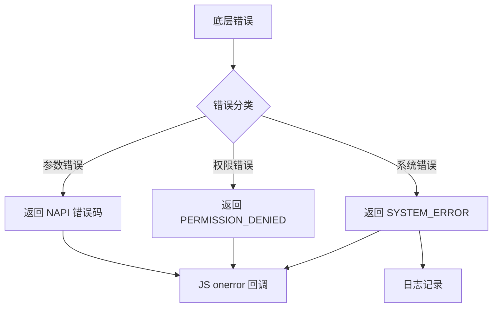

## 10. 调用链速查表

| 功能 | 入口 | 关键路径 | 终点 |
|-----|------|---------|------|
| 设备发现 | `startDiscovering` | SDK → IPC → Service → DSoftBus | `discoverSuccess` |
| 设备认证 | `bindTarget` | SDK → IPC → Service → HiChain | `bindSuccess` |
| 设备发布 | `publishDeviceDiscovery` | SDK → IPC → Service → DSoftBus | `publishSuccess` |
| 状态监听 | `on('deviceStateChange')` | SDK → IPC → Service → 回调注册 | 事件触发 |
| 实例创建 | `createDeviceManager` | N-API → SDK | 实例返回 |
| 实例释放 | `releaseDeviceManager` | SDK 清理 → 回调注销 | 完成 |
