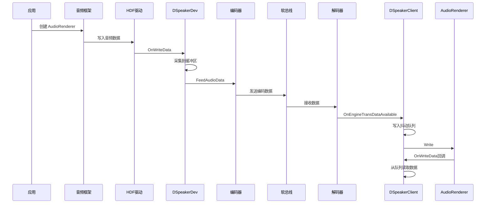
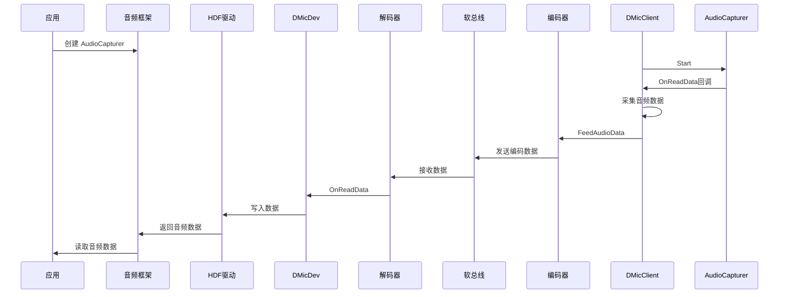

# 架构说明

## 系统架构图

```
┌─────────────────────────────────────────────────────────────────────────────┐
│                              分布式音频系统架构                               │
├─────────────────────────────────────────────────────────────────────────────┤
│                                                                              │
│   ┌─────────────────────────────────────────────────────────────────────┐  │
│   │                          应用层                                      │  │
│   │                   （音频框架接口）                                    │  │
│   └─────────────────────────────────────────────────────────────────────┘  │
│                                    │                                        │
│                                    ▼                                        │
│   ┌─────────────────────────────────────────────────────────────────────┐  │
│   │                      分布式音频框架                                  │  │
│   │  ┌───────────────────────────────────────────────────────────────┐ │  │
│   │  │                    HDF 驱动层                                  │ │  │
│   │  │  ┌─────────────┐  ┌─────────────┐  ┌─────────────┐           │ │  │
│   │  │  │ 虚拟扬声器   │  │ 虚拟麦克风   │  │ 虚拟音频适配 │           │ │  │
│   │  │  │ (Source)   │  │ (Source)   │  │            │           │ │  │
│   │  │  └──────┬──────┘  └──────┬──────┘  └──────┬──────┘           │ │  │
│   │  └─────────┼────────────────┼────────────────┼──────────────────┘ │  │
│   │            │                │                │                     │  │
│   │  ┌─────────▼────────────────▼────────────────▼──────────────────┐  │  │
│   │  │              音频管理器 (Audio Manager)                     │  │  │
│   │  │  ┌──────────────┐        ┌──────────────┐                  │  │  │
│   │  │  │ Source 服务  │        │  Sink 服务   │                  │  │  │
│   │  │  │  (SA 4805)   │        │  (SA 4806)   │                  │  │  │
│   │  │  └──────┬───────┘        └──────┬───────┘                  │  │  │
│   │  └─────────┼───────────────────────┼──────────────────────────┘  │  │
│   │            │                       │                             │  │
│   │  ┌─────────▼──────────┐  ┌────────▼──────────┐                 │  │
│   │  │    Source 管理器    │  │    Sink 管理器     │                 │  │
│   │  │ ┌─────┐  ┌─────┐  │  │  ┌─────┐  ┌─────┐  │                 │  │
│   │  │ │扬声器│  │麦克风│  │  │  │扬声器│  │麦克风│  │                 │  │
│   │  │ │设备 │  │设备 │  │  │  │客户端│  │客户端│  │                 │  │
│   │  │ └─────┘  └─────┘  │  │  └─────┘  └─────┘  │                 │  │
│   │  └─────────┬──────────┘  └────────┬──────────┘                 │  │
│   └────────────┼──────────────────────┼──────────────────────────────┘  │
│                │                      │                                  │
│   ┌────────────▼──────────────────────▼──────────────────────────────┐  │
│   │                        传输层                                     │  │
│   │  ┌────────────────┐  ┌────────────────┐  ┌────────────────┐    │  │
│   │  │  发送引擎       │  │  接收引擎       │  │  控制传输       │    │  │
│   │  │ (编码/发送)    │  │ (接收/解码)    │  │ (控制指令)      │    │  │
│   │  └────────┬───────┘  └────────┬───────┘  └────────┬───────┘    │  │
│   └───────────┼───────────────────┼───────────────────┼────────────┘  │
│               │                   │                   │                │
│   ┌───────────▼───────────────────▼───────────────────▼────────────┐  │
│   │                        软总线                                   │  │
│   │              （分布式通信基础设施）                              │  │
│   └────────────────────────────────────────────────────────────────┘  │
│                                                                              │
└─────────────────────────────────────────────────────────────────────────────┘
```

## 数据流图

### 播放流程（Source → Sink）



### 录音流程（Sink → Source）



## 组件职责

### 1. HDF 驱动层（虚拟设备）

**文件**: `services/audiohdiproxy/`, `services/audiomanager/managersource/`

**职责**:
- 向 HDF 注册虚拟音频设备
- 接收音频框架的读写请求
- 将请求转发给设备管理器

**关键类**:
```cpp
// services/audiohdiproxy/include/daudio_hdi_handler.h
class DAudioHdiHandler {
    int32_t RegisterAudioDevice(const std::string &devId, const int32_t dhId);
    int32_t UnRegisterAudioDevice(const std::string &devId, const int32_t dhId);
};
```

### 2. 音频管理器

**文件**: `services/audiomanager/`

**职责**:
- 管理分布式音频设备生命周期
- 协调编码/传输/解码流程
- 处理设备事件和状态变更

**Source 端**:
```cpp
// services/audiomanager/managersource/include/daudio_source_manager.h
class DAudioSourceManager {
    int32_t EnableDAudio(const std::string &devId, ...);
    int32_t DisableDAudio(const std::string &devId, ...);
    void HandleDAudioNotify(const std::string &devId, ...);
};
```

**Sink 端**:
```cpp
// services/audiomanager/managersink/include/daudio_sink_manager.h
class DAudioSinkManager {
    int32_t InitAVTransEngines();
    int32_t SubscribeLocalHardware(const std::string &dhId, ...);
    int32_t UnsubscribeLocalHardware(const std::string &dhId);
};
```

### 3. 设备抽象

**Source 端设备**:
```cpp
// services/audiomanager/managersource/include/dspeaker_dev.h
class DSpeakerDev : public DAudioIODev {
    void OnWriteData();  // HDF 写入回调
    void OnEnqueueData(); // 数据入队
};

// services/audiomanager/managersource/include/dmic_dev.h
class DMicDev : public DAudioIODev {
    void OnReadData();   // HDF 读取回调
    void OnMicDataReceived(); // 麦克风数据接收
};
```

**Sink 端客户端**:
```cpp
// services/audioclient/spkclient/include/dspeaker_client.h
class DSpeakerClient : public IStandardAudioRendererListener {
    int32_t SetUp(const AudioParam &audioParams);
    int32_t StartRender();
    void OnEngineTransDataAvailable(); // 接收远端音频
};

// services/audioclient/micclient/include/dmic_client.h
class DMicClient : public IStandardAudioCapturerListener {
    int32_t SetUp(const AudioParam &audioParams);
    int32_t StartCapture();
    void OnReadData(); // 采集本地音频
};
```

### 4. 传输层

**文件**: `services/audiotransport/`

**职责**:
- 音频数据编码/解码
- 通过软总线传输数据
- 控制通道维护

```cpp
// 发送端
class AVTransSenderTransport : public IAudioDataTransport {
    int32_t FeedAudioData(const std::shared_ptr<AudioData> &audioData);
    int32_t SendMessage(const AudioEvent &event);
};

// 接收端
class AVTransReceiverTransport : public IAudioDataTransport {
    void OnEngineDataAvailable(); // 接收数据回调
};
```

## 线程模型

### Source 端线程

```
daudio 进程
├── 主线程
│   └── SA 服务事件处理
├── listenThread_ ("sourceListenTh")
│   └── Hicollie 看门狗线程
├── devClearThread_
│   └── 异步设备清理
├── SourceManagerHandler (EventRunner)
│   └── 管理器事件循环
├── SourceEventHandler (每个设备)
│   └── 设备事件循环
├── SpeakerEnqueueThread
│   └── 扬声器数据入队
└── MicEnqueueThread
    └── 麦克风数据入队
```

### Sink 端线程

```
daudio 进程
├── 主线程
│   └── SA 服务事件处理
├── renderDataThread_ ("renderThread")
│   └── 扬声器渲染循环
├── captureDataThread_ ("captureThread")
│   └── 麦克风采集循环
└── SinkEventHandler (每个设备)
    └── 设备事件循环
```

### 线程安全

```cpp
// 环形缓冲区（线程安全）
// common/include/daudio_ringbuffer.h
class DAudioRingBuffer {
    std::mutex mtx_;  // 互斥锁
    std::condition_variable cvWrite_;
    std::condition_variable cvRead_;
};

// 音频数据队列（线程安全）
// services/audioclient/spkclient/include/dspeaker_client.h
class DSpeakerClient {
    std::mutex dataQueueMtx_;
    std::condition_variable dataQueueCondVar_;
    std::queue<std::shared_ptr<AudioData>> dataQueue_;
};
```

## 关键时序

### Source 设备启用时序

```
1. 分布式硬件框架调用
   └── DAudioSource::RegisterDistributedHardware()

2. Source 管理器处理
   └── DAudioSourceManager::EnableDAudio()
       └── 创建设备: new DAudioSourceDev()
       └── 唤醒设备: DAudioSourceDev::AwakeAudioDev()
       └── 创建 EventHandler
       └── 发送启用任务: TaskEnableDAudio()

3. HDF 注册
   └── DAudioHdiHandler::RegisterAudioDevice()
       └── HDF 注册虚拟设备
       └── 音频框架发现新设备

4. 应用使用
   └── 应用通过音频框架使用虚拟设备
       └── 数据流向 DSpeakerDev/DMicDev
       └── 编码 → 传输 → Sink 端
```

### Sink 设备启用时序

```
1. 订阅硬件
   └── DAudioSink::SubscribeLocalHardware()
       └── DAudioSinkManager::SubscribeLocalHardware()
       └── 创建 Sink 设备

2. 初始化传输引擎
   └── DAudioSinkDev::InitAVTransEngines()
       └── 创建 AVTransReceiverTransport
       └── 创建 AVTransSenderTransport

3. 等待连接
   └── 接收 Source 端连接
   └── 协商音频参数
   └── 打开扬声器/麦克风客户端
```

## 模块依赖关系

```
┌─────────────────────────────────────────────────────────────────┐
│                      模块依赖关系图                              │
├─────────────────────────────────────────────────────────────────┤
│                                                                  │
│   ┌─────────────┐                                                │
│   │  audio_framework  │◄────────────┐                          │
│   └──────┬──────┘                 │                          │
│          │ (Native)               │                          │
│          ▼                        │                          │
│   ┌─────────────┐                 │                          │
│   │ audiohdiproxy│                 │                          │
│   └──────┬──────┘                 │                          │
│          │ (HDI)                  │                          │
│          ▼                        │                          │
│   ┌─────────────┐    ┌─────────────┐    ┌─────────────┐      │
│   │audiomanager │◄──►│audiotransport│◄──►│  dsoftbus   │      │
│   │ (Source/Sink)│    └──────┬──────┘    └─────────────┘      │
│   └──────┬──────┘           │                                 │
│          │                  │                                 │
│          ▼                  ▼                                 │
│   ┌─────────────┐    ┌─────────────┐                        │
│   │audiocontrol │    │audioprocessor│                        │
│   └─────────────┘    └─────────────┘                        │
│                                  │                           │
│                                  ▼                           │
│                          ┌─────────────┐                     │
│                          │ audioclient │◄───────────────────┘
│                          │ (Sink only) │    (Native)
│                          └─────────────┘
│                                  │
│                                  ▼
│                          ┌─────────────┐
│                          │ audio_framework  │
│                          └─────────────┘
└─────────────────────────────────────────────────────────────────┘
```

## 配置参数

### 音频参数结构

```cpp
// services/common/audioparam/audio_param.h
struct AudioCommonParam {
    int32_t sampleRate = 0;      // 采样率: 8000, 16000, 44100, 48000
    int32_t channelMask = 0;     // 声道掩码
    int32_t bitFormat = 0;       // 位格式
    std::string codecType;       // 编解码类型
    int32_t frameSize = 0;       // 帧大小
};

struct AudioParam {
    AudioCommonParam comParam;
    AudioCaptureOptions captureOpts;
    AudioRenderOptions renderOpts;
};
```

### 事件类型

```cpp
// services/common/audioparam/audio_event.h
enum AudioEventType : uint32_t {
    // 扬声器事件
    OPEN_SPEAKER = 11,
    CLOSE_SPEAKER = 12,
    SPEAKER_OPENED = 13,
    SPEAKER_CLOSED = 14,
    
    // 麦克风事件
    OPEN_MIC = 21,
    CLOSE_MIC = 22,
    MIC_OPENED = 23,
    MIC_CLOSED = 24,
    
    // 控制事件
    VOLUME_SET = 31,
    VOLUME_CHANGE = 33,
    AUDIO_FOCUS_CHANGE = 41,
};
```

---

*文档生成时间: 2025-02-06*
